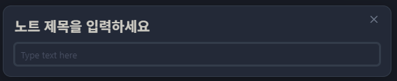
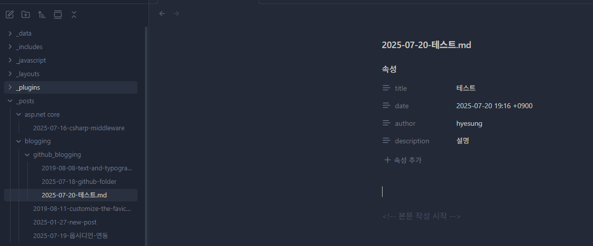

블로그를 구성하게 되면 대부분 VSCode 를 이용해서 프로젝트를 열 텐데, 마크다운 문법이 바로 적용되지 않아 불편할 때가 있다. 아래처럼..

옵시디언 + Templater 조합으로 설정해두면 Frontmatter에 경로까지 편리하게 사용이 가능할 것 같아서 구성해보았다.
 
---

## 사용 흐름

1. 사이드바에서 **새 노트** 클릭 → 빈 파일(`무제`)이 뜨면
2. 왼쪽 사이드바 Templater 아이콘 눌러 작성한 템플릿 파일 명 선택
3. 팝업에 글 제목 입력을 입력하면 아래 화면이 나올 것이다.

옵시디언 내부의 색이나 UI 가 일부 다른 이유는 테마를 적용했기 때문이고 아마 대부분 큰 차이는 없을 것이다. 
