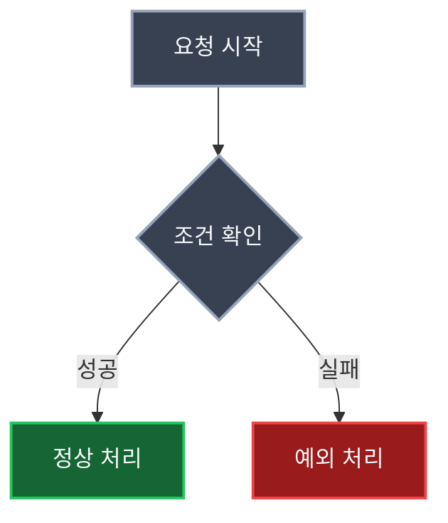

## Headings

<!-- markdownlint-capture -->
<!-- markdownlint-disable -->
# H1 — heading
{: .mt-4 .mb-0 }

## H2 — heading
{: data-toc-skip='' .mt-4 .mb-0 }

### H3 — heading
{: data-toc-skip='' .mt-4 .mb-0 }

#### H4 — heading
{: data-toc-skip='' .mt-4 }
<!-- markdownlint-restore -->

## Paragraph

Quisque egestas convallis ipsum, ut sollicitudin risus tincidunt a. Maecenas interdum malesuada egestas. Duis consectetur porta risus, sit amet vulputate urna facilisis ac. Phasellus semper dui non purus ultrices sodales. Aliquam ante lorem, ornare a feugiat ac, finibus nec mauris. Vivamus ut tristique nisi. Sed vel leo vulputate, efficitur risus non, posuere mi. Nullam tincidunt bibendum rutrum. Proin commodo ornare sapien. Vivamus interdum diam sed sapien blandit, sit amet aliquam risus mattis. Nullam arcu turpis, mollis quis laoreet at, placerat id nibh. Suspendisse venenatis eros eros.

## Lists

### Ordered list

1. Firstly
2. Secondly
3. Thirdly

### Unordered list

- Chapter
  - Section
    - Paragraph

### ToDo list

- [ ] Job
  - [x] Step 1
  - [x] Step 2
  - [ ] Step 3

### Description list

Sun
: the star around which the earth orbits

Moon
: the natural satellite of the earth, visible by reflected light from the sun

## Block Quote

> This line shows the _block quote_.

## Prompts

<!-- markdownlint-capture -->
<!-- markdownlint-disable -->
> An example showing the `tip` type prompt.
{: .prompt-tip }

> An example showing the `info` type prompt.
{: .prompt-info }

> An example showing the `warning` type prompt.
{: .prompt-warning }

> An example showing the `danger` type prompt.
{: .prompt-danger }
<!-- markdownlint-restore -->

## Tables

| Company                      | Contact          | Country |
| :--------------------------- | :--------------- | ------: |
| Alfreds Futterkiste          | Maria Anders     | Germany |
| Island Trading               | Helen Bennett    |      UK |
| Magazzini Alimentari Riuniti | Giovanni Rovelli |   Italy |

## Links

<http://127.0.0.1:4000>

## Footnote

Click the hook will locate the footnote[^footnote], and here is another footnote[^fn-nth-2].

## Inline code

This is an example of `Inline Code`.

## Filepath

Here is the `/path/to/the/file.extend`{: .filepath}.

## Code blocks

### Common

```text
This is a common code snippet, without syntax highlight and line number.
```

### Specific Language

```bash
if [ $? -ne 0 ]; then
  echo "The command was not successful.";
  #do the needful / exit
fi;
```

### Specific filename

```sass
@import
  "colors/light-typography",
  "colors/dark-typography";
```
{: file='_sass/jekyll-theme-chirpy.scss'}

## Front Matter

게시글 상단에는 다음과 같은 front matter를 작성한다.

```yaml
---
title: 글 제목
date: 2026-05-21 20:00 +0900
author: hyesung
mermaid: true
math: true
categories: JAVA 13-스레드_제어_및_기초적_동기화
---
```

카테고리는 공백을 기준으로 depth가 나뉜다. 예를 들어 `JAVA 13-스레드_제어_및_기초적_동기화`는 `JAVA` 아래에 `13-스레드_제어_및_기초적_동기화` 카테고리가 생긴다.

글을 임시로 숨기고 싶을 때는 다음 값을 추가한다.

```yaml
published: false
```

## Images

이미지는 게시글에서 접근 가능한 경로를 기준으로 작성한다.

```md

```

이미지 크기를 조절해야 할 때는 현재 블로그에서 사용하는 다음 형태를 참고한다.

```md

```

GitHub Pages에서는 파일명 대소문자를 구분하므로, 이미지가 깨지면 실제 파일명과 경로가 정확히 일치하는지 확인한다.

## Mermaid

Mermaid를 사용하는 글은 front matter에 `mermaid: true`를 넣는다.



Mermaid 스타일은 쉼표로 구분한다. `stroke-width:2px;color:#f8fafc`처럼 세미콜론으로 연결하면 `color:#f8fafc`가 노드처럼 보일 수 있다.

## Math

수식을 사용하는 글은 front matter에 `math: true`를 넣는다.

인라인 수식은 `$O(n)$`처럼 작성한다.

블록 수식은 다음과 같이 작성한다.

$$
T(n) = O(n \log n)
$$

## Post Links

일반 링크는 다음처럼 작성한다.

```md
[링크 텍스트](https://example.com)
```

블로그 내부 게시글이나 특정 섹션을 연결할 때는 실제 생성된 URL을 기준으로 작성한다.

```md
[스레드 인터럽트](/posts/스레드-인터럽트/)
```

## Video



## Reverse Footnote

[^footnote]: The footnote source
[^fn-nth-2]: The 2nd footnote source
