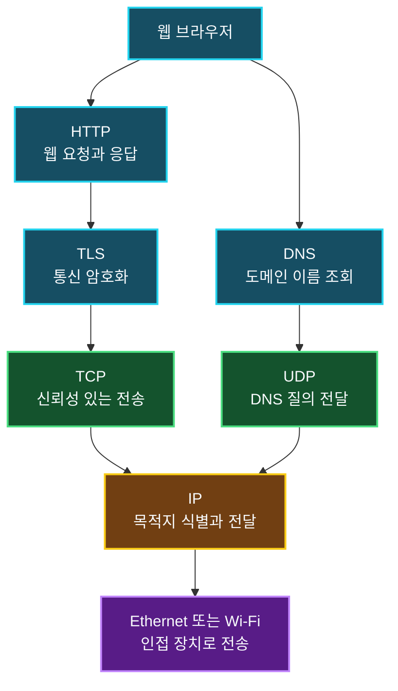
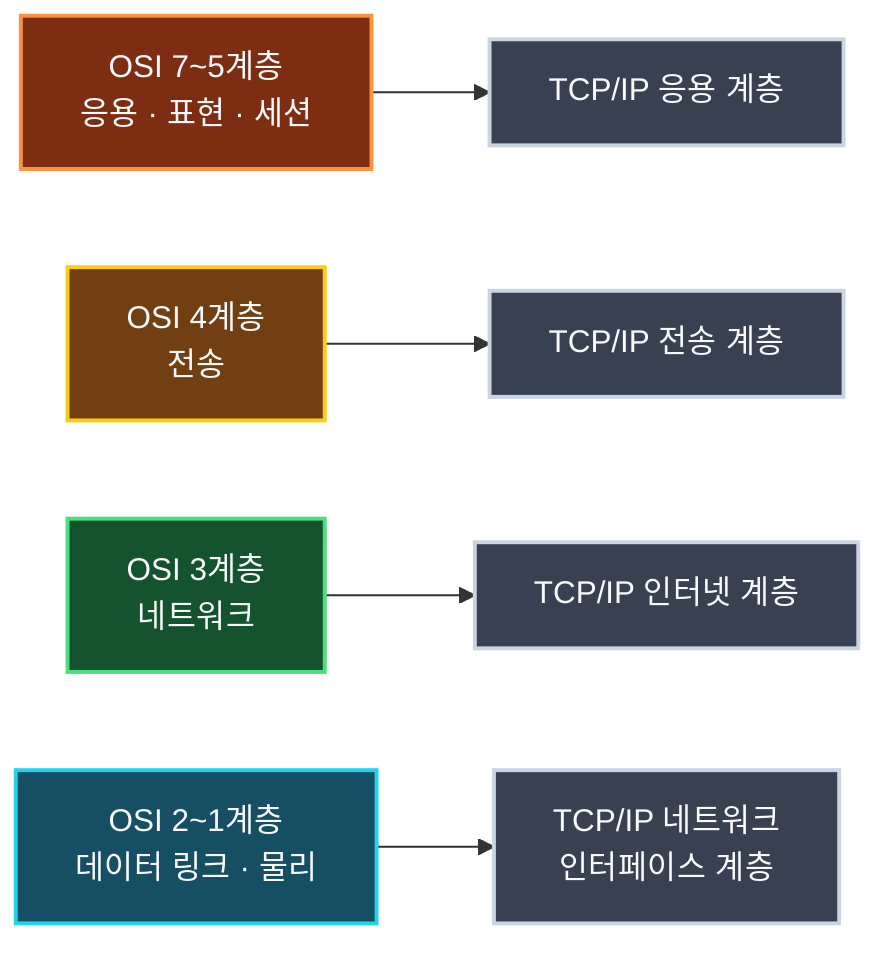
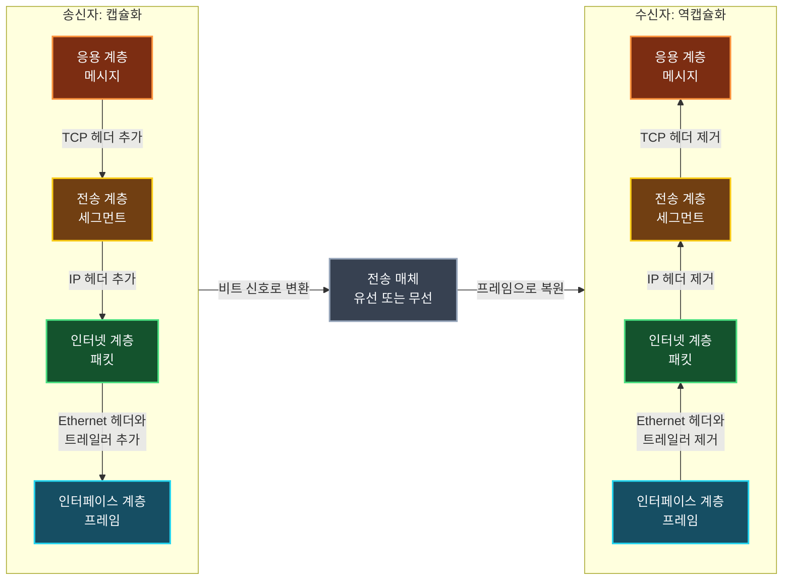
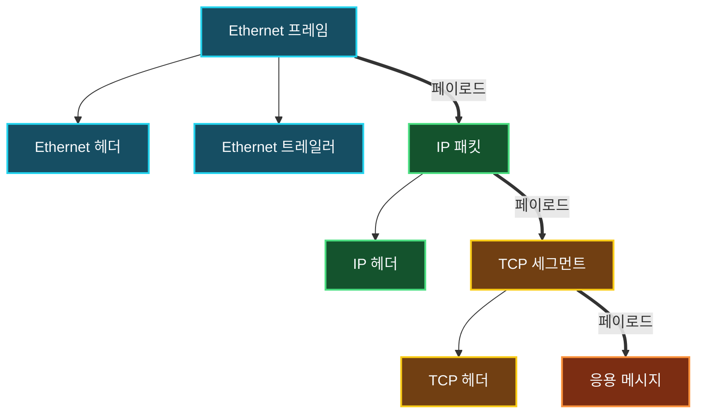

서로 다른 컴퓨터가 네트워크를 통해 통신하려면 공통된 규칙이 필요하다. 데이터를 어떤 형식으로 표현할지, 어떤 순서로 주고받을지, 오류가 발생하면 어떻게 처리할지 합의되어 있지 않다면 송신자가 보낸 정보를 수신자가 올바르게 해석할 수 없기 때문이다.

이러한 개별 통신 규칙을 **프로토콜(Protocol)**이라고 하며, 서로 협력하는 여러 프로토콜을 하나의 체계로 구성한 것을 **프로토콜 스위트(Protocol Suite)**라고 한다. 복잡한 통신 과정을 역할별로 나누어 이해하려면 TCP/IP 모델과 OSI 모델 같은 계층 모델, 그리고 데이터가 계층을 이동하는 캡슐화 과정도 함께 살펴봐야 한다.

## 프로토콜이란

사람은 같은 언어의 발음, 어휘, 문법을 공유하기 때문에 대화할 수 있다. 한 사람이 질문하면 상대방은 문장의 구조와 의미를 해석하고 적절한 방식으로 응답한다.

컴퓨터 통신도 이와 비슷하다. 두 장치가 데이터를 주고받으려면 다음과 같은 사항을 미리 약속해야 한다.

- 데이터를 어떤 구조와 형식으로 표현할 것인가
- 메시지를 어떤 순서로 주고받을 것인가
- 메시지를 받으면 어떤 동작을 수행할 것인가
- 데이터가 손상되거나 응답이 없으면 어떻게 처리할 것인가

이처럼 네트워크에서 정보를 교환하기 위해 표준화한 규칙이 프로토콜이다. 사람의 언어와 달리 컴퓨터는 문맥을 임의로 추측하기 어려우므로 메시지 구조와 처리 절차가 구체적으로 정의되어야 한다.

### 프로토콜을 구성하는 요소

프로토콜은 일반적으로 형식, 의미, 순서와 시점이라는 관점에서 살펴볼 수 있다.

| 요소 | 설명 | 예시 |
| :--- | :--- | :--- |
| 형식(Syntax) | 데이터의 구조와 표현 방법 | 헤더의 필드 위치와 길이 |
| 의미(Semantics) | 각 값이 나타내는 의미와 수행할 동작 | 상태 코드 `404`는 요청한 자원을 찾지 못했음을 의미 |
| 순서와 시점(Timing) | 메시지를 보내는 순서, 속도, 응답 대기 시간 | 요청을 보낸 뒤 일정 시간 동안 응답을 기다림 |

예를 들어 HTTP는 요청 메서드, 헤더, 본문과 응답 상태 코드의 형식을 정의한다. TCP는 데이터를 신뢰성 있게 전달하기 위한 연결 설정, 순서 제어, 재전송 규칙을 제공한다. 서로 담당하는 역할은 다르지만 모두 통신을 위한 구체적인 약속이라는 점에서는 같은 프로토콜이다.

## 프로토콜 스위트란

실제 네트워크 통신은 하나의 프로토콜만으로 끝나지 않는다. 웹 페이지 하나를 열 때도 도메인 이름을 IP 주소로 변환하고, 상대 서버와 연결하고, 데이터를 암호화한 뒤, 웹 요청과 응답을 주고받는 여러 과정이 필요하다.

각 과정을 담당하는 프로토콜을 역할에 따라 묶은 전체 체계가 프로토콜 스위트다.



위 그림은 일반적인 웹 접속 과정을 단순화한 것이다. DNS 질의는 주로 UDP를 사용하지만 응답 크기나 동작 방식에 따라 TCP를 사용할 수도 있다. 하나의 응용 계층 프로토콜이 언제나 하나의 전송 프로토콜에만 고정되는 것은 아니다.

인터넷에서 사용하는 대표적인 프로토콜 스위트가 **TCP/IP 프로토콜 스위트**다. 이름에는 TCP와 IP만 들어가지만 실제로는 HTTP, DNS, DHCP, TCP, UDP, IP 등 인터넷 통신에 필요한 여러 프로토콜을 포함한다.

> 프로토콜이 하나의 구체적인 규칙이라면, 프로토콜 스위트는 서로 다른 역할을 맡은 프로토콜이 함께 동작하도록 구성한 체계다.
{: .prompt-info }

OSI도 처음에는 네트워크 통신을 위한 프로토콜 체계와 함께 설계되었다. 오늘날에는 OSI 프로토콜 자체보다 네트워크 기능을 일곱 계층으로 구분한 **OSI 참조 모델**이 통신 구조를 설명하고 장애 지점을 구분하는 용도로 널리 사용된다.

## 네트워크를 계층으로 나누는 이유

네트워크 통신에는 케이블이나 무선 신호부터 IP 주소, 데이터 전송, 응용 프로그램의 요청과 응답까지 서로 다른 문제가 동시에 얽혀 있다. 이 모든 기능을 하나의 거대한 규칙으로 다루면 구현을 변경하기 어렵고, 장애가 발생했을 때 원인을 찾기도 힘들어진다.

계층 모델은 복잡한 통신 과정을 역할별로 나누어 다음과 같은 이점을 제공한다.

- 각 계층이 담당하는 책임과 프로토콜을 구분할 수 있다.
- 한 계층의 구현이 바뀌어도 약속된 인터페이스를 유지하면 다른 계층에 미치는 영향을 줄일 수 있다.
- 통신 장애가 발생한 범위를 아래 계층부터 단계적으로 좁힐 수 있다.
- 서로 다른 제조사와 운영체제가 공통된 기준으로 통신 구조를 설명할 수 있다.

예를 들어 온라인 게임의 연결이 끊겼다고 해서 곧바로 게임 서버만 의심할 수는 없다. Wi-Fi 연결이 끊겼을 수도 있고, IP 주소나 라우팅이 잘못되었을 수도 있으며, 방화벽이 서버 포트를 차단했거나 게임 애플리케이션 자체에 문제가 생겼을 수도 있다. 계층을 기준으로 확인하면 이 문제들을 체계적으로 분리할 수 있다.

## TCP/IP 모델과 OSI 모델

### TCP/IP 모델

TCP/IP 모델은 미국 국방부 산하 연구 기관의 ARPANET 연구에서 출발했다. 1970년대에 개발된 프로토콜이 실제 네트워크에 적용되었고, 1983년 ARPANET이 TCP/IP를 공식적으로 사용하기 시작하면서 현대 인터넷의 기반이 되었다.

TCP/IP 모델은 실용적인 인터넷 통신에 초점을 맞추며 일반적으로 네 계층으로 설명한다.

| 계층 | 주요 역할 | 대표적인 기술과 프로토콜 |
| :--- | :--- | :--- |
| 응용 계층 | 사용자에게 네트워크 서비스를 제공하고 데이터를 표현 | HTTP, DNS, DHCP, SMTP, TLS |
| 전송 계층 | 프로세스 사이의 데이터 전달과 신뢰성·흐름 관리 | TCP, UDP |
| 인터넷 계층 | 논리 주소를 이용한 목적지 식별과 네트워크 간 전달 | IP, ICMP |
| 네트워크 인터페이스 계층 | 같은 네트워크 안의 프레임 전달과 물리 신호 전송 | Ethernet, Wi-Fi, ARP |

인터넷에서 실제로 사용하는 프로토콜과 구현을 설명할 때는 TCP/IP 모델이 중심이 된다. 앞서 살펴본 HTTP, TCP, IP, Ethernet의 협력 과정도 이 네 계층을 따라 이해할 수 있다.

### OSI 모델

국제표준화기구(ISO)는 네트워크 통신 기능을 더 세밀하게 구분하기 위해 **OSI(Open Systems Interconnection) 참조 모델**을 제정했다. OSI 모델은 아래에서부터 일곱 계층으로 구성된다.

| 계층 | 이름 | 주요 역할 |
| ---: | :--- | :--- |
| 7 | 응용(Application) | 사용자와 가까운 네트워크 서비스 제공 |
| 6 | 표현(Presentation) | 데이터 인코딩, 압축, 암호화와 표현 형식 변환 |
| 5 | 세션(Session) | 통신 세션의 설정, 유지, 종료 |
| 4 | 전송(Transport) | 종단 프로세스 간 전달, 분할, 재조립, 신뢰성 관리 |
| 3 | 네트워크(Network) | 논리 주소와 라우팅을 이용한 네트워크 간 전달 |
| 2 | 데이터 링크(Data Link) | 프레임 구성, MAC 주소 기반 전달, 오류 검출 |
| 1 | 물리(Physical) | 비트를 전기·광학·무선 신호로 전송 |

OSI 모델의 각 계층이 실제 시스템에서 항상 독립된 소프트웨어로 구현되는 것은 아니다. 세션 관리, 데이터 표현, 암호화 같은 기능은 현대 애플리케이션과 라이브러리에서 함께 처리되는 경우가 많다. OSI 모델은 실제 제품의 내부 구조를 그대로 보여주는 설계도라기보다, 통신 기능을 분석하고 설명하기 위한 참조 모델로 이해하는 편이 정확하다.

### 두 모델의 계층 대응

TCP/IP와 OSI는 계층 수가 다르지만 담당하는 역할을 기준으로 대략 다음과 같이 대응할 수 있다.



| TCP/IP 모델 | OSI 모델 | 공통된 관점 |
| :--- | :--- | :--- |
| 응용 계층 | 응용·표현·세션 계층 | 애플리케이션 서비스, 데이터 표현, 세션 관리 |
| 전송 계층 | 전송 계층 | 프로세스 간 데이터 전달 |
| 인터넷 계층 | 네트워크 계층 | 논리 주소와 라우팅 |
| 네트워크 인터페이스 계층 | 데이터 링크·물리 계층 | 인접 장치 간 전달과 실제 신호 전송 |

> 두 모델의 계층은 역할을 이해하기 위한 대략적인 대응 관계다. TLS나 ARP처럼 경계에 걸쳐 설명되는 기술도 있으므로 모든 프로토콜을 억지로 한 계층에만 고정할 필요는 없다.
{: .prompt-tip }

## 헤더를 붙이고 떼는 캡슐화

애플리케이션이 만든 데이터는 그대로 전송 매체에 실리지 않는다. 송신자는 데이터를 상위 계층에서 하위 계층으로 전달하면서 각 계층이 필요로 하는 제어 정보를 덧붙인다. 수신자는 반대로 하위 계층에서 상위 계층으로 데이터를 전달하면서 해당 정보를 확인하고 제거한다.

- **캡슐화(Encapsulation)**: 상위 계층에서 받은 데이터에 현재 계층의 헤더나 트레일러를 추가하는 과정
- **역캡슐화(Decapsulation)**: 수신한 데이터의 헤더나 트레일러를 해석하고 상위 계층에 전달할 데이터를 꺼내는 과정

헤더에는 단순히 주소만 들어가는 것이 아니다. 목적지와 출발지, 데이터의 종류, 순서, 오류 확인 등 현재 계층이 통신을 처리하는 데 필요한 정보가 담긴다. 데이터 링크 계층처럼 데이터 뒤에 **트레일러(Trailer)**를 추가하는 경우도 있다.

### 송신자와 수신자의 처리 과정

웹 브라우저가 TCP를 이용해 메시지를 전송한다고 가정하면 데이터의 형태는 다음 순서로 바뀐다.



송신 측의 캡슐화 과정은 다음과 같다.

1. 응용 계층이 헤더와 본문을 포함한 메시지를 만든다.
2. 전송 계층이 TCP 헤더를 붙여 세그먼트를 만든다.
3. 인터넷 계층이 IP 헤더를 붙여 패킷을 만든다.
4. 네트워크 인터페이스 계층이 Ethernet 헤더와 트레일러를 붙여 프레임을 만든다.
5. 프레임이 비트 신호로 변환되어 유선 또는 무선 매체로 전달된다.

수신 측은 이 과정을 반대로 수행한다. 다만 역캡슐화는 헤더를 무조건 잘라내는 단순 작업이 아니다. 각 계층은 자신에게 전달된 헤더를 먼저 검사하고, 데이터가 유효하며 자신이 처리해야 할 대상인지 판단한 뒤 상위 계층으로 페이로드를 전달한다.

### 계층별 PDU

각 계층에서 처리하는 데이터 단위를 **PDU(Protocol Data Unit)**라고 한다. 같은 데이터도 어느 계층에서 바라보는지에 따라 이름과 포함하는 제어 정보가 달라진다.

| TCP/IP 계층 | 추가하거나 해석하는 정보의 예 | PDU |
| :--- | :--- | :--- |
| 응용 계층 | HTTP 메서드·상태 코드, DNS 질의와 응답 | 메시지(Message) 또는 데이터(Data) |
| 전송 계층 | 출발지·목적지 포트, 순서 번호, 제어 플래그 | TCP 세그먼트(Segment), UDP 데이터그램(Datagram) |
| 인터넷 계층 | 출발지·목적지 IP 주소, TTL, 상위 프로토콜 번호 | 패킷(Packet) 또는 IP 데이터그램 |
| 네트워크 인터페이스 계층 | 출발지·목적지 MAC 주소, EtherType, 오류 검출 정보 | 프레임(Frame) |
| 전송 매체 | 전기·광학·무선 신호 | 비트(Bit) |

강의나 문서에서는 넓은 의미로 모든 네트워크 데이터를 패킷이라고 부르기도 한다. 하지만 정확한 계층 구조를 설명할 때는 세그먼트, 패킷, 프레임을 구분하는 편이 좋다.

### 페이로드는 계층에 따라 달라진다

**페이로드(Payload)**는 현재 계층이 상위 계층으로부터 전달받아 운반하는 내용이다. 따라서 페이로드는 모든 헤더를 제외한 최종 사용자 데이터만을 의미하지 않는다.



- Ethernet 프레임에서는 IP 패킷 전체가 페이로드다.
- IP 패킷에서는 TCP 세그먼트 전체가 페이로드다.
- TCP 세그먼트에서는 응용 계층 메시지가 페이로드다.

즉 페이로드는 절대적인 위치가 아니라 **어느 계층을 기준으로 보는가에 따라 달라지는 상대적인 개념**이다.

### 헤더는 상위 프로토콜을 찾아가는 단서다

수신 측은 헤더에 기록된 식별자를 이용해 다음 계층의 처리 대상을 결정한다. 이러한 분배 과정을 **역다중화(Demultiplexing)**라고 한다.

- Ethernet 헤더의 EtherType은 페이로드가 IPv4, IPv6, ARP 중 무엇인지 알려준다.
- IP 헤더의 Protocol 필드는 다음 데이터가 TCP, UDP, ICMP 중 무엇인지 알려준다.
- TCP와 UDP 헤더의 목적지 포트는 데이터를 전달할 애플리케이션 프로세스를 찾는 데 사용된다.

따라서 역캡슐화는 단순한 포장 제거가 아니라, 헤더를 따라 올바른 상위 프로토콜과 프로세스를 찾아가는 과정이다.

### 프레임은 홉마다 다시 만들어진다

캡슐화 그림만 보면 송신자가 만든 프레임 하나가 수신자까지 그대로 이동하는 것처럼 보일 수 있다. 하지만 Ethernet 프레임은 같은 링크 안에서 인접한 장치로 전달하기 위한 단위다.

라우터는 들어온 프레임의 헤더와 트레일러를 제거하고 IP 패킷을 확인한 뒤, 다음 링크에 맞는 새로운 프레임으로 다시 캡슐화한다. 이 과정에서 출발지와 목적지 MAC 주소는 홉(Hop)마다 달라진다. 반면 출발지와 목적지 IP 주소는 일반적인 라우팅 과정에서는 유지되지만 TTL은 라우터를 지날 때마다 감소한다. NAT를 거치는 경우에는 IP 주소나 포트도 변경될 수 있다.

> HTTPS가 응용 데이터를 암호화하더라도 전달에 필요한 Ethernet, IP, TCP 헤더까지 모두 숨겨지는 것은 아니다. Wireshark에서는 본문 내용을 읽지 못하더라도 MAC 주소, IP 주소, 포트, 패킷 길이와 통신 시점 같은 메타데이터를 확인할 수 있다.
{: .prompt-info }

## 계층을 이용한 장애 진단

실무에서 계층 모델은 외우기 위한 표보다 **어디까지 정상인지 확인하는 체크리스트**로 더 유용하다. 웹 사이트나 게임 서버에 접속되지 않는다면 아래 계층부터 차례로 확인할 수 있다.

1. **네트워크 인터페이스·물리 계층**: 케이블, Wi-Fi 연결, 네트워크 어댑터가 정상인지 확인한다.
2. **인터넷·네트워크 계층**: IP 주소, 서브넷 마스크, 기본 게이트웨이, 목적지까지의 경로를 확인한다.
3. **전송 계층**: 대상 포트가 열려 있는지, 방화벽이 TCP 또는 UDP 통신을 차단하는지 확인한다.
4. **응용 계층**: DNS 조회, TLS 인증서, HTTP 응답, 서버 애플리케이션 로그를 확인한다.

Windows에서는 다음 명령을 순서대로 활용할 수 있다.

```powershell
ipconfig /all
ping 8.8.8.8
tracert 8.8.8.8
Test-NetConnection example.com -Port 443
nslookup example.com
curl.exe -v https://example.com
```

`ping`에 응답하지 않는다고 해서 반드시 서버가 중단된 것은 아니다. 운영 환경에서는 보안 정책으로 ICMP 응답을 차단할 수 있으므로, IP 경로와 실제 서비스 포트 및 응용 계층 응답을 함께 확인해야 한다.

> `curl.exe -v` 출력에는 요청·응답 헤더와 TLS 연결 정보가 포함될 수 있다. 인증 토큰이나 쿠키를 사용하는 실제 서비스의 출력은 외부에 그대로 공유하지 않는 것이 좋다.
{: .prompt-warning }

## 대표적인 프로토콜의 역할

프로토콜은 각자 해결하려는 문제가 다르다.

| 프로토콜 | 주요 역할 |
| :--- | :--- |
| HTTP | 웹 클라이언트와 서버가 요청과 응답을 교환하는 방법 정의 |
| DHCP | 장치에 IP 주소와 네트워크 설정을 자동으로 할당 |
| DNS | 도메인 이름을 IP 주소로 변환 |
| TCP | 연결을 맺고 데이터의 순서와 신뢰성을 관리 |
| UDP | 연결 설정과 재전송을 최소화해 데이터를 빠르게 전달 |
| IP | 출발지와 목적지 주소를 이용해 패킷을 전달 |

웹 브라우저에서 `https://example.com`에 접속하는 과정을 단순화하면 다음과 같다.

1. DNS로 `example.com`의 IP 주소를 조회한다.
2. IP를 이용해 목적지를 식별하고 패킷을 전달한다.
3. TCP로 서버와 연결을 설정한다.
4. TLS로 암호화 통신 환경을 만든다.
5. HTTP로 웹 페이지를 요청하고 응답을 받는다.

각 프로토콜은 자신의 역할에 집중하지만, 실제 통신 결과는 여러 프로토콜이 협력하여 만들어 낸다.

## 프로토콜 스위트와 프로토콜 스택의 차이

실무에서는 **프로토콜 스위트**와 함께 **프로토콜 스택(Protocol Stack)**이라는 표현도 자주 사용한다.

- 프로토콜 스위트는 함께 사용되는 프로토콜의 규격과 체계를 가리킨다.
- 프로토콜 스택은 운영체제나 네트워크 장비가 이 규격을 실제로 구현한 소프트웨어 구조를 가리킬 때 주로 사용한다.

예를 들어 TCP/IP는 프로토콜 스위트이며, Windows나 Linux 커널에는 TCP/IP 통신을 실제로 처리하는 네트워크 스택이 구현되어 있다. 문맥에 따라 두 표현을 비슷하게 사용하기도 하지만, **규격의 집합**과 **그 규격의 구현**이라는 관점으로 구분하면 이해하기 쉽다.

## 정리

- 프로토콜은 컴퓨터가 데이터를 주고받기 위해 합의한 개별 규칙이다.
- 프로토콜은 데이터의 형식, 의미, 통신 순서와 처리 시점을 정의한다.
- 프로토콜 스위트는 서로 협력하는 여러 프로토콜을 하나의 체계로 묶은 것이다.
- TCP/IP 프로토콜 스위트에는 TCP와 IP뿐 아니라 HTTP, DNS, DHCP, UDP 등 다양한 프로토콜이 포함된다.
- TCP/IP 모델은 실제 인터넷 통신을 네 계층으로 설명하며, OSI 모델은 통신 기능을 일곱 계층으로 세분화한 참조 모델이다.
- 두 모델은 계층 수는 다르지만 응용, 전송, 네트워크, 인터페이스라는 역할을 기준으로 대응할 수 있다.
- 송신자는 계층을 내려가며 헤더와 트레일러를 추가하고, 수신자는 이를 검사하고 제거하면서 상위 계층에 데이터를 전달한다.
- 메시지, 세그먼트, 패킷, 프레임은 각 계층에서 사용하는 PDU의 이름이다.
- 페이로드는 현재 계층이 운반하는 상위 계층 데이터이므로 계층에 따라 범위가 달라진다.
- Ethernet 프레임은 링크마다 새로 만들어지며, 라우터는 IP 패킷을 다음 링크의 프레임으로 다시 캡슐화한다.
- 계층 모델을 사용하면 물리 연결부터 응용 서비스까지 장애 범위를 단계적으로 좁힐 수 있다.
- 실제 시스템에는 프로토콜 규격을 실행하는 네트워크 프로토콜 스택이 구현되어 있다.

프로토콜과 계층 모델, 캡슐화를 함께 이해하면 패킷 분석 도구에 표시되는 여러 헤더가 왜 존재하고, 데이터가 어떤 경로를 거쳐 애플리케이션까지 전달되는지 연결해서 볼 수 있다.
