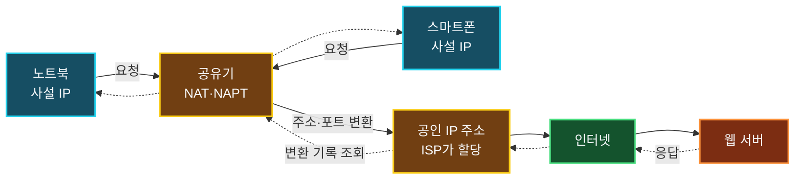

네트워크는 거리, 규모, 관리 주체, 접속 가능한 사용자 등 여러 기준으로 분류할 수 있다. 이 중 **누가 접속할 수 있는가**를 기준으로 보면 가정이나 회사처럼 사용자를 제한하는 사설 네트워크와, 인터넷이나 공공 Wi-Fi처럼 많은 사람에게 개방된 공용 네트워크로 나눌 수 있다.

여기서 주의할 점이 있다. **사설·공용 네트워크**는 접근 범위와 관리 정책에 관한 분류이고, **사설·공인 IP 주소**는 인터넷에서 주소를 사용할 수 있는 범위에 관한 분류다. 서로 관련은 있지만 같은 개념은 아니다.

## 접속 대상을 기준으로 네트워크 분류하기

### 사설 네트워크

**사설 네트워크(Private Network)**는 소유자나 관리자가 접속할 수 있는 사용자와 장치를 제한하는 네트워크다.

- 가정에서 공유기에 연결한 유선·무선 네트워크
- 사원과 승인된 장비만 사용하는 회사 내부망
- 학교의 학내망
- 클라우드에서 구성한 VPC(Virtual Private Cloud)

사설 네트워크라고 해서 외부와 완전히 단절되어야 하는 것은 아니다. 내부 장치의 접근은 제한하면서 라우터, 방화벽, VPN, 프록시 등을 통해 인터넷이나 다른 네트워크와 통신할 수 있다.

### 공용 네트워크

**공용 네트워크(Public Network)**는 불특정 다수 또는 넓은 범위의 사용자가 접속할 수 있는 네트워크다. 인터넷이 대표적인 예이며 카페, 공항, 도서관에서 제공하는 공공 Wi-Fi도 접속 정책을 기준으로 보면 공용 네트워크에 가깝다.

| 구분 | 사설 네트워크 | 공용 네트워크 |
| :--- | :--- | :--- |
| 접속 대상 | 소유자나 관리자가 허용한 사용자와 장치 | 불특정 다수 또는 광범위한 사용자 |
| 관리 방식 | 조직이나 개인이 접근 정책을 직접 관리 | 사업자나 기관이 다수 이용자를 대상으로 운영 |
| 대표 사례 | 가정 LAN, 회사 내부망, VPC | 인터넷, 공항·카페의 공공 Wi-Fi |
| 신뢰 수준 | 정책에 따라 다름 | 기본적으로 신뢰하지 않는 편이 안전함 |

> 사설 네트워크는 접근 대상이 제한되었다는 뜻이지, 자동으로 안전하다는 뜻은 아니다. 잘못된 방화벽 정책, 감염된 내부 장치, 약한 Wi-Fi 암호 때문에 사설 네트워크에서도 보안 사고가 발생할 수 있다.
{: .prompt-warning }

## 공용 네트워크와 공인 IP는 같은 개념이 아니다

강의나 입문 자료에서는 사설 네트워크와 사설 IP, 공용 네트워크와 공인 IP를 짝지어 설명하곤 한다. 가정과 회사에서 흔히 볼 수 있는 구성이므로 전체 흐름을 이해하는 데는 도움이 되지만, 둘을 항상 일대일 관계로 보면 안 된다.

| 사례 | 접속 범위 | 장치에 설정되는 주소의 일반적인 형태 |
| :--- | :--- | :--- |
| 가정 내부망 | 사설 네트워크 | 사설 IP 주소 |
| 회사 내부망 | 사설 네트워크 | 주로 사설 IP 주소, 필요하면 공인 IP 주소도 사용 가능 |
| 카페의 공공 Wi-Fi | 공용 네트워크 | 대부분 사설 IP 주소를 할당하고 NAT 사용 |
| 인터넷에 공개한 웹 서버 | 공용 서비스 | 공인 IP 주소 또는 공인 주소를 가진 로드 밸런서 뒤에 배치 |

공공 Wi-Fi는 누구나 접속할 수 있으므로 공용 네트워크지만, 연결된 노트북과 스마트폰에는 보통 `192.168.x.x`와 같은 사설 IP 주소가 할당된다. 반대로 접근이 엄격히 제한된 데이터 센터 내부 장치에 공인 IP 주소를 설정하는 구성도 가능하다.

> Windows에서 네트워크 프로필을 `공용`으로 선택하는 것은 현재 네트워크를 신뢰하지 않으므로 검색과 파일 공유를 제한하겠다는 방화벽 정책이다. 해당 장치가 공인 IP 주소를 사용한다는 의미가 아니다.
{: .prompt-info }

## 사설 IP 주소와 공인 IP 주소

**IP 주소**는 IP 네트워크에서 인터페이스를 식별하고 패킷을 전달하기 위해 사용하는 논리 주소다. IPv4 주소는 약 43억 개로 한정되어 있고, 모든 내부 장치에 전 세계에서 고유한 주소를 직접 할당하기에는 부족하다.

### 사설 IPv4 주소

사설 IPv4 주소는 내부 네트워크에서 반복해서 사용할 수 있도록 예약한 주소다. RFC 1918은 다음 세 범위를 정의한다.

| 주소 범위 | CIDR 표기 | 주소 개수 |
| :--- | :--- | ---: |
| `10.0.0.0` ~ `10.255.255.255` | `10.0.0.0/8` | 16,777,216 |
| `172.16.0.0` ~ `172.31.255.255` | `172.16.0.0/12` | 1,048,576 |
| `192.168.0.0` ~ `192.168.255.255` | `192.168.0.0/16` | 65,536 |

서로 분리된 두 가정에서 노트북이 모두 `192.168.0.10`을 사용해도 충돌하지 않는다. 각 주소는 해당 사설 네트워크 안에서만 의미가 있고, 인터넷 라우터는 RFC 1918 주소를 목적지로 하는 패킷을 일반적인 인터넷 경로로 전달하지 않기 때문이다.

단, 두 사설 네트워크를 VPN이나 전용선으로 연결할 때 주소 대역이 겹치면 라우팅 충돌이 발생할 수 있다. 회사, 클라우드 VPC, 개발 환경을 연결할 계획이 있다면 처음부터 서로 겹치지 않는 CIDR 대역을 설계하는 것이 좋다.

### 공인 IPv4 주소

**공인 IP 주소(Public IP Address)**는 인터넷에서 라우팅할 수 있는 주소다. 인터넷 전체에서 주소와 경로가 충돌하지 않도록 계층적으로 관리되며, 사용자는 일반적으로 인터넷 서비스 제공자(ISP)나 클라우드 사업자를 통해 할당받는다.

공인 IP 주소를 사용한다고 해서 인터넷의 모든 장치가 해당 호스트에 접속할 수 있는 것은 아니다. 방화벽, 보안 그룹, 라우터 정책, 서비스의 수신 상태가 모두 허용되어야 실제 연결이 성립한다.

> 사설 주소가 아닌 모든 IPv4 주소가 공인 주소인 것은 아니다. `127.0.0.0/8`은 루프백, `169.254.0.0/16`은 링크 로컬, `100.64.0.0/10`은 통신사업자의 CGNAT용 공유 주소처럼 별도의 목적으로 예약된 범위도 있다.
{: .prompt-tip }

## 사설 네트워크가 인터넷과 통신하는 과정

가정에서는 여러 장치가 사설 IP 주소를 사용하고, 공유기의 인터넷 쪽 인터페이스가 ISP로부터 공인 IP 주소를 받는 구성이 일반적이다. 내부 장치가 인터넷 서버에 접속할 때 공유기는 주소와 포트를 변환하고 그 대응 관계를 잠시 기록한다.



이 과정을 단계별로 보면 다음과 같다.

1. 노트북이 사설 IP 주소와 임시 출발지 포트로 웹 서버에 요청을 보낸다.
2. 공유기가 사설 출발지 주소와 포트를 공인 IP 주소와 다른 포트로 변환한다.
3. 공유기는 변환 전후의 주소와 포트 대응 관계를 테이블에 저장한다.
4. 웹 서버의 응답이 공유기로 돌아오면 변환 테이블을 조회한다.
5. 공유기는 응답의 목적지를 원래 노트북의 사설 주소와 포트로 되돌려 전달한다.

### NAT와 NAPT

**NAT(Network Address Translation)**는 IP 주소를 변환하는 기술을 넓게 가리킨다. 가정용 공유기는 여러 내부 장치가 하나의 공인 IPv4 주소를 함께 사용하도록 주소뿐 아니라 TCP·UDP 포트도 변환하는 경우가 많다. 이를 **NAPT(Network Address Port Translation)** 또는 **PAT(Port Address Translation)**라고 한다.

강의에서는 NAT를 프로토콜이라고 표현하기도 하지만, 정확히는 독립된 통신 프로토콜이라기보다 라우터나 방화벽이 패킷의 주소와 포트를 바꾸는 변환 기능에 가깝다.

NAT는 내부 주소를 외부에서 직접 볼 수 없게 하고 요청에 대한 응답을 구분해 주지만, 그 자체가 완전한 보안 장치는 아니다. 외부에서 내부 서버로 먼저 접속하게 하려면 포트 포워딩이나 별도의 프록시·VPN 구성이 필요하며, 접근 통제는 방화벽 정책과 함께 설계해야 한다.

### 통신사업자의 CGNAT

ISP가 가입자에게도 공인 IPv4 주소 대신 공유 주소를 할당하고 사업자 네트워크에서 한 번 더 NAT하는 방식을 **CGNAT(Carrier-Grade NAT)**라고 한다. 공유기의 WAN 주소가 `100.64.0.0/10`에 속하거나, IP 확인 서비스에 표시되는 주소와 공유기 WAN 주소가 다르다면 CGNAT 환경일 가능성이 있다.

CGNAT에서는 사용자가 관리할 수 없는 ISP 장비에서도 주소가 변환되므로 일반적인 포트 포워딩만으로 외부 접속을 열기 어렵다. 홈 서버, 원격 접속, 일부 P2P 애플리케이션을 운영할 때 문제가 된다면 공인 IP 옵션, IPv6, VPN 터널 같은 대안을 검토할 수 있다.

## 공공 Wi-Fi에서 확인할 보안 사항

공공 Wi-Fi는 공인 IP를 직접 사용해서 위험한 것이 아니라, 신뢰하기 어려운 사용자와 같은 접속 환경을 공유할 수 있다는 점이 핵심이다.

- 운영 주체와 SSID를 확인하고 이름이 비슷한 가짜 AP에 주의한다.
- 운영체제의 네트워크 프로필을 공용으로 설정하고 파일·프린터 공유를 끈다.
- 브라우저의 HTTPS 인증서 경고를 무시하지 않는다.
- 자동 연결 기능을 끄고 사용 후 저장된 공공 Wi-Fi를 삭제한다.
- 중요한 관리 작업은 신뢰할 수 있는 네트워크나 검증된 VPN을 사용한다.

HTTPS는 웹 본문과 인증 정보를 암호화하지만 접속한 네트워크 자체를 신뢰할 수 있게 만드는 것은 아니다. 반대로 공공 Wi-Fi라고 해서 모든 트래픽 내용을 다른 사용자가 바로 읽을 수 있는 것도 아니다. 암호화 여부, 단말 보안, AP의 사용자 격리 설정을 함께 봐야 한다.

## Windows에서 주소 확인하기

현재 장치에 설정된 주소와 기본 게이트웨이는 다음 명령으로 확인할 수 있다.

```powershell
ipconfig
```

좀 더 자세한 인터페이스와 DNS 정보를 확인하려면 다음 명령을 사용한다.

```powershell
Get-NetIPConfiguration
```

출력된 IPv4 주소가 RFC 1918 범위에 속하면 장치는 사설 IPv4 주소를 사용하고 있다. 다만 장치의 로컬 주소만으로 인터넷에서 보이는 공인 IP 주소를 알 수는 없다. 공인 주소는 공유기 관리 화면이나 신뢰할 수 있는 IP 확인 서비스를 통해 별도로 확인해야 한다.

## 정리

- 사설 네트워크와 공용 네트워크는 누가 접속할 수 있는지와 누가 관리하는지를 기준으로 구분한다.
- 사설 IP 주소와 공인 IP 주소는 주소를 사용할 수 있는 범위와 인터넷 라우팅 가능 여부를 기준으로 구분한다.
- 공공 Wi-Fi처럼 공용 네트워크에 접속해도 장치에는 사설 IP 주소가 할당될 수 있다.
- 사설 IPv4 주소는 `10.0.0.0/8`, `172.16.0.0/12`, `192.168.0.0/16` 범위에서 사용한다.
- 서로 분리된 네트워크에서는 같은 사설 주소를 재사용할 수 있지만, VPN 등으로 네트워크를 연결하면 중복 대역이 충돌할 수 있다.
- 가정용 공유기는 일반적으로 NAT와 NAPT를 이용해 여러 내부 장치가 하나의 공인 IPv4 주소를 공유하게 한다.
- NAT는 주소 변환 기능이며 방화벽을 완전히 대신하지 않는다.
- 공공 Wi-Fi는 네트워크를 신뢰하지 않는다는 전제에서 운영체제와 애플리케이션의 보안 설정을 유지해야 한다.

사설·공용 네트워크와 사설·공인 IP 주소를 서로 다른 분류 축으로 이해하면, 공유기와 NAT가 필요한 이유뿐 아니라 공공 Wi-Fi, VPN 주소 충돌, CGNAT 환경에서 발생하는 문제도 정확하게 설명할 수 있다.
