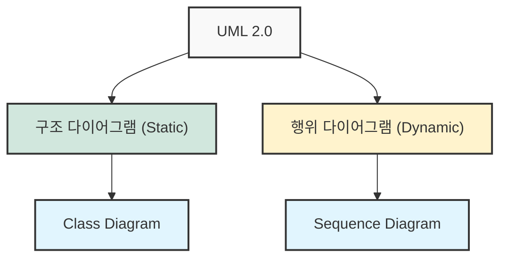
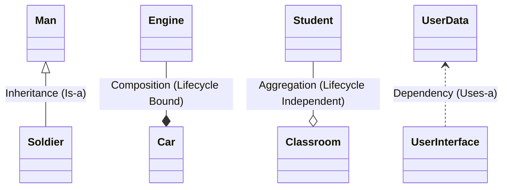
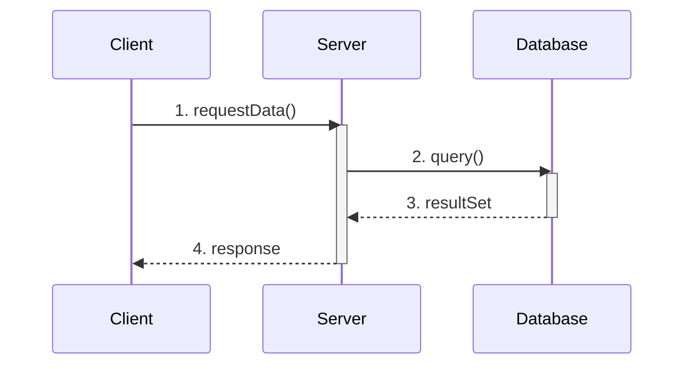

## 1. 개요

객체 지향 프로그래밍(OOP) 환경에서 프로젝트 규모가 커지면 클래스의 수는 기하급수적으로 증가한다. 수백, 수천 개의 클래스가 상호작용하는 엔터프라이즈 시스템에서 코드를 한 줄씩 읽으며 전체 구조를 파악하는 것은 불가능에 가깝다.

이러한 복잡성을 해결하고 개발자 간의 명확한 의사소통을 돕기 위해 **UML(Unified Modeling Language)** 이 사용된다. UML은 단순한 그림 그리기가 아니라, 소프트웨어의 청사진을 설계하고 **추상화(Abstraction)** 를 통해 시스템의 본질을 파악하는 엔지니어링 도구다.  **클래스 다이어그램(Class Diagram)** 과 **시퀀스 다이어그램(Sequence Diagram)**, 그리고 객체 간의 **핵심 관계(Relationships)** 를 간단히 알아보자.

## 2. UML의 구조 및 다이어그램 종류

UML은 크게 구조(Structure)를 표현하는 다이어그램과 행위(Behavior)를 표현하는 다이어그램으로 나뉜다. 실무에서는 주로 클래스 간의 정적 관계를 표현하는 **클래스 다이어그램**과, 런타임 시 객체 간의 메시지 흐름을 표현하는 **시퀀스 다이어그램**이 가장 많이 사용된다[^1].



## 3. 클래스 다이어그램 (Class Diagram)

클래스 다이어그램은 시스템의 정적인 구조를 표현한다. 하나의 클래스는 직사각형으로 표현되며, 세 가지 구획으로 나뉜다.

1. **클래스 이름 (Class Name)**
2. **속성 (Attributes/Fields)**
3. **기능 (Operations/Methods)**

### 3.1 가시성 제어 (Visibility)

UML에서는 접근 제어자를 기호로 표현한다.

* `+` : Public (어디서든 접근 가능)
* `-` : Private (클래스 내부에서만 접근 가능)
* `#` : Protected (상속 관계 및 같은 패키지 내 접근 가능)

### 3.2 Java 구현 예제

```java
// UserData 클래스 예제
public class UserData {
    // [-] Private Fields
    private String name;
    private String phone;

    // [+] Public Methods
    public String getName() {
        return name;
    }

    public void setName(String name) {
        this.name = name;
    }
}

```

## 4. 객체 간의 관계 (Relationships) - 핵심 심화

클래스 다이어그램의 핵심은 클래스 자체가 아니라 클래스 간의 **관계**를 어떻게 정의하느냐에 있다.

### 4.1 일반화 (Generalization) - 상속

부모(Super) 클래스와 자식(Sub) 클래스 간의 관계다. 'Is-a' 관계가 성립하며, 자식 클래스는 부모 클래스의 특성을 물려받고 기능을 구체화(Specialize)한다.

* **UML 표기**: 빈 삼각형 화살표 (`──▷`)
* **Java 키워드**: `extends`

### 4.2 집합 (Aggregation) vs 합성 (Composition)

두 관계 모두 'Has-a' 관계를 나타내지만, **생명주기(Lifecycle)** 의 의존성에서 결정적인 차이가 있다.

* **집합 (Aggregation)**: 전체와 부분의 생명주기가 독립적이다.
* *예시*: `교실`과 `학생`. 교실이 사라져도 학생은 존재한다.
* **UML 표기**: 빈 마름모 (`──◇`)


* **합성 (Composition)**: 부분의 생명주기가 전체에 종속된다.
* *예시*: `자동차`와 `엔진`. 자동차가 폐기되면 엔진도 함께 폐기된다(논리적 관점).
* **UML 표기**: 채워진 마름모 (`──◆`)


```java
// 1. 집합 (Aggregation) - 약한 결합
class Student {}

class Classroom {
    private List<Student> students; // 외부에서 주입받거나, 교실이 사라져도 학생은 유지됨
    
    public void addStudent(Student s) {
        this.students.add(s);
    }
}

// 2. 합성 (Composition) - 강한 결합
class Engine {}

class Car {
    private final Engine engine;

    public Car() {
        // Car가 생성될 때 Engine도 함께 생성 (생명주기 동기화)
        this.engine = new Engine(); 
    }
}
```

> **Deep Dive: 메모리 관점에서의 합성(Composition)**
> 
> 합성 관계는 **가비지 컬렉션(GC)** 관점에서 중요한 의미를 가진다. `Car` 객체(전체)가 GC의 대상이 되어 Heap 영역에서 제거될 때, `Car` 내부에서 강하게 참조하고 있는 `Engine` 객체(부분) 또한 (다른 곳에서 참조하지 않는다면) 도달 불가능한 상태(Unreachable)가 되어 함께 GC의 수집 대상이 된다. 즉, 객체 그래프(Object Graph) 상에서 부모 노드의 소멸이 자식 노드의 소멸을 유발한다.
{: .prompt-info }

### 4.3 의존 (Dependency)

한 클래스가 다른 클래스를 **일시적으로** 사용하는 관계다. 주로 메서드의 매개변수(Parameter)로 전달되거나, 메서드 내부에서 로컬 변수로 잠시 생성되어 사용될 때 나타난다.

* **특징**: 참조 대상(`B`)이 변경되면 이를 사용하는 클래스(`A`)도 영향을 받는다. 하지만 필드(멤버 변수)로 유지하지 않으므로 관계는 일시적이다.
* **UML 표기**: 점선 화살표 (`- - ->`)

```java
class UserInterface {
    // UserData를 필드로 가지지 않음 (연관 관계 아님)
    
    // 메서드 실행 시점에만 일시적으로 사용 (의존 관계)
    public void render(UserData data) {
        System.out.println("Display: " + data.getName());
    } // 메서드 종료 시 data에 대한 참조 종료
}
```

### 4.4 관계 요약 시각화



## 5. 시퀀스 다이어그램 (Sequence Diagram)

시퀀스 다이어그램은 시간의 흐름에 따른 객체 간의 상호작용을 보여준다. 메서드 호출(Call), 리턴(Return), 그리고 제어 흐름을 파악하는 데 유용하다.

* **주요 용도**: 복잡한 비즈니스 로직의 트랜잭션 흐름 분석, API 호출 순서 정의.



> **Tip:** 시퀀스 다이어그램은 모든 코드를 그리는 것이 아니라, 분기 처리가 많거나 여러 객체가 협력해야 하는 **핵심 로직** 위주로 작성하는 것이 효율적이다.
{: .prompt-tip }

## 6. 결론 및 디자인 패턴과의 연결

UML은 그 자체가 목적이 아니라, **효율적인 설계와 소통을 위한 수단**이다. 실무에서는 화이트보드에 간단한 네모 상자와 화살표를 그리는 것만으로도 충분한 경우가 많다. 하지만 정확한 UML 문법을 이해하고 있다면, **디자인 패턴(Design Patterns)** 을 학습할 때 구조를 훨씬 빠르게 파악할 수 있다. 디자인 패턴의 대부분은 클래스 간의 상속, 합성, 위임(Delegation) 관계를 통해 재사용성과 유지보수성을 높이는 전략이기 때문이다.

> **주의:** 과도한 상속(Inheritance)은 클래스 간의 결합도를 높여 유지보수를 어렵게 만든다. 현대적인 Java 설계 원칙에서는 가능한 상속보다는 **합성(Composition)** 을 사용할 것을 권장한다.
{: .prompt-warning }

---

## 💡 Quiz: 학습 내용 확인하기

**Q1. Java 코드에서 한 클래스가 다른 클래스를 필드(멤버 변수)로 가지고 있으며, 생성자에서 해당 객체를 직접 생성하여 생명주기를 같이 관리하는 관계는 UML에서 무엇이라 하는가?**

<details>
<summary>정답 확인</summary>
<div>
합성 (Composition) 관계입니다. 전체 객체가 소멸될 때 부분 객체도 함께 소멸되는 강한 결합을 의미합니다.
</div>
</details>

**Q2. 어떤 클래스 A의 메서드에서 클래스 B를 매개변수(Parameter)로 받아 해당 메서드 내에서만 사용하고 버리는 경우, 두 클래스의 관계는?**

<details>
<summary>정답 확인</summary>
<div>
의존 (Dependency) 관계입니다. A는 B의 변경에 영향을 받지만, B를 계속 소유하지는 않는 일시적인 관계입니다.
</div>
</details>

---

[^1]:UML에는 총 14가지 종류의 다이어그램이 존재하지만, 개발자에게 필수적인 것은 Class, Sequence, 그리고 Use Case Diagram 정도이다.