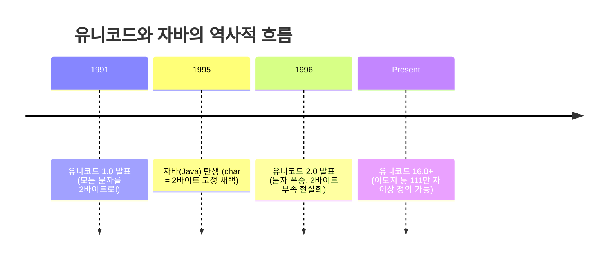
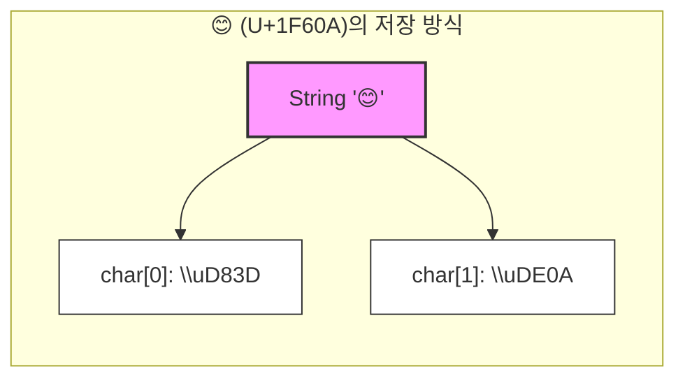

원시 타입(Primitive Type)을 학습할 때 가장 먼저 의문을 갖는 부분 중 하나가 바로 `char` 타입의 크기다. C언어 계열에서 `char`는 관례적으로 1바이트(ASCII)로 취급되지만, 자바에서는 **2바이트(16비트)** 를 차지한다.

`int`가 4바이트인 것은 이해하기 쉽지만, `char`가 2바이트라는 점은 직관적으로 와닿지 않는다. 더욱이 현대의 이모지(😊) 같은 문자는 2바이트로 표현조차 불가능하다. 자바는 과연 어떤 역사적 배경으로 이러한 크기를 갖게 되었으며, 현대의 복잡한 문자 체계를 어떻게 처리하고 있는지 내부 구조를 파헤쳐 본다.

---

## 1. 1995년의 오판: "65,536자면 충분하다"

자바 언어가 설계되던 1990년대 중반, IT 업계는 **유니코드(Unicode)** 프로젝트에 큰 기대를 걸고 있었다. 당시 유니코드 표준(버전 1.0~2.0)은 전 세계의 모든 문자를 16비트 코드 체계 안에 통합할 수 있다고 믿었다.

16비트로 표현 가능한 경우의 수는 개다. 당시 개발자들에게 이 숫자는 영어, 유럽어, 한자, 한글 등을 모두 담고도 남을 만큼 광활해 보였다. 따라서 자바 설계팀은 문자 타입 `char`를 **고정 2바이트(UTF-16)** 로 확정하는 결단을 내렸다.



결과적으로 이 결정은 자바가 별도의 라이브러리 없이 다국어를 지원하는 강력한 장점이 되었으나, 유니코드가 21비트 체계로 확장되면서 구조적 한계에 직면하게 된다.

---

## 2. 16비트의 한계와 서로게이트 페어 (Surrogate Pair)

문자 체계가 **BMP(Basic Multilingual Plane, 기본 다국어 평면)** 를 넘어 확장되면서, 65,536 범위를 벗어나는 문자들이 등장했다. 대표적인 것이 바로 이모지(Emoji)다.

예를 들어, 웃는 얼굴(😊)의 유니코드 포인트는 `U+1F60A`다. 이는 16비트(`U+FFFF`) 범위를 초과하므로 자바의 `char` 변수 하나에는 절대 담을 수 없다.

```java
// 컴파일 에러 발생: 16비트 그릇에 21비트 데이터를 넣으려 함
char c = '😊'; // Error: java: incompatible types: int cannot be converted to char

```

### 해결책: 두 개의 `char`를 하나로 묶기

자바는 이 문제를 해결하기 위해 **서로게이트 페어(Surrogate Pair)** 방식을 사용한다. 이는 2바이트 `char` 두 개를 연속으로 배치하여 하나의 문자를 표현하는 기법이다.

* **상위 서로게이트(High Surrogate)**: `U+D800` ~ `U+DBFF`
* **하위 서로게이트(Low Surrogate)**: `U+DC00` ~ `U+DFFF`

자바 가상 머신(JVM)이나 문자열 처리 로직은 이 범위의 코드가 발견되면, "이것은 개별 문자가 아니라, 뒤따라오는 코드와 합쳐져야 하나의 문자가 된다"라고 인식한다.



> **주의:** 서로게이트 페어 영역(`D800`~`DFFF`)은 문자로 할당되지 않고 오직 대리자(Surrogate) 역할만 수행하도록 유니코드 표준에 예약되어 있다.
 {: .prompt-warning }

---

## 3. 개발자가 주의해야 할 `length()`의 함정

서로게이트 페어의 도입으로 인해 `String.length()` 메서드는 개발자의 직관과 다르게 동작할 수 있다. `length()`는 **"글자 수"가 아니라 "사용된 `char`의 개수"를 반환**하기 때문이다.

실무에서 이모지나 특수 문자가 포함된 텍스트의 길이를 검증할 때는 반드시 `codePointCount`를 사용해야 한다.

```java
public class StringLengthDeepDive {
    public static void main(String[] args) {
        // "A" + "😊" (이모지)
        String content = "A😊";

        // 1. 단순 길이 측정 (char 개수 반환)
        // 'A'(1) + '😊'(2) = 3
        System.out.println("length(): " + content.length()); 

        // 2. 실제 문자 개수 측정 (Code Point 기준)
        // 실제 보이는 글자 수는 2개다.
        int realCount = content.codePointCount(0, content.length());
        System.out.println("Real Character Count: " + realCount);

        // 3. 내부 char 배열 확인
        char[] chars = content.toCharArray();
        System.out.printf("Char 1: 0x%X\n", (int)chars[1]); // High Surrogate
        System.out.printf("Char 2: 0x%X\n", (int)chars[2]); // Low Surrogate
    }
}

```

---

## 4. Deep Dive: Java 9의 혁신, Compact Strings

`char`가 2바이트라는 사실은 서구권 개발자들에게 불만 요인이었다. 영어 알파벳은 1바이트(ASCII)로 충분한데, 자바는 무조건 2바이트를 사용하니 메모리가 2배로 낭비되기 때문이다.

이를 해결하기 위해 **Java 9**부터 `String` 클래스의 내부 구현이 완전히 재설계되었다. 이를 **Compact Strings**라고 부른다.

### `char[]`에서 `byte[]`로의 전환

Java 8까지 `String`은 내부적으로 `char[]`를 사용했지만, Java 9부터는 `byte[]`와 인코딩 정보를 담는 `coder` 필드를 사용한다.

```java
// Java 9 이후의 String 클래스 구조 (단순화)
public final class String {
    @Stable
    private final byte[] value; // char[]가 byte[]로 변경됨
    private final byte coder;   // 0: LATIN1 (1byte), 1: UTF16 (2byte)
    // ...
}

```

### 동작 원리

JVM은 문자열 생성 시 내용을 분석하여 최적의 저장 방식을 선택한다.

1. **LATIN-1 (영어, 숫자 등)**: 문자가 모두 1바이트로 표현 가능하면 `coder=0`으로 설정하고, 문자당 1바이트만 할당한다. (메모리 50% 절감)
2. **UTF-16 (한글, 이모지 등)**: 1바이트 범위를 벗어나는 문자가 하나라도 포함되면 `coder=1`로 설정하고, 기존처럼 문자당 2바이트를 사용한다.

> **Tip:** 이 최적화는 `String` 객체에만 적용된다. `char` 원시 타입 변수 자체는 여전히 2바이트를 고수한다. 이는 기존 레거시 코드와의 호환성을 유지하기 위함이다.
{: .prompt-tip }

---

## 5. 요약

1. **역사적 배경**: 자바 `char`가 2바이트인 이유는 1995년 당시 모든 문자를 16비트(UCS-2)로 통합하려던 유니코드 초기 설계 사상을 따랐기 때문이다.
2. **확장 문자 처리**: 16비트를 초과하는 이모지 등은 두 개의 `char`를 묶는 **서로게이트 페어(Surrogate Pair)** 방식으로 표현한다.
3. **정확한 길이 계산**: 이모지가 포함된 문자열의 길이를 정확히 세려면 `.length()` 대신 **`.codePointCount()`** 를 사용해야 한다.
4. **최신 메모리 최적화**: Java 9부터는 **Compact Strings** 기능이 도입되어, `String` 내부적으로 문자열 구성에 따라 1바이트(`byte[]`) 또는 2바이트로 동적 최적화를 수행한다.

---

## 💡 Quiz: 학습 내용 확인하기

<details>
<summary><strong>Q1. Java 9 이상에서 "Hello"라는 문자열을 생성했을 때, 내부적으로 할당되는 바이트 수는 얼마인가요? (객체 헤더 제외)</strong></summary>

<strong>정답: 5바이트</strong>


Java 9의 Compact String 최적화로 인해, 순수 라틴 문자(영어)로 구성된 문자열은 <code>LATIN-1</code> 인코딩(1바이트)을 사용합니다. 따라서 5글자 × 1바이트 = 5바이트가 할당됩니다. (Java 8 이전이었다면 10바이트였습니다.)

</details>

<details>
<summary><strong>Q2. 이모지와 같이 2바이트를 넘어서는 문자를 자바가 내부적으로 2개의 char로 나누어 저장하는 방식을 무엇이라 합니까?</strong></summary>

<strong>정답: 서로게이트 페어 (Surrogate Pair)</strong>


유니코드의 평면 0(BMP)을 벗어나는 문자를 표현하기 위해 상위(High)와 하위(Low) 두 개의 16비트 대리자 코드를 쌍으로 사용하는 방식입니다.

</details>

<details>
<summary><strong>Q3. 다음 코드의 실행 결과는 무엇입니까?</strong></summary>

<code>String s = "A😊";</code>


<code>System.out.println(s.length());</code>

<strong>정답: 3</strong>


'A'는 1개의 char, '😊'는 서로게이트 페어로 인해 2개의 char를 차지하므로, <code>length()</code> 메서드는 총 3을 반환합니다.

</details>