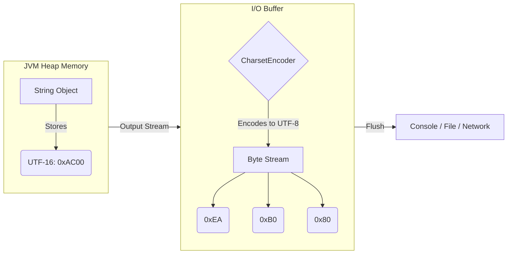

개발자라면 한 번쯤 한글이 깨지는 현상을 겪거나, 문자열 길이 계산 시 예상과 다른 바이트 수를 마주한 적이 있을 것이다. 특히 `"가"`라는 한 글자가 내부 메모리에서는 2바이트지만, 파일이나 네트워크로 전송될 때는 3바이트로 변환되는 현상은 입출력(I/O) 스트림의 핵심 개념인 **인코딩(Encoding)** 과 밀접한 관련이 있다.

이번 글에서는 자바가 문자열을 메모리에 저장하는 방식과 I/O 과정에서 발생하는 인코딩 변환 매커니즘을 알아보자.

---

## 1. 문제 상황: 한글 '가'는 왜 3개의 숫자가 되는가?

자바에서 한글 '가'를 입력받아 바이트 단위로 출력해보면 `234, 176, 128`이라는 세 개의 숫자가 출력되는 것을 볼 수 있다. '가'는 분명 한 글자인데, 왜 세 개의 데이터로 쪼개지는 것일까?

이 현상을 이해하기 위해서는 **메모리(Memory)**와 **직렬화(Serialization/I/O)** 의 관점을 분리해서 생각해야 한다.

| 구분 | 인코딩 체계 | 비트 크기 | 표현 방식 |
| --- | --- | --- | --- |
| **Java 메모리 (Internal)** | UTF-16 BE | 16비트 (2바이트) | 고정 길이 (기본 다국어 평면 기준) |
| **I/O 전송 (External)** | UTF-8 | 24비트 (3바이트) | 가변 길이 |

즉, **저장 방식(UTF-16)**과 **전송 방식(UTF-8)** 의 불일치로 인해 데이터의 크기와 형태가 변환되는 것이다.

---

## 2. JVM의 메모리 구조와 UTF-16

JVM(Java Virtual Machine)은 문자열(String)과 문자(char)를 내부적으로 **UTF-16 Big Endian** 방식으로 저장한다. 이는 초창기 유니코드 설계 사상을 반영한 것으로, 전 세계 대부분의 문자를 2바이트(16비트)로 표현하려던 의도가 담겨 있다.

### 2.1 문자 '가'의 메모리 적재

```java
char ch = '가';
System.out.println((int)ch); // 출력: 44032
System.out.printf("Hex: 0x%04X%n", (int)ch); // 출력: Hex: 0xAC00

```

위 코드에서 `'가'`는 유니코드 매핑 테이블에 의해 `U+AC00` (10진수 44032)라는 값을 가진다. JVM 힙 메모리(Heap Memory) 상에서 `String` 객체는 이 값을 `char` 배열(또는 `byte` 배열) 형태로 유지한다.

> **Deep Dive: Java 9 이후의 Compact Strings**
> 
> Java 8까지 `String` 클래스는 내부적으로 `char[]` 배열(UTF-16)을 사용했다. 즉, 영문자 하나만 저장해도 2바이트를 소비하는 메모리 낭비가 있었다.
> Java 9부터는 **Compact Strings** 기능이 도입되어, 내부 구현이 `byte[]`로 변경되었다. 문자열이 Latin-1(1바이트) 문자로만 구성된 경우 1바이트씩 저장하고, 한글 같은 멀티바이트 문자가 포함된 경우 UTF-16(2바이트)으로 저장한다. 이를 구분하기 위해 `coder`라는 별도의 플래그 필드가 추가되었다.
{: .prompt-info }

---

## 3. I/O 인코딩 변환 프로세스 (UTF-16 → UTF-8)

데이터가 JVM 밖으로 나갈 때(파일 저장, 네트워크 전송, 콘솔 출력), 자바는 메모리상의 데이터를 '바이트 스트림'으로 변환해야 한다. 이때 가장 표준적으로 사용되는 인코딩이 **UTF-8**이다.

### 3.1 인코딩 흐름 시각화

다음은 `'가'`라는 문자가 시스템에 입력되어 출력될 때까지의 데이터 변환 과정을 나타낸 다이어그램이다.



### 3.2 UTF-8 변환 알고리즘

UTF-8은 유니코드 범위에 따라 바이트 수가 달라지는 **가변 길이 인코딩**이다. 한글 음절 영역(U+0800 ~ U+FFFF)은 **3바이트** 템플릿을 따른다.

1. **'가'의 코드 포인트**: `0xAC00`
2. **2진수 변환**: `1010 1100 0000 0000`
3. **UTF-8 3바이트 템플릿 적용**: `1110xxxx 10xxxxxx 10xxxxxx`

| 바이트 순서 | 템플릿 (Binary) | 데이터 채움 (Binary) | 16진수 | 10진수 (Unsigned) |
| --- | --- | --- | --- | --- |
| 첫 번째 | `1110`xxxx | `1110`**1010** | `0xEA` | **234** |
| 두 번째 | `10`xxxxxx | `10`**110000** | `0xB0` | **176** |
| 세 번째 | `10`xxxxxx | `10`**000000** | `0x80` | **128** |

결과적으로 `0xAC00` 비트들이 쪼개져서 `0xEA, 0xB0, 0x80`이 되며, 이를 10진수(Unsigned)로 읽으면 `234, 176, 128`이 된다.

> **주의: Java의 byte는 Signed Type이다**
> 
> 자바의 `byte` 자료형은 -128 ~ 127 범위를 갖는다. 따라서 `0xEA`를 자바에서 그대로 `byte`로 출력하면 음수(`-22`)가 나온다. 우리가 흔히 말하는 234는 이를 `int`로 캐스팅하고 `& 0xFF` 비트 연산을 통해 부호 없는 정수(Unsigned Integer)로 해석했을 때의 값이다.
{: .prompt-warning }

---

## 4. 자바 전용 인코딩: Modified UTF-8

일반적인 웹/파일 환경과 달리, 자바 내부의 특수한 상황에서는 표준 UTF-8이 아닌 **Modified UTF-8**을 사용한다.

### 4.1 사용처

* **JNI (Java Native Interface)**: C/C++ 네이티브 코드와 문자열을 교환할 때.
* **Class File**: `.class` 파일 내부에서 문자열 리터럴을 저장할 때.
* **객체 직렬화 (Serialization)**: `DataOutputStream.writeUTF()` 등을 사용할 때.

### 4.2 표준 UTF-8과의 차이점

| 특성 | 표준 UTF-8 | Modified UTF-8 | 이유 |
| --- | --- | --- | --- |
| **Null 문자 (U+0000)** | `0x00` (1바이트) | `0xC0 0x80` (2바이트) | C언어 문자열(`char*`)이 `null(0)`을 문자열 끝(Termination)으로 인식하는 문제를 방지하기 위해. |
| **Surrogate Pair** | 4바이트로 통합 인코딩 | 3바이트 쌍 2개(총 6바이트)로 분리 | 인코딩 로직의 단순화. |

> **Tip: DataInputStream 사용 시 주의**
> 
> `DataInputStream.readUTF()`는 Modified UTF-8 형식을 기대한다. 일반적인 텍스트 파일(표준 UTF-8)을 이 메서드로 읽으려 하면 `UTFDataFormatException`이 발생하거나 데이터가 깨질 수 있다.
{: .prompt-tip }

---

## 5. 실습 코드 (Java)

위에서 설명한 내용을 검증하는 자바 예제 코드다.

```java
import java.io.UnsupportedEncodingException;
import java.util.Arrays;

public class EncodingLab {
    public static void main(String[] args) throws UnsupportedEncodingException {
        String target = "가";

        // 1. JVM 내부 값 (UTF-16) 확인
        char ch = target.charAt(0);
        System.out.printf("[JVM Memory] char: %c, Hex: U+%04X, Int: %d%n", 
                          ch, (int)ch, (int)ch);

        // 2. I/O 전송을 위한 UTF-8 바이트 분해
        byte[] utf8Bytes = target.getBytes("UTF-8");
        
        System.out.print("[UTF-8 Output] Bytes (Signed): ");
        for (byte b : utf8Bytes) {
            System.out.print(b + " "); // 자바의 byte는 기본적으로 signed
        }
        System.out.println();

        System.out.print("[UTF-8 Output] Bytes (Unsigned): ");
        for (byte b : utf8Bytes) {
            // 비트 연산으로 Unsigned 값 확인 (234, 176, 128)
            System.out.print((b & 0xFF) + " "); 
        }
        System.out.println();
        
        System.out.println("Byte Length: " + utf8Bytes.length);
    }
}

```

**실행 결과:**

```text
[JVM Memory] char: 가, Hex: U+AC00, Int: 44032
[UTF-8 Output] Bytes (Signed): -22 -80 -128 
[UTF-8 Output] Bytes (Unsigned): 234 176 128 
Byte Length: 3
```

---

## 6. 결론

자바 애플리케이션 개발 시 문자열 깨짐이나 바이트 길이 오류는 빈번하게 발생한다. 이를 해결하기 위해서는 다음 원칙을 기억해야 한다.

1. **자바 내부(메모리)는 UTF-16**이다. (Java 9+ Compact String에서도 논리적 기반은 유니코드다).
2. **외부와 통신(I/O)할 때는 바이트 스트림**으로 변환되며, 이때 **인코딩(Charset)** 설정이 필수적이다.
3. 한글은 **UTF-8에서 3바이트**, **EUC-KR에서 2바이트**를 차지한다.
4. 자바의 직렬화 프로토콜이나 클래스 파일 포맷은 **Modified UTF-8**이라는 변형 규격을 사용한다.

---

## 💡 Quiz: 학습 내용 확인하기

<details>
<summary>Q1. Java의 char 타입은 몇 바이트이며, 어떤 인코딩 방식을 따르는가?</summary>
Java의 char 타입은 2바이트(16비트)이며, UTF-16 Big Endian 방식을 따른다.
</details>

<details>
<summary>Q2. 문자열 "ABC"를 UTF-8로 인코딩했을 때와 "가나다"를 UTF-8로 인코딩했을 때의 바이트 수 차이는?</summary>
"ABC"는 ASCII 범위이므로 1바이트씩 총 3바이트가 된다.
"가나다"는 한글 범위이므로 3바이트씩 총 9바이트가 된다.
</details>

<details>
<summary>Q3. 자바의 Modified UTF-8이 null 문자를 0x00이 아닌 0xC0 0x80으로 표현하는 이유는?</summary>
C/C++ 언어 기반의 시스템에서 0x00을 문자열의 끝(Null Terminator)으로 인식하여 데이터 읽기를 중단하는 문제를 방지하기 위해서다.
</details>