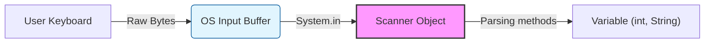

## 1. 입력의 본질: 바이트에서 데이터로

프로그래밍 관점에서 키보드 입력은 **스트림(Stream)** 의 형태를 띤다. 사용자가 키를 누르면 운영체제는 이를 '키보드 코드(KeyCode)'나 '스캔 코드(Scan Code)'로 인식하며, 최종적으로 프로그램에는 **문자(Character)** 혹은 **바이트(Byte)** 의 배열로 전달된다.

### 데이터의 흐름과 해석

입력된 데이터는 본질적으로 의미 없는 바이트의 연속이다. 예를 들어 사용자가 `1`과 `2`를 순서대로 입력했다면, 메모리에는 문자 '1'과 '2'가 저장된다.

> **Raw Data:** '1', '2'  
> **Interpretation:** 이를 문자열 "12"로 볼지, 정수 12로 볼지는 **해석기(Parser)** 의 역할이다.

이러한 복잡한 변환 과정을 추상화하여 개발자가 쉽게 사용할 수 있도록 제공하는 도구가 바로 Java의 `Scanner` 클래스이다.

---

## 2. System.in과 Scanner의 관계

Java에서 입력을 다룰 때 가장 먼저 마주하는 코드는 `new Scanner(System.in)`이다. 이 코드가 의미하는 바를 정확히 이해하기 위해 `System.in`과 `Scanner`를 분리하여 살펴본다.

### 2.1 System.in: 표준 입력 스트림 (Standard Input Stream)

`System.in`은 `java.lang.System` 클래스의 정적 필드(static field)로, 키보드와 연결된 **표준 입력 스트림(InputStream)** 이다.

* **역할:** 운영체제(OS)로부터 키보드 입력 값을 **바이트(Byte)** 단위로 읽어온다.
* **한계:** 바이트 단위로만 데이터를 읽기 때문에, 한글 같은 2바이트 이상의 문자나 정수/실수 같은 타입으로 직접 변환하기가 매우 번거롭다.

### 2.2 Scanner: 고수준 래퍼 (High-Level Wrapper)

`Scanner`는 `System.in`이 읽어온 날것의 바이트 데이터를 우리가 원하는 데이터 타입(`int`, `double`, `String` 등)으로 변환(Parsing) 해주는 역할을 한다.

```java
import java.util.Scanner; // 패키지는 자바 클래스들의 논리적 묶음

// System.in(바이트 스트림)을 Scanner(파서)에 전달하여 객체 생성
Scanner sc = new Scanner(System.in);

```

### 데이터 흐름 시각화



---

## 3. 입력 버퍼(Input Buffer)와 토큰(Token) 처리

Scanner의 핵심 동작 원리는 **버퍼링(Buffering)** 과 **토크나이징(Tokenizing)** 이다.

### 3.1 입력 버퍼의 동작

사용자가 데이터를 입력하고 Enter 키를 누르기 전까지 데이터는 I/O 버퍼에 대기한다. Enter를 누르는 순간 입력이 종료된 것으로 간주하며, 이때 Enter 키값은 **개행문자(\n)** 로 변환되어 버퍼의 끝에 저장된다.

> **Deep Dive: 화이트스페이스(Whitespace)와 제어 문자**
> 
> 컴퓨터는 공백이나 줄바꿈도 하나의 문자로 취급한다. 이를 화이트스페이스라고 하며, Scanner는 이를 데이터를 나누는 기준으로 사용한다.
> * **Space (' '):** 단어 사이의 공백
> * **Tab (\t):** 탭 문자
> * **Newline (\n, \r):** 줄바꿈 문자 (Enter 입력 시 생성)
{: .prompt-info }
> 
> 

### 3.2 토큰(Token)과 구분자(Separator)

토큰은 구분자로 잘라낸 데이터의 최소 단위이다. `Scanner`는 기본적으로 공백, 탭, 개행을 구분자로 사용한다.

**예제 코드: 입력 해석 과정**

```java
Scanner sc = new Scanner(System.in);

// 입력값 가정: "3 3.4" (엔터)
int a = sc.nextInt();        // 1. 정수 3을 읽음
double b = sc.nextDouble(); // 2. 실수 3.4를 읽음

```

**내부 처리 순서:**

1. **버퍼 상태:** `['3', ' ', '3', '.', '4', '\n']`
2. **nextInt() 호출:** 공백 전까지 읽어 '3'을 가져오고 정수 3으로 변환한다. (남은 버퍼: `[' ', '3', '.', '4', '\n']`)
3. **nextDouble() 호출:** 선행 공백(' ')을 무시하고 '3.4'를 읽어 실수 3.4로 변환한다.

---

## 4. next() vs nextLine(): 결정적 차이

Scanner 사용 시 가장 많이 발생하는 버그는 `next()` 계열 메서드와 `nextLine()`을 혼용할 때 발생한다. 두 메서드는 **개행문자(\n)** 처리 방식이 다르다.

| 메서드 | 읽는 단위 | 개행문자(\n) 처리 | 공백 포함 여부 |
| --- | --- | --- | --- |
| **next() / nextInt()** | 토큰 단위 | 읽지 않음 (버퍼에 남김) | ❌ (공백에서 멈춤) |
| **nextLine()** | 라인 단위 | 읽어서 소비함 (버퍼에서 제거) | ✅ (줄 끝까지 포함) |

> **주의: Ghost Enter 문제**
> 
> `nextInt()`로 숫자를 입력받은 후 곧바로 `nextLine()`을 호출하면, `nextInt()`가 남겨둔 개행문자(\n)를 `nextLine()`이 읽어버려 빈 문자열을 리턴하고 즉시 종료되는 현상이 발생한다.
> **해결책:** `nextInt()`와 `nextLine()` 사이에 `sc.nextLine()`을 한 번 더 호출하여 버퍼의 개행문자를 비워야 한다.
{: .prompt-warning }

---

## 5. 예외 처리와 견고한 입력 (Robust Input Handling)

자바에서 예외(Exception)는 프로그램 실행 중 발생하는 '비정상적인 상황'이다. Scanner 사용 시 발생할 수 있는 예외를 깊이 이해하고 방어하는 것은 안정적인 애플리케이션의 필수 조건이다.

### 5.1 Scanner의 주요 예외 (Exceptions)

Scanner가 던지는 예외들은 대부분 **Unchecked Exception (RuntimeException)** 이다. 컴파일러가 강제하지 않기 때문에 개발자가 주의하지 않으면 런타임 에러로 프로그램이 종료될 수 있다.

| 예외 클래스                     | 발생 원인                                | 해결 전략                     |
| -------------------------- | ------------------------------------ | ------------------------- |
| **InputMismatchException** | 기대한 타입(예: int)과 실제 입력(예: String) 불일치 | 버퍼 비우기(`next()`) 및 재입력 유도 |
| **NoSuchElementException** | 더 이상 읽을 토큰이 없는데 읽으려 할 때              | `hasNext()` 계열 메서드로 사전 확인 |
| **IllegalStateException**  | 이미 닫힌(closed) Scanner를 사용하려 할 때      | `close()` 호출 시점 관리 주의     |

### 5.2 전략 1: 사후 처리 (try-catch)

입력을 일단 시도하고, 에러가 발생하면 잡는 방식이다. 중요한 점은 에러 발생 후 버퍼에 남은 **'잘못된 입력값'** 을 반드시 비워줘야 한다는 것이다.

```java
Scanner sc = new Scanner(System.in);
try {
    System.out.print("나이를 입력하세요: ");
    int age = sc.nextInt(); // "abc" 입력 시 예외 발생
    System.out.println("나이: " + age);
} catch (java.util.InputMismatchException e) {
    System.out.println("에러: 숫자가 아닌 값이 입력되었습니다.");
    sc.nextLine(); // [핵심] 버퍼에 남은 "abc"와 엔터를 비워줌 (Flush)
}

```

### 5.3 전략 2: 사전 검증 (hasNext - 권장)

예외 처리는 시스템 비용(Cost)이 비싸다. 따라서 에러가 나기 전에 미리 확인(Validation) 하는 것이 성능과 안정성 면에서 더 유리하다.

> **Deep Dive: 룩어헤드(Lookahead) 메커니즘**
> 
> `hasNextInt()`는 입력 버퍼를 소비하지 않고 **미리보기(Peek)** 만 수행한다. 검증에 실패(false)하더라도 잘못된 데이터는 버퍼에 그대로 남아있으므로, 반드시 `next()`로 꺼내서 버려야 무한 루프를 방지할 수 있다.
{: .prompt-info }

**[견고한 입력 패턴 예시]**

```java
import java.util.Scanner;

public class SafeInputExample {
    public static void main(String[] args) {
        Scanner sc = new Scanner(System.in);
        int number = 0;

        System.out.print("정수를 입력하세요: ");

        // [Validation] 정수가 들어올 때까지 반복
        while (!sc.hasNextInt()) {
            // [Flush] 잘못된 입력을 읽어서 버림 (이 과정이 없으면 무한루프)
            String trash = sc.next(); 
            System.out.println("[오류] '" + trash + "'는 정수가 아닙니다.");
            System.out.print("다시 입력해주세요: ");
        }

        // 안전하게 정수 읽기
        number = sc.nextInt(); 
        System.out.println("입력 성공: " + number);
        
        sc.close();
    }
}

```

### 5.4 리소스 관리: try-with-resources

Java 7부터 도입된 `try-with-resources` 구문을 사용하면 `finally` 블록에서 수동으로 `close()`를 호출하지 않아도 자동으로 리소스가 해제된다.

```java
// 블록을 빠져나갈 때 sc.close()가 자동 호출됨
try (Scanner sc = new Scanner(System.in)) {
    System.out.print("입력: ");
    int data = sc.nextInt();
} catch (Exception e) {
    e.printStackTrace();
}

```

> **주의: System.in과 close()의 딜레마**
> 
> Scanner를 닫으면(`close()`) 연결된 기반 스트림인 `System.in`도 함께 닫힌다. 한 번 닫힌 `System.in`은 프로그램 재실행 전까지 다시 열 수 없다. 따라서 키보드 입력을 계속 받아야 한다면 Scanner를 섣불리 닫지 않도록 주의해야 한다.
{: .prompt-warning }

---

## 6. 요약

* **System.in & Scanner:** 바이트 스트림(`System.in`)을 Scanner가 받아 적절한 타입으로 파싱한다.
* **버퍼 동작:** `nextInt()`는 개행문자를 남기고, `nextLine()`은 소비한다. 이 차이를 명확히 구분해야 한다.
* **예외 방어:** `try-catch`로 예외를 잡을 때는 반드시 버퍼를 비워야(flush) 하며, 가능하면 `hasNextInt()` 등을 사용한 **사전 검증 방식**이 더 효율적이다.
* **무한 루프 주의:** `hasNext()`가 false일 때 잘못된 토큰을 소비(`next()`)하지 않으면 프로그램이 무한 루프에 빠진다.
* **리소스 해제:** Scanner 종료 시 `System.in`도 닫히므로, 프로그램 전체의 입력 생명주기를 고려해야 한다.

### 💡 Quiz: 학습 내용 확인하기

<details>
<summary>Q1. System.in은 어떤 단위로 데이터를 읽어오는가?</summary>
<strong>바이트(Byte)</strong> 단위로 데이터를 읽어온다.
</details>

<details>
<summary>Q2. 사용자가 "10"을 입력하고 엔터를 쳤을 때, nextInt() 메서드는 엔터값(\n)을 버퍼에서 제거하는가?</summary>
아니요. nextInt()는 숫자 10만 읽어가고, 엔터값(\n)은 입력 버퍼에 그대로 남겨둔다.
</details>

<details>
<summary>Q3. hasNextInt()가 false를 반환했을 때, 버퍼에 있는 잘못된 데이터를 비우지 않고 다시 hasNextInt()를 호출하면 어떤 현상이 발생하는가?</summary>
<strong>무한 루프(Infinite Loop)</strong>에 빠진다. 잘못된 데이터가 버퍼에 계속 남아있어 hasNextInt()가 계속 false를 반환하기 때문이다.
</details>

<details>
<summary>Q4. hasNextInt() 메서드는 입력 버퍼의 데이터를 소비(Consume)하는가?</summary>
아니요. <strong>미리보기(Peek)</strong>만 수행하며, 데이터를 버퍼에서 제거하지 않는다.
</details>
