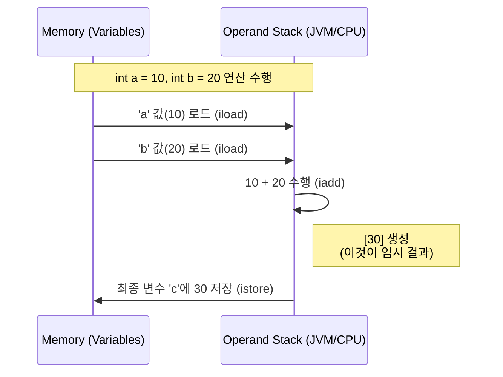
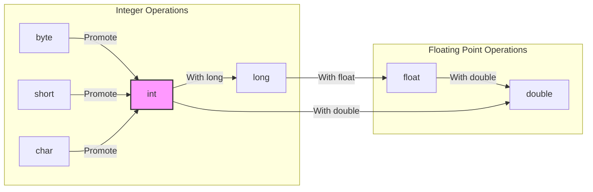

개발자가 `int c = a + b;`라는 코드를 작성할 때, 런타임 환경에서는 단순히 두 변수의 값을 더해 할당하는 것 이상의 작업이 수행된다. 이 과정에서 발생하는 **임시 결과(Temporary Result)** 와 **타입 프로모션(Type Promotion)** 의 원리를 이해하는 것은 정확한 데이터 타입 선정과 잠재적인 버그 방지를 위해 필수적이다.

> Java의 산술 연산은 단순한 값의 결합이 아니다. 그 뒤에는 CPU 레지스터와 JVM 오퍼랜드 스택(Operand Stack)을 오가는 **임시 결과**의 생성과, 데이터 손실을 방지하기 위한 **타입 승격** 메커니즘이 숨겨져 있다.
{: .prompt-info }

---

## 1. 임시 결과(Temporary Result): 연산의 중간 기착지

임시 결과란 연산이 수행되는 **찰나의 순간에만 메모리(주로 CPU 레지스터나 JVM 스택)에 존재하는 값**을 의미한다.

### 연산의 내부 프로세스

`a + b`가 실행될 때, 변수 `a`와 `b`의 값이 직접 합쳐져서 변수 `c`로 이동하는 것이 아니다. CPU 혹은 JVM은 연산을 위해 값을 로드(Load)하고, 계산(ALU Operation)한 뒤, 그 결과를 잠시 들고 있다가(Temporary Store), 최종 목적지에 저장(Store)한다.



### 복합 연산에서의 생명주기

수식이 복잡해질수록 임시 결과의 생성과 소멸은 빈번하게 일어난다.

```java
int x = 5;
int y = 2;
// 복합 연산: 임시 결과가 여러 번 생성된다.
int z = x * 3 + y * 4;

```

위 코드의 내부 동작 흐름은 다음과 같다.

1. `x * 3` 계산 → **15 (임시 결과 1 생성)**
2. `y * 4` 계산 → **8 (임시 결과 2 생성)**
3. `15 + 8` 계산 → **23 (임시 결과 3 생성)**
4. 최종 값 `23`을 변수 `z`에 저장하며 모든 임시 결과 소멸

> **Deep Dive: JVM의 Operand Stack**
> 
> Java 바이트코드를 살펴보면 임시 결과의 실체를 명확히 볼 수 있다. `iload` 명령어로 변수 값을 스택에 올리고, `iadd` 같은 연산 명령어가 실행되면 스택의 최상단 값들을 꺼내 연산한 뒤 **결과를 다시 스택(Operand Stack)에 push** 한다. 이 스택에 잠시 머무르는 값이 바로 임시 결과다.
{: .prompt-info }

---

## 2. 타입 프로모션(Type Promotion): 암묵적인 형 변환 규칙

Java는 산술 연산을 수행할 때, 피연산자들의 타입을 자동으로 더 큰 범위의 타입으로 변환하는 규칙을 가지고 있다. 이를 **타입 프로모션(Type Promotion)** 혹은 **형 승격**이라 한다.

### 핵심 프로모션 규칙

1. **4바이트 미만 정수의 승격**: `byte`, `short`, `char` 타입은 연산 시 무조건 **`int`** 로 변환된다.
2. **큰 타입으로의 동화**: 서로 다른 타입이 연산될 경우, 더 큰 데이터 타입을 가진 쪽으로 맞춰진다.
* `long`이 포함된 연산 → 결과는 `long`
* `float`가 포함된 연산 → 결과는 `float`
* `double`이 포함된 연산 → 결과는 `double`




### 왜 byte 끼리 더해도 int가 되는가? (32bit 아키텍처의 비밀)

많은 사람들이 의아해하는 부분이 바로 `byte` 연산이다.

```java
byte a = 10;
byte b = 20;
// byte c = a + b; // 컴파일 에러 발생!

```

> **Deep Dive: 왜 int로 승격되는가? (Word Size)**
> 
> 이는 CPU 아키텍처와 성능 최적화 때문이다. 현대의 CPU는 대부분 32비트(4바이트) 또는 64비트 단위(Word Size)로 데이터를 처리하도록 설계되어 있다.
> 1바이트(byte)나 2바이트(short) 단위로 연산하는 것보다, 기본 처리 단위인 4바이트(int)로 데이터를 확장하여 레지스터에서 처리하는 것이 하드웨어적으로 더 효율적이고 빠르다. 따라서 Java Virtual Machine(JVM)은 4바이트 미만의 데이터를 연산할 때 효율성을 위해 `int`로 변환하여 처리한다.
{: .prompt-info }

---

## 3. 임시 결과와 타입 승격의 상호작용

임시 결과와 타입 승격은 별개의 개념이 아니다. **연산이 일어나는 순간(임시 결과 생성) 타입 승격이 적용**되며, 따라서 **임시 결과의 타입은 항상 승격된 타입**을 따른다.

### 실무 예제 분석

다음은 흔히 발생할 수 있는 데이터 손실 및 타입 불일치 사례다.

#### Case 1: 명시적 캐스팅과 오버플로우

```java
public class TypePromotionEx {
    public static void main(String[] args) {
        byte b1 = 100;
        byte b2 = 30;
        
        // 1. b1 + b2 수행 시 둘 다 int로 승격됨 (100 + 30 = 130)
        // 2. 임시 결과 130은 int 타입임.
        // 3. 이를 byte 변수에 담으려 하므로 컴파일 에러 발생.
        // byte sum = b1 + b2; 
        
        // 해결: 강제 형 변환(Casting)
        // 주의: byte 범위(-128 ~ 127)를 넘었으므로 오버플로우 발생 (-126 저장됨)
        byte sum = (byte)(b1 + b2); 
        
        System.out.println("Result: " + sum);
    }
}

```

> **주의:** 승격된 `int` 결과를 억지로 작은 타입(`byte`)으로 캐스팅할 경우, 상위 비트가 잘려나가면서(Truncation) 전혀 엉뚱한 값(음수 등)이 될 수 있음을 명심해야 한다.
{: .prompt-warning }

#### Case 2: 혼합 타입 연산의 단계별 승격

```java
public class MixedTypeEx {
    public static void main(String[] args) {
        int i = 10;
        long l = 20L;
        float f = 30.5f;
        
        // 표현식: i + l + f
        // 순서에 따른 타입 변화 추적
        float result = i + l + f;
    }
}

```

**단계별 분석 표:**

| 연산 단계 | 연산 대상 | 적용 규칙 | 임시 결과 값 | 임시 결과 타입 |
| --- | --- | --- | --- | --- |
| 1 | `i` + `l` | `int`가 `long`으로 승격 | 30 | `long` |
| 2 | (결과 1) + `f` | `long`이 `float`로 승격 | 60.5 | `float` |
| 최종 | 할당 | 변수 타입과 일치 | 60.5 | `float` |

---

## 4. 마치며

Java의 산술 연산에서 우리가 기억해야 할 것은 "눈에 보이는 타입이 전부가 아니다"라는 점이다.

1. **임시 결과**: 모든 연산은 메모리 어딘가에 중간값을 생성하며, 이는 아주 잠깐 존재했다 사라진다.
2. **타입 안전성**: Java는 하드웨어 효율성과 데이터 손실 방지를 위해 작은 타입을 `int`나 더 큰 타입으로 자동 승격시킨다.

이 원리를 이해하면, "왜 `byte` 덧셈에 캐스팅이 필요한지", "복잡한 수식에서 왜 결과가 `double`이 되었는지" 명확하게 파악할 수 있다. 컴파일러가 보내는 타입 불일치 오류는 단순한 귀찮음이 아니라, 내부에서 일어나는 타입 승격의 결과임을 이해하자.

---

## 💡 Quiz: 학습 내용 확인하기

<details>
<summary>Q1. byte 타입 변수 a와 b를 더했을 때, 생성되는 임시 결과의 타입은 무엇인가?</summary>


정답: <strong>int</strong>


Java JVM의 피연산자 스택(Operand Stack)은 피연산자를 기본적으로 4바이트(int) 단위로 처리하기 때문에, byte, short, char 타입은 연산 시 자동으로 int로 승격(Promotion)됩니다.
</details>

<details>
<summary>Q2. int a = 5; double b = 2.5; 연산 시 결과 타입이 double이 되는 이유는?</summary>


정답: <strong>타입 프로모션 규칙에 의해 정수가 실수로, 작은 타입이 큰 타입으로 승격되기 때문입니다.</strong>


서로 다른 타입의 연산에서는 데이터 손실을 막기 위해 표현 범위가 더 넓은 쪽으로 타입을 맞춥니다. 따라서 int가 double로 변환된 후 연산이 수행됩니다.
</details>

<details>
<summary>Q3. 임시 결과(Temporary Result)는 연산이 끝난 후에도 메모리에 계속 남아있는가?</summary>


정답: <strong>아니요.</strong>


임시 결과는 연산 과정 중에만 레지스터나 스택에 잠시 존재하다가, 최종 변수에 값이 저장되거나 다음 연산에 사용된 직후 소멸합니다.
</details>