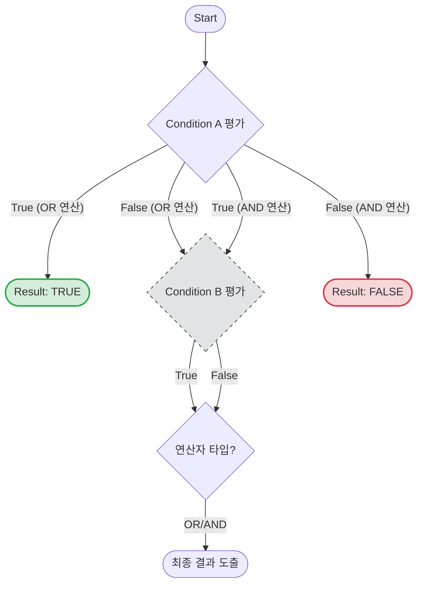

**Short Circuit(단락 회로)** 평가는 프로그래밍 언어의 컴파일러나 인터프리터가 논리 연산식을 평가할 때 사용하는 최적화 기법이다. 모든 연산자는 **왼쪽에서 오른쪽(`->`)** 으로 평가되는데, 앞선 연산의 결과만으로 전체 식의 결과가 확정될 경우 **남은 연산 과정을 아예 실행하지 않고 건너뛰는(Skip)** 것을 의미한다.

이 메커니즘은 시스템 리소스를 절약하고 속도를 향상시키지만, 개발자가 의도치 않은 **부작용(Side Effect)** 을 낳을 수 있는 양날의 검이다.

---

## 1. 동작 메커니즘과 시각화

Short Circuit은 논리합(OR)과 논리곱(AND) 연산자에서 서로 다르게 동작하지만, "결과가 확정되는 즉시 멈춘다"는 대원칙은 동일하다.

### 논리 흐름도 (Logic Flow)

아래 다이어그램은 Java의 논리 연산자가 어떻게 다음 단계를 생략하는지 보여준다.



### 연산자별 상세 동작

| 연산자 | 기호 | Short Circuit 조건 | 동작 설명 |
| --- | --- | --- | --- |
| **논리합** | ` |  | ` |
| **논리곱** | `&&` | 왼쪽 항이 **False**일 때 | 전체 결과는 무조건 False이므로 오른쪽 항을 **실행하지 않는다.** |

> **Deep Dive: Java Bytecode 수준에서의 처리**
> 
> Java 컴파일러(`javac`)는 소스 코드를 바이트코드로 변환할 때, Short Circuit을 구현하기 위해 조건부 점프(Conditional Jump) 명령어를 사용한다.
> 예를 들어 `if (A && B)` 구문이 있다면:
> 
> 1. `A`를 로드하고 평가한다.
> 2. `ifeq` (0과 같으면, 즉 False이면) 명령어를 통해 `B`를 평가하는 코드 블록을 건너뛰고 바로 `else`나 다음 로직으로 점프(Jump)하도록 설계된다.
> 3. 즉, 물리적으로 `B` 명령어 자체가 CPU에서 실행될 기회를 얻지 못한다.
{: .prompt-info }
> 
> 

---

## 2. 치명적인 주의사항: 상태 변경(Side Effect)의 위험성

Short Circuit의 가장 큰 함정은 **조건식 내부에서 변수의 상태를 변경하는 코드를 작성할 때** 발생한다. 개발자는 조건식 안에 있는 코드가 당연히 실행될 것이라 기대하지만, Short Circuit에 의해 실행이 생략되면 데이터 무결성이 깨지게 된다.

### 안티 패턴 (Anti-Pattern) 예제

조건식 안에 증감 연산자(`++`, `--`)를 사용하여 변수의 값을 변경하려는 시도는 매우 위험하다.

```java
public class ShortCircuitTrap {
    public static void main(String[] args) {
        int x = 10;
        
        // [시나리오]
        // 1. (x-- > 3) 평가:
        //    - 현재 x는 10. 10 > 3 은 True.
        //    - 후위 연산자이므로 비교 후 x는 9로 감소.
        // 2. 논리합(||)의 특성:
        //    - 앞이 True이므로 뒤의 식 (++x > 10)은 평가하지 않음 (Skip).
        // 3. 결과:
        //    - 개발자는 뒤의 ++x가 실행되어 x가 다시 10이 되길 기대했을 수 있음.
        
        if (x-- > 3 || ++x > 10) {
            System.out.println("조건문 진입");
        }

        // 예상값: 10 (감소했다가 다시 증가했으므로)
        // 실제값: 9 (뒤의 증가 연산이 실행되지 않음)
        System.out.println("최종 x 값: " + x); 
    }
}

```

> **주의:** 조건문(`if`, `while` 등) 내부에서는 **순수하게 값을 비교하는 로직(Pure Function)** 만 작성해야 한다. 상태를 변경하는 로직은 조건문 밖으로 분리하는 것이 클린 코드의 원칙이다.
{: .prompt-warning }

---

## 3. 실전 활용: 쿼리 성능 최적화 (Query Optimization)

이 원리는 애플리케이션 코드뿐만 아니라 데이터베이스 쿼리 튜닝에서도 중요하게 활용된다. `WHERE` 절에 나열된 조건들의 순서에 따라 쿼리의 성능(Cost)이 달라질 수 있다.

핵심 전략은 **"비용이 저렴한 조건을 먼저 검사하여, 비용이 비싼 연산을 최대한 실행하지 않도록 유도하는 것"** 이다.

### 조건 배치 전략

1. **AND (`&&`) 조건인 경우**:
* 데이터를 많이 필터링할 수 있는 조건이나, 연산 비용이 **가벼운 조건**을 왼쪽에 배치한다.
* 앞에서 False가 발생하면 뒤쪽의 무거운 연산을 수행하지 않는다.


2. **OR (`||`) 조건인 경우**:
* **True가 될 확률이 높은 조건**을 왼쪽에 배치한다.
* 앞에서 True가 발생하면 뒤쪽 조건을 검사하지 않아 탐색 범위를 줄인다.


### SQL 튜닝 예시

가벼운 컬럼 비교(`Status`)와 무거운 함수 연산(`ComplexFunction`)이 섞여 있는 경우를 비교해 보자.

```sql
-- [Bad Case] 비효율적인 쿼리
-- 모든 행(Row)에 대해 무거운 이미지 분석 함수를 먼저 실행한다.
-- 그 후 결과가 1인 데이터 중 Status를 확인한다.
-- CPU 부하: High
SELECT * FROM Users 
WHERE ComplexFunction(ProfileImage) = 1 
  AND Status = 'Active';

-- [Good Case] Short Circuit을 활용한 튜닝
-- 1. 텍스트 비교인 'Active' 체크는 매우 빠르다. (가벼움)
-- 2. 'Active'가 아닌 행들은 뒤의 무거운 함수를 아예 실행하지 않는다.
-- CPU 부하: Low
SELECT * FROM Users 
WHERE Status = 'Active' 
  AND ComplexFunction(ProfileImage) = 1;

```

> **Tip:** 최신 DB 옵티마이저(Optimizer)는 실행 계획(Execution Plan)을 수립할 때 스스로 조건 순서를 재배치하여 최적화를 수행하기도 한다. 하지만 서브쿼리가 포함되거나 복잡한 연산자 함수(User Defined Function)가 개입될 경우 옵티마이저가 완벽하지 않을 수 있으므로, 개발자가 명시적으로 효율적인 순서를 작성하는 습관을 들이는 것이 안전하다.
 {: .prompt-tip }

---

## 💡 Quiz: 학습 내용 확인하기

<details>
<summary>Q1. 다음 Java 코드 실행 후 출력되는 결과는 무엇인가?</summary>


**정답: false / 10**

**해설:**

1. `check(false)` 실행: `int n = 10`
2. 조건식 `if (n > 20 && ++n > 0)` 평가
3. 앞의 `n > 20` (10 > 20)은 **False**이다.
4. **AND(`&&`)** 연산자이므로 앞이 False면 뒤의 식 `++n > 0`은 실행되지 않는다 (**Short Circuit**).
5. 따라서 `n`은 증가하지 않고 그대로 10이다.
6. 결과적으로 `false`가 출력되고, `n`은 `10`이 출력된다.

</details>

<details>
<summary>Q2. SQL 쿼리 작성 시 AND 조건에서 성능상 가장 유리한 조건 배치 순서는?</summary>


**정답: 가볍거나 데이터를 많이 걸러내는 조건을 왼쪽에 배치한다.**

**해설:**
AND 연산은 앞에서 하나라도 False가 나오면 뒤의 연산을 수행하지 않는다. 따라서 연산 비용이 낮고 False가 나올 확률이 높은(데이터를 많이 필터링하는) 조건을 가장 먼저(왼쪽) 배치해야, 불필요한 고비용 연산을 최소화할 수 있다.

</details>