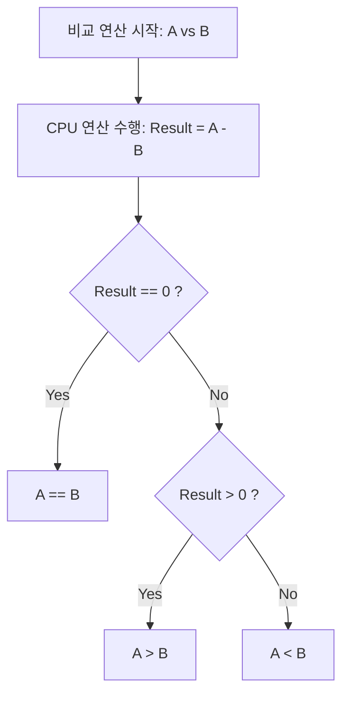

프로그래밍을 하다 보면 두 수가 같은지(`==`), 혹은 어느 쪽이 더 큰지(`>`) 비교해야 하는 상황을 끊임없이 마주한다. 정수형(`int`) 데이터를 다룰 때는 이러한 비교가 직관적이지만, 실수형(`float`, `double`)이나 논리형(`boolean`)으로 넘어가면 내부 동작 원리에 대한 이해 부족으로 인해 예상치 못한 버그를 만들어내곤 한다.

본 포스트에서는 관계 연산자가 하드웨어 수준에서 어떻게 작동하는지 살펴보고, **왜 Java에서는 C언어와 달리 Boolean을 정수로 변환할 수 없는지**, 그리고 **왜 실수형 데이터에 등가 비교(`==`)를 사용하면 안 되는지** 그 기술적 배경을 정리한다.

---

## 1. 관계 연산자의 작동 메커니즘: "뺄셈"

우리는 코드를 작성할 때 `>`나 `<` 기호를 통해 직관적으로 크기를 비교한다고 생각한다. 하지만 컴퓨터의 두뇌인 CPU는 인간처럼 직관적인 비교를 수행하지 않는다. CPU 내부(ALU)에서는 **'뺄셈(Subtraction)'** 연산을 통해 두 값의 관계를 파악한다.

### 비교 연산의 내부 로직

컴퓨터가 두 수 와 를 비교하는 과정은 다음과 같다.

1. **상등(Equality) 확인:** 연산 를 수행한다. 결과가 **0**이면 두 수는 **같다**고 판단한다.
2. **크기(Comparison) 확인:** 뺄셈의 결과가 **양수**인지 **음수**인지에 따라 대소 관계를 판별한다. (Zero Flag, Sign Flag 등의 레지스터 상태 플래그를 활용)

이 흐름을 시각화하면 다음과 같다.



---

## 2. Boolean 타입의 엄격함과 JVM

관계 연산의 결과는 항상 `true` 또는 `false`인 **Boolean(논리)** 형식으로 반환된다. 여기서 C/C++ 기반의 개발 경험이 있는 경우, `true`를 `1`로, `false`를 `0`으로 치환하여 형변환(Casting) 하려는 시도를 하곤 한다. 하지만 Java에서는 이러한 변환이 **엄격하게 금지**된다.

### 하드웨어 vs JVM의 관점 차이

| 구분 | 관점 및 특징 |
| --- | --- |
| **CPU (Hardware)** | 물리적으로 `boolean` 타입이 존재하지 않는다. 오직 0과 1의 비트, 그리고 정수(`int`) 연산만 처리한다. |
| **Java (JVM)** | `boolean`이라는 독자적인 데이터 타입을 정의하며, 이를 정수형과 **완벽하게 분리**하여 관리한다. |

Java 컴파일러는 타입 안전성(Type Safety)을 최우선으로 하기 때문에, 논리형과 숫자형 간의 모호한 호환을 허용하지 않는다. 따라서 아래와 같은 코드는 컴파일 단계에서 차단된다.

```java
public class BooleanCastingTest {
    public static void main(String[] args) {
        boolean flag = true;

        /**
         * [컴파일 에러 발생]
         * java: incompatible types: boolean cannot be converted to int
         * C언어처럼 논리값을 1 또는 0으로 해석하여 변환할 수 없다.
         */
        // int num = (int) flag; 

        // 문자형(char) 또한 정수형의 일종이므로 변환 불가
        // char c = (char) flag; 
        
        System.out.println("Boolean은 오직 논리 연산에만 사용된다: " + flag);
    }
}

```

> **Deep Dive: JVM 내부에서의 boolean 처리**
> 
> 흥미롭게도 JVM 수준(Bytecode)으로 내려가면, `boolean`은 내부적으로 `int`(32bit)로 처리되는 경우가 많다. Java Virtual Machine Specification에 따르면, `boolean` 변수는 컴파일 시 `int` 데이터 타입으로 변환되어 스택에서 연산된다(`true`는 1, `false`는 0). 하지만 `boolean[]` 배열의 경우 메모리 효율을 위해 `byte` 배열로 처리된다.
> **핵심은, 내부 구현이 숫자를 사용하더라도 Java 언어 명세(Language Specification) 차원에서는 개발자가 이를 명시적으로 변환하는 것을 막아두었다는 점이다.** 이는 코드의 명확성과 플랫폼 독립성을 보장하기 위함이다.
{: .prompt-info }

---

## 3. 부동소수점 오차 (Floating Point Error)

관계 연산자의 원리가 '뺄셈'이라는 점은 **실수형(Float, Double)** 데이터를 비교할 때 치명적인 문제를 야기한다. 컴퓨터가 실수를 표현하는 방식인 **IEEE 754 부동소수점 표준**은 태생적으로 완벽한 실수를 저장하지 못하고 근사값(Approximation)을 저장하기 때문이다.

### 왜 실수 비교가 위험한가?

1. **잔존 데이터(Trash Value):** 논리적으로 같은 두 실수를 뺐을 때, 미세한 정밀도 차이로 인해 결과가 정확히 되지 않고 과 같은 아주 작은 값이 남을 수 있다.
2. **관계 연산자의 오판:** 컴퓨터는 뺄셈 결과가 0이 아니므로 두 수가 **다르다**(`!=`)고 판단하거나, 엉뚱한 대소 관계를 리턴하게 된다.

### 실수형 비교 실패 예제

```java
public class FloatComparison {
    public static void main(String[] args) {
        // float의 정밀도 한계(유효자릿수 약 7자리)를 테스트
        float f1 = 0.9999999F; 
        float f2 = 1.0F;

        // 논리적으로 f1과 f2는 다른 수이다.
        // 하지만 float의 가수부 표현 한계를 넘어서면 두 비트 패턴이 같아질 수 있다.
        if (f1 == f2) {
            // 이 블록이 실행된다면, 정밀도 문제로 인해 서로 다른 수를 같다고 오판한 것이다.
            System.out.println("true: 두 수는 논리적으로 다르지만, 컴퓨터는 같다고 판단했다.");
        }
    }
}

```

> **주의:** 금융 계산이나 과학 정밀 계산과 같이 정확도가 생명인 분야에서는 `float`이나 `double` 타입을 사용하여 `==` 연산자로 비교해서는 안된다.
{: .prompt-warning }


### 올바른 실수 비교 방법

실수를 비교해야 한다면 다음과 같은 대안을 사용해야 한다.

#### **Epsilon(입실론) 사용:** 허용 가능한 오차 범위(Tolerance)를 정해두고, 두 수의 차이가 그 범위보다 작은지 확인하는 수학적 방법이다.

```java
double a = 1.0;
double b = 0.9999999;
double epsilon = 1e-9; // 오차 허용 범위

if (Math.abs(a - b) < epsilon) {
    // 차이가 아주 작으므로 같다고 간주
}
```

#### **BigDecimal 클래스 사용:** 실무에서 가장 권장되는 방식이다.
   금융권이나 정밀한 계산이 필요한 실무에서는 BigDecimal을 사용하는 것이 표준이다. 단, 객체 생성 시 치명적인 함정을 피해야 한다.
   - 문자열(String) 생성자 사용 (Best): 숫자를 문자열로 전달하면 오차 없이 정확하게 저장된다.
   - `valueOf` 메서드 사용 (Best): double 변수를 써야 한다면, 내부적으로 문자열 변환을 수행하는 `BigDecimal.valueOf()`를 사용한다.
   - `double` 생성자 사용 금지 (Worst): `new BigDecimal(double)`은 부동소수점의 근사값을 그대로 가져오므로 절대 사용하면 안 된다.

```java
import java.math.BigDecimal;

// ❌ 나쁜 예: 부동소수점 오차가 그대로 들어감
// 저장된 값: 0.10000000000000000555...
BigDecimal bad = new BigDecimal(0.1); 

// ✅ 좋은 예 1: 문자열로 초기화 (가장 확실함)
BigDecimal good1 = new BigDecimal("0.1");

// ✅ 좋은 예 2: double 변수를 써야 할 땐 valueOf 사용
double val = 0.1;
BigDecimal good2 = BigDecimal.valueOf(val); // 내부적으로 Double.toString(val) 수행

// 비교 연산 (compareTo 사용)
if (good1.compareTo(good2) == 0) {
    System.out.println("정확히 일치합니다.");
}
```

---

## 4. 결론 및 요약

Java 프로그래밍에서 관계 연산자를 올바르게 사용하기 위해서는 단순한 문법 암기를 넘어 하드웨어와 언어적 특성을 이해해야 한다.

1. **관계 연산의 본질:** `==`, `>`, `<` 연산은 내부적으로 **뺄셈**을 통해 0인지 양수/음수인지 판단하는 과정이다.
2. **Boolean의 타입 안전성:** Java의 `boolean`은 JVM에 의해 추상화된 독립적인 타입이다. C언어적 습관으로 `int` 형변환을 시도하면 컴파일 에러가 발생한다.
3. **실수형 비교의 위험성:** 부동소수점 방식은 근사값을 다루므로, 정밀도 오차로 인해 `==` 연산이 의도치 않은 결과를 초래한다. 실무에서는 **`BigDecimal`**을 활용하거나 오차 범위를 고려한 비교 로직을 작성해야 한다.

---

## 💡 Quiz: 학습 내용 확인하기

<details>
<summary>Q1. 컴퓨터 내부(CPU)에서 두 수의 크기 비교(>, <)나 상등 비교(==)를 수행할 때, 가장 기본적으로 사용하는 산술 연산은 무엇인가?</summary>

**정답:** 뺄셈 (Subtraction)

</details>

<details>
<summary>Q2. 다음 코드의 실행 결과는 무엇인가? <code>int result = (int) true;</code></summary>

**정답:** 컴파일 에러 (Compile Error). Java에서는 boolean 타입을 int로 강제 형변환할 수 없다.

</details>

<details>
<summary>Q3. 실수형 데이터(float, double)를 비교할 때 등가비교 연산자(==)를 사용하는 것이 권장되지 않는 이유는 무엇인가?</summary>

**정답:** 부동소수점 표현 방식의 한계로 인해 미세한 오차가 발생하여, 논리적으로 같은 값이라도 컴퓨터 내부에서는 서로 다른 값으로 인식(뺄셈 결과가 0이 아님)될 수 있기 때문이다.

</details>


