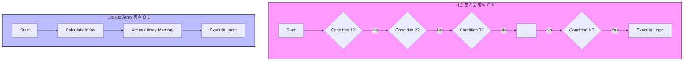

**Lookup 배열(Lookup Array)** 은 데이터를 검색하거나 참조하기 위해 미리 계산된 값들을 배열로 구성하여 사용하는 프로그래밍 기법이다. 이는 단순히 데이터를 저장하는 자료구조를 넘어, 제어 흐름(Control Flow)을 데이터 접근(Data Access)으로 전환하는 고성능 아키텍처의 핵심 요소다.

---

## 1. 제어 구조의 한계와 성능 병목

일반적인 비즈니스 로직을 구현할 때 가장 흔하게 사용되는 제어문은 `if-else`와 `switch-case`다. 하지만 처리해야 할 조건(Case)이 늘어날수록 이 구조는 명확한 한계를 드러낸다.

### 1.1 순차 비교의 비효율성 (O(N))

전통적인 제어문은 '순차적 비교'를 수행한다. 예를 들어, 100번째 케이스를 실행하기 위해서는 앞선 99번의 비교 연산(`False`)을 거쳐야 한다.

* **비균일한 성능**: 조건 목록의 앞쪽에 있는 데이터는 빠르지만, 뒤쪽에 있는 데이터는 처리가 느리다.
* **CPU 파이프라인 효율 저하**: 잦은 분기(Branching)는 CPU의 분기 예측(Branch Prediction) 실패 확률을 높여 파이프라인 스톨(Stall)을 유발할 수 있다.

### 1.2 복잡도 증가

조건이 추가될 때마다 코드 라인이 선형적으로 증가하며, 비즈니스 로직과 제어 로직이 뒤섞여 유지보수가 어려워진다.



---

## 2. Lookup 배열의 동작 원리

Lookup 배열은 **"연산(Calculation)을 통한 인덱스 도출"** 이 핵심이다. 값을 비교하는 과정 없이, 입력값을 배열의 인덱스로 변환하여 즉시 데이터에 접근한다.

### 2.1 핵심 특징

* **Direct Access (직접 접근)**: 메모리 주소 연산을 통해 단 한 번의 접근으로 데이터를 가져온다.
* **O(1) 성능 보장**: 데이터가 10개든 100만 개든 접근 속도가 동일하다.
* **Data-Driven Design**: 로직(코드)이 아닌 데이터(배열)가 프로그램의 동작을 제어한다.

> **Deep Dive: 배열 접근의 내부 메커니즘 (Memory Address Calculation)**
> 
> 왜 배열 접근은 빠를까? 배열은 메모리상에 연속적으로 할당된다. 컴파일러와 CPU는 인덱스를 통해 물리적 메모리 주소를 다음과 같이 즉시 계산한다.
> `Target Address = Base Address + (Index * Size of Data Type)`
> 예를 들어 `int[] arr`에서 `arr[5]`에 접근한다면, 비교 연산 없이 `시작주소 + (5 * 4바이트)`라는 단순 사칙연산 한 번으로 해당 위치를 찾아간다. 이것이 O(1) 성능의 원천이다.
{: .prompt-info }

---

## 3. 실전 구현: Switch-Case vs Lookup 배열

사용자의 **나이(Age)**에 따라 서로 다른 **할인율(Rate)** 을 적용하는 요금 계산 로직을 예로 들어 비교해 보자.

### 3.1 Legacy Code: Switch-Case 방식

조건이 늘어날수록 코드가 비대해지며, 가독성이 떨어진다.

```java
public double calculateFeeLegacy(int age, int baseFare) {
    double rate;
    
    // 조건이 많아질수록 JVM이 바이트코드를 최적화하기 어려워지며 가독성이 저하됨
    switch (age) {
        case 1: rate = 0.0; break;
        case 2: rate = 0.0; break;
        case 3: rate = 0.1; break;
        // ... (중략: 수백 개의 케이스가 존재할 수 있음) ...
        case 10: rate = 0.5; break;
        default: rate = 1.0;
    }

    return baseFare * rate; // 할인된 요금 반환
}

```

### 3.2 Refactored Code: Lookup 배열 방식

제어문을 제거하고 데이터 정의로 로직을 대체한다. 로직은 데이터의 양과 무관하게 일정하게 유지된다.

```java
public class FeeCalculator {
    // 1. 데이터 정의: 각 연령(인덱스)에 매핑되는 할인율을 미리 배열로 구성 (불변성 보장)
    // 0번 인덱스부터 사용하기 위해 age-1 로직을 고려하거나, 0번을 더미로 채울 수 있음.
    // 여기서는 age가 1부터 시작한다고 가정하고 매핑.
    private static final double[] DISCOUNT_RATES = {
        0.0, 0.0, 0.1, 0.1, 0.25, // 1세 ~ 5세
        0.3, 0.4, 0.45, 0.5, 0.5  // 6세 ~ 10세
    };

    public double calculateFee(int age, int baseFare) {
        // 2. 입력 값 보정 (Guard Clause): 배열 인덱스 경계(Bound) 검사 필수
        // 유효하지 않은 입력에 대해 방어 로직을 수행
        if (age < 1 || age > DISCOUNT_RATES.length) {
            // 범위 밖의 나이는 할인이 없다고 가정 (기본 요금 반환)
            return baseFare;
        }

        // 3. 인덱스 계산 및 직접 접근 (Core Logic)
        // age는 1부터 시작하므로 0-based index로 변환하기 위해 1을 차감
        // 분기문 없이 O(1)로 즉시 값 획득
        double rate = DISCOUNT_RATES[age - 1]; 

        return baseFare * rate;
    }
}

```

> **Tip:** 데이터가 듬성듬성 존재하는 **희소 데이터(Sparse Data)** 의 경우, 배열을 사용하면 메모리 낭비가 심할 수 있다. 이 경우 `HashMap`을 사용하는 것이 메모리 효율 측면에서 낫지만, 성능은 배열이 압도적으로 빠르다. 데이터의 밀집도에 따라 자료구조를 선택하라.
{: .prompt-tip }

---

## 4. 핵심 주의사항: 경계 검사 (Boundary Check)

Lookup 배열 패턴 도입 시 가장 주의해야 할 점은 **ArrayIndexOutOfBoundsException**이다.

* **위험 요소**: 사용자 입력은 예측 불가능하다. 배열의 크기를 벗어나는 값(음수, 초과된 값)이 입력되면 프로그램이 크래시(Crash)된다.
* **해결책**: 배열 접근 직전에 반드시 입력값의 유효성을 검증하는 **경계 검사(Boundary Check)** 로직을 추가해야 한다. 이는 선택이 아닌 필수 사항이다.

```java
// 안전하지 않은 코드 예시
int value = LOOKUP_TABLE[input]; // input이 음수거나 length보다 크면 예외 발생!

// 안전한 코드 패턴
if (input >= 0 && input < LOOKUP_TABLE.length) {
    int value = LOOKUP_TABLE[input];
} else {
    // 예외 처리 또는 기본값(Default) 할당
}

```

---

## 5. 요약 및 활용 분야

### 장점과 단점 비교

| 구분 | Switch-Case / If-Else | Lookup Array |
| --- | --- | --- |
| **시간 복잡도** | O(N) (일반적) | **O(1)** (상수 시간) |
| **코드 구조** | 로직 중심 (Code-Driven) | **데이터 중심 (Data-Driven)** |
| **유지보수** | 로직 수정 필요 | **데이터 값만 변경** |
| **가독성** | 조건이 많으면 난해함 | 매우 간결함 |
| **메모리 사용** | 적음 | 배열 크기만큼 메모리 점유 |

### 주요 활용 분야

1. **임베디드 및 OS 커널**: 리눅스 커널 등 하드웨어 제어 코드에서 인터럽트 벡터 테이블(Interrupt Vector Table) 등으로 사용.
2. **고성능 서버**: 대용량 트래픽을 처리하는 서버에서 프로토콜 파싱, 상태 머신(FSM) 구현 시 분기 비용 제거.
3. **암호화 알고리즘**: AES S-Box 등 암호화 연산에서 치환 작업을 빠르게 수행하기 위해 사용.

---

## 💡 Quiz: 학습 내용 확인하기

<details>
<summary>Q1. 조건이 1,000개인 경우, <code>if-else</code> 문과 Lookup 배열 중 성능상 유리한 것은 무엇이며 그 이유는 무엇인가?</summary>
<div>
정답: <strong>Lookup 배열</strong>. 


if-else 문은 최악의 경우 1,000번의 비교 연산을 수행해야 하지만(O(N)), Lookup 배열은 입력값 계산을 통해 단 한 번의 메모리 접근(O(1))으로 결과를 얻을 수 있기 때문이다.
</div>
</details>

<details>
<summary>Q2. Lookup 배열 사용 시 발생할 수 있는 대표적인 런타임 예외(Exception)와 이를 방지하는 방법은?</summary>
<div>
정답: <strong>ArrayIndexOutOfBoundsException</strong>. 


이를 방지하기 위해 배열에 접근하기 전, 입력 값이 배열의 유효한 인덱스 범위(0 ~ length-1) 내에 있는지 확인하는 <strong>경계 검사(Boundary Check)</strong> 로직을 반드시 작성해야 한다.
</div>
</details>

<details>
<summary>Q3. Lookup 배열 패턴이 CPU 파이프라인 효율을 높이는 이유는 무엇인가?</summary>
<div>
정답: <strong>분기 예측 실패(Branch Misprediction) 방지</strong>. 


조건문(분기)이 많으면 CPU가 다음에 실행할 명령어를 예측하기 어려워 파이프라인이 중단(Stall)될 수 있다. Lookup 배열은 분기를 제거하고 직선적인 메모리 접근만 수행하므로 CPU 명령어 처리 흐름을 원활하게 유지한다.
</div>
</details>