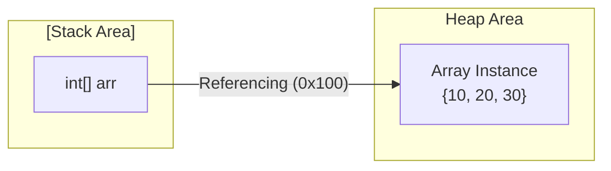
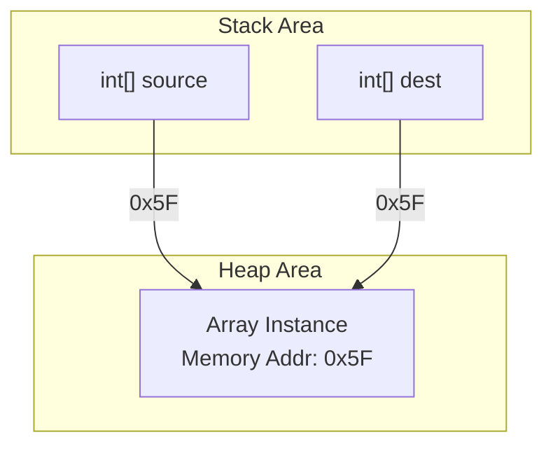
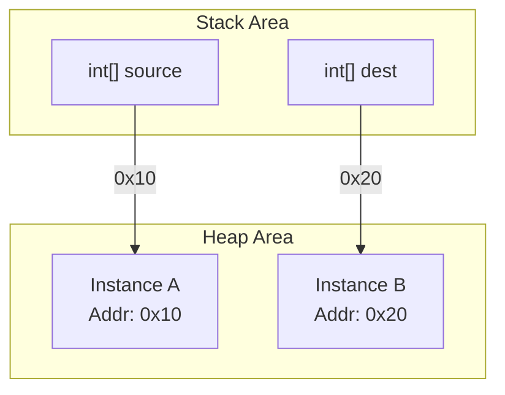

## 1. 배열의 구조적 본질: 참조자(Reference)

자바에서 배열은 기본형(Primitive type)이 아닌 **객체(Object)** 로 취급된다. 따라서 배열 변수를 선언한다는 것은 실제 데이터를 담을 공간을 만드는 것이 아니라, 힙(Heap) 영역에 생성된 배열 인스턴스의 **위치(주소값)를 가리키는 참조자**를 선언하는 것이다.

### 1.1. 메모리 아키텍처와 스코프

`new` 연산자를 통해 배열이 생성되면 JVM의 메모리 영역 중 **Heap**에 실질적인 데이터가 저장된다. 우리가 코드에서 다루는 배열 변수(식별자)는 **Stack** 영역에 존재하며, Heap에 있는 인스턴스의 주소값을 보유한다.



> **Deep Dive: JVM 메모리 관리와 생명주기**
> 
> 배열 변수(참조자)는 선언된 블록(Scope)이 종료되면 스택에서 제거된다. 이때 힙 영역에 남겨진 배열 인스턴스는 더 이상 자신을 참조하는 변수가 없게 되며(Unreachable), 추후 **가비지 컬렉터(Garbage Collector)** 의 수거 대상이 되어 메모리에서 해제된다.
{: .prompt-info }

---

## 2. 얕은 복사 (Shallow Copy)

**얕은 복사**는 실제 데이터가 있는 인스턴스를 복제하는 것이 아니라, 인스턴스의 주소값을 담고 있는 **참조값만 복사**하는 방식이다.

### 2.1. 동작 원리 및 부작용

변수 대입 연산(`=`)을 수행하면 스택에 있는 주소값만 복사된다. 결과적으로 두 개의 변수가 하나의 배열 인스턴스를 공유하게 된다.



```java
int[] source = {10, 20, 30};
int[] dest = source; // 얕은 복사 (주소값만 복사)

dest[0] = 999; 

// source와 dest가 같은 인스턴스를 바라보므로 둘 다 값이 변경됨
System.out.println(source[0]); // Output: 999

```

> **주의:** 얕은 복사는 의도치 않은 **데이터 동기화(Side Effect)** 를 유발할 수 있다. 원본 데이터의 보존이 필요한 로직에서는 치명적인 버그의 원인이 되므로 사용에 각별한 주의가 필요하다.
{: .prompt-warning }

---

## 3. 깊은 복사 (Deep Copy)

**깊은 복사**는 새로운 메모리 공간을 할당받아 원본의 데이터를 통째로 복제하는 방식이다. 원본과 사본이 서로 다른 힙 메모리 주소를 가지므로 완전한 독립성을 보장한다.

### 3.1. 메모리 분리 구조



---

## 4. 깊은 복사 구현 기법 및 성능 비교

자바에서는 개발자의 목적(편의성, 성능, 부분 복사 등)에 따라 다양한 깊은 복사 방식을 제공한다.

### 4.1. `clone()` 메서드

배열 객체가 자체적으로 제공하는 메서드다. 가장 직관적이고 코드가 간결하다.

```java
int[] source = {10, 20, 30};
int[] dest = source.clone(); // 새로운 인스턴스 생성 및 값 복사

dest[0] = 999;
// source[0]은 여전히 10을 유지함 (독립적)
```

> **Tip:** 1차원 배열에서는 `clone()`이 완벽한 깊은 복사를 수행하지만, **2차원 이상의 다차원 배열**에서는 하위 배열에 대한 참조만 복사하는 '얕은 복사'가 발생한다. 다차원 배열의 완전한 깊은 복사는 재귀적으로 구현하거나 다른 방식을 사용해야 한다.
{: .prompt-tip }

### 4.2. `System.arraycopy()`

운영체제 레벨의 기능을 활용하는 Native Method로, 가장 우수한 성능을 제공하며 정밀한 제어가 가능하다.

* **특징**: 반복문보다 빠르며, 원본의 특정 인덱스에서 목적지의 특정 인덱스로 원하는 길이만큼 복사(Slicing)할 수 있다.
* **제약**: 목적지 배열(`dest`)을 미리 `new`로 할당해야 한다.

```java
int[] source = {10, 20, 30, 40, 50};
int[] dest = new int[5]; // 1. 공간 미리 할당

// 2. Native 복사 수행
// 문법: (원본, 원본시작위치, 목적지, 목적지시작위치, 복사길이)
System.arraycopy(source, 0, dest, 0, source.length);
```

> **Deep Dive: System.arraycopy()의 성능 비결**
> 
> 이 메서드는 JVM 내부적으로 JNI(Java Native Interface)를 통해 C/C++ 레벨의 `memcpy()` 또는 `memmove()` 함수를 호출한다. 이는 바이트 단위로 메모리를 블록 전송하므로, 하나씩 값을 꺼내 대입하는 `for` 루프 방식보다 월등히 빠른 속도를 자랑한다.
{: .prompt-info }

### 4.3. 복사 방식 비교 요약

| 방식 | 설명 | 장점 | 단점 |
| --- | --- | --- | --- |
| **반복문 (for)** | 직접 요소를 순회하며 대입 | 로직 이해가 쉬움 | 코드가 길어지고 성능이 가장 낮음 |
| **clone()** | 객체 메서드 호출 | **구현이 가장 간단함** | 다차원 배열 복사 시 주의 필요, 전체 복사만 가능 |
| **System.arraycopy()** | 시스템 Native API 사용 | **최고의 성능**, 부분 복사 가능 | 매개변수가 많아 사용법이 다소 복잡함 |

## 💡 Quiz: 학습 내용 확인하기

<details>
<summary>Q1. 배열 변수 `int[] arr`는 메모리의 어느 영역에 저장되며, 실제 배열 인스턴스는 어디에 저장되는가?</summary>
<div>
<strong>정답:</strong> 배열 변수(참조자)는 <strong>Stack(스택)</strong> 영역에, 실제 배열 인스턴스는 <strong>Heap(힙)</strong> 영역에 저장된다.
</div>
</details>

<details>
<summary>Q2. `int[] b = a;` 코드를 실행한 후 `b`의 값을 변경했을 때 `a`도 변경되는 이유는 무엇인가?</summary>
<div>
<strong>정답:</strong> 해당 코드는 <strong>얕은 복사(Shallow Copy)</strong>를 수행하기 때문이다. 새로운 배열이 생성된 것이 아니라, 메모리 주소(참조값)만 복사되어 두 변수가 동일한 인스턴스를 공유하게 된다.
</div>
</details>

<details>
<summary>Q3. 대량의 배열 데이터를 복사하거나 배열의 일부분만 잘라내어 복사하고 싶을 때, 성능상 가장 유리한 메서드는?</summary>
<div>
<strong>정답:</strong> <code>System.arraycopy()</code>이다. Native Method를 사용하여 메모리 블록 단위로 데이터를 전송하기 때문에 가장 빠른 성능을 보여준다.
</div>
</details>