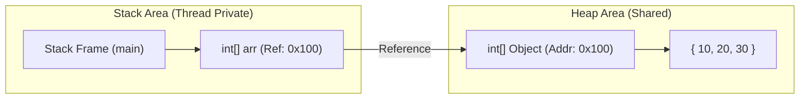

## 1. 개요

프로그램이 실행될 때 데이터는 성격에 따라 **스택(Stack)** 과 **힙(Heap)** 이라는 두 가지 핵심 영역으로 나뉘어 관리된다.  Java의 메모리 구조를 기반으로 매개변수 전달 방식과 GC(Garbage Collection)의 작동 메커니즘을 알아보자.

## 2. 메모리 구조의 이해: Stack과 Heap

### 2.1. 스택(Stack) 영역과 스택 프레임

스택은 메서드 호출과 연산의 흐름을 담당하는 메모리 영역이다. 스택은 단순한 변수 저장소가 아니라 **스택 프레임(Stack Frame)** 이라는 단위로 관리된다.

* **스택 프레임(Stack Frame)**: 메서드가 호출될 때마다 생성되는 독립적인 메모리 블록이다[^1].
* **지역 변수 배열(Local Variable Array)**: 매개변수(`Parameter`), 메서드 내부의 지역 변수, `this` 참조 등이 저장된다.
* **피연산자 스택(Operand Stack)**: 연산의 중간 결과값을 저장하는 임시 작업 공간이다.
* **프레임 데이터(Frame Data)**: 리턴 주소(메서드 종료 후 돌아갈 위치)와 상수 풀 참조 정보 등을 포함한다.


* **수명(Lifecycle)**: 메서드가 종료(`Return`)되면 해당 프레임은 스택에서 즉시 제거(`Pop`)되며, 내부의 모든 데이터도 소멸한다.

### 2.2. 힙(Heap) 영역

힙은 런타임에 생성되는 모든 **객체(Instance)** 와 **배열**이 저장되는 공간이다.

* **생성**: `new` 연산자를 사용하거나 배열을 선언할 때 할당된다.
* **접근**: 스택 영역에 있는 참조 변수가 힙 영역의 메모리 주소를 가지고 있으며, 이를 통해 데이터에 접근한다.
* **수명(Lifecycle)**: 메서드 호출이 끝나도 즉시 사라지지 않으며, 오직 가비지 컬렉터(GC)에 의해서만 제거된다.



> **Deep Dive: 객체 메모리 레이아웃 (Object Memory Layout)**
> 
> 힙에 생성된 객체는 단순히 데이터만 가지는 것이 아니라, JVM이 관리하기 위한 헤더 정보를 포함한다[^2].
> * **Mark Word (8 bytes)**: GC 상태, 해시코드(HashCode), 락(Lock) 정보 등을 저장한다.
> * **Klass Pointer (4 bytes)**: 해당 객체의 클래스 메타데이터를 가리키는 포인터다.
> * **Instance Data**: 실제 필드 데이터가 저장된다.
> * **Padding**: 8바이트 단위 정렬을 위한 빈 공간이다.
{: .prompt-info } 

---

## 3. 매개변수 전달 기법 (Parameter Passing)

Java에서 함수 호출 시 데이터를 전달하는 방식은 변수의 자료형에 따라 구분된다.

### 3.1. Call by Value (값에 의한 호출)

* **대상**: `int`, `double`, `boolean` 등 기본 자료형(Primitive Type).
* **동작**: 변수가 가진 **값(Value)** 자체가 복사되어 전달된다.
* **특징**: 호출자(Caller)와 피호출자(Callee)의 변수는 완전히 독립적이다. 피호출자에서 값을 변경해도 호출자의 원본에는 아무런 영향을 주지 않는다.

### 3.2. Call by Reference (참조에 의한 호출)

* **대상**: 배열, 객체 등 참조 자료형(Reference Type).
* **동작**: 힙 영역에 존재하는 인스턴스의 **주소값(Reference)** 이 복사되어 전달된다.
* **특징**: 두 변수가 **동일한 인스턴스**를 가리키게 된다. 따라서 피호출자가 데이터를 수정하면, 호출자가 참조하는 원본 데이터도 함께 변경된다.

> **주의:** Java는 엄밀히 말하면 **Call by Value**이다.
> 
> 참조형 변수를 넘길 때 '객체 자체'가 넘어가는 것이 아니라, '객체의 주소값(Value)'이 복사되어 넘어가기 때문이다. 하지만 실무적으로는 주소를 통해 원본 객체를 제어하므로 Call by Reference와 유사하게 동작한다고 이해하면 쉽다.
{: .prompt-warning }

### 3.3. 예외: String 클래스

* `String`은 참조 자료형이지만 **불변(Immutable)** 객체이다.
* 함수 내부에서 값을 변경하려 하면 기존 객체를 수정하는 것이 아니라, **새로운 문자열 객체를 생성**하여 변수가 그것을 가리키게 한다.
* 결과적으로 원본은 유지되므로, 마치 Call by Value처럼 동작하는 것으로 보인다.

---

## 4. Call by Reference 메모리 동작 시뮬레이션

"참조를 전달한다"는 개념을 구체적인 메모리 주소 이동으로 시각화하면 다음과 같다.

### 4.1. 상황 설정

* `main` 함수에서 `int[] arr = {1, 2}`를 선언했다.
* 이 배열은 **Heap 영역의 0x100 번지**에 생성되었다고 가정한다.

| 영역 | 변수명 | 저장된 값 (Value) | 실제 의미 |
| --- | --- | --- | --- |
| **Stack (main)** | `arr` | **0x100** | 힙의 0x100번지를 가리킴 |
| **Heap** | (0x100) | `{1, 2}` | 실제 데이터 |

### 4.2. 함수 호출과 값 변경 과정

함수 `testFunc(arr)`가 호출되고, 내부에서 `param[0] = 5`를 수행하는 과정이다.

1. **주소 복사**: `arr`가 가진 값 **0x100**이 복사되어 `testFunc`의 매개변수 `param`에 저장된다. (`param` == 0x100)
2. **참조 접근**: `param`은 **0x100** 번지를 찾아간다.
3. **데이터 수정**: 힙 영역 0x100번지의 첫 번째 요소(`1`)를 `5`로 덮어쓴다.
4. **결과**: 함수가 종료되어 `param`이 사라져도, 힙 영역(0x100)의 데이터는 이미 `{5, 2}`로 변경된 상태다.

---

## 5. 실전 코드 예제 (Java)

위의 이론을 실제 Java 코드로 구현하여 원본 데이터가 변경되는 과정을 확인한다.

```java
public class MemoryTest {

    public static void main(String[] args) {
        // 1. Heap 영역에 정수형 배열 객체 생성 
        // (가정: 힙 주소 0x100, Stack의 arr에는 0x100이 저장됨)
        int[] arr = { 10, 20, 30 };
        
        System.out.println("함수 호출 전 arr[0]: " + arr[0]); // 출력: 10
        
        // 2. modifyArray 호출: arr의 주소값(0x100)이 param으로 복사됨
        modifyArray(arr); 
        
        // 4. 함수 종료 후: Heap 영역의 데이터가 변경되었음을 확인
        // arr는 여전히 0x100을 가리키고 있으며, 그곳의 데이터가 999로 바뀜
        System.out.println("함수 호출 후 arr[0]: " + arr[0]); // 출력: 999
    }

    public static void modifyArray(int[] param) {
        // param도 0x100을 가지고 있음 (주소값 복사)
        // 3. param 참조를 통해 Heap(0x100)의 실제 데이터 변경
        param[0] = 999; 
        System.out.println("modifyArray 내부 변경 완료");
    }
}

```

---

## 6. 가비지 컬렉션(GC)의 동작 원리

스택 프레임 소멸로 인해 힙 영역의 객체와 연결이 끊어졌을 때, 메모리를 정리하는 메커니즘이다.

### 6.1. 참조의 소멸과 Reachability

GC는 객체의 생존 여부를 판단하기 위해 **Reachability(도달 가능성)** 개념을 사용한다.

* **Root Set**: 힙 영역의 객체를 참조하는 시작점들(Stack의 지역변수, Method Area의 static 변수, JNI 참조 등)[^3].
* **Reachable**: Root Set에서부터 참조 사슬을 따라 도달할 수 있는 객체 (유효함).
* **Unreachable**: Root Set에서 참조가 끊겨 더 이상 접근할 수 없는 객체 (수거 대상).

### 6.2. Mark and Sweep 알고리즘

가장 기본적인 GC 알고리즘의 동작 순서다.

1. **Mark (표시)**: Root Set에서 시작하여 참조된 모든 객체를 추적하고, 살아있는 객체에 마킹(Marking)을 한다.
2. **Sweep (청소)**: 힙 영역 전체를 스캔하여 마킹되지 않은(Unreachable) 객체들을 메모리에서 해제한다.

> **Deep Dive: 세대별 가설 (Generational Hypothesis)**
> 
> 효율적인 GC를 위해 힙 영역은 **Young Generation**과 **Old Generation**으로 나뉜다.
> * **Young Generation (Eden, Survivor)**: 대부분의 객체는 생성 직후 금방 불필요해진다(Unreachable). 이곳에서 일어나는 GC를 **Minor GC**라 하며 속도가 빠르다.
> * **Old Generation**: 오랫동안 살아남은 객체가 이동하는 곳이다. 이곳이 가득 차면 **Major GC(Full GC)** 가 발생하며, 이때 애플리케이션이 일시 멈추는 **Stop-the-world** 현상이 발생할 수 있다.
{: .prompt-info }

---

## 💡 Quiz: 학습 내용 확인하기

**Q1. 메서드가 호출될 때 생성되며 지역변수와 리턴 주소를 저장하는 메모리 블록의 이름은?**

<details>
<summary>정답 확인</summary>
<div>
스택 프레임(Stack Frame)
</div>
</details>

**Q2. GC가 객체를 삭제할지 판단하는 기준이 되는 개념으로, Root Set으로부터의 연결 여부를 뜻하는 용어는?**

<details>
<summary>정답 확인</summary>
<div>
Reachability (도달 가능성)
</div>
</details>

**Q3. Java 객체 헤더(Header)에 포함되며, GC 상태나 해시코드, 스레드 락 정보를 담고 있는 8바이트 데이터 필드는?**

<details>
<summary>정답 확인</summary>
<div>
Mark Word
</div>
</details>

---

[^1]: 스택 프레임 내부에는 지역 변수 배열(LVA), 피연산자 스택(Operand Stack), 프레임 데이터가 포함된다.

[^2]: 객체 헤더는 Mark Word와 Klass Word(Pointer)로 구성된다.

[^3]: Root Set에는 스택의 지역변수, 정적(Static) 변수, JNI 참조 등이 포함된다.