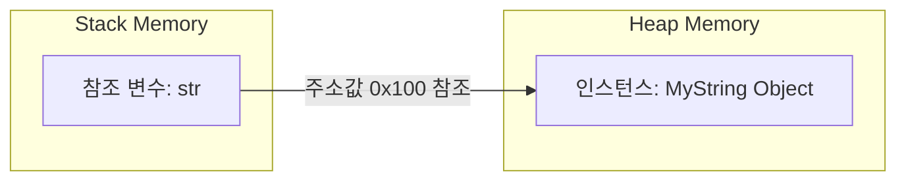
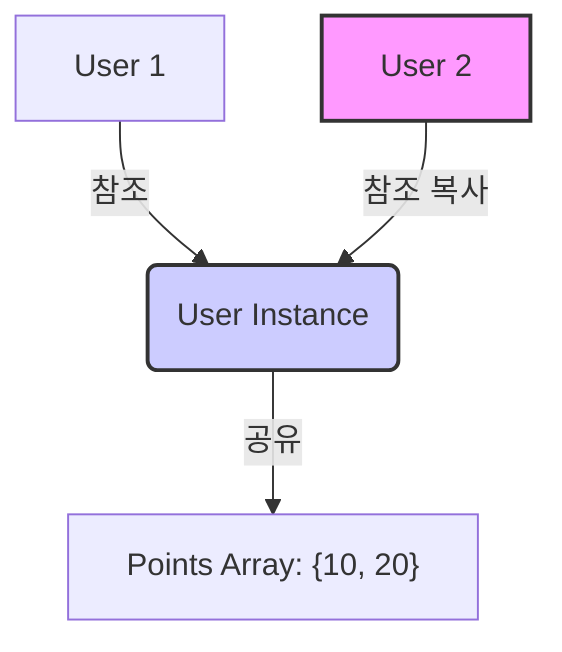
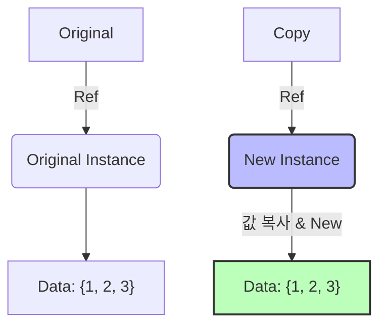

## 1. 참조(Reference)와 인스턴스(Instance)의 분리

Java 입문자가 가장 많이 범하는 실수는 **참조 변수(Reference Variable)**와 **인스턴스(Instance)** 를 동일시하는 것이다. 이 둘은 메모리 상에서 명확하게 분리되어 존재하며, 역할 또한 완전히 다르다.

* **참조 변수 (Reference)**: **스택(Stack)** 영역에 생성되며, 실제 데이터가 위치한 힙(Heap) 영역의 **주소값**을 담고 있는 '포인터' 역할을 한다.
* **인스턴스 (Instance)**: `new` 연산자를 통해 **힙(Heap)** 영역에 생성된 실제 객체 덩어리다.



### 코드 예시로 보는 차이

```java
// 1. 참조 변수만 선언 (아직 인스턴스는 없음, Stack에만 존재)
MyString str; 

// 2. 인스턴스 생성 후 주소 할당 (Heap에 객체 생성 -> 주소 연결)
str = new MyString("Hello"); 
```

만약 `str`이 인스턴스 자체라면 선언만으로 데이터를 조작할 수 있어야 하지만, 실제로는 `NullPointerException`이 발생한다. 이는 `str`이 초기화되지 않은 '빈 껍데기(null)'에 불과하기 때문이다. 인스턴스는 이름이 없으며, 오직 참조 변수가 가진 주소를 통해서만 식별되고 접근 가능하다.

---

## 2. 얕은 복사 (Shallow Copy): 의도치 않은 공유의 함정

객체를 복사할 때 단순히 변수를 대입(`=`)하거나, 객체 내부의 참조 필드를 그대로 할당하는 경우 **얕은 복사**가 발생한다. 이는 '데이터 내용'을 복사하는 것이 아니라 **'메모리 주소'** 만 복사하는 행위다.

### 2.1 시각화: 하나의 인스턴스, 두 개의 리모컨



### 2.2 부작용 (Side Effect) 발생 예제

두 참조 변수가 하나의 인스턴스를 공유하게 되면, 한쪽에서 데이터를 수정했을 때 다른 쪽에도 영향을 미치는 심각한 버그가 발생한다.

```java
public class User {
    String name;
    int[] points; // 참조 타입 필드

    public User(String name, int[] points) {
        this.name = name;
        this.points = points;
    }
}

public class Main {
    public static void main(String[] args) {
        int[] score = {10, 20, 30};
        User user1 = new User("NullNull", score);
        
        // [얕은 복사] user2는 user1과 동일한 points 배열 인스턴스를 참조함
        User user2 = user1; 
        
        // user2의 데이터를 변경
        user2.points[0] = 999;
        
        // [결과] user1의 데이터도 변경됨 (의도치 않은 버그)
        System.out.println(user1.points[0]); // 출력: 999
    }
}

```

> **주의:** 개발자는 `user2`를 독립적인 객체로 생각하고 수정했지만, 실제로는 `user1`의 데이터가 훼손되었다. 클래스 내부에 배열이나 다른 객체(참조 타입)가 멤버로 존재할 때 이 문제는 더욱 빈번하게 발생한다.
{: .prompt-warning }

---

## 3. 깊은 복사 (Deep Copy) 구현 전략

**깊은 복사**는 원본 인스턴스의 실제 데이터를 새로운 메모리 공간에 통째로 복제하는 것을 의미한다. 복사본과 원본은 서로 다른 주소를 가지므로, 한쪽을 수정해도 다른 쪽에 전혀 영향을 주지 않는다.

### 3.1 `clone()` 메서드

Java의 모든 객체는 `Object.clone()`을 통해 복사를 수행할 수 있으나, 실무에서는 다음과 같은 이유로 사용을 **지양**한다.

1. **Cloneable 인터페이스 강제**: 구현하지 않으면 `CloneNotSupportedException`이 발생한다.
2. **예외 처리의 복잡성**: Checked Exception이므로 매번 `try-catch` 처리가 필요하다.
3. **타입 캐스팅 필요**: 반환 타입이 `Object`라 매번 형 변환을 해야 한다.
4. **기본이 얕은 복사**: `clone()`은 기본적으로 필드 단위 복사만 수행하므로, 내부의 참조 필드(배열 등)는 여전히 얕은 복사 상태로 남는다. 이를 해결하려면 재귀적으로 오버라이딩해야 하는데 구현이 까다롭다.
5. **생성자 미호출**: 생성자를 통하지 않고 메모리를 할당하므로, 초기화 로직이 무시될 위험이 있다.

### 3.2 복사 생성자 (Copy Constructor) 패턴 (권장)

가장 권장되는 방식은 **복사 생성자**를 사용하는 것이다. 같은 클래스의 객체를 매개변수로 받아, 내부 필드를 명시적으로 '새로 생성(`new`)'하여 복사한다.



```java
public class MyArrayClass {
    private int[] data; // 참조형 멤버

    // 기본 생성자
    public MyArrayClass(int size) {
        this.data = new int[size];
    }

    // [핵심] 복사 생성자: 깊은 복사(Deep Copy) 구현
    public MyArrayClass(MyArrayClass original) { // original은 R-Value
        // 1. 새로운 메모리 공간 확보 (인스턴스 분리) -> this는 L-Value
        this.data = new int[original.data.length];

        // 2. 실제 데이터 값 복사 (내용 복제)
        // 만약 this.data = original.data; 라고 하면 얕은 복사가 됨!
        for (int i = 0; i < original.data.length; i++) {
            this.data[i] = original.data[i];
        }
        
        // Tip: 배열의 경우 clone()을 사용해도 깊은 복사가 된다 (배열은 예외적으로 clone이 잘 동작함)
        // this.data = original.data.clone();
    }
}

```

---

## 4. Deep Dive: 내부 동작 원리

단순히 코드를 작성하는 것을 넘어, JVM 메모리 레벨에서 어떤 일이 일어나는지 이해해 보자.

> **Deep Dive: L-Value/R-Value와 GC의 동작**
> **1. L-Value와 R-Value 관점의 복사**
> * **R-Value (Right Value)**: 원본 데이터가 위치한 곳 (Source).
> * **L-Value (Left Value)**: 데이터가 저장될 메모리 위치 (Destination).
> * **얕은 복사**: L-Value의 참조 변수가 R-Value의 **주소값**만을 가져온다. (인스턴스 공유)
> * **깊은 복사**: JVM이 힙 영역에 **새로운 주소(L-Value)**를 가진 인스턴스를 생성하고, R-Value 내부의 **비트 패턴(실제 값)**을 읽어와 새 공간에 쓴다.
> 
> 
> **2. GC와 '끈 떨어진 연'**
> * 만약 얕은 복사로 덮어쓰기가 발생하면(`user2 = user1`), 기존에 `user2`가 가리키던 인스턴스는 참조 카운트가 0이 되어 접근 불가능해진다.
> * 이렇게 링크가 끊어진 인스턴스는 **"끈 떨어진 연"**과 같으며, 가비지 컬렉터(GC)에 의해 메모리에서 수거(Reclaim)된다.
> 
> 
> **3. String은 왜 예외인가?**
> * `String`은 참조 타입이지만 **불변(Immutable)** 객체다.
> * 얕은 복사로 주소를 공유하더라도, 값을 변경하려고 하면 아예 **새로운 문자열 인스턴스가 생성**되므로 원본이 훼손될 일이 없다. 따라서 `String` 필드는 굳이 깊은 복사를 할 필요가 없다.
> {: .prompt-info }
> 
> 

---

## 5. 결론 및 요약

복잡한 객체 지향 프로그래밍에서 '복사'는 단순한 대입이 아니다.

1. **구분하라**: 변수는 리모컨(참조)일 뿐, TV(인스턴스) 자체가 아니다.
2. **경계하라**: 얕은 복사는 의도치 않은 데이터 공유로 인한 치명적 버그의 원인이 된다.
3. **구현하라**: `clone()`보다는 **복사 생성자**를 사용하여 멤버 필드까지 새로 할당(`new`)하는 **깊은 복사**를 구현하는 것이 안전하다.
4. **습관화하라**: 클래스 내부에 참조형 필드(배열, 다른 객체)가 있다면, 습관적으로 Deep Copy 로직을 미리 구현해 두는 것이 유지보수에 유리하다.

---

## 💡 Quiz: 학습 내용 확인하기

<details>
<summary>Q1. '얕은 복사(Shallow Copy)'의 동작 방식과, 이로 인해 발생할 수 있는 잠재적인 문제점(Side Effect)에 대해 설명하시오.</summary>

**모범 답안:**

**얕은 복사**는 객체를 복사할 때 인스턴스 자체를 메모리에 새로 생성하지 않고, **원본 객체가 위치한 메모리 주소값(Reference)**만을 복사하는 방식입니다.

이로 인해 복사된 변수와 원본 변수가 **물리적으로 동일한 인스턴스를 공유**하게 됩니다. 따라서 한 쪽 변수에서 객체의 내부 상태(필드 값)를 변경하면, 이를 공유하는 다른 쪽 변수에도 즉시 변경 사항이 반영되는 **의도치 않은 부작용(Side Effect)**이 발생할 수 있으며, 이는 데이터 무결성을 해치는 원인이 됩니다.

</details>

<details>
<summary>Q2. 클래스 내부에 '배열(Array)' 타입의 멤버 변수가 있을 때, 이를 안전하게 '깊은 복사(Deep Copy)' 하기 위한 논리적 절차를 서술하시오.</summary>

**모범 답안:**

배열은 참조 타입이므로 단순히 변수에 대입하면 주소값만 복사됩니다. 따라서 완전한 깊은 복사를 수행하기 위해서는 다음 두 단계의 절차가 필요합니다.

1. **새로운 메모리 할당**: 원본 배열과 동일한 타입 및 크기를 가진 새로운 배열 객체를 **힙(Heap) 메모리에 별도로 생성**해야 합니다.
2. **값의 이동**: 원본 배열의 각 인덱스에 저장된 실제 데이터 값을 반복문 등을 사용하여, 앞서 생성한 **새로운 배열의 각 인덱스로 직접 옮겨 담아야** 합니다.

</details>

<details>
<summary>Q3. Java에서 객체 복사를 위해 `clone()` 메서드보다 '복사 생성자(Copy Constructor)' 패턴 사용을 권장하는 설계적/구조적 이유를 2가지 이상 서술하시오.</summary>

**모범 답안:**

`clone()` 메서드 대신 복사 생성자를 권장하는 주요 이유는 다음과 같습니다.

1. **생성자 우회 문제**: `clone()`은 생성자를 호출하지 않고 메모리 상태를 복제하여 객체를 생성하므로, 생성자 내부에 정의된 초기화 로직이 실행되지 않는 구조적 위험이 있습니다.
2. **예외 처리 및 구현의 복잡성**: `clone()`을 사용하려면 `Cloneable` 마커 인터페이스를 구현해야 하며, `CloneNotSupportedException`이라는 체크 예외(Checked Exception)를 처리해야 하는 번거로움이 있습니다.
3. **타입 안정성**: `clone()`의 반환 타입은 `Object`이므로, 사용 시마다 매번 해당 클래스 타입으로 **형 변환(Casting)**을 수행해야 합니다. 반면 복사 생성자는 해당 타입의 객체를 명확하게 반환합니다.

</details>