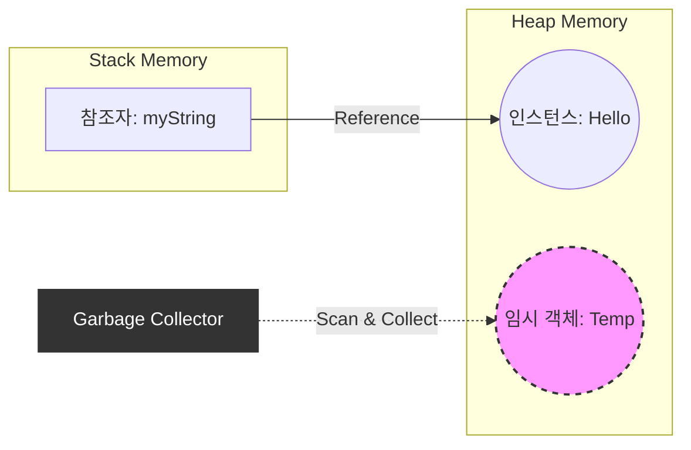
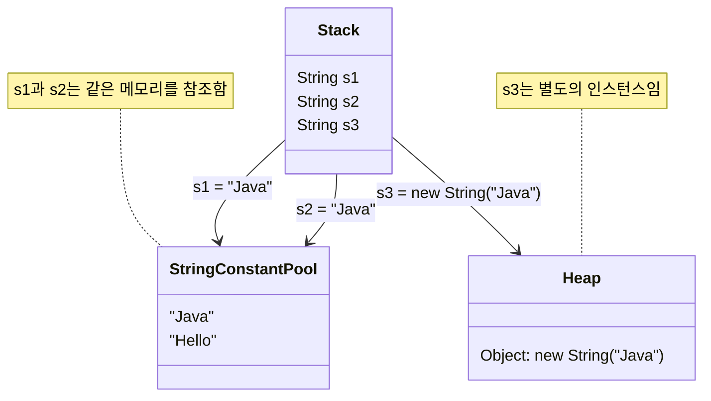

Java 프로그래밍에서 객체는 일반적으로 `new` 키워드를 통해 생성되고, 참조 변수(Reference Variable)를 통해 제어된다. 하지만 우리가 작성하는 코드의 이면에는 개발자가 의도적으로 이름을 붙이지 않았음에도 생성되었다가, 역할이 끝나면 조용히 사라지는 **임시 객체(Temporary Object)** 들이 존재한다.

특히 문자열(`String`) 연산이나 메서드 체이닝 과정에서 빈번하게 발생하는 이러한 임시 객체들은 시스템 성능과 가비지 컬렉션(GC)에 직접적인 영향을 미친다. 이 글에서는 임시 객체의 생성 원리와 메모리 내부 동작 방식을 파헤쳐 본다.

---

## 1. 참조자(Reference)와 인스턴스(Instance)의 분리

임시 객체를 이해하기 위해서는 먼저 객체의 기본 구조를 명확히 해야 한다. Java에서 클래스 타입의 변수를 선언할 때, 실제로는 두 가지 요소가 관여한다.

1. **참조자 (Reference)**: 스택(Stack) 영역에 생성되며, 실제 데이터가 있는 위치(주소)를 가리킨다. 이름(식별자)을 가진다.
2. **인스턴스 (Instance)**: 힙(Heap) 영역에 생성되며, 실제 데이터를 담고 있다. **그 자체로는 이름이 없다.**

일반적인 객체 생성은 참조자가 인스턴스를 가리키는 형태다. 하지만 **임시 객체는 인스턴스는 생성되었으나, 이를 지속적으로 가리키는 참조자가 없는 상태**를 의미한다.





---

## 2. 임시 객체가 생성되는 순간: 연산과 반환

보이지 않는 임시 객체는 주로 **수식의 중간 연산 결과**나 **메서드의 반환 값**으로 생성된다.

### 2.1 산술 연산의 중간 결과

`int`와 같은 기본형(Primitive Type)은 객체가 아니지만, 이해를 돕기 위해 객체처럼 동작한다고 가정하거나 Wrapper Class(`Integer`)를 사용한다고 가정해보자.

```java
// 예: a = 3 + 4 + 5;
int a = 3 + 4 + 5;

```

위 연산은 한 번에 수행되지 않는다.

1. `3 + 4`가 먼저 수행되어 `7`이라는 **임시 결과**가 생성된다.
2. 이 `7`은 `5`와 더해져 최종 결과 `12`가 된다.
3. 여기서 중간 결과인 `7`은 다음 연산에 사용된 직후 더 이상 필요가 없어진다. 만약 이것이 객체였다면, 즉시 GC의 대상이 된다.

### 2.2 문자열(String) 연산의 함정

`String`은 불변(Immutable) 객체이므로, 문자열 덧셈 연산은 새로운 객체를 계속해서 만들어낸다.

```java
String left = "Hello";
String right = "World";

// 연산 과정에서 임시 객체 생성
System.out.println((left + right).toUpperCase());

```

위 코드의 실행 흐름을 분석하면 다음과 같다.

1. `left + right` 연산이 수행되어 `"HelloWorld"`라는 **익명의 임시 객체**가 힙 메모리에 생성된다.
2. 해당 임시 객체의 `.toUpperCase()` 메서드가 호출된다.
3. `toUpperCase()`의 결과로 `"HELLOWORLD"`라는 또 다른 객체가 생성되어 출력된다.
4. 출력이 끝난 후, `"HelloWorld"`(중간 결과)와 `"HELLOWORLD"`(최종 결과) 모두 참조하는 변수가 없으므로 GC 대상이 된다.

> **주의:** 반복문(Loop) 안에서 문자열 더하기 연산(`+`)을 수행하면, 반복 횟수만큼 임시 객체가 생성되고 버려지기를 반복하여 메모리 낭비와 성능 저하를 유발한다. 이 경우 `StringBuilder`를 사용하는 것이 바람직하다.
{: .prompt-warning }

---

## 3. Deep Dive: String 리터럴과 메모리 관리

강의 내용에서 언급된 "보이지 않는 객체"의 핵심은 `String`의 독특한 메모리 관리 방식에 있다. `String`은 `new` 연산자 없이 리터럴(`""`)로 생성할 수 있으며, 이 경우 메모리 할당 위치가 다르다.

> **Deep Dive: String Constant Pool vs Heap**
> 
> Java는 문자열 리터럴을 효율적으로 관리하기 위해 **String Constant Pool**을 사용한다.
> * **리터럴 사용 (`String s = "Hello";`)**: 내부적으로 `intern()` 메서드가 호출된 것과 유사하게 동작한다. JVM은 String Constant Pool에 동일한 문자열이 있는지 확인하고, 있으면 그 주소를 반환하고 없으면 풀에 새로 생성한다.
> * **new 연산자 사용 (`String s = new String("Hello");`)**: String Constant Pool과는 무관하게 일반 **Heap 영역**에 무조건 새로운 객체를 생성한다.

### 3.1 메모리 구조 시각화



---

## 4. 메서드 체이닝(Method Chaining)과 임시 객체

임시 객체는 메서드 체이닝 패턴에서 빈번하게 활용된다. 반환된 객체를 변수에 저장하지 않고 즉시 다음 메서드의 호출 주체로 사용하는 방식이다.

```java
public class MethodChainingExample {
    public static void main(String[] args) {
        String str = "  java programming  ";

        // 메서드 체이닝: 각 단계마다 임시 객체가 생성되었다가 다음 단계로 넘어감
        String result = str.trim()          // 1. 공백 제거된 임시 객체 생성
                           .toUpperCase()   // 2. 대문자로 변환된 임시 객체 생성
                           .substring(0, 4);// 3. "JAVA" 문자열 객체 생성 및 반환

        // 최종 결과인 "JAVA"만 result 변수에 참조됨
        // 1번과 2번 과정에서 생긴 객체들은 즉시 GC 대상이 됨
        System.out.println(result);
    }
}

```

### 4.1 임시 객체의 생명주기 요약

| 단계 | 상태 | 설명 | GC 가능 여부 |
| --- | --- | --- | --- |
| **생성** | Created | 연산자(`+`)나 메서드 반환으로 인스턴스 생성 | 불가 (사용 중) |
| **사용** | Used | 다음 메서드 호출이나 출력 등에 사용됨 | 불가 (사용 중) |
| **종료** | Unreachable | 구문(Statement)이 끝나고 참조자가 없음 | **가능 (Eligible)** |

> **Tip:** 임시 객체는 변수 선언을 줄여 코드를 간결하게 만들지만, 디버깅 시 중간 값을 확인하기 어렵다는 단점이 있다. 복잡한 연산의 경우 중간 변수를 선언하는 것이 가독성과 디버깅에 유리할 수 있다.
 {: .prompt-tip }

---

## 5. 결론

"보이지 않는 임시 객체"는 마법이 아니라 JVM의 메모리 운용 방식에 따른 자연스러운 현상이다.

* **이름(참조자)이 없는 인스턴스**도 메모리(Heap)를 차지한다.
* 참조자가 없는 객체는 해당 구문이 끝나는 즉시 **가비지 컬렉터의 수거 대상**이 된다.
* 특히 `String` 연산 시 불필요한 임시 객체 생성을 주의해야 한다.

개발자는 단순히 코드가 "동작한다"는 것에 그치지 않고, 그 이면에서 메모리가 어떻게 할당되고 해제되는지 이해함으로써 더 효율적이고 견고한 애플리케이션을 작성할 수 있다.

---

## 💡 Quiz: 학습 내용 확인하기

<details>
<summary>Q1. Java에서 '임시 객체'란 무엇이며, 일반적인 객체와 가장 큰 차이점은 무엇인가?</summary>
임시 객체는 연산의 중간 결과나 메서드 반환값 등으로 생성되지만, 이를 저장하는 참조 변수(이름)가 없는 객체를 말한다. 일반 객체와 달리 해당 구문(Statement)이 실행된 직후 참조가 사라져 즉시 가비지 컬렉션(GC)의 대상이 된다.
</details>

<details>
<summary>Q2. String s = "Hello"; 와 String s = new String("Hello"); 의 메모리 할당 차이점은?</summary>
리터럴("")을 사용하면 String Constant Pool(문자열 상수 풀)에 저장되며, 이미 동일한 문자열이 존재하면 그 주소를 재사용한다. 반면 new 연산자를 사용하면 상수 풀과 관계없이 힙(Heap) 영역에 무조건 새로운 인스턴스를 생성한다.
</details>

<details>
<summary>Q3. 다음 코드에서 생성되는 String 인스턴스는 총 몇 개인가? (리터럴 포함)</summary>
String a = "Hello";
String b = "World";
String c = a + b;

정답: 3개이다.

1. "Hello" (리터럴, 상수 풀)
2. "World" (리터럴, 상수 풀)
3. "HelloWorld" (a + b 연산의 결과로 힙에 생성된 새로운 객체)

</details>

