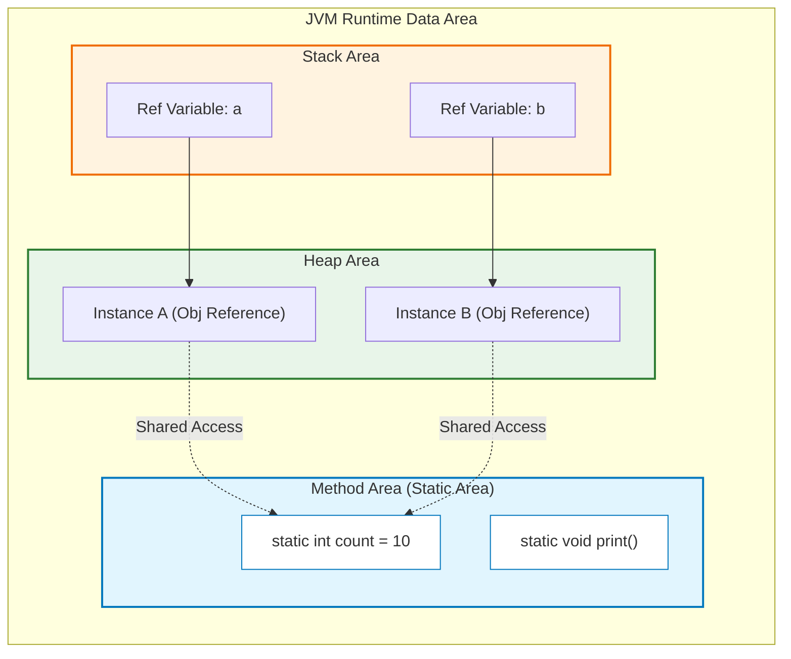

## 1. 개요

Java에서 `static` 키워드는 멤버(필드, 메서드)를 **인스턴스(Instance)** 가 아닌 **클래스(Class)** 에 귀속시킨다. 이는 객체 지향 프로그래밍에서 "동적(Dynamic)"인 객체의 생명주기와 대비되는 "정적(Static)"인 특성을 가지며, 메모리 효율성과 공유 데이터 관리에 핵심적인 역할을 수행한다. `static`의 내부 동작 원리와 메모리 배치, 그리고 실무적인 사용 패턴을 알아보자.

## 2. 아키텍처 및 동작 원리

`static` 멤버는 프로그램 시작 시(정확히는 클래스 로딩 시점) 메모리에 할당되며, 프로그램이 종료될 때까지 유지된다. 이는 힙(Heap) 영역에 생성되고 가비지 컬렉션(GC)의 대상이 되는 인스턴스와는 근본적으로 다른 생명주기를 가진다.

### 2.1 메모리 레이아웃 시각화

JVM 메모리 구조에서 정적 멤버는 모든 인스턴스가 공유하는 영역에 위치한다.



* **Method Area (Static Area)**: 클래스 정보, 전역 변수, 정적 멤버가 저장된다. 모든 인스턴스가 이 공간을 공유한다.
* **Heap Area**: `new` 연산자로 생성된 객체(인스턴스)가 저장된다. 인스턴스별로 독립적인 필드 값을 가진다.

## 3. 정적 멤버의 핵심 특징

### 3.1 인스턴스로부터의 독립성 및 공유

정적 멤버는 특정 인스턴스에 종속되지 않는다. 즉, 가족 관계에서 서류상 가족(클래스 멤버)이지만, 집에 같이 살지 않는(인스턴스 메모리 미사용) 구성원과 같다.

* **공유성**: 인스턴스 A가 정적 변수의 값을 변경하면, 인스턴스 B가 조회할 때도 변경된 값이 조회된다.
* **접근성**: 객체 생성(`new`) 없이 `ClassName.member` 형태로 즉시 접근 가능하다.

### 3.2 `this` 키워드 사용 불가

`static` 메서드 내부에서는 `this` 키워드를 사용할 수 없다. 이는 메서드 호출 메커니즘과 깊은 관련이 있다.

* **인스턴스 메서드**: 호출 시 JVM이 묵시적으로 0번 매개변수에 자기 자신의 참조(`this`)를 넘긴다.
* **정적 메서드**: 호출 시 특정 인스턴스의 참조가 전달되지 않는다. 따라서 "나 자신"을 지칭할 주소가 없다.

```java
public class MyTest {
    int instanceVar = 10;
    static int staticVar = 20;

    void instanceMethod() {
        // 가능: this가 암묵적으로 존재함
        System.out.println(this.instanceVar); 
    }

    static void staticMethod() {
        // 불가능: 컴파일 에러 발생 (non-static variable cannot be referenced...)
        // System.out.println(this.instanceVar);
        
        // 가능: 정적 변수는 클래스 레벨이므로 접근 가능
        System.out.println(staticVar); 
    }
}

```

> **주의:** 정적 메서드 내부에서 인스턴스 변수에 접근하려면, 반드시 해당 메서드의 파라미터로 객체의 참조를 명시적으로 전달받아야 한다.
{: .prompt-warning }

## 4. 구현 및 Best Practice (Java)

### 4.1 심볼릭 상수 (Symbolic Constants) 정의

매직 넘버(Magic Number)[^1] 사용을 피하고 가독성을 높이기 위해 `static final`을 조합하여 상수로 사용한다.

```java
public class AppConfig {
    // 인스턴스마다 가질 필요가 없는 불변의 값
    public static final int MAX_USER_COUNT = 100;
    public static final String DEFAULT_COLOR = "#FFFFFF";
    
    // 로직에서 사용 시 의미가 명확해짐
    public boolean isAcceptable(int currentUsers) {
        return currentUsers < MAX_USER_COUNT;
    }
}

```

### 4.2 유틸리티 메서드 (Utility Methods)

상태(State)를 가지지 않고 단순히 입력값에 대한 연산만 수행하는 경우 `static` 메서드가 효율적이다. 객체 생성 비용을 절약할 수 있다.

```java
public class MathUtils {
    // 인스턴스 생성 방지 (private 생성자)
    private MathUtils() {}

    // 인스턴스 없이 호출 가능: MathUtils.add(1, 2)
    public static int add(int a, int b) {
        return a + b;
    }
}
```

### 4.3 안티 패턴: 인스턴스를 통한 정적 멤버 접근

Java 문법상 인스턴스 참조 변수를 통해 정적 멤버에 접근하는 것이 허용되지만, 이는 지양해야 한다.

```java
MyTest t = new MyTest();
t.staticMethod(); // (1) 비권장: 인스턴스 메서드인 것처럼 오해를 유발함
MyTest.staticMethod(); // (2) 권장: 클래스 메서드임이 명확함

```

> **위험:** (1)번 방식은 코드를 읽는 사람에게 해당 메서드가 인스턴스 상태에 의존한다는 잘못된 인상을 심어준다. 또한, `t`가 `null`이어도 `NullPointerException`이 발생하지 않고 실행되는 기이한 동작(참조 변수의 타입만 보고 호출)을 하여 디버깅을 어렵게 만든다.
{: .prompt-danger }

## 5. 요약 및 결론

1. **메모리 효율성**: 모든 인스턴스가 공유해야 하는 값은 `static`으로 선언하여 메모리 중복을 막는다.
2. **독립성**: 인스턴스 생성 없이 기능을 제공해야 하는 유틸리티성 함수는 `static` 메서드로 구현한다.
3. **제약 사항**: `static` 컨텍스트에서는 인스턴스 멤버(`this` 포함)에 직접 접근할 수 없다.

---

## 💡 Quiz: 학습 내용 확인하기

**Q1. `static` 메서드 내부에서 `this` 키워드를 사용할 수 없는 근본적인 이유는 무엇인가?**

<details>
<summary>정답 확인</summary>
<div>
정적 메서드는 인스턴스 생성 없이 클래스 레벨에서 호출되므로, 호출 시점에 스택 프레임에 인스턴스의 참조 주소(this)가 전달되지 않기 때문이다.
</div>
</details>

**Q2. 다음 코드의 실행 결과와 그 이유는?**

```java
MyTest t = null;
System.out.println(t.STATIC_VAR); // STATIC_VAR는 정적 변수임

```

<details>
<summary>정답 확인</summary>
<div>
<b>실행 결과:</b> 정상적으로 값이 출력된다 (NullPointerException 발생 안 함).


<b>이유:</b> 정적 멤버는 컴파일러가 참조 변수의 '타입(Class)'만 보고 접근 경로를 결정한다. 런타임에 실제 객체의 참조 여부(null)를 확인하지 않고 Method Area의 값을 가져온다.
</div>
</details>

**Q3. 인스턴스 변수와 정적 변수의 초기화 시점의 차이는?**

<details>
<summary>정답 확인</summary>
<div>
정적 변수는 클래스가 메모리에 로딩(Loading)되는 시점에 초기화되며, 인스턴스 변수는 객체가 생성(new)되는 시점에 초기화된다.
</div>
</details>

---

[^1]:**매직 넘버(Magic Number)**: 소스 코드 중간에 뜻을 알 수 없는 구체적인 숫자나 문자열이 하드코딩된 것을 의미하며, 유지보수를 어렵게 만든다.