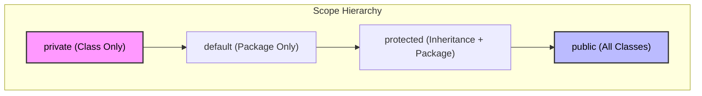

## 1. 개요: 경계 설정의 중요성

자바 프로그래밍에서 **접근 제어 지시자(Access Modifier)** 는 단순한 보안 장치가 아니다. 이는 클래스와 객체 간의 **의존성(Dependency)** 과 **결합도(Coupling)** 를 제어하는 핵심 설계 도구다. 올바른 접근 제어는 객체 내부의 복잡성을 감추고(Information Hiding), 외부에는 필요한 인터페이스만 노출함으로써 유지보수 가능한 소프트웨어를 만드는 기반이 된다[^1].

## 2. 접근 제어 지시자 (Access Modifiers) 상세 분석

자바는 4가지 수준의 접근 제어 지시자를 제공한다. 이를 통해 개발자는 클래스 멤버(필드, 메서드)의 가시성을 정밀하게 제어할 수 있다.

### 2.1 가시성 범위 비교

| 지시자 (Modifier) | 동일 클래스 | 동일 패키지 | 자식 클래스 (상속) | 외부 클래스 (전체) | 비고 |
| --- | --- | --- | --- | --- | --- |
| **public** | ✅ | ✅ | ✅ | ✅ | 제한 없음 (API 인터페이스용) |
| **protected** | ✅ | ✅ | ✅ | ❌ | 상속 관계나 같은 패키지 내 허용 |
| **default** (package-private) | ✅ | ✅ | ❌ | ❌ | 별도 키워드 없음, 패키지 내부용 |
| **private** | ✅ | ❌ | ❌ | ❌ | 외부 접근 절대 불가 (데이터 보호) |

### 2.2 가시성 시각화 (Access Scope)



> **Tip:** **'폐쇄적인 설계'에서 시작하라.**
> 
> 모든 필드는 기본적으로 `private`으로 선언하여 접근을 차단하고, 외부와의 협력이 반드시 필요한 경우에만 `protected`나 `public`으로 단계를 넓혀가는 것이 안전한 설계의 기본 원칙이다.
{: .prompt-tip }

---

## 3. 객체지향 설계 철학: 제작자와 사용자

좋은 소프트웨어 설계는 **제작자(Creator)** 와 **사용자(User)** 의 관점을 명확히 분리하는 데서 출발한다.

### 3.1 인터페이스와 구현의 분리

* **사용자(Client Code)**: 내부 동작 원리를 몰라도 제공된 메서드(Interface)만 호출하면 기능을 사용할 수 있어야 한다. (직관성, 간결함)
* **제작자(Implementation)**: 복잡한 로직과 데이터를 내부에 숨기고(Encapsulation), 사용자의 오용을 방지할 수 있는 안전장치를 마련해야 한다.

---

## 4. 캡슐화와 데이터 무결성 (Implementation)

데이터를 `private`으로 보호하고 `Getter/Setter`를 통해 접근하는 패턴은 **자바 빈즈(JavaBeans)** 규약의 기초이며, 프레임워크 호환성과 데이터 무결성을 위해 필수적이다.

### 4.1 안전한 접근 제어 구현 (Java)

```java
public class UserData {
    /**
     * 필드는 private으로 선언하여 외부의 직접 접근을 차단한다.
     * 이는 객체의 상태가 예측 불가능하게 변경되는 것을 방지한다.
     */
    private String name;
    private int age;

    /**
     * Getter: 읽기 전용 접근을 허용한다.
     * 필요에 따라 내부 데이터의 사본을 반환하여 불변성을 보장할 수도 있다.
     */
    public String getName() {
        return this.name;
    }

    /**
     * Setter: 데이터 쓰기 시 검증 로직(Validation)을 수행한다.
     * 메서드를 통하기 때문에 유효하지 않은 값의 유입을 원천 차단할 수 있다.
     */
    public void setAge(int age) {
        if (age < 0) {
            // 로깅을 남기거나 예외를 발생시킬 수 있음
            System.out.println("[Warn] 나이는 0보다 작을 수 없습니다. 0으로 초기화합니다.");
            this.age = 0;
            return;
        }
        if (age > 150) {
            throw new IllegalArgumentException("유효하지 않은 나이입니다.");
        }
        this.age = age;
    }
}

```

### 4.2 Getter/Setter 패턴의 기술적 이점

1. **데이터 무결성(Integrity)**: `setAge(-5)`와 같은 비정상적인 데이터 입력을 메서드 내부 로직으로 방어할 수 있다.
2. **디버깅 추적성(Traceability)**: 필드 직접 할당은 추적이 어렵지만, 메서드 호출은 **Call Stack**에 기록되므로 데이터 변경 시점과 주체를 명확히 파악할 수 있다.
3. **프레임워크 호환성**: Spring, Hibernate, Jackson 등 대다수의 자바 라이브러리는 Reflection과 Getter/Setter 명명 규칙을 기반으로 객체를 바인딩한다.

---

## 5. 심화 분석 (Deep Dive)

### 5.1 JVM의 접근 제어 검증 프로세스

자바의 접근 제어는 단순히 소스 코드 레벨의 컴파일 에러를 넘어, 런타임 시점에도 엄격하게 관리된다. JVM의 클래스 로딩 과정 중 **Linking - Verification** 단계에서 바이트코드의 무결성과 접근 권한을 검사한다. 만약 악의적으로 바이트코드를 조작하여 `private` 필드에 접근하려 한다면 `IllegalAccessError`가 발생한다.

### 5.2 성능 최적화: JIT Compiler와 Method Inlining

흔히 "Getter/Setter를 사용하면 메서드 호출 오버헤드 때문에 성능이 떨어지지 않을까?"라고 우려한다. 하지만 현대의 JVM은 이를 완벽하게 최적화한다.

> **Deep Dive: JIT 컴파일러의 메서드 인라이닝(Method Inlining)**
> 
> JVM의 C2 컴파일러(Server Compiler)는 'Hot Spot'으로 감지된 빈번한 메서드 호출을 분석한다. 단순한 Getter/Setter는 컴파일 단계에서 **호출 코드를 실제 필드 접근 코드로 치환(Inlining)** 해버린다.
> **동작 예시:**
> 1. 코드 작성: `int age = user.getAge();`
> 2. JIT 컴파일 후(기계어 레벨): `MOV EAX, [User_Address + Age_Offset]`
> 
> 
> 결과적으로 캡슐화를 유지하면서도, 런타임 성능은 필드에 직접 접근하는 것과 동일한 수준을 보장받는다.
{: .prompt-info }

> **Deep Dive: 객체 헤더와 Mark Word**
> 
> 퀴즈에서 언급되는 '객체의 메타 정보'는 힙 메모리에 저장된 객체의 **Header** 부분에 위치한다. 특히 **Mark Word**라는 32bit/64bit 영역에는 다음 정보들이 비트 단위로 압축되어 저장된다.
> * **Identity HashCode**: 객체의 고유 해시값
> * **GC Age**: 가비지 컬렉션에서 살아남은 횟수 (세대 정보)
> * **Lock Flag**: 스레드 동기화를 위한 락 상태 정보 (Biased Lock, Thin Lock 등)
{: .prompt-info }

---

## 💡 Quiz: 학습 내용 확인하기

**Q1. `protected` 접근 제어 지시자가 허용하는 접근 범위는 어디까지인가?**

<details>
<summary>정답 확인</summary>
<div>
동일 클래스, 동일 패키지 내의 모든 클래스, 그리고 <b>패키지가 달라도 해당 클래스를 상속받은 자식 클래스</b>까지 접근을 허용한다.
</div>
</details>

**Q2. 필드를 public으로 공개하지 않고 Getter/Setter를 사용하는 것이 디버깅에 유리한 이유는?**

<details>
<summary>정답 확인</summary>
<div>
데이터 변경이 반드시 메서드를 통해 이루어지므로, 브레이크 포인트(Break Point)를 걸거나 <b>Call Stack</b>을 분석하여 누가, 언제, 어떤 값으로 데이터를 변경했는지 명확하게 추적할 수 있기 때문이다.
</div>
</details>

**Q3. JVM 메모리 구조 중, 객체의 해시코드(HashCode), GC 나이(Age), 락(Lock) 정보가 저장되는 영역의 명칭은?**

<details>
<summary>정답 확인</summary>
<div>
객체 헤더(Object Header) 내부의 <b>Mark Word</b> 영역이다.
</div>
</details>

---

[^1]:캡슐화는 객체의 자율성을 보장하고, 변경의 파급 효과를 최소화하여 시스템의 응집도를 높이는 역할을 한다.