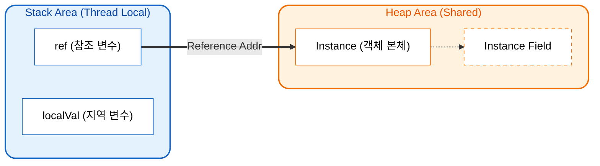
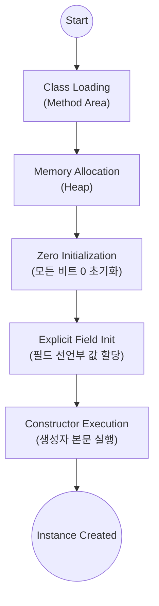

## 1. 클래스의 구성 요소와 멤버 초기화 메커니즘

Java에서 **클래스(Class)** 는 필드(Field)와 메서드(Method)가 결합된 집합체다. 필드는 객체의 상태를, 메서드는 객체의 행위를 정의하며 이 둘을 합쳐 **멤버(Member)** 라 부른다.

### 필드의 초기화와 기본값

클래스 내부에 선언된 변수(필드)는 명시적으로 초기화하지 않아도 **JVM(Java Virtual Machine)** 에 의해 안전하게 기본값으로 초기화된다.

* **숫자형 타입**: `0`으로 초기화된다.
* **참조형 타입(Reference Type)**: `null`로 초기화된다.

이때 `0`과 `null`은 개념적으로 다르지만, 메모리 내부(이진수 레벨)에서는 모두 비트가 0으로 채워진 상태를 의미한다. JVM은 인스턴스 생성 시 할당된 메모리 영역을 0으로 비우는 과정을 거치는데, 이를 **제로 초기화(Zero-initialization)** 라 한다.

---

## 2. JVM 메모리 아키텍처: Stack 영역과 Heap 영역

Java의 메모리 관리는 변수의 선언 위치와 성격에 따라 크게 **스택(Stack)** 과 **힙(Heap)**, 그리고 **메서드(Method)** 영역으로 나뉜다. 여기서는 객체 관리의 핵심인 스택과 힙에 집중한다.

### 메모리 구조 시각화



### 스택(Stack)과 힙(Heap)의 차이점

| 구분 | 스택(Stack) 영역 | 힙(Heap) 영역 |
| --- | --- | --- |
| **저장 대상** | 지역 변수, 매개변수 (Primitive, Reference 주소) | 인스턴스(객체 본체), 배열 |
| **관리 주체** | 스코프(Scope) 종료 시 자동 제거 (LIFO) | **가비지 컬렉터(GC)**가 관리 |
| **할당 시점** | 컴파일 타임에 크기 결정 (정적) | 런타임에 결정 (**동적 할당**) |

> **Deep Dive: Method Area(메서드 영역)의 역할**
> 
> 힙과 스택 외에도 **Method Area(또는 Metaspace)** 라는 중요한 영역이 존재한다. 이곳에는 `.class` 파일에서 로딩된 **클래스 메타데이터**, **Static 변수**, **상수 풀(Constant Pool)**이 저장된다. 객체 생성(`new`)을 위해서는 JVM이 먼저 이 영역에서 클래스 정보를 읽어와야 한다.
{: .prompt-info }

### 동적 할당(Dynamic Allocation)의 의미

`new` 연산자를 사용하여 객체를 생성하는 행위는 런타임(Runtime)에 메모리를 확보하는 **동적 할당**이다. '동적', '다이나믹', '런타임'은 하나의 맥락으로 이해해야 한다. 프로그램 실행 중에 필요한 만큼의 메모리를 운영체제가 아닌 JVM의 힙 영역에 요청하여 할당받는 것이 핵심이다.

---

## 3. 인스턴스 생성과 생성자(Constructor)의 역할

**생성자**는 객체가 생성되는 시점에 JVM에 의해 자동으로 호출되는 특수한 메서드다. 객체의 상태를 초기화하는 마지막 단계이자 가장 강력한 권한을 가진다.

### 생성자의 주요 특징

1. **반환 타입 부재**: 생성자는 `new` 연산자가 인스턴스의 주소를 반환하는 과정의 일부이므로, 별도의 반환 값을 갖지 않는다 (`void`조차 명시하지 않음).
2. **클래스명과 동일**: 반드시 클래스 이름과 정확히 일치해야 한다.
3. **초기화 우선순위**: 필드 선언 시 대입한 값보다 생성자 내부의 로직이 더 늦게 실행되므로, 생성자의 값이 최종 상태가 된다.

### 객체 생성 라이프사이클 (Under the hood)



### 코드 예제

```java
public class MyTest {
    // 1. 필드 선언 시 초기화 (먼저 실행됨)
    private int data = 10;

    // 2. 기본 생성자 (Default Constructor)
    public MyTest() {
        // 3. 생성자 내부 초기화 (나중에 실행되어 값을 덮어씀)
        this.data = 20; 
        System.out.println("인스턴스가 생성되었습니다.");
    }

    public int getData() {
        return data;
    }
}

```

> **Tip: TLAB (Thread Local Allocation Buffer)**
> 
> 힙 영역은 모든 스레드가 공유하므로 동기화 비용이 발생한다. 이를 최적화하기 위해 JVM은 각 스레드별로 힙 내에 **TLAB**라는 작은 전용 버퍼를 두어, 락(Lock) 없이 빠르게 객체를 할당할 수 있게 한다.
{: .prompt-tip }

---

## 4. 참조 변수와 가비지 컬렉션(GC)

Java에서 클래스 타입으로 선언된 변수는 객체 자체가 아니라, 힙 영역에 생성된 객체의 **메모리 주소(Reference)** 를 저장하는 **참조 변수**다.

### 참조 변수의 특징과 사이드 이펙트

하나의 인스턴스를 여러 참조 변수가 가리킬 수 있다 (`Aliasing`).

```java
MyTest a = new MyTest();
MyTest b = a; // 주소 복사 (Shallow Copy)
```

이 경우 `a`를 통해 객체 상태를 변경하면, `b`가 바라보는 객체도 동일하게 변경된다. 이를 **사이드 이펙트(Side Effect)** 라 하며, 의도치 않은 데이터 변경을 야기할 수 있어 주의가 필요하다.

### 가비지 컬렉터 (Garbage Collector)

더 이상 유효한 참조(Reference)가 없는 객체를 **Unreachable Object**라 한다. JVM의 가비지 컬렉터(GC)는 이러한 객체를 감지하여 메모리를 회수한다.

> **위험: Memory Leak (메모리 누수)**
> 
> Java는 GC가 있지만 메모리 누수에서 완전히 자유롭지 않다. 예를 들어, `static` 컬렉션에 객체를 담아두고 삭제하지 않거나, 사용하지 않는 `List`에 참조가 남아있다면 GC는 해당 객체를 회수할 수 없다.
{: .prompt-danger }

---

## 5. 접근 제어자와 캡슐화(Encapsulation)

객체 지향 프로그래밍(OOP)의 핵심 원칙 중 하나는 객체 내부의 데이터를 외부의 간섭으로부터 보호하는 것이다.

### 캡슐화 전략

1. 필드는 `private`: 외부에서 직접 접근하여 상태를 망가뜨리는 것을 원천 봉쇄한다.
2. 메서드는 `public`: 데이터에 접근할 수 있는 통제된 창구인 **Getter/Setter**를 제공한다.

```java
public class User {
    // 데이터를 외부로부터 은닉 (Information Hiding)
    private int age;

    // 읽기 전용 접근자 (Getter)
    public int getAge() {
        return age;
    }

    // 쓰기 전용 설정자 (Setter) - 보호 로직 포함
    public void setAge(int age) {
        if (age < 0) {
            System.out.println("나이는 음수가 될 수 없습니다.");
            return; // 유효성 검증 실패 시 차단
        }
        this.age = age;
    }
}
```

---

## 💡 Quiz: 학습 내용 확인하기

**Q1. Java에서 필드 선언 시 `int count = 10;`으로 초기화하고, 생성자에서 `this.count = 20;`으로 재할당했다. 객체 생성 직후 `count`의 값은 무엇인가?**

<details>
<summary>정답 확인</summary>
<div>
<strong>20</strong>. 객체 생성 라이프사이클에 따라 '제로 초기화' -> '필드 명시적 초기화(10)' -> '생성자 실행(20)' 순서로 진행되므로, 생성자에서의 할당값이 최종값이 된다.
</div>
</details>

**Q2. `MyClass ref = null;` 상태에서 `ref.method();`를 호출하면 발생하는 예외와 그 원인은?**

<details>
<summary>정답 확인</summary>
<div>
<strong>NullPointerException (NPE)</strong>. 참조 변수 <code>ref</code>가 힙 메모리 상의 어떤 인스턴스도 가리키지 않는 상태(Null)에서 멤버에 접근하려 했기 때문이다.
</div>
</details>

**Q3. 생성자 내부에서 DB 연결과 같은 무거운 로직을 수행하는 것이 권장되지 않는 이유는?**

<details>
<summary>정답 확인</summary>
<div>
생성자는 <strong>객체의 초기화</strong>라는 단일 책임에 집중해야 한다. 생성자 내에서 복잡한 로직이 실패할 경우 객체 생성이 중단되거나 불완전한 객체가 남을 수 있으며, 테스트와 유지보수가 어려워진다.
</div>
</details>