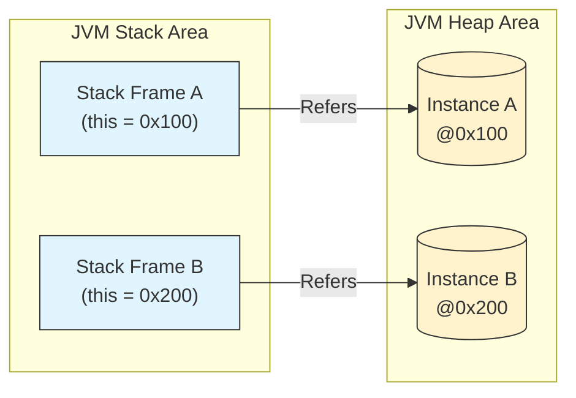

## 1. 개요: 참조의 본질과 시차

Java에서 **`this`** 는 현재 실행 중인 메서드가 속한 **객체 자신(Current Instance)을 가리키는 참조자(Reference)** 다. C++의 '디스 포인터(this pointer)'와 개념적으로 유사하지만, Java는 메모리 주소를 직접 조작하는 것을 허용하지 않으므로 JVM이 관리하는 '참조값'의 형태를 띤다.

### 인스턴스화의 시차(Time Lag)

클래스를 코드로 작성하는 시점은 '현재'이지만, `new` 연산자를 통해 실제 힙(Heap) 메모리에 할당되는 시점은 '미래'다. 개발자는 코딩 시점에 해당 객체가 메모리의 어느 주소에 적재될지 알 수 없다. **`this`** 는 런타임에 결정될 이 **미래의 주소값**을 대신하여 식별하는 역할을 수행한다.

---

## 2. 식별자 모호성 해결 (Variable Shadowing)

`this`의 가장 보편적인 사용 패턴은 **변수 가려짐(Variable Shadowing)** 현상을 해결하는 것이다. 클래스의 **필드(Member Variable)** 와 메서드의 **매개변수(Local Variable)** 이름이 동일할 경우, 스코프 우선순위에 의해 필드가 가려지는 현상이 발생한다.

### 2.1 스코프와 우선순위

Java의 식별자 검색 순서에 따르면, 메서드 내부에서 변수명을 호출할 때 가장 가까운 스코프인 **지역 변수(매개변수)** 를 우선적으로 참조한다. 이때 `this`를 명시함으로써 해당 변수가 지역 변수가 아닌 **객체의 필드**임을 JVM에게 알린다.

```java
public class UserSession {
    // 1. 클래스 필드 (Heap 영역)
    private String sessionId;

    // 생성자: 의도적인 이름 중복 사용
    public UserSession(String sessionId) {
        // this.sessionId : 인스턴스 변수 (Heap)
        // sessionId      : 매개변수 (Stack)
        
        this.sessionId = sessionId; 
    }

    public void printSessionInfo(String additionalInfo) {
        // this를 사용하여 명시적으로 필드에 접근
        System.out.println("Session ID: " + this.sessionId);
        System.out.println("Info: " + additionalInfo);
    }
}

```

> **주의:** `this`를 생략할 경우, 컴파일러는 `sessionId = sessionId;`를 "매개변수에 매개변수 값을 대입"하는 무의미한 연산으로 처리한다. 필드 값은 초기화되지 않는다.
 {: .prompt-warning }

---

## 3. 메모리 아키텍처와 `this`

클래스(Class)는 설계도일 뿐이며 하나만 존재하지만, 이를 통해 생성된 **인스턴스(Instance)** 는 힙 메모리에 여러 개가 독립적으로 존재한다. `this`는 각 인스턴스마다 고유한 참조값을 가진다.

### 3.1 인스턴스별 독립성 시각화



위 다이어그램과 같이 서로 다른 스택 프레임에서 실행되는 메서드는 서로 다른 힙 영역의 인스턴스를 가리키게 된다.

---

## 4. Deep Dive: JVM 내부 동작 원리 (Stack Frame & Slot 0)

많은 개발자가 `this`를 단순한 문법적 예약어로 이해하지만, JVM 레벨에서는 물리적인 데이터 전달 메커니즘이 존재한다.

### 4.1 스택 프레임의 구조

메서드가 호출될 때 JVM 스택에는 **스택 프레임(Stack Frame)** 이라는 블록이 생성된다. 이 프레임 내부에는 **지역 변수 배열(Local Variable Array)** 이 존재하며, 변수들은 **슬롯(Slot)** 이라는 단위로 관리된다.

### 4.2 Slot 0의 비밀

인스턴스 메서드(static이 아닌 메서드)가 호출될 때, JVM은 개발자가 선언하지 않은 **0번째 매개변수**로 해당 객체의 참조값(`this`)을 은밀하게 전달한다.

> Deep Dive: Bytecode와 `aload_0`
> 
> 자바 소스 코드를 컴파일하여 바이트코드(`.class`)를 확인해보면, 인스턴스 메서드 내부에서 `this`를 사용할 때 `aload_0`라는 명령어가 자주 등장한다.
> * **`aload_0`**: 지역 변수 배열의 **0번 인덱스(Slot 0)** 에 저장된 참조값(Reference)을 오퍼랜드 스택(Operand Stack)으로 로드하라는 명령어다.
> * 즉, `this`는 마법처럼 나타나는 것이 아니라, **메서드 호출 시 0번 인자로 강제 주입된 파라미터**다.
{: .prompt-info }

| 인덱스 (Slot) | 변수명 | 설명 |
| --- | --- | --- |
| **0** | **`this`** | **호출한 객체의 참조 주소 (JVM이 자동 할당)** |
| 1 | `arg1` | 메서드의 첫 번째 매개변수 |
| 2 | `arg2` | 메서드의 두 번째 매개변수 |

---

## 5. `static` 컨텍스트와 `this`의 단절

`static` 메서드 내에서 `this`를 사용할 수 없는 이유는 메모리 로딩 시점과 소유권의 차이 때문이다.

1. **로딩 시점**: 정적(static) 메서드는 프로그램 시작 시(또는 클래스 로딩 시) 메모리에 올라간다. 인스턴스가 생성되기 전이다.
2. **소유권**: 정적 메서드는 특정 인스턴스(객체)에 종속되지 않고 클래스 자체에 속한다.
3. **Slot 0 부재**: 정적 메서드 호출 시에는 JVM이 스택 프레임의 0번 슬롯에 `this` 참조를 넘겨주지 않는다. 따라서 참조할 주소 자체가 존재하지 않는다.

### 구현 예제

```java
public class StaticContextTest {
    private int instanceData = 10;

    // [Bad Case] 컴파일 에러 발생
    public static void printDataError() {
        // static 메서드는 this(인스턴스 참조)를 모른다.
        // System.out.println(this.instanceData); // Error: cannot use this in a static context
    }
    
    // [Good Case] 외부에서 참조를 주입받아야 함
    public static void printDataSuccess(StaticContextTest target) {
        // 명시적으로 인스턴스 참조를 매개변수로 전달받음
        System.out.println("Data: " + target.instanceData);
    }
}

```

> **Tip:** `static` 메서드에서 인스턴스 변수를 다뤄야 한다면, 위 예제의 `printDataSuccess`처럼 객체를 파라미터로 전달받는 방식을 사용해야 한다.
{: .prompt-tip }

---

## 💡 Quiz: 학습 내용 확인하기

**Q1. 인스턴스 메서드 호출 시, JVM은 객체의 참조 주소(`this`)를 스택 프레임의 어느 위치에 저장하는가?**

<details>
<summary>정답 확인</summary>
<div>
지역 변수 배열(Local Variable Array)의 <strong>0번 슬롯(Slot 0)</strong>에 저장한다. 컴파일된 바이트코드에서는 <code>aload_0</code> 명령어로 이를 확인할 수 있다.
</div>
</details>

**Q2. `static` 메서드 내부에서 `this` 예약어를 사용할 수 없는 근본적인 이유는 무엇인가?**

<details>
<summary>정답 확인</summary>
<div>
`static` 메서드는 인스턴스 생성 없이 호출 가능하며 클래스 레벨에 속한다. 메서드 호출 시 JVM이 `this` 참조값을 스택 프레임에 전달하지 않으므로(0번 슬롯이 비어있거나 다른 용도로 쓰임), 참조할 대상이 존재하지 않기 때문이다.
</div>
</details>

**Q3. 클래스 필드명과 메서드 매개변수명이 동일할 때, `this`를 생략하면 어떤 현상이 발생하는가?**

<details>
<summary>정답 확인</summary>
<div>
<strong>변수 가려짐(Variable Shadowing)</strong> 현상이 발생하여, 필드보다 스코프가 좁은 <strong>지역 변수(매개변수)</strong>가 우선적으로 참조된다. 이로 인해 필드 초기화가 실패할 수 있다.
</div>
</details>