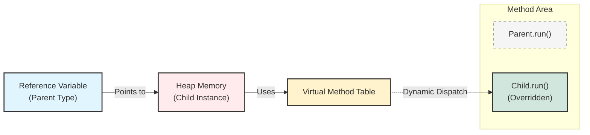
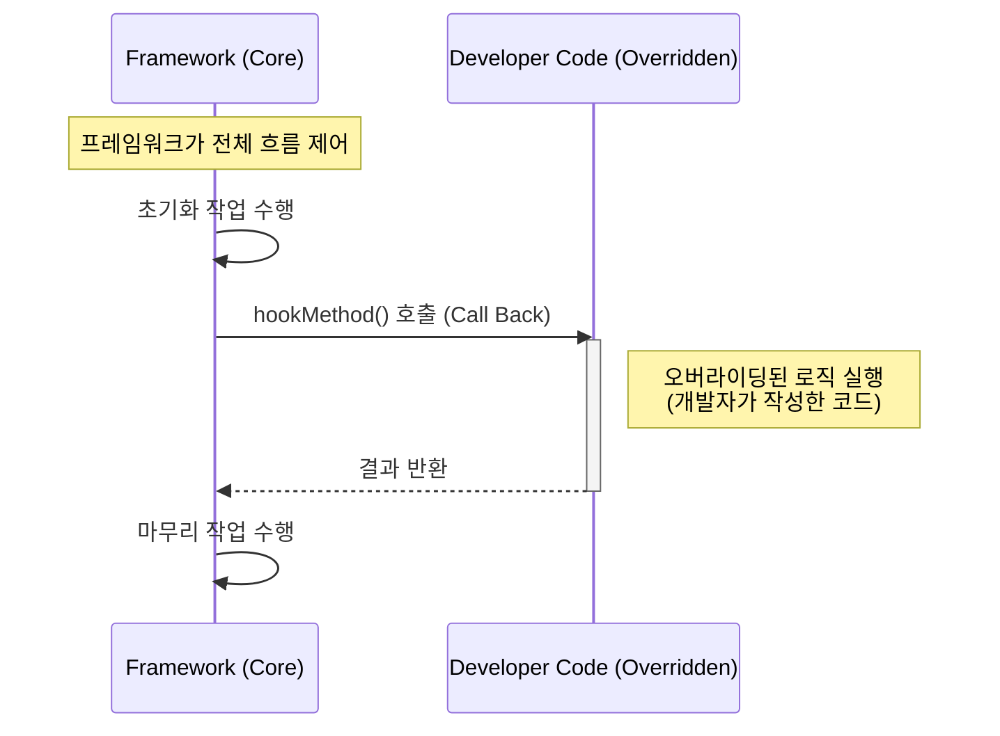

## 1. 개요

객체 지향 프로그래밍(OOP)에서 상속이 구조적인 틀을 제공한다면, **오버라이딩(Overriding)**은 그 틀 안에서 동작을 유연하게 변경하는 핵심 메커니즘이다. 오버라이딩은 상위 클래스(Superclass)에 정의된 메서드를 하위 클래스(Subclass)에서 재정의하는 것을 의미하며, 이는 기존 코드를 수정하지 않고 기능을 확장하거나 변경하는 **유지보수의 핵심 수단**이 된다.

> **Deep Dive: 오버로딩(Overloading) vs 오버라이딩(Overriding)**
> 
> * **오버로딩(Overloading)**: 같은 이름의 메서드를 매개변수의 유형이나 개수를 다르게 하여 여러 개 정의하는 것(다중 정의).
> * **오버라이딩(Overriding)**: 상속받은 메서드의 내용만 변경하여 동일한 시그니처로 다시 정의하는 것(재정의).
{: .prompt-info }

## 2. 다형성과 동적 바인딩 (Polymorphism & Dynamic Binding)

오버라이딩의 가장 중요한 특징은 **참조 변수의 타입이 아닌, 실제 생성된 인스턴스의 타입에 따라 실행될 메서드가 결정된다**는 점이다. 이를 **동적 바인딩(Dynamic Binding)**이라고 한다.

### 2.1 메모리 참조 구조와 메서드 호출

상위 클래스 `Parent`와 이를 상속받아 메서드를 재정의한 `Child` 클래스가 있다고 가정하자.

```java
Parent obj = new Child(); // Upcasting
obj.run(); // 누구의 run()이 실행되는가?
```

이 코드가 실행될 때 JVM 내부에서 일어나는 일을 시각화하면 다음과 같다.



* **참조 변수(`Ref`)**: `Parent` 타입으로 선언되었지만, 실제 힙 메모리에는 `Child` 인스턴스를 가리킨다.
* **실행 결과**: 자바의 메서드 호출은 런타임에 인스턴스의 실제 타입을 확인하여 결정되므로, `Parent.run()`이 아닌 `Child.run()`이 실행된다.

> **Deep Dive: JVM의 가상 메서드 테이블 (vtable)**
> 
> JVM은 메서드 호출 속도를 높이기 위해 **vtable(virtual method table)**[^1]이라는 구조를 사용한다.
> 1. 클래스가 로딩될 때, JVM은 메서드들의 주소값을 가진 vtable을 생성한다.
> 2. `Child` 클래스가 `run()`을 오버라이딩하면, `Child`의 vtable에서 `run()`의 주소는 `Child.run()`을 가리키도록 갱신된다.
> 3. `Parent` 타입으로 참조하더라도, 실제 인스턴스(`Child`)의 vtable을 참조하므로 오버라이딩된 메서드가 고속으로 호출된다.
{: .prompt-info }

## 3. 구현 및 확장 패턴 (Implementation)

오버라이딩은 단순히 기존 기능을 덮어쓰는 것(Replace) 외에도, 기존 기능 앞뒤에 로직을 추가(Append/Prepend)하는 형태로 활용된다.

### 3.1 기본 구현과 `super` 키워드 활용

```java
class DataProcessor {
    // 기본 로직
    public void process(int data) {
        System.out.println("[Parent] 데이터를 처리합니다: " + data);
    }
}

class SecureDataProcessor extends DataProcessor {
    @Override // 컴파일러에게 재정의임을 명시
    public void process(int data) {
        // 1. 사전 처리 (Pre-processing): 유효성 검사 또는 보안 체크
        if (data < 0) {
            System.out.println("[Child] 경고: 데이터 보정 (0으로 변경)");
            data = 0;
        }

        // 2. 기존 로직 수행 (super 호출)
        super.process(data); 

        // 3. 사후 처리 (Post-processing): 로깅 등
        System.out.println("[Child] 처리 완료 로그 기록");
    }
}

public class Main {
    public static void main(String[] args) {
        // 다형성 활용
        DataProcessor processor = new SecureDataProcessor();
        processor.process(-10);
    }
}

```

> **Tip:** `@Override` 애너테이션은 필수 사항은 아니지만, **강력히 권장**된다. 메서드 시그니처(이름, 매개변수)가 틀렸을 때 컴파일러가 오류를 잡아주어 실수를 방지한다.
{: .prompt-tip }

## 4. 프레임워크와 제어 역전 (Framework & IoC)

오버라이딩은 스프링(Spring)과 같은 프레임워크를 이해하는 데 핵심적인 개념이다. 프레임워크는 전체적인 흐름(Flow)을 미리 정의해 두고, 개발자가 특정 시점(Hook)에 개입할 수 있도록 메서드 재정의를 유도한다.

### 4.1 지하철 노선과 템플릿 메서드 패턴

이를 쉽게 비교하자면 **지하철 노선**이 있다. 노선(프레임워크의 흐름)은 이미 정해져 있고 변경할 수 없지만, 승객(개발자)은 특정 역에서 승차하거나 하차(오버라이딩을 통한 개입)할 수 있다.

이를 디자인 패턴에서는 **템플릿 메서드 패턴(Template Method Pattern)**이라 부르며, 제어 역전(IoC, Inversion of Control)의 기본 원리가 된다.



> **Deep Dive: 할리우드 원칙 (Hollywood Principle)**
> 
> "우리에게 전화하지 마세요. 우리가 당신에게 전화할 것입니다(Don't call us, we'll call you)."
> 
> 오버라이딩된 메서드는 개발자가 직접 `new Child().method()` 처럼 호출하는 경우가 드물다. 대신 프레임워크 내부 엔진이 **적절한 시점(Lifecycle)**에 개발자가 재정의해둔 메서드를 자동으로 호출한다.
> {: .prompt-info }

## 5. 실무 적용 시나리오 (Real-World Scenario)

실무에서 오버라이딩은 **공통 로직의 추상화**와 **비즈니스 로직의 구체화**를 분리할 때 자주 사용된다. 예를 들어, 다양한 결제 수단을 처리하는 시스템을 구현한다고 가정해보자.

### 시나리오: 결제 처리 시스템

모든 결제는 `검증 -> 승인 -> 알림`의 순서를 따르지만(공통 흐름), `승인` 방식은 카드사마다 다르다.

```java
// 1. 프레임워크/라이브러리 계층 (변하지 않는 흐름)
abstract class PaymentService {
    // 템플릿 메서드: 결제의 전체 흐름을 제어 (final로 오버라이딩 방지)
    public final void processPayment(int amount) {
        validate(amount); // 공통 로직
        approve(amount);  // 추상 메서드 (하위 클래스 구현 강제)
        notifyUser();     // 공통 로직 (필요시 오버라이딩 가능 - Hook)
    }

    private void validate(int amount) {
        System.out.println("기본 검증: 금액 확인 " + amount);
    }

    // 하위 클래스에서 반드시 구현해야 하는 핵심 로직
    protected abstract void approve(int amount);

    // Hook Method: 기본 구현을 제공하되, 필요하면 재정의
    protected void notifyUser() {
        System.out.println("기본 알림: SMS 발송");
    }
}

// 2. 비즈니스 구현 계층 (개발자 영역)
class KakaoPayService extends PaymentService {
    @Override
    protected void approve(int amount) {
        System.out.println("KakaoPay API 호출하여 " + amount + "원 승인 요청");
    }

    @Override
    protected void notifyUser() {
        // 기본 SMS 대신 카카오톡 알림으로 변경 (기존 로직 대체)
        System.out.println("카카오톡으로 결제 완료 알림 전송");
    }
}

public class PaymentMain {
    public static void main(String[] args) {
        // IoC: 개발자는 객체만 주입하고, 흐름은 상위 클래스가 제어
        PaymentService service = new KakaoPayService();
        service.processPayment(15000);
    }
}

```

이처럼 오버라이딩을 활용하면 핵심 비즈니스 로직에만 집중하면서 견고한 애플리케이션을 구축할 수 있다.

---

## 💡 Quiz: 학습 내용 확인하기

**Q1. 부모 클래스 타입의 참조 변수로 자식 클래스 인스턴스를 참조할 때, 오버라이딩된 메서드를 호출하면 어떤 클래스의 메서드가 실행되는가?**

<details>
<summary>정답 확인</summary>
<div>
자식 클래스(실제 인스턴스 타입)에 정의된 메서드가 실행된다. 이를 동적 바인딩(Dynamic Binding)이라고 한다.
</div>
</details>

**Q2. 오버라이딩 시 부모 클래스의 원래 메서드 기능을 수행한 후, 추가적인 기능을 덧붙이려면 어떤 키워드를 사용해야 하는가?**

<details>
<summary>정답 확인</summary>
<div>
<code>super</code> 키워드를 사용한다. (예: <code>super.methodName()</code> 호출 후 내 로직 작성)
</div>
</details>

**Q3. 프레임워크에서 오버라이딩을 사용하는 주된 이유는 무엇이며, 이는 어떤 원칙과 관련이 있는가?**

<details>
<summary>정답 확인</summary>
<div>
프레임워크가 정해둔 전체적인 흐름(Lifecycle) 속에 개발자가 필요한 로직만 끼워 넣기 위함이다. 이는 제어 역전(IoC) 또는 할리우드 원칙과 관련이 있다.
</div>
</details>

---

[^1]:**vtable (Virtual Method Table)**: 가상 함수 테이블. 다형성을 지원하기 위해 컴파일러나 런타임 환경이 생성하는 함수 포인터 배열로, 오버라이딩된 메서드의 정확한 주소를 매핑하고 있다.

