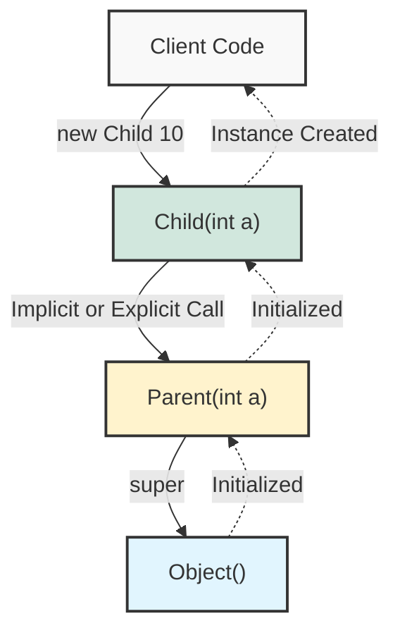

## 1. 개요

객체 지향 프로그래밍(OOP)에서 `this`가 인스턴스 자신을 가리키는 참조자라면, `super`는 **상속 관계에 있는 부모 클래스(Super Class)의 인스턴스 영역**을 가리키는 키워드다. 자식 클래스가 인스턴스화될 때, 단순히 자식 객체만 생성되는 것이 아니라 부모 클래스의 초기화 과정이 선행되어야 한다.

생성자 오버로딩(Overloading) 상황에서 자식 클래스가 부모 클래스의 특정 생성자를 선택하여 호출하는 메커니즘에 대하여 알아보자.

## 2. 생성자 호출 메커니즘과 아키텍처

Java에서 자식 클래스의 인스턴스를 생성하면, 메모리상에서는 부모 클래스의 멤버들도 함께 할당된다. 이때 초기화 순서는 최상위 부모(`java.lang.Object`)부터 아래쪽으로 내려오는 것이 아니라, 호출 스택상 자식에서 부모를 호출하고 부모가 초기화를 마친 후 자식으로 제어권이 돌아오는 구조를 가진다.



> **Deep Dive: 힙(Heap) 메모리 레이아웃**
> 
> `new Child()`를 실행할 때, 힙 메모리에는 부모 객체와 자식 객체가 따로 생성되는 것이 아니다. **하나의 거대한 인스턴스**가 생성되며, 그 내부에 부모 클래스에서 정의한 필드 영역과 자식 클래스에서 정의한 필드 영역이 공존한다. `super`는 이 단일 인스턴스 내부에서 부모의 멤버에 접근하기 위한 참조 윈도우(Reference Window) 역할을 한다.
{: .prompt-info }

## 3. 기본 생성자의 묵시적 호출과 문제점

부모 클래스에 여러 개의 생성자가 정의되어 있을 때, 자식 클래스에서 명시적으로 부모 생성자를 지정하지 않으면 컴파일러는 자동으로 `super()` (매개변수가 없는 기본 생성자)를 호출한다.

### 3.1 문제 상황: 의도치 않은 초기화

개발자가 의도한 것은 부모 클래스의 `int`를 받는 생성자 호출이었으나, 명시하지 않을 경우 기본 생성자가 호출되어 데이터 초기화가 누락될 수 있다.

```java
class Parent {
    int value;

    // 1. 기본 생성자
    Parent() {
        System.out.println("Parent Default Constructor");
    }

    // 2. 매개변수가 있는 생성자
    Parent(int value) {
        this.value = value;
        System.out.println("Parent Parameterized Constructor");
    }
}

class Child extends Parent {
    Child(int value) {
        // 여기에 super(value)를 명시하지 않으면,
        // 컴파일러는 자동으로 super(); 를 삽입한다.
        System.out.println("Child Constructor");
    }
}

public class Main {
    public static void main(String[] args) {
        // 의도: 부모의 value도 10으로 초기화되길 원함
        // 결과: 부모의 기본 생성자가 호출되어 value는 0으로 남음
        new Child(10); 
    }
}

```

> **위험:** 부모 클래스에 기본 생성자(`Parent()`)가 정의되어 있지 않고 매개변수가 있는 생성자만 존재할 경우, 자식 클래스에서 `super(인자)`를 명시적으로 호출하지 않으면 **컴파일 에러(Compile Error)**가 발생한다.
{: .prompt-danger }

## 4. 해결책: `super()`를 통한 명시적 호출

자식 클래스 생성자 내부에서 `super` 예약어를 사용하여 부모의 특정 생성자를 호출함으로써 초기화 흐름을 제어할 수 있다.

### 4.1 올바른 구현 (Java)

```java
class Parent {
    protected int baseValue;

    Parent() {
        this.baseValue = 0;
    }

    Parent(int baseValue) {
        this.baseValue = baseValue;
        System.out.println("[Parent] 값 초기화: " + baseValue);
    }
}

class Child extends Parent {
    private int childValue;

    public Child() {
        // 명시하지 않으면 super() 호출됨
        super(); 
    }

    public Child(int value) {
        // [핵심] 부모의 매개변수가 있는 생성자를 선택하여 호출
        // 반드시 생성자의 첫 번째 라인에 위치해야 함
        super(value); 
        
        this.childValue = value;
        System.out.println("[Child] 생성 완료");
    }
    
    public void printValues() {
        // super.baseValue로 부모 필드 접근 가능 (이름이 겹치지 않으면 this로도 가능)
        System.out.println("Parent Value: " + super.baseValue);
        System.out.println("Child Value: " + this.childValue);
    }
}

public class Main {
    public static void main(String[] args) {
        // 부모의 생성자(int)가 호출되도록 유도
        Child c = new Child(100);
        c.printValues();
    }
}

```

### 4.2 실행 결과

```text
[Parent] 값 초기화: 100
[Child] 생성 완료
Parent Value: 100
Child Value: 100

```

> **Tip:** `super` 키워드는 메서드 오버라이딩(Overriding) 시 부모의 원본 메서드를 호출해야 할 때도 유용하게 사용된다. (예: `super.printMethod()`)
{: .prompt-tip }

## 5. 심화 분석: 생성자 규칙 (Rules of Constructors)

1. **반드시 첫 줄에 위치**: `super(...)` 호출은 자식 클래스 생성자의 **가장 첫 번째 문장(Statement)** 이어야 한다.
* **이유**: 자식 클래스가 초기화되기 전에 부모 클래스의 상태(필드 등)가 완벽하게 초기화되어 있어야 안전하기 때문이다. 자식 클래스에서 부모의 필드를 사용할 수도 있는데, 초기화되지 않은 상태에서 접근하는 것을 막기 위함이다.


2. **`this()`와의 관계**: 생성자 내에서 다른 생성자를 호출하는 `this()`를 사용할 경우, `super()`와 동시에 사용할 수 없다. `this()`를 통해 이동한 다른 생성자에서 결국 `super()`가 호출되는 구조를 가져야 한다.

> **Deep Dive: Object 클래스와 상속의 끝**
> 모든 클래스는 명시하지 않아도 `java.lang.Object`를 상속받는다. 따라서 상속 계층 구조의 최상단에 있는 클래스의 생성자에는 컴파일러가 `super()`를 삽입하며, 이는 `Object` 클래스의 기본 생성자를 호출하게 된다. 이것이 Java의 모든 객체가 `Object`의 메서드(toString, equals 등)를 사용할 수 있는 근본적인 이유다.
{: .prompt-info }

---

## 💡 Quiz: 학습 내용 확인하기

**Q1. 자식 클래스 생성자의 첫 번째 줄에 `super()`를 명시하지 않았을 때 어떤 일이 발생하는가?**

<details>
<summary>정답 확인</summary>
<div>
컴파일러가 자동으로 부모 클래스의 매개변수 없는 기본 생성자 super()를 호출하는 코드를 삽입한다.
</div>
</details>

**Q2. 부모 클래스에 매개변수가 있는 생성자만 정의되어 있고 기본 생성자가 없을 때, 자식 클래스에서 주의해야 할 점은 무엇인가?**

<details>
<summary>정답 확인</summary>
<div>
컴파일러가 기본 생성자를 자동으로 제공하지 않으므로, 자식 클래스 생성자에서 반드시 부모의 존재하는 생성자를 super(인자) 형식으로 명시적으로 호출해야 한다. 그렇지 않으면 컴파일 에러가 발생한다.
</div>
</details>

**Q3. `super(args)` 호출이 생성자 코드의 중간이나 마지막에 위치할 수 없는 기술적 이유는 무엇인가?**

<details>
<summary>정답 확인</summary>
<div>
자식 인스턴스가 생성될 때 부모의 멤버 변수나 상태에 의존할 수 있으므로, 자식의 초기화 로직이 실행되기 전에 부모의 초기화가 완벽히 보장되어야 하기 때문이다.
</div>
</details>