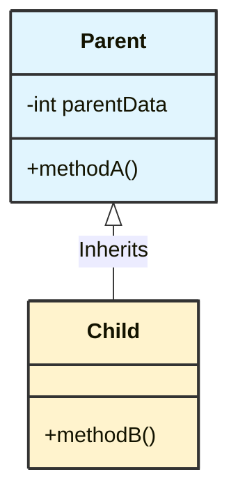
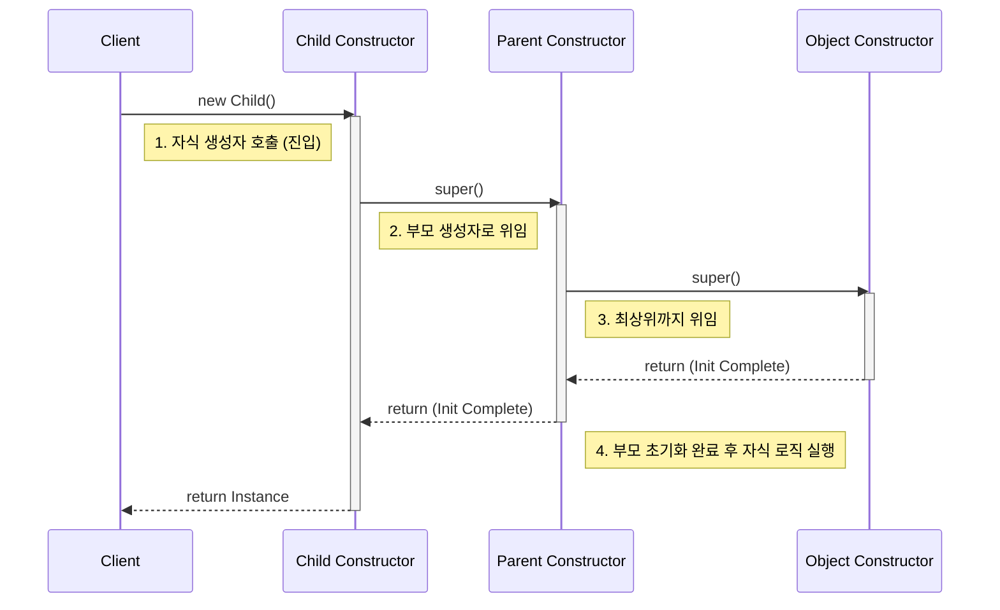

## 1. 개요

상속(Inheritance)은 객체 지향 프로그래밍(OOP)의 핵심 기둥 중 하나지만, 잘못 사용하면 '나락'으로 갈 수 있는 양날의 검이다. 특히 클래스 간의 **시간차(Time Gap)**—부모 클래스를 만든 시점과 자식 클래스를 확장하는 시점의 괴리—는 예기치 못한 버그를 만들어낸다. 상속 시 인스턴스가 생성되는 내부 메커니즘과 `protected` 접근 제어자를 알아보자.

## 2. 상속의 구조와 UML

클래스 다이어그램(UML)에서 상속 관계는 자식 클래스(Sub Class)에서 부모 클래스(Super Class)를 향하는 **빈 삼각형 화살표**로 표기한다. 이는 자식이 부모를 '가리키는(참조하는)' 구조가 아니라, 자식이 부모의 정의를 **확장(Extend)** 한다는 의미다.



## 3. 생성자 호출 메커니즘 (Call Stack vs Execution)

상속 관계에서 가장 혼동하기 쉬운 것이 **생성자의 호출 순서와 실행 순서의 차이**다.

* **호출(Call)**: 자식 클래스 생성자가 먼저 호출된다.
* **실행(Execution)**: 부모 클래스 생성자가 먼저 실행(완료)된다.

자식 클래스의 생성자가 호출되면, 컴파일러는 암묵적으로 부모 클래스의 생성자(`super()`)를 호출하는 코드를 삽입한다. 이는 `Object` 클래스(최상위)에 도달할 때까지 재귀적으로 반복된다. 결과적으로 **스택(Stack)은 자식부터 쌓이지만, 초기화는 부모부터 완료**되며 내려온다.



> **Deep Dive: 힙 메모리 레이아웃 (Memory Layout)**
> 
> `new Child()`를 실행할 때, 메모리 상에는 두 개의 객체가 따로 생성되는 것이 아니다. **하나의 큰 힙 메모리 블록**이 할당되고, 그 내부에 부모 클래스의 필드 영역이 포함되는 구조다.
> * `this` 키워드는 자식 클래스 입장에서 이 **전체 덩어리**를 가리킨다.
> * 따라서 자식 객체 내부에는 부모의 인스턴스 멤버가 공존하며, 접근 제어자에 따라 가시성이 결정된다.
{: .prompt-info }

## 4. 접근 제어자와 캡슐화 전략

상속을 고려할 때 접근 제어자(Access Modifier)의 선택은 설계의 유연성과 안전성을 결정한다.

| 접근 제어자      | 설명                            | 상속 관계에서의 의미                    |
| ----------- | ----------------------------- | ------------------------------ |
| `private`   | 클래스 내부에서만 접근 가능               | 자식 클래스에서도 접근 불가 (완벽한 은닉)       |
| `protected` | 패키지 내부 + **상속받은 클래스**에서 접근 가능 | 자식에게 부모의 유산을 물려줄 때 사용하는 핵심 키워드 |
| `public`    | 모든 곳에서 접근 가능                  | 캡슐화 위배 가능성 높음                  |

### 설계 원칙

1. 기본적으로 모든 멤버는 `private`으로 시작한다.
2. 상속을 통한 확장이 반드시 필요하고, 자식 클래스에게 해당 필드의 제어권을 넘겨야 할 때만 `protected`로 완화한다.
3. `protected`는 외부(다른 패키지의 비상속 클래스)로부터는 데이터를 보호하면서, 파생 클래스에게는 문을 열어주는 "가족 간의 합의"다.

## 5. 상속의 위험성: 안티 패턴 (Anti-Patterns)

상속은 "6개월 뒤의 나" 또는 "다른 개발자"가 내 코드를 확장할 때 발생할 수 있는 문제를 내포한다. 특히 **자식 클래스가 부모 클래스의 상태(State)를 직접 조작**하려 할 때 치명적인 오류가 발생한다.

### 위험한 코드 예시: 부모의 초기화 무력화

부모 클래스가 생성자에서 필드를 정상적으로 초기화했음에도, 자식 클래스가 이를 임의로 변경(특히 `null` 처리)하여 시스템을 붕괴시키는 패턴이다.

```java
// 부모 클래스: 문자열을 바이트 배열로 관리한다고 가정
class Parent {
    // protected로 자식에게 접근 허용
    protected String data;

    public Parent() {
        // 부모는 생성 시점에 반드시 데이터를 초기화함 (불변식 가정)
        this.data = "Hello Java"; 
    }

    public void printLen() {
        // data가 null일 것이라 예상하지 않음
        System.out.println("Length: " + data.length());
    }
}

// 자식 클래스
class Child extends Parent {
    public Child() {
        // 1. super()에 의해 부모 생성자 실행 -> data = "Hello Java"
        super(); 
        
        // 2. 자식 생성자 본문 실행 -> 부모가 만든 데이터를 파괴
        this.data = null; 
    }
}

public class Main {
    public static void main(String[] args) {
        // 다형성: 자식 인스턴스를 부모 타입으로 참조
        Parent p = new Child();
        
        // 런타임 에러 발생 (NullPointerException)
        // 부모 클래스 작성자는 자신의 코드가 안전하다고 믿었으나, 자식에 의해 오염됨
        p.printLen(); 
    }
}

```

> **위험:** 위 예제처럼 자식 클래스에서 부모 필드(`data`)를 직접 수정하는 행위는 부모 클래스의 **불변식(Invariant)** 을 깨뜨릴 수 있다. 이는 부모 클래스 내부 동작 원리를 완벽히 파악하지 못한 상태에서 발생하는 전형적인 잘못된 코딩이다.
{: .prompt-danger }

### 해결책: Composition over Inheritance

상속은 부모와 자식 간의 결합도(Coupling)를 매우 높인다. 단순히 기능을 재사용하거나 확장하기 위함이라면, 상속보다는 **합성(Composition)** 패턴을 고려해야 한다. 즉, 부모 클래스를 상속받는 대신, 해당 클래스의 인스턴스를 필드로 가지고(`has-a` 관계) 필요한 기능을 위임하는 방식이 훨씬 안전하다.

## 6. 다형성 (Polymorphism)과 참조

```java
Parent obj = new Child();
```

* **참조 변수의 타입(`Parent`)**: 접근 가능한 멤버의 범위(스코프)를 결정한다.
* **실제 인스턴스의 타입(`Child`)**: 실제 메모리에 생성된 객체이며, 오버라이딩된 메서드가 있다면 그것이 실행된다(동적 바인딩).

상속 관계에서 자식은 부모의 일종(`is-a`)이므로 위와 같은 코드는 자연스럽다. 

## 💡 Quiz: 학습 내용 확인하기

**Q1. 자식 클래스의 인스턴스를 생성할 때, 생성자의 '호출' 순서와 '실행 완료' 순서는 어떻게 다른가?**

<details>
<summary>정답 확인</summary>
<div>
호출(Call)은 자식 클래스에서 부모 클래스 방향(Child -> Parent -> Object)으로 이루어지지만, 실제 실행 완료(Execution/Init)는 최상위 부모 클래스부터 자식 클래스 방향(Object -> Parent -> Child)으로 진행된다.
</div>
</details>

**Q2. 상속받은 자식 클래스에서만 접근을 허용하고, 외부 클래스에서는 접근을 막고 싶을 때 사용하는 접근 제어자는?**

<details>
<summary>정답 확인</summary>
<div>
<code>protected</code>이다. 이는 같은 패키지 내의 클래스와 해당 클래스를 상속받은 자식 클래스에서의 접근을 허용한다.
</div>
</details>

**Q3. 힙 메모리에서 상속된 자식 객체는 부모 객체와 별도로 분리되어 생성되는가?**

<details>
<summary>정답 확인</summary>
<div>
아니다. 하나의 인스턴스 메모리 공간 안에 부모 클래스의 멤버 필드들이 포함(Nested)되는 형태로 생성된다. <code>this</code> 포인터는 이 전체 인스턴스를 가리킨다.
</div>
</details>