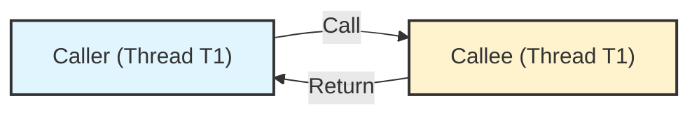
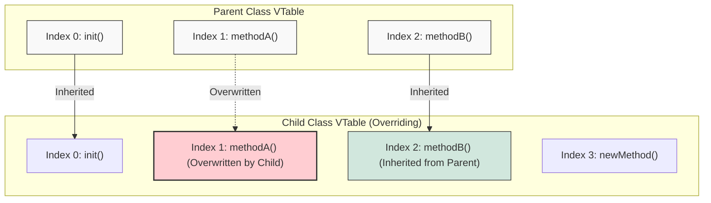

## 1. 개요

프로그래밍에서 함수(Function) 또는 메서드(Method)를 호출한다는 것은 단순히 코드를 실행하는 행위를 넘어, 호출자(Caller)와 피호출자(Callee) 간의 연결 관계를 맺는 과정을 포함한다. 이 연결이 결정되는 시점과 방식에 따라 **정적 바인딩(Static Binding)** 과 **동적 바인딩(Dynamic Binding)** 으로 나뉜다. 특히 Java는 C++과 달리 기본적으로 가상 함수(Virtual Function) 메커니즘을 채택하고 있어, 내부 동작 원리를 이해하는 것이 중요하다.

### 1.1 호출 관계의 시각화



## 2. 바인딩(Binding)의 종류

바인딩은 함수 호출 부분과 실제 실행될 코드의 메모리 번지를 연결하는 것이다. 이 연결이 언제 확정되느냐가 핵심이다.

### 2.1 정적 바인딩 (Static Binding)

* **시점**: 컴파일 타임 (Compile Time)
* **특징**: 컴파일러가 소스 코드를 기계어(또는 바이트코드)로 번역할 때 호출할 메서드가 이미 결정된다.
* **Java에서의 적용**:
* `static` 메서드
* `private` 메서드 (오버라이딩 불가)
* `final` 메서드 (오버라이딩 불가)
* Overloading(오버로딩) 된 메서드


### 2.2 동적 바인딩 (Dynamic Binding)

* **시점**: 런타임 (Runtime)
* **특징**: 실행 중에 객체의 실제 타입(Instance type)을 확인하여 호출할 메서드를 결정한다. 이를 **Late Binding** 또는 **Lazy Binding**이라고도 한다.
* **Java에서의 적용**:
* Overriding(오버라이딩) 된 인스턴스 메서드
* 추상 메서드의 구현체 호출

> **Tip:** "다이나믹(Dynamic)"이라는 용어가 나오면 항상 **런타임(Runtime)** 과 연관 지어 생각하면 이해가 쉽다.
{: .prompt-tip }

## 3. Deep Dive: JVM과 VTable (Virtual Method Table)

Java와 C++의 가장 큰 차이점 중 하나는 메서드 처리 방식이다.

### 3.1 Java 메서드는 기본적으로 가상 함수(Virtual Function)다

C++에서는 `virtual` 키워드를 명시해야 동적 바인딩(가상 함수)이 작동하지만, **Java의 모든 인스턴스 메서드는 기본적으로 가상 함수**다. 즉, 별도의 키워드 없이도 다형성(Polymorphism)이 동작한다.

### 3.2 VTable의 구조와 오버라이딩 메커니즘

JVM은 클래스를 로딩하고 인스턴스를 생성할 때 **VTable(Virtual Method Table)**[^1]이라는 구조체를 사용하여 메서드 호출을 관리한다. 이는 함수 포인터의 배열과 유사하다.



1. **초기 상태**: 부모 클래스(Parent)의 VTable에는 자신의 메서드 주소들이 매핑되어 있다.
2. **상속 및 생성**: 자식 클래스(Child)가 생성될 때, 부모의 VTable 구조를 복사한다.
3. **오버라이팅(Overwriting)**: 자식 클래스에서 `methodA()`를 오버라이딩했다면, VTable의 해당 인덱스가 가리키는 주소가 **자식 클래스의 메서드 주소로 덮어씌워진다.**
4. **실행**: 호출자는 VTable의 인덱스만 참조하여 호출하므로, 실제 인스턴스 타입에 맞는(덮어씌워진) 메서드가 실행된다.

> **Deep Dive: JVM의 바인딩 최적화**
> 
> 이론적으로 동적 바인딩은 VTable을 조회해야 하므로 정적 바인딩보다 느리다. 하지만 현대의 HotSpot JVM은 **Inline Caching** 등의 기법을 통해 반복 호출되는 가상 함수를 직접 연결된 기계어로 최적화하여 정적 바인딩에 준하는 성능을 낸다.
{: .prompt-info }

## 4. 구현 (Java Code)

다음은 정적 바인딩과 동적 바인딩의 차이를 명확히 보여주는 예제다.

```java
class Parent {
    // Static Method: 정적 바인딩 (클래스 타입 기준)
    public static void staticMethod() {
        System.out.println("Parent's staticMethod");
    }

    // Instance Method: 동적 바인딩 (인스턴스 타입 기준)
    public void instanceMethod() {
        System.out.println("Parent's instanceMethod");
    }
}

class Child extends Parent {
    // Hiding: 부모의 static 메서드를 가림 (오버라이딩 아님)
    public static void staticMethod() {
        System.out.println("Child's staticMethod");
    }

    // Overriding: VTable에서 부모 메서드 주소를 덮어씀
    @Override
    public void instanceMethod() {
        System.out.println("Child's instanceMethod");
    }
}

public class BindingTest {
    public static void main(String[] args) {
        // 참조 변수의 타입은 Parent, 실제 인스턴스는 Child
        Parent obj = new Child();

        // 1. 정적 바인딩 예시
        // 컴파일러는 참조 변수의 타입(Parent)만 보고 결정함
        obj.staticMethod(); 
        // 출력: Parent's staticMethod
        
        // 2. 동적 바인딩 예시
        // 런타임에 실제 객체(Child)의 VTable을 참조하여 결정함
        obj.instanceMethod(); 
        // 출력: Child's instanceMethod
    }
}

```

> **주의:** `static` 메서드는 오버라이딩되지 않고 **Hiding(숨김)** 처리된다. 따라서 다형성을 의도하고 `static` 메서드를 사용하면 예상치 못한 결과(참조 타입의 메서드 호출)를 초래할 수 있다.
{: .prompt-warning }

## 5. 결론

* **정적 바인딩**은 컴파일 시점에 결정되며 속도가 빠르지만 유연성이 떨어진다.
* **동적 바인딩**은 런타임에 결정되며 다형성의 핵심이 된다.
* Java는 프로그래머의 편의를 위해 모든 인스턴스 메서드를 가상 함수로 취급하며, JVM 내부적으로 VTable을 통해 이를 효율적으로 관리한다.

---

## 💡 Quiz: 학습 내용 확인하기

**Q1. Java에서 메서드 오버로딩(Overloading)은 어떤 바인딩 방식을 사용하는가?**

<details>
<summary>정답 확인</summary>
<div>
정적 바인딩(Static Binding)을 사용합니다. 오버로딩된 메서드는 컴파일 시점에 매개변수의 타입과 개수를 기반으로 호출될 메서드가 확정됩니다.
</div>
</details>

**Q2. 자식 클래스가 부모 클래스의 메서드를 오버라이딩할 때, VTable 내부에서는 어떤 일이 발생하는가?**

<details>
<summary>정답 확인</summary>
<div>
자식 클래스의 VTable 생성 시, 부모 클래스로부터 복사된 메서드 주소 목록 중 오버라이딩된 메서드에 해당하는 인덱스의 주소 값을 자식 클래스의 메서드 주소로 덮어씁니다(Overwrite).
</div>
</details>

[^1]:**VTable (Virtual Method Table)**: 가상 함수들의 주소를 배열 형태로 저장한 테이블. 객체의 다형성 구현을 위해 컴파일러나 런타임 환경에 의해 생성된다.