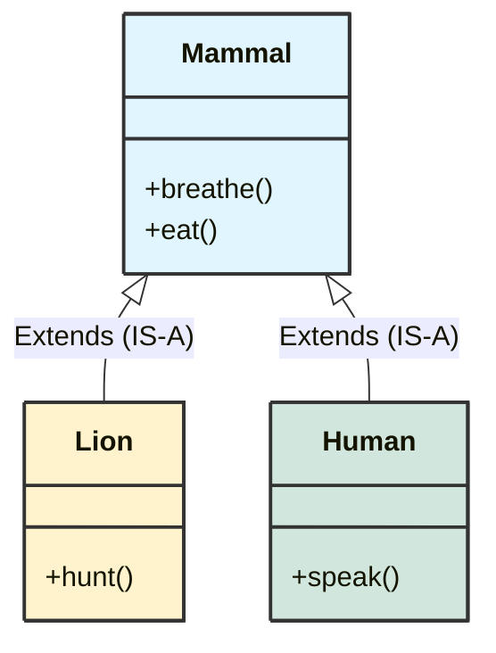
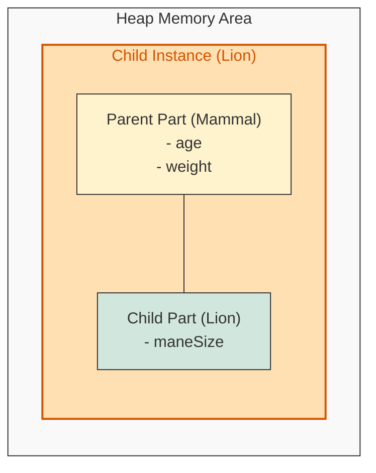
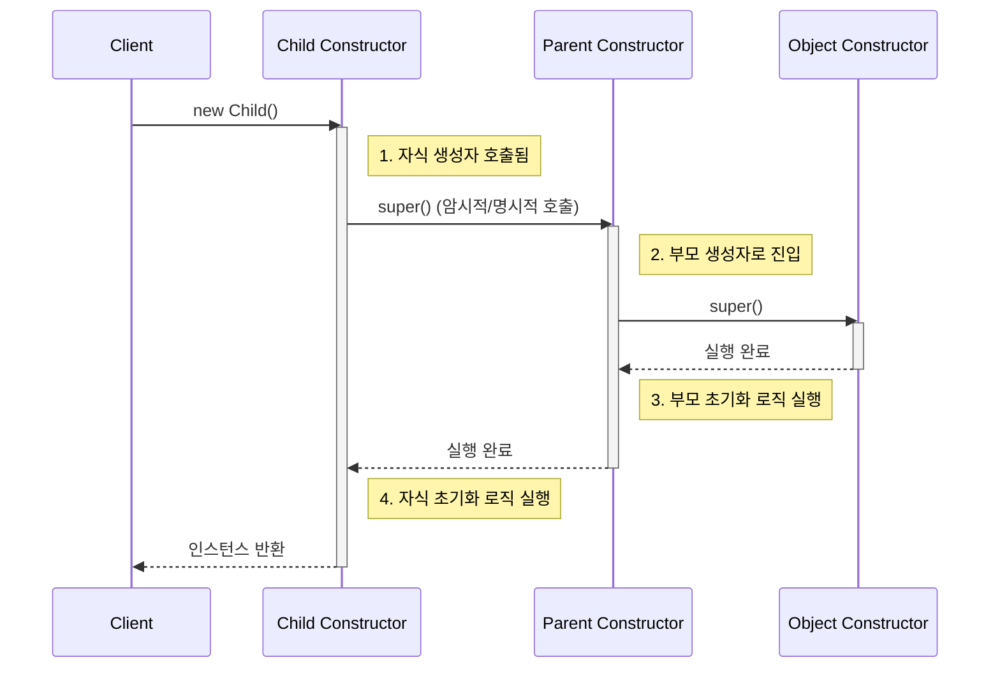

## 1. 개요

프로그래밍에서 클래스가 하나일 때는 개인의 사생활처럼 자유롭지만, 클래스가 여러 개로 늘어나면 **관계(Relationship)** 에 대한 고민이 시작된다. 객체지향 언어에서 클래스 간의 관계를 맺는 가장 기초적이면서도 강력한 방법은 바로 **상속(Inheritance)** 이다.

상속은 단순히 부모의 재산을 물려받는 개념을 넘어, 기존에 잘 만들어진 클래스(기본 클래스)를 **재사용**하고, 필요한 기능을 덧붙여 **확장**하는 메커니즘이다. 이를 통해 현재 시점의 개발자는 미래에 자신의 코드를 상속받아 사용할 개발자와 논리적인 소통을 할 수 있게 된다.

## 2. 상속의 개념과 구조

### 2.1 정의 및 문법

상속은 `extends` 키워드를 사용하여 선언한다. 이때 기존 클래스를 **부모 클래스(Parent Class)** 혹은 **슈퍼 클래스(Super Class)** 라고 하며, 이를 상속받는 새로운 클래스를 **자식 클래스(Child Class)** 혹은 **서브 클래스(Sub Class)** 라고 한다.

* **구문**: `class Child extends Parent { ... }`
* **관계**: 부모 클래스는 자식 클래스의 **일반화(Generalization)** 된 형태이며, 자식 클래스는 부모 클래스의 **구체화(Specialization)** 된 형태다.

### 2.2 IS-A 관계와 분류

상속은 흔히 **"~은 ~의 일종이다(IS-A)"** 관계라고 표현한다.

* "사람은 포유류다." (Human **is a** Mammal)
* "사자는 포유류다." (Lion **is a** Mammal)

이처럼 상속은 논리적인 **분류(Classification)** 체계를 코드에 반영하는 것이다.



## 3. 메모리 모델과 동작 원리 (Under the hood)

상속을 이해하는 데 있어 가장 중요한 것은 **객체가 메모리에 생성될 때의 형태**다.

### 3.1 인스턴스 생성 구조

자식 클래스의 인스턴스를 생성하면, 힙(Heap) 메모리 내부에는 자식 클래스의 멤버뿐만 아니라 **부모 클래스의 멤버도 함께 생성**된다. 논리적으로는 자식 객체 내부에 부모 객체가 포함(Nested)되어 있는 형태로 이해할 수 있다.



> **Deep Dive: Java 객체의 메모리 레이아웃**
> 
> 실제 JVM(HotSpot 기준)에서 상속된 객체는 하나의 연속된 메모리 블록(Chunk)으로 할당된다.
> 1. **Object Header**: 메타데이터(GC 정보, 해시코드 등) 저장.
> 2. **Super Class Fields**: 부모 클래스의 필드가 먼저 배치된다.
> 3. **Sub Class Fields**: 그 뒤에 자식 클래스의 필드가 배치된다.
> 
> 
> 따라서 자식 객체(`this`)를 통해 부모의 필드(`super`)에 접근할 때, 실제로는 같은 메모리 블록 내의 오프셋(Offset) 위치를 참조하는 것이다.
{: .prompt-info }

### 3.2 접근 메커니즘

자식 클래스 인스턴스(`Lion`)에서 메서드를 호출하면 다음과 같은 순서로 탐색한다.

1. 자식 클래스(`Lion`) 내부에 해당 메서드가 있는지 확인한다.
2. 없다면, 부모 클래스(`Mammal`) 영역으로 올라가서 메서드를 찾는다.
3. 이 덕분에 자식 클래스는 부모의 코드를 재작성하지 않고도(`Reuse`) 그대로 사용할 수 있다.

## 4. 생성자 호출과 실행 순서 (Lifecycle)

상속 관계에서 인스턴스 생성 시, 생성자의 **호출(Call)** 순서와 **실행 완료(Execution)** 순서는 다르다. 이 차이를 명확히 이해해야 초기화 관련 버그를 막을 수 있다.

### 4.1 생성자 체이닝 (Constructor Chaining)

자식 클래스의 생성자가 호출되면, 가장 먼저 하는 일은 **부모 클래스의 생성자를 호출(`super()`)** 하는 것이다. 이는 언어 스펙상 강제된 규칙이다.



> **주의:** 자식 클래스 생성자의 첫 줄에는 반드시 부모 생성자 호출 코드(`super(...)`)가 있어야 한다. 개발자가 생략할 경우 컴파일러가 자동으로 `super()`(기본 생성자)를 삽입한다. 만약 부모에게 기본 생성자가 없다면 반드시 명시적으로 호출해야 한다.
{: .prompt-warning }

## 5. 구현 (Java)

실제 상속을 코드로 구현해보자. `Mammal` 클래스를 상속받는 `Lion` 클래스의 예제다.

```java
// 1. 부모 클래스 (기본 형식)
class Mammal {
    // 상속받은 자식도 접근할 수 있도록 protected 사용 (필요에 따라 private 사용 후 getter 제공)
    protected int age;

    public Mammal(int age) {
        this.age = age;
        System.out.println("Mammal(Parent) Constructor Executed.");
    }

    public void breathe() {
        System.out.println("Mammal is breathing.");
    }
}

// 2. 자식 클래스 (파생 형식)
class Lion extends Mammal {
    private String name;

    public Lion(int age, String name) {
        // [중요] 부모의 생성자를 가장 먼저 호출해야 한다.
        super(age); 
        this.name = name;
        System.out.println("Lion(Child) Constructor Executed.");
    }

    public void hunt() {
        // 부모의 필드(age)를 마치 내 것처럼 사용 가능
        System.out.println(name + " (Age: " + age + ") is hunting.");
    }
}

// 3. 실행 클래스
public class Main {
    public static void main(String[] args) {
        // 자식 인스턴스 생성
        // 출력 순서: Mammal 생성자 -> Lion 생성자
        Lion myLion = new Lion(5, "Simba");

        // 부모의 메서드 재사용 (Code Reuse)
        myLion.breathe(); 
        
        // 자식의 메서드 확장 (Extension)
        myLion.hunt();    
    }
}

```

> **Tip:** 상속은 강력하지만 결합도(Coupling)를 높일 수 있다. 단순히 코드 재사용만을 목적으로 상속을 남발하기보다는, **구성(Composition)** 관계(`has-a`)가 더 적절하지 않은지 항상 검토해야 한다.
{: .prompt-tip }

---

## 💡 Quiz: 학습 내용 확인하기

**Q1. 자식 클래스의 인스턴스를 생성할 때, 생성자의 '실행 완료' 순서는 어떻게 되는가? (자식 먼저 vs 부모 먼저)**

<details>
<summary>정답 확인</summary>
<div>
부모 클래스의 생성자가 먼저 실행 완료되고, 그 후에 자식 클래스의 생성자 로직이 실행됩니다. (호출은 자식이 먼저 되지만, super()를 통해 부모로 거슬러 올라갔다가 내려오면서 초기화가 진행되기 때문입니다.)
</div>
</details>

**Q2. 상속 관계를 설정할 때 사용하는 Java 키워드는 무엇인가?**

<details>
<summary>정답 확인</summary>
<div>
extends
</div>
</details>

**Q3. 자식 클래스 생성자에서 부모 클래스의 생성자를 명시적으로 호출하지 않았을 때, 컴파일러가 자동으로 삽입하는 코드는 무엇인가?**

<details>
<summary>정답 확인</summary>
<div>
super(); (부모 클래스의 매개변수가 없는 기본 생성자 호출)
</div>
</details>