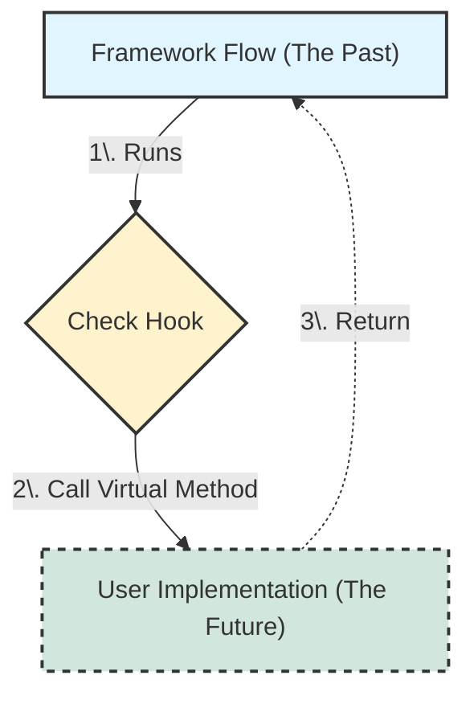

## 1. 서론: 코드에도 '시간'이 존재한다

우리가 작성하는 모든 코드에는 보이지 않는 **시점(Timepoint)** 의 차이가 존재한다. 객체지향 프로그래밍(OOP)에서 상속을 이해하는 가장 높은 차원의 관점은 바로 이 '시간'을 이해하는 것이다.

* **과거의 코드 (Framework)**: 프레임워크 개발자가 수년 전에 미리 작성해 둔 코드. (예: Spring, JUnit, JDK 라이브러리)
* **미래의 코드 (Application)**: 오늘 우리가 비즈니스 요구사항을 맞추기 위해 작성하는 코드.

일반적인 절차지향 프로그래밍에서는 '미래(나)'가 '과거(라이브러리)'를 가져다 쓴다. 하지만 프레임워크 기반의 개발에서는 **'과거'가 '미래'를 호출하는 기현상**이 발생한다. 우리는 이것을 **제어 역전(IoC, Inversion of Control)** 이라 부른다.

## 2. 제어 역전(IoC)과 할리우드 원칙

### 2.1 라이브러리 vs 프레임워크

이 개념을 명확히 하기 위해 자주 사용되는 비유가 있다.

* **라이브러리 (Library)**: **망치**와 같다. 목수(개발자)가 필요할 때 망치를 들고 못을 박는다. 제어권은 '나'에게 있다.
* **프레임워크 (Framework)**: **비행기**와 같다. 기장(프레임워크)이 이륙과 착륙, 비행 항로를 모두 결정한다. 승객(개발자)은 기장이 안내방송(Hook Method)을 할 때만 정해진 행동(안전벨트 착용)을 한다. 제어권은 '비행기'에게 있다.

### 2.2 할리우드 원칙 (The Hollywood Principle)

오디션을 보러 간 배우에게 심사위원은 이렇게 말한다.

> *"우리한테 연락하려고 하지 마세요. 우리가 당신에게 연락할게요. (Don't call us, we'll call you.)"*

이것이 프레임워크의 핵심 철학이다. 프레임워크는 거대한 흐름(Lifecycle)을 미리 만들어 두고, 개발자가 끼어들어야 할 **틈새(Slot)** 만 열어둔다. 개발자는 그 틈새에 자신의 로직을 끼워 넣고 기다리면 된다.

## 3. 동작 메커니즘: 과거가 미래를 호출하는 법

어떻게 수년 전에 컴파일된 `jar` 파일(부모 클래스)이, 오늘 방금 작성해서 컴파일한 내 클래스(자식 클래스)의 메서드를 알고 호출할 수 있을까?



### 3.1 런타임의 마법: 동적 바인딩 (Dynamic Binding)

컴파일 시점(Compile-time)에 프레임워크는 여러분의 클래스를 모른다. 하지만 **런타임(Runtime)** 이 되면 이야기가 달라진다.

1. 메모리(Heap)에 여러분이 만든 자식 객체(`Child`)가 생성된다.
2. 이 객체는 자신의 메서드 주소들을 담은 목록표인 **가상 메서드 테이블(vtable)** 을 들고 있다.
3. 프레임워크 코드가 실행되다가 오버라이딩된 메서드(`hook()`)를 만나면, JVM에게 묻는다. *"지금 실행 중인 이 객체의 vtable에서 `hook`이 가리키는 주소가 어디지?"*
4. JVM은 자식 객체의 vtable을 확인하고, **재정의된 최신 메서드(미래의 코드)** 로 실행 흐름을 점프시킨다.

> **Deep Dive: `abstract` vs `protected` (강제와 선택)**
> 
> 프레임워크는 개발자의 참여 수준을 두 가지로 조절한다.
> * **`abstract` 메서드**: "이 부분은 미래에 네가 **반드시** 채워 넣어야 해. 안 그러면 실행 못 해." (강제성)
> * **`protected` (Hook) 메서드**: "이 부분은 내가 기본 동작을 해뒀는데, 마음에 안 들면 네가 **바꿔도 돼**." (선택성)
{: .prompt-info }

---

## 4. 실무 패턴: 템플릿 메서드 (Template Method)

위의 개념이 코드 레벨로 구체화된 디자인 패턴이다. **"변하지 않는 뼈대(Template)"** 와 **"변하는 내용"** 을 분리한다.

### 4.1 시나리오: 배치 파일 처리기

수만 건의 데이터를 읽어서 처리하는 배치를 만든다고 가정하자. 파일 열기, 예외 처리, 리소스 반환은 지겨운 반복(Boilerplate)이다. 이를 프레임워크화 해보자.

### 4.2 Framework (과거의 코드)

```java
public abstract class BatchProcessor {

    // [Template Method]
    // 전체 알고리즘의 뼈대를 정의한다. 
    // final로 막아서 하위 클래스가 흐름 전체를 뒤집는 것을 방지한다.
    public final void run() {
        try {
            System.out.println("[Framework] 초기화 작업 수행...");
            onInitialize(); // Hook (선택)

            System.out.println("[Framework] 데이터 로딩...");
            loadData(); // Private (내부 동작)

            System.out.println("[Framework] 데이터 가공 시작...");
            doProcess(); // Abstract (필수)

        } catch (Exception e) {
            onError(e); // Hook (선택 - 에러 핸들링 위임)
        } finally {
            System.out.println("[Framework] 리소스 정리...");
            onComplete(); // Hook (선택)
        }
    }

    // 필수 구현 (개발자가 구체적인 가공 로직을 짜야 함)
    protected abstract void doProcess();

    // Hook 메서드 (필요하면 오버라이딩 하세요)
    protected void onInitialize() {} 
    protected void onComplete() {}
    protected void onError(Exception e) {
        System.err.println("기본 에러 처리: " + e.getMessage());
    }
    
    private void loadData() { /* 공통 데이터 로딩 로직 */ }
}
```

### 4.3 Implementation (미래의 코드)

개발자는 복잡한 `try-catch`나 초기화 순서를 신경 쓰지 않고, 오직 **비즈니스 로직**에만 집중한다.

```java
public class DailySalesBatch extends BatchProcessor {

    // [필수] 구체적인 작업 내용 정의
    @Override
    protected void doProcess() {
        System.out.println(">> [Dev] 일일 매출 데이터를 집계합니다.");
        // 비즈니스 로직...
    }

    // [선택] 초기화 시점에 끼어들기
    @Override
    protected void onInitialize() {
        System.out.println(">> [Dev] DB 연결을 확인합니다.");
    }
    
    // [선택] 에러 처리 방식을 변경
    @Override
    protected void onError(Exception e) {
        System.out.println(">> [Dev] 슬랙(Slack)으로 관리자에게 알림 전송!");
    }
}
```

### 4.4 실행 (Main)

```java
public class Main {
    public static void main(String[] args) {
        // 프레임워크 타입으로 선언하지만, 실제 인스턴스는 개발자의 구현체다.
        BatchProcessor batch = new DailySalesBatch();
        
        // 개발자는 단순히 '실행(run)'만 시킨다. 
        // 실제로는 프레임워크가 내부적으로 onInitialize -> doProcess 등을 호출한다.
        batch.run();
    }
}
```

## 5. 핵심 요약

1. **시점의 분리**: 상속은 단순한 코드 복사가 아니다. **과거(부모)가 설계한 흐름 위에 미래(자식)의 코드를 태우는 시간 여행**이다.
2. **제어 역전(IoC)**: 내가 코드를 호출하는 것이 아니라, 프레임워크가 나를 호출한다(Called by Framework). 이를 통해 개발자는 반복적인 제어 흐름에서 해방된다.
3. **템플릿 메서드 패턴**: 이 철학을 구현하는 가장 표준적인 방법으로, `final`로 흐름을 고정하고 `abstract`와 `protected`로 자유도를 조절한다.

> **Tip:** Spring의 `Bean` 생명주기(`@PostConstruct`, `@PreDestroy`)나 React의 `useEffect` 같은 개념도 넓게 보면 이 '시점'과 '제어 역전'의 원리를 따르고 있다. "언제 불릴지는 프레임워크가 정한다. 너는 무엇을 할지만 적어라."
{: .prompt-tip }

## 💡 Quiz: 개념 점검

**Q1. '라이브러리'와 '프레임워크'를 구분하는 가장 결정적인 차이점(키워드)은 무엇인가?**

<details>
<summary>정답 확인</summary>
<div>
<strong>제어의 흐름(Flow of Control)</strong>이다. 라이브러리는 개발자가 흐름을 제어하지만, 프레임워크는 프레임워크 자체가 흐름을 제어하고 개발자의 코드를 호출한다(IoC).
</div>
</details>

**Q2. 템플릿 메서드 패턴에서 상위 클래스의 로직 흐름(알고리즘 구조)이 하위 클래스에 의해 무분별하게 변경되는 것을 막기 위해 사용하는 자바 키워드는?**

<details>
<summary>정답 확인</summary>
<div>
<code>final</code>이다. (예: <code>public final void process() { ... }</code>)
</div>
</details>