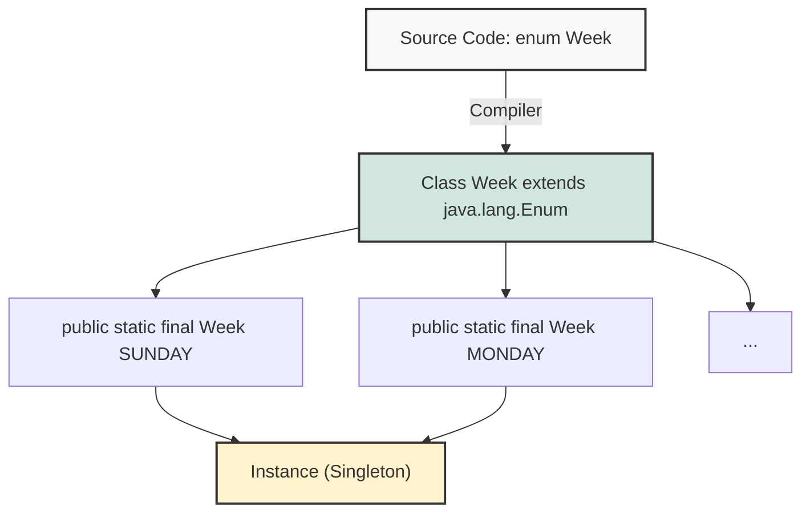

## 1. 개요

자바 프로그래밍에서 상수를 정의할 때 가장 전통적인 방식은 `public static final` 키워드를 사용하는 것이었다. 그러나 이 방식은 상수의 집합을 관리하거나 컴파일 시점의 타입 체크를 엄격하게 수행하는 데 한계가 있다.

Java 1.5부터 도입된 **열거형(Enumeration, 이하 Enum)**은 서로 연관된 상수들의 집합을 정의하는 문법이다. 겉보기에는 단순한 키워드처럼 보이지만, 내부적으로는 `java.lang.Enum` 클래스를 상속받는 **특수한 클래스**로 동작한다[^1]. 이를 통해 코드의 가독성을 높이고, 유지보수성을 강화하며, 강력한 타입 안전성을 제공한다.

## 2. 아키텍처 및 내부 동작 원리

Enum은 컴파일 시점에 일반적인 클래스로 변환된다. 개발자가 `enum` 키워드를 사용하여 정의하면, 컴파일러는 이를 확장하여 각 상수를 `public static final` 필드로 변환한다.



### 2.1 Enum의 특징

1. **타입 안전성 (Type Safety)**: 정해진 상수 외의 값(예: 임의의 정수)을 할당하려 하면 컴파일 에러가 발생한다.
2. **클래스 기반**: 내부적으로 클래스이므로 필드, 생성자, 메서드를 가질 수 있다.
3. **싱글톤 (Singleton)**: 각 상수는 JVM 내에서 유일한 인스턴스임이 보장된다.

> **Deep Dive: Enum과 메모리 구조**
> 
> Enum 상수는 `static final` 필드로 선언되므로, 클래스 로딩 시점에 **Method Area(또는 Metaspace)** 에 메타 정보가 올라가고, 실제 인스턴스는 **Heap** 영역에 생성된다. 각 상수는 애플리케이션 전역에서 유일한 객체(Singleton)로 존재하므로 `==` 연산자를 통한 참조 비교가 가능하다. 이는 `equals()` 메서드보다 `NullPointerException`에서 안전하며 속도가 빠르다.
{: .prompt-info }

## 3. 핵심 기능 및 메서드

`java.lang.Enum` 클래스는 모든 Enum의 부모 클래스이며, 다음과 같은 핵심 메서드들을 제공한다.

### 3.1 주요 메서드 명세

| 메서드 | 설명 | 반환 타입 |
| --- | --- | --- |
| `ordinal()` | 상수가 정의된 순서(인덱스)를 반환한다. (0부터 시작) | `int` |
| `name()` | 상수의 이름을 문자열로 반환한다. | `String` |
| `valueOf(String name)` | 문자열과 일치하는 Enum 상수를 반환한다. | `T` |
| `values()` | 정의된 모든 상수를 배열로 반환한다. | `T[]` |

> **위험:** `ordinal()` 메서드는 상수의 정의 순서에 의존한다. 만약 유지보수 과정에서 상수의 순서가 변경되거나 중간에 새로운 상수가 추가되면, 기존 데이터와의 정합성이 깨질 수 있다. 따라서 비즈니스 로직에 `ordinal()` 값을 직접 사용하는 것은 지양해야 한다.
{: .prompt-danger }

## 4. 구현 (Java)

강의에서 언급된 `Action`과 `Week` 예제를 통합하여, 실무적인 형태의 Enum 활용 코드를 작성한다.

### 4.1 기본 선언 및 사용

```java
// 1. 단순한 형태의 Enum 선언
public enum Action {
    MOVE, 
    JUMP, 
    ATTACK, 
    DEFEND
}

public class GameClient {
    public static void main(String[] args) {
        // 타입 안전성: Action 타입 변수에는 Action에 정의된 상수만 대입 가능
        Action currentAction = Action.MOVE;
        
        // Action wrongAction = 3; // 컴파일 에러 발생 (Type Mismatch)
        
        if (currentAction == Action.MOVE) {
            System.out.println("캐릭터가 이동합니다.");
        }
    }
}

```

### 4.2 주요 메서드 활용 및 반복문

```java
public enum Week {
    SUNDAY, MONDAY, TUESDAY, WEDNESDAY, THURSDAY, FRIDAY, SATURDAY
}

public class EnumMethodDemo {
    public static void main(String[] args) {
        Week today = Week.SUNDAY;

        // 1. name(): 상수의 이름 출력
        System.out.println("Name: " + today.name()); // 출력: SUNDAY

        // 2. ordinal(): 정의된 순서(인덱스) 출력
        System.out.println("Ordinal: " + today.ordinal()); // 출력: 0

        // 3. valueOf(): 문자열로 Enum 객체 찾기
        Week day = Week.valueOf("MONDAY");
        System.out.println("Found: " + day);

        // 4. values(): 모든 상수 순회 (확장 for문)
        System.out.println("=== 요일 목록 ===");
        for (Week w : Week.values()) {
            System.out.println(w.name() + " (" + w.ordinal() + ")");
        }
    }
}

```

> **Tip:** Enum은 `switch` 문과 함께 사용할 때 매우 강력하다. JDK 14부터 도입된 Enhanced Switch 문(`->`)을 사용하면 가독성을 더욱 높일 수 있다.
{: .prompt-tip }

## 5. 결론 및 컨벤션

열거형은 단순한 값을 넘어 관련된 상수들을 그룹화하고, 컴파일 타임에 타입 체크를 수행하여 **방어적 코딩**을 가능하게 한다. 실무에서는 다음과 같은 컨벤션을 고려해야 한다.

1. **일관성**: 팀 내에서 상수를 정의할 때 Enum 사용 규칙을 정립한다.
2. **명명 규칙**: 상수는 대문자와 언더스코어(`_`)를 사용하는 `UPPER_SNAKE_CASE`를 따른다.
3. **확장성**: `ordinal()` 값보다는 내부 필드를 두어 별도의 코드값(Code)을 관리하는 것이 안전하다.

---

## 💡 Quiz: 학습 내용 확인하기

**Q1. `enum` 키워드로 정의된 타입이 상속받는 부모 클래스는 무엇인가?**

<details>
<summary>정답 확인</summary>
<div>
java.lang.Enum 클래스입니다.
</div>
</details>

**Q2. Enum 상수의 순서값을 반환하는 메서드는 무엇이며, 이를 비즈니스 로직에 사용할 때의 주의점은?**

<details>
<summary>정답 확인</summary>
<div>
ordinal() 메서드입니다. 이 값은 상수가 선언된 순서에 따라 0부터 부여되는데, 중간에 상수가 추가되거나 순서가 바뀌면 기존 데이터와 불일치할 수 있으므로 로직에 직접 사용하는 것은 위험합니다.
</div>
</details>

**Q3. Enum 타입 변수에 해당 Enum에 정의되지 않은 정수값(예: 3)을 직접 대입할 수 있는가?**

<details>
<summary>정답 확인</summary>
<div>
아니요, 불가능합니다. Enum은 강력한 타입 체크를 지원하므로, 정의된 열거형 상수 이외의 값은 대입할 수 없으며 컴파일 에러가 발생합니다.
</div>
</details>

[^1]:자바의 모든 Enum은 컴파일 시 자동으로 `java.lang.Enum` 클래스를 상속받는다. 자바는 다중 상속을 지원하지 않으므로, Enum은 다른 클래스를 상속받을 수 없다(인터페이스 구현은 가능).