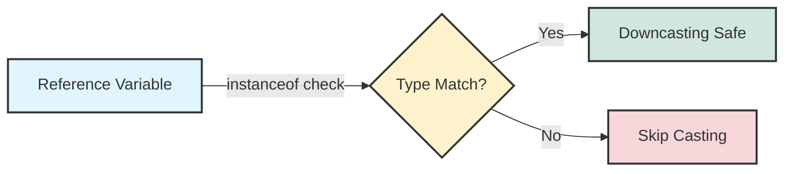
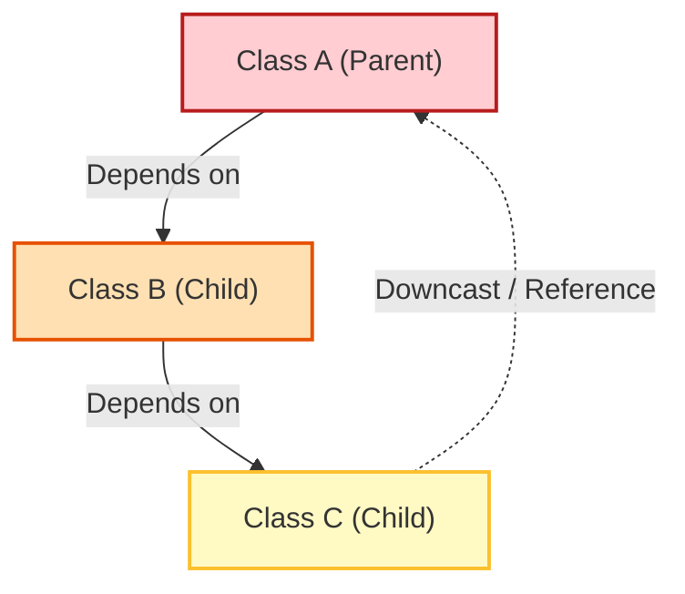

## 1. 개요

객체지향 프로그래밍(OOP)에서 다형성(Polymorphism)은 코드의 유연성을 보장하는 핵심 요소다. 자식 클래스의 인스턴스를 부모 타입의 참조 변수로 다루는 것을 **업캐스팅(Upcasting)** 이라 하며, 이는 별도의 연산자 없이 자연스럽게 이루어진다.

반대로, 부모 타입의 참조 변수가 가리키는 실제 인스턴스의 하위 타입 기능을 사용하기 위해 타입을 명시적으로 변환하는 것을 **다운캐스팅(Downcasting)** 이라 한다. 하지만 다운캐스팅은 타입 안정성을 깨뜨릴 위험이 있으며, 잘못된 설계의 신호일 수 있으므로 주의 깊게 다워야 한다.

## 2. 다운캐스팅과 RTTI (Runtime Type Information)

다운캐스팅은 개발자가 컴파일러에게 "내가 이 객체의 실제 타입을 알고 있으니 변환을 허용해달라"고 강제하는 행위다. 만약 실제 메모리에 생성된 객체가 변환하려는 타입과 다를 경우 런타임에 심각한 오류가 발생한다.

### 2.1 동작 원리 및 위험성

```java
Parent p = new Child(); // 업캐스팅 (안전)
Child c = (Child) p;    // 다운캐스팅 (명시적 형변환 필요)

```

만약 `p`가 `Child`가 아닌 다른 타입(예: `Monkey`)의 인스턴스를 가리키고 있는데 `Child`로 강제 변환을 시도하면 **`ClassCastException`** 이 발생한다. 이를 방지하기 위해 자바는 실행 시간에 객체의 타입을 검사할 수 있는 메커니즘인 **RTTI(Runtime Type Information)**[^1]를 제공한다.

> **위험:** 다운캐스팅 실패 시 발생하는 `ClassCastException`은 **Unchecked Exception(RuntimeException)** 이다. 적절한 예외 처리가 없다면 애플리케이션이 즉시 종료될 수 있다.
{: .prompt-danger }

### 2.2 안전한 형변환을 위한 `instanceof`

`instanceof` 연산자는 레퍼런스 변수가 가리키는 실제 객체가 특정 클래스(또는 인터페이스)의 인스턴스인지 확인하여 `boolean` 값을 반환한다.



> **Deep Dive: JVM의 `instanceof`와 `checkcast` 동작 원리**
> 
> 자바 소스 코드를 컴파일하면 바이트코드 레벨에서 `instanceof`와 `checkcast` 명령어로 변환된다.
> 1. **Object Layout**: 힙 메모리에 생성된 모든 자바 객체는 헤더(Header)에 **Mark Word**와 **Klass Pointer**를 가진다.
> 2. **Klass Pointer**: 이 포인터는 해당 객체가 어떤 클래스의 인스턴스인지 가리키는 메타데이터(Metaspace) 주소를 담고 있다.
> 3. **Type Checking**: `instanceof` 연산이 실행되면, JVM은 객체 헤더의 Klass Pointer를 따라가 실제 클래스 정보를 확인하고, 상속 계층 구조(Inheritance Hierarchy)를 순회하며 타입 일치 여부를 고속으로 판단한다. C++의 RTTI보다 오버헤드가 적도록 최적화되어 있다.
{: .prompt-info }

## 3. 아키텍처 관점: 다운캐스팅과 순환 의존성(Circular Dependency)

다운캐스팅 기능 자체는 필요악(Necessary Evil)이지만, 이를 남용하면 심각한 설계 결함을 초래할 수 있다. 강사는 특히 **부모 클래스에서 자식 클래스로의 다운캐스팅**이 빈번한 경우를 경계해야 한다고 강조한다.

### 3.1 의존성 역전과 유지보수 지옥

일반적인 상속 구조에서 **자식(Child)은 부모(Parent)에게 의존**한다. 부모가 없으면 자식도 존재할 수 없기 때문이다. 그러나 부모 클래스 내부 로직이나 부모를 다루는 코드에서 특정 자식 타입을 알려고 시도(다운캐스팅)하는 순간, **부모가 자식에게 의존**하는 역전 현상이 발생한다.

이러한 잘못된 설계는 컴포넌트 간의 **순환 의존성(Circular Dependency)** 을 유발한다.



* **문제점**: A를 수정했더니 B에서 에러가 발생하고, B를 고쳤더니 C에서 터지고, C를 고치니 다시 A가 망가지는 무한 루프에 빠지게 된다.
* **해결책**: 다운캐스팅을 사용해야만 하는 상황인지 재고해야 한다. 대부분의 경우 오버라이딩(Overriding)을 통한 다형성으로 해결 가능하다.

> **Tip:** Java 14부터 도입된 **Pattern Matching for instanceof**를 사용하면 캐스팅 코드를 간소화할 수 있다.
> `if (obj instanceof String s) { ... }` 형태로 검사와 선언을 동시에 수행하여 가독성을 높인다.
{: .prompt-tip }

## 4. 구현 (Java Code)

도형(Shape)을 예제로 하여 안전한 다운캐스팅과 RTTI 활용법을 구현해 본다.

```java
// 1. 추상 기반 클래스
abstract class Shape {
    abstract void draw();
}

// 2. 구체적인 구현 클래스 A
class Rectangle extends Shape {
    @Override
    void draw() {
        System.out.println("Draw Rectangle");
    }
    
    // Rectangle만의 고유 기능
    void drawAngles() {
        System.out.println("Rectangle has 4 angles.");
    }
}

// 3. 구체적인 구현 클래스 B
class Triangle extends Shape {
    @Override
    void draw() {
        System.out.println("Draw Triangle");
    }
}

public class Main {
    public static void main(String[] args) {
        // 다형성을 이용한 업캐스팅
        Shape myShape = getShapeFromUserInput(); 

        // 공통 기능은 다형성으로 처리
        myShape.draw();

        // [RTTI 활용] 특정 타입(Rectangle)일 때만 고유 기능 사용
        // 다운캐스팅 전 반드시 instanceof로 검증해야 함
        if (myShape instanceof Rectangle) {
            // 명시적 다운캐스팅
            Rectangle rect = (Rectangle) myShape;
            rect.drawAngles();
        } else {
            System.out.println("This shape is not a Rectangle.");
        }
    }

    // 랜덤하게 Shape의 구현체를 반환하는 팩토리 메서드 가정
    static Shape getShapeFromUserInput() {
        return Math.random() > 0.5 ? new Rectangle() : new Triangle();
    }
}

```

## 💡 Quiz: 학습 내용 확인하기

**Q1. 부모 클래스가 자식 클래스를 다운캐스팅하여 구체적인 타입에 의존하게 될 때 발생하는 설계상의 주요 문제는 무엇인가?**

<details>
<summary>정답 확인</summary>
<div>
의존성 순환(Circular Dependency) 문제가 발생합니다. 이로 인해 한 클래스의 수정이 연쇄적인 오류를 유발하여 유지보수를 어렵게 만듭니다.
</div>
</details>

**Q2. `instanceof` 연산자를 사용하지 않고 잘못된 타입으로 강제 다운캐스팅을 시도할 때 발생하는 런타임 예외는?**

<details>
<summary>정답 확인</summary>
<div>
java.lang.ClassCastException
</div>
</details>

**Q3. RTTI(Runtime Type Information)란 무엇인가?**

<details>
<summary>정답 확인</summary>
<div>
프로그램 실행 시간(Runtime)에 객체의 실제 타입 정보를 식별하거나 확인하는 기술을 의미합니다. Java에서는 instanceof 연산자가 이를 수행합니다.
</div>
</details>

---

[^1]:**RTTI (Runtime Type Information)**: 프로그램 실행 중에 변수의 실제 데이터 타입을 식별하는 메커니즘. C++ 등에서 유래된 용어이나 Java에서도 `instanceof`나 `Reflection` 등을 설명할 때 사용된다.