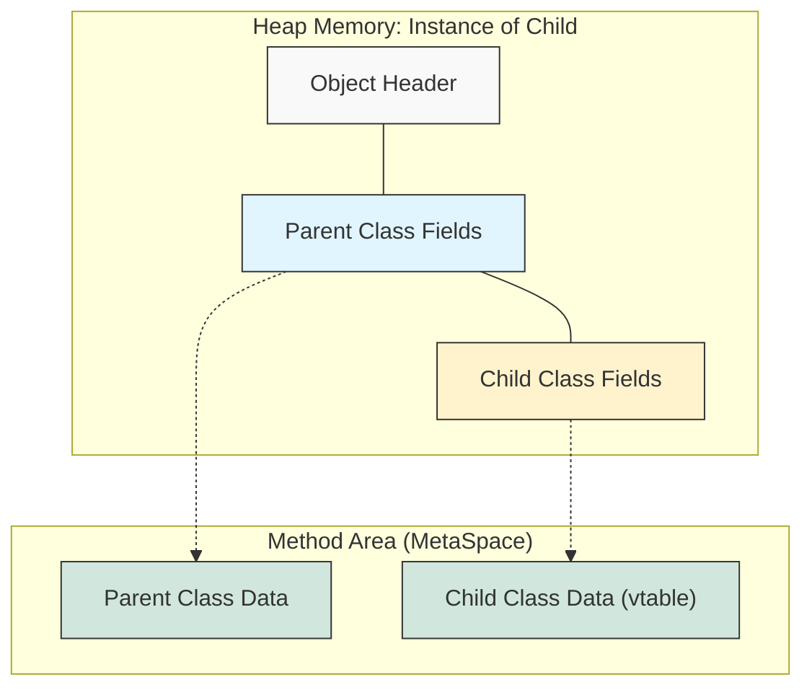

## 1. 개요

객체지향 프로그래밍(OOP)에서 다형성(Polymorphism)은 코드의 유연성과 확장성을 보장하는 가장 핵심적인 메커니즘이다. 사전적 의미로는 '같은 종임에도 형태나 형질이 다양하게 나타나는 현상'을 뜻하지만, 소프트웨어 공학에서는 **"상위 수준의 인터페이스를 통해 하위 구현체의 구체적인 동작을 제어하는 기술"** 로 정의할 수 있다.

다형성이 단순한 문법적 특징을 넘어, 시스템의 유지보수성을 어떻게 향상시키는지, 그리고 JVM 메모리 레벨에서 어떤 방식으로 동작하는지 알아보자.

## 2. 추상화(Abstraction)와 일반화

다형성을 이해하기 위한 선행 조건은 **추상화**다. 추상화란 복잡한 내부 구현을 숨기고, 사용자에게 필요한 단순화된 인터페이스(Interface)만을 노출하는 과정이다.

### 2.1 개념적 접근

'변호사'의 예시를 들어 추상화를 이해해보자.

* **의뢰인(Client)**: 복잡한 법률 지식을 알 필요가 없다. "변호한다"라는 추상화된 행위만 요청하면 된다.
* **변호사(Abstraction Layer)**: 법률적 복잡성을 캡슐화하여 의뢰인에게 '법적 보호'라는 추상성을 제공한다.

프로그래밍 관점에서 이를 **일반화(Generalization)** 라고도 한다. 여러 구체적인 객체(Zealot, Dragoon)의 공통적인 특징(체력, 이동, 공격)을 뽑아내어 상위 클래스(Unit)로 정의하는 과정이다. 이를 통해 개발자는 개별 객체의 디테일 대신, **일반화된 상위 타입**을 기준으로 시스템을 설계할 수 있다.

## 3. 상속 구조와 메모리 레이아웃 (Memory Layout)

다형성은 주로 **상속(Inheritance)**을 통해 구현된다. 자식 클래스가 부모 클래스를 상속받을 때, 메모리 상에서는 어떤 일이 일어날까?



자식 클래스(`Child`)의 인스턴스를 생성(`new Child()`)하면, 힙 메모리에는 **부모 클래스(`Parent`)의 필드 정보가 포함된 상태**로 공간이 할당된다. 즉, 자식 객체 내부에는 부모 객체의 정보가 내포되어 있다. 이 구조 덕분에 자식 객체는 언제든지 부모 타입으로 취급(Upcasting)될 수 있다.

> **Deep Dive: 가상 메서드 테이블 (vtable)**
> 
> 다형성의 핵심인 **메서드 오버라이딩(Overriding)** 은 런타임에 어떻게 동작할까? 컴파일 시점이 아닌 실행 시점에 실제 호출할 메서드를 결정하는 것을 **동적 바인딩(Dynamic Binding)** 이라 한다.
> JVM은 이를 효율적으로 처리하기 위해 각 클래스 정보를 저장하는 Method Area에 **가상 메서드 테이블(vtable)** 을 유지한다. 자식 클래스가 메서드를 재정의하면, vtable의 해당 메서드 주소가 자식 클래스의 메서드 주소로 갱신된다. 따라서 부모 타입으로 참조하더라도, vtable을 참조하여 실제 자식 객체의 오버라이딩된 메서드가 실행된다.
{: .prompt-info }

## 4. 타입 변환: Upcasting & Downcasting

상속 관계에 있는 클래스 간에는 형 변환(Type Casting)이 가능하다.

### 4.1 Upcasting (업캐스팅)

하위 클래스의 인스턴스를 상위 클래스 타입의 변수에 할당하는 것이다.

* **특징**: 항상 안전하며, 묵시적(Implicit)으로 수행된다.
* **원리**: 자식 객체는 이미 부모의 모든 멤버를 가지고 있기 때문에, 부모 타입으로 바라보더라도 데이터 소실이나 접근 오류가 발생하지 않는다.

```java
// Parent p = new Child();
Object obj = new String("Hello"); // String은 Object의 자식이다.
```

### 4.2 Downcasting (다운캐스팅)

상위 클래스 타입으로 참조되고 있는 객체를 다시 원래의 하위 클래스 타입으로 변환하는 것이다.

* **특징**: 항상 안전하지 않으며, 명시적(Explicit)인 캐스팅 연산자가 필요하다.
* **위험성**: 실제 메모리에 생성된 객체가 해당 하위 타입이 아닐 경우 런타임 에러가 발생한다.

```java
Object obj = new String("Hello");
String str = (String) obj; // 성공: 실제 객체가 String임

Object obj2 = new Object();
String str2 = (String) obj2; // 실패: Runtime Exception 발생
```

> **위험:** 잘못된 Downcasting은 컴파일 타임에는 감지되지 않으며, 런타임에 `ClassCastException`을 발생시켜 프로세스를 비정상 종료시킬 수 있다. 반드시 `instanceof` 연산자로 타입을 확인한 후 수행해야 한다.
{: .prompt-danger }

## 5. 모든 클래스의 조상: java.lang.Object

Java의 모든 클래스는 명시적으로 상속받지 않더라도, 컴파일러에 의해 자동으로 `java.lang.Object`를 상속받게 된다[^1].

### 5.1 JVM 관점에서의 Object

JVM 입장에서 개발자가 새로 정의할 클래스의 이름을 미리 알 수 없다. 하지만 JVM은 모든 객체를 관리해야 한다. 이 딜레마를 해결하기 위해 모든 클래스는 `Object`의 파생 클래스로 규정된다.
즉, **JVM은 모든 객체를 `Object` 타입으로 참조하고 관리**할 수 있게 되며, 이는 Java 메모리 관리와 GC(Garbage Collection)의 기반이 된다.

## 6. 구현 (Java)

다형성을 활용하여 `Unit`이라는 추상화된 계층을 통해 구체적인 유닛(`Zealot`, `Dragoon`)을 일괄 제어하는 예제다.

```java
// 1. 추상화된 상위 클래스
abstract class Unit {
    protected int hp;

    public Unit(int hp) {
        this.hp = hp;
    }

    // 모든 유닛은 이동할 수 있어야 한다 (추상화)
    public abstract void move(int x, int y);
    
    // 공통 기능
    public void stop() {
        System.out.println("유닛이 멈춥니다.");
    }
}

// 2. 구체화된 파생 클래스 (Zealot)
class Zealot extends Unit {
    public Zealot() { super(100); } // 부모 생성자 호출

    @Override
    public void move(int x, int y) {
        System.out.println("Zealot이 두 발로 뛰어갑니다. 좌표: " + x + "," + y);
    }
    
    public void charge() {
        System.out.println("돌진 스킬 사용!");
    }
}

// 3. 구체화된 파생 클래스 (Dragoon)
class Dragoon extends Unit {
    public Dragoon() { super(120); }

    @Override
    public void move(int x, int y) {
        System.out.println("Dragoon이 네 발로 걸어갑니다. 좌표: " + x + "," + y);
    }
}

// 4. 다형성 활용 (Main)
public class GameEngine {
    public static void main(String[] args) {
        // Upcasting: 구체적인 유닛을 일반적인 Unit으로 참조
        Unit u1 = new Zealot();
        Unit u2 = new Dragoon();

        // 다형적 호출: 코드는 같지만(unit.move), 실제 동작은 객체에 따라 다르다.
        controlUnit(u1);
        controlUnit(u2);
    }

    // 매개변수의 다형성: 어떤 Unit의 파생 클래스가 오더라도 처리 가능
    public static void controlUnit(Unit unit) {
        unit.move(10, 20); // Dynamic Binding 발생
        
        // Downcasting 예시
        if (unit instanceof Zealot) {
            Zealot z = (Zealot) unit; // 명시적 형변환
            z.charge(); // Zealot 고유 기능 사용
        }
    }
}

```

### 코드 분석

1. **확장성**: 새로운 유닛(예: `HighTemplar`)이 추가되더라도 `controlUnit` 메서드의 코드를 수정할 필요가 없다. (OCP 원칙[^2])
2. **안전성**: `instanceof`를 사용하여 `Zealot`일 경우에만 안전하게 Downcasting하여 고유 스킬을 사용했다.

---

## 💡 Quiz: 학습 내용 확인하기

**Q1. 자식 클래스 인스턴스를 부모 타입의 변수에 대입하는 것을 무엇이라 하며, 그 안전성은 어떠한가?**

<details>
<summary>정답 확인</summary>
<div>
Upcasting(업캐스팅)이라 하며, 자식 객체 내부에 부모 객체의 정보가 모두 포함되어 있으므로 항상 안전하고 묵시적으로 수행된다.
</div>
</details>

**Q2. Java에서 모든 클래스의 최상위 부모 클래스는 무엇이며, 이를 통해 JVM이 얻는 이점은?**

<details>
<summary>정답 확인</summary>
<div>
java.lang.Object 클래스이다. JVM은 모든 객체를 Object 타입으로 참조할 수 있게 되어, 구체적인 클래스 타입을 몰라도 객체 관리(GC 등)와 공통 메서드(toString, clone 등) 호출이 가능해진다.
</div>
</details>

**Q3. Downcasting 시 발생할 수 있는 런타임 예외는 무엇이며, 이를 방지하기 위한 연산자는?**

<details>
<summary>정답 확인</summary>
<div>
ClassCastException이 발생할 수 있다. 이를 방지하기 위해 instanceof 연산자를 사용하여 실제 객체의 타입을 확인한 후 형 변환을 수행해야 한다.
</div>
</details>

---

[^1]:`extends` 키워드가 없는 경우 컴파일러가 자동으로 `extends Object`를 추가한다.

[^2]:OCP(Open-Closed Principle): 개방-폐쇄 원칙. 확장에는 열려 있어야 하고, 변경에는 닫혀 있어야 한다.