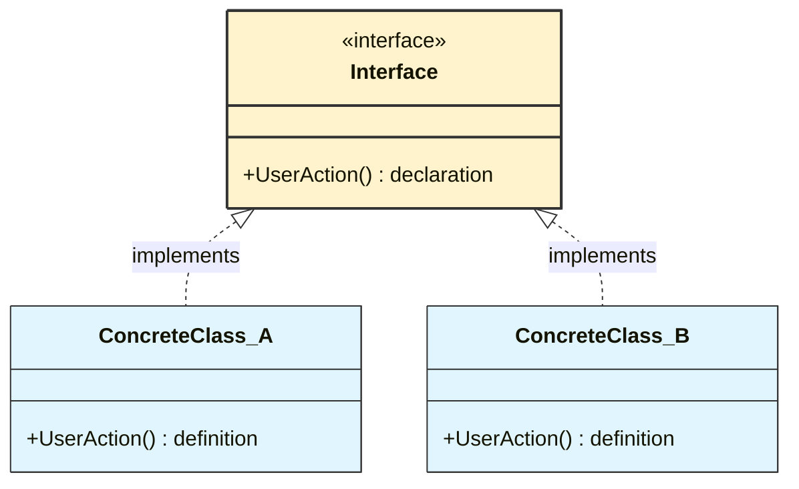
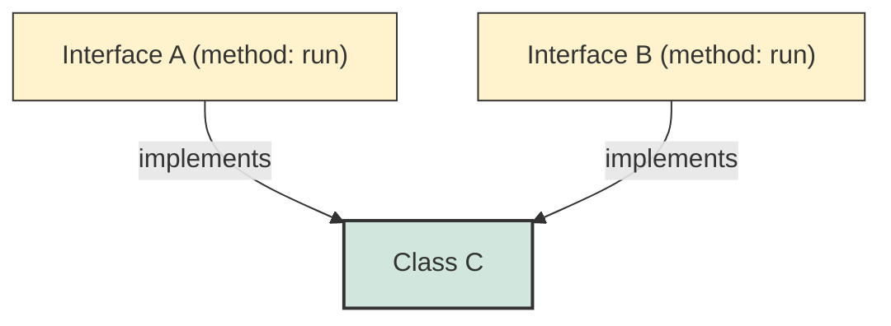
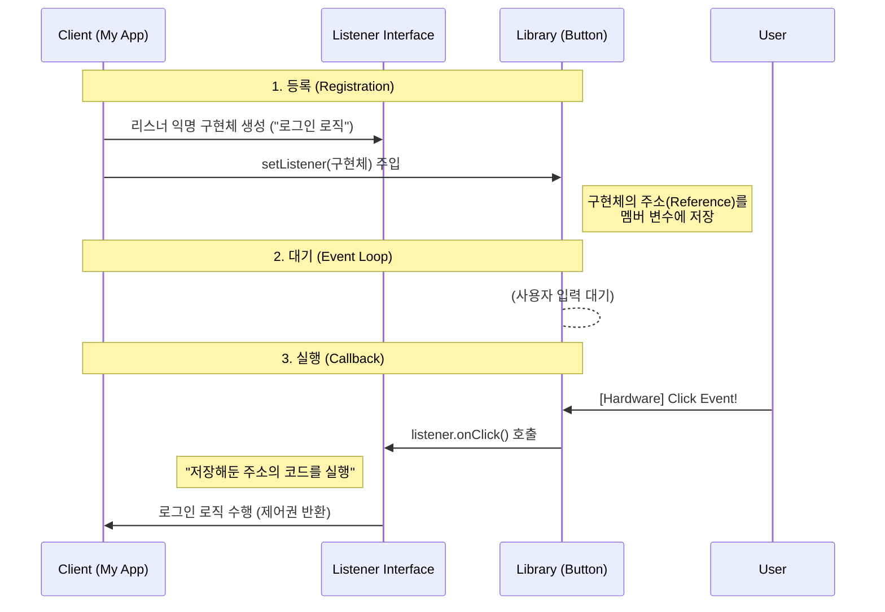

## 1. 개요: 껍데기뿐인 클래스의 미학

추상 클래스(`abstract class`)가 '미완성된 설계도'라면, **인터페이스(`interface`)는 완벽하게 비어 있는 '규격(Protocol)'** 이다.
Java는 C++의 복잡한 다중 상속 문제를 해결하기 위해, 상태(State)와 구현(Implementation)을 완전히 제거한 순수 추상 계층인 인터페이스를 도입했다. 인터페이스의 구조적 특징과 이를 활용한 **이벤트 리스너(Event Listener)** 패턴의 내부 동작 원리를 알아보자.

## 2. 인터페이스의 본질과 메모리 구조

### 2.1 상태(State)의 부재와 상수(Constant)

인터페이스의 가장 강력한 제약이자 특징은 **인스턴스 필드(멤버 변수)를 가질 수 없다**는 점이다.

* **메모리 관점**: 인터페이스를 구현한 객체(Instance)가 힙(Heap)에 생성될 때, 인터페이스에 정의된 필드를 위한 공간은 할당되지 않는다.
* **상수(Constants)**: 유일하게 허용되는 필드는 `public static final`로 선언된 **심볼릭 상수(Symbolic Constant)** 뿐이다. 이는 인스턴스 데이터가 아니라, JVM의 **Method Area(Class Area)** 내부 상수 풀(Constant Pool)에 저장되어 공유된다[^1].

### 2.2 선언(Declaration)과 정의(Definition)의 분리

인터페이스는 철저하게 **선언(Signature)** 에 집중한다.



### 2.3 다이아몬드 문제의 해결과 다중 구현

Java 클래스는 단일 상속(`extends`)만 가능하지만, 인터페이스는 **다중 구현(`implements`)**이 가능하다.



> **Deep Dive: 왜 상태(State)를 금지하는가?**
> 
> 다중 상속 시 발생할 수 있는 **'다이아몬드 문제(Diamond Problem)'**를 원천 차단하기 위함이다. 만약 두 부모 인터페이스가 동일한 이름의 인스턴스 변수를 가진다면, 자식 클래스는 어떤 부모의 변수를 참조해야 할지 모호해진다. Java는 상태 자체를 제거함으로써 충돌 가능성을 없앴다.
{: .prompt-info }

## 3. 실무 Deep Dive: 이벤트 리스너와 콜백 패턴

인터페이스가 실무에서 가장 빛을 발하는 순간은 바로 **이벤트 처리**다. 이 패턴은 "라이브러리 제작자(Google/Samsung)"와 "애플리케이션 개발자(You)" 사이의 **코드를 분리**하기 위해 탄생했다.

### 3.1 문제의 정의: "코드를 미리 알 수 없다"

안드로이드 OS의 `Button` 클래스를 개발하는 구글 엔지니어라고 가정해보자. 전 세계 개발자들이 이 버튼을 눌렀을 때 무슨 동작을 할지 미리 알 수 있을까?

* A 개발자: 로그인 시도
* B 개발자: 음악 재생
* C 개발자: 앱 종료

따라서 `Button` 클래스 내부에는 구체적인 동작(`login()`, `playMusic()`)을 코딩할 수 없다. 대신 **"누군가 동작을 채워 넣어주면, 클릭 시점에 실행해주겠다"**는 약속(Protocol)만 정의해야 한다. 이것이 인터페이스가 필요한 이유다.

### 3.2 콜백(Callback) 아키텍처 시각화

이 과정은 **"나중에 전화해(Call-back)"** 원리로 동작한다.



### 3.3 구현 (Java Code)

위 아키텍처를 실제 코드로 구현하면 다음과 같다. 주석을 통해 각 라인의 역할을 명확히 이해해야 한다.

```java
// 1. 규격(Protocol) 정의: "클릭 시 이 메서드를 호출하겠다"는 약속
interface OnClickListener {
    void onClick(); 
}

// 2. 버튼 클래스 (라이브러리 영역)
class Button {
    // [핵심] 미래에 들어올 동작(구현체)을 담을 그릇 (Reference Holder)
    // 이 변수가 없으면 메인에서 넘겨준 로직을 기억할 수 없다.
    private OnClickListener listener; 

    // 의존성 주입 (Dependency Injection) 메서드
    public void setOnClickListener(OnClickListener listener) {
        this.listener = listener; // 주소를 받아 적어둠
    }

    // 하드웨어 신호가 감지되었을 때 호출되는 메서드
    public void eventOccurred() {
        // 리스너가 등록되어 있다면, 저장된 주소의 메서드를 대신 실행(Delegate)
        if (this.listener != null) {
            this.listener.onClick(); // Callback 발생!
        }
    }
}

// 3. 클라이언트 구현 (애플리케이션 영역)
public class Main {
    public static void main(String[] args) {
        Button loginBtn = new Button();
        
        // 익명 내부 클래스(Anonymous Inner Class)를 통한 즉시 구현
        // 인터페이스는 생성이 불가능하므로, 구현과 동시에 인스턴스화하여 주입한다.
        loginBtn.setOnClickListener(new OnClickListener() {
            @Override
            public void onClick() {
                // Button 개발자는 몰랐던 "나만의 로직"을 여기에 작성
                System.out.println("로그인 서버에 접속을 시도합니다...");
            }
        });
        
        // (시뮬레이션) 사용자가 버튼을 클릭함
        loginBtn.eventOccurred();
    }
}

```

> **Tip: 현실 비유 (피자 주문)**
> 
> 이 패턴은 피자 주문 과정과 정확히 일치한다.
> * **Button (피자 가게)**: 언제 피자가 완성될지 모름. 손님을 계속 기다리게 할 수 없음.
> * **Interface (주문서)**: 전화번호를 적는 란이 있음 (규격).
> * **Main (손님)**: "피자가 완성되면 제 번호로 전화주세요"라고 요청(`setListener`).
> * **Callback**: 피자가 완성되면 가게 주인이 적어둔 번호로 전화를 거는 행위(`listener.onClick()`).
{: .prompt-tip }
> 
> 

## 4. 패턴의 핵심 가치: 제어의 역전 (IoC)

이 패턴을 사용함으로써 얻는 이점은 단순한 코드 분리가 아니다.

1. **완벽한 분리 (Decoupling)**: `Button` 클래스는 `Main`의 존재를 전혀 모른다. 오직 인터페이스 규격만 바라본다. 덕분에 버튼 코드를 수정하지 않고도 동작을 무한히 확장할 수 있다.
2. **제어의 역전 (Inversion of Control)**:
* 일반적인 코드는 `Main`이 라이브러리를 호출한다.
* 이 패턴에서는 **라이브러리(Button)가 내 코드(onClick)를 호출**한다.
* 이로써 이벤트 발생 시점에 대한 제어권을 버튼(프레임워크)이 완벽하게 가질 수 있게 된다.


## 5. 요약: 추상 클래스 vs 인터페이스

| 비교 항목 | 추상 클래스 (`abstract class`) | 인터페이스 (`interface`) |
| --- | --- | --- |
| **목적** | 기능의 확장 및 공통 로직 재사용 (Inheritance) | **행위의 표준화 및 규격 정의 (Type Definition)** |
| **관계** | A is a B (자식은 부모의 일종이다) | **A can do B** (A는 B라는 행위를 할 수 있다) |
| **다중 상속** | 불가능 | **가능** (여러 규격 준수 가능) |
| **멤버 변수** | 가질 수 있음 (상태 유지) | **가질 수 없음** (상수만 가능) |
| **유연성** | 강한 결합 (Tight Coupling) | **느슨한 결합 (Loose Coupling)** |

---

## 💡 Quiz: 학습 내용 확인하기

**Q1. 인터페이스 내부에 `int count = 0;`을 선언했다면, 컴파일러는 이를 어떻게 처리하는가?**

<details>
<summary>정답 확인</summary>
<div>
<code>public static final int count = 0;</code>으로 처리한다. 인터페이스는 인스턴스 변수를 가질 수 없으며, 모든 필드는 자동으로 상수가 된다.
</div>
</details>

**Q2. 이벤트 리스너 패턴에서 `Button` 클래스가 구체적인 동작(로그인 등)을 직접 구현하지 않고 인터페이스를 사용하는 이유는?**

<details>
<summary>정답 확인</summary>
<div>
버튼을 사용하는 개발자가 어떤 동작을 원할지 미리 알 수 없기 때문이다. 따라서 동작을 추상화(인터페이스)하여 외부에 구현을 위임(Delegation)함으로써 유연성을 확보하기 위함이다.
</div>
</details>

**Q3. `new OnClickListener() { ... }` 문법의 명칭과 사용 이유는?**

<details>
<summary>정답 확인</summary>
<div>
<strong>익명 내부 클래스(Anonymous Inner Class)</strong>이다. 인터페이스는 직접 인스턴스화할 수 없으므로, 클래스 선언과 동시에 객체를 생성하여 리스너 등록과 같은 일회성 구현에 사용된다.
</div>
</details>

---

[^1]:Java 8 이후 Metaspace 영역으로 변경되었으나, 논리적으로 상수 풀에 저장된다는 개념은 동일하다.