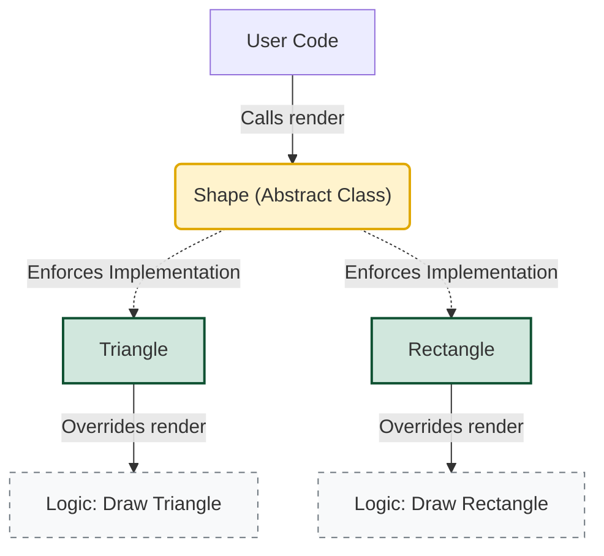

## 1. 개요

일반적인 클래스가 객체를 생성하기 위한 '틀'이라면, **추상 클래스(Abstract Class)** 는 완성되지 않은 설계도와 같다. Java에서는 `abstract` 키워드를 사용하여 선언하며, 스스로 인스턴스(객체)를 생성할 수 없다는 가장 큰 특징을 가진다.

이는 단순한 문법적 제약이 아니라, **"이 클래스는 단독으로 존재할 수 없으며, 반드시 자식 클래스를 통해 완성되어야 한다"** 는 설계적 의도를 내포한다[^1].

## 2. 아키텍처 및 동작 원리

추상 클래스는 상속 구조에서 최상위에 위치하여 공통된 필드와 메서드 시그니처를 정의한다. 핵심은 **추상 메서드(Abstract Method)**의 존재다.

### 2.1 설계 구조 시각화



* **Shape (Abstract)**: `render()` 메서드의 선언만 가지고 있으며, 구체적인 그리기 로직은 없다.
* **Concrete Classes (Triangle, Rectangle)**: 부모가 선언한 `render()`를 반드시 재정의(Override)하여 구체적인 로직을 완성해야 한다.

> **Deep Dive: 가상 메서드 테이블 (vtable)과 늦은 바인딩**
> 
> 컴파일 타임에는 `Shape`의 `render()`가 호출되는 것으로 보이지만, 실제 런타임(Runtime)에는 JVM이 **가상 메서드 테이블(vtable)**을 참조하여 실제 생성된 인스턴스(`Triangle` 또는 `Rectangle`)의 오버라이딩된 메서드를 찾아 호출한다. 이를 **늦은 바인딩(Late Binding)**이라 하며, 다형성(Polymorphism)의 핵심 원리다.
{: .prompt-info }

## 3. 핵심 특징 및 문법

### 3.1 추상 메서드 (Abstract Method)

메서드의 선언부(Signature)만 존재하고 구현부(Body, `{}`)가 없는 메서드다.

* **문법**: `abstract` 키워드를 사용하며 세미콜론(`;`)으로 종료한다.
* **제약**: 추상 메서드를 하나라도 포함하는 클래스는 반드시 추상 클래스로 선언되어야 한다.

### 3.2 구현 강제성 (Contract)

추상 클래스를 상속받은 자식 클래스는 부모의 모든 추상 메서드를 **반드시 재정의(Override)**해야 한다.

* 만약 재정의하지 않는다면, 자식 클래스 또한 추상 클래스(`abstract`)로 선언되어야 한다.
* 이는 개발자에게 **"이 기능을 반드시 구현하라"**는 컴파일 타임의 강력한 제약 조건을 건다.

> **주의:** 추상 클래스는 `new` 연산자를 사용한 직접적인 인스턴스 생성이 불가능하다. 단, 자식 클래스의 생성자 내에서 `super()`를 통해 추상 클래스의 생성자는 호출될 수 있다.
{: .prompt-warning }

## 4. 구현 (Java)

도형(`Shape`)을 추상화하여, 모든 도형이 `render()` 기능을 갖추도록 강제하는 예제다.

```java
// 1. 추상 클래스 선언
abstract class Shape {
    protected String type;

    // 추상 클래스도 생성자를 가질 수 있다. (자식 객체 생성 시 호출됨)
    Shape(String type) {
        this.type = type;
    }

    // [추상 메서드] 선언만 있고 구현({ body })이 없다.
    // 하위 클래스에서 반드시 구현해야 함을 명시.
    abstract void render(); 
    
    // 일반 메서드도 포함 가능
    void commonInfo() {
        System.out.println("이것은 도형입니다: " + type);
    }
}

// 2. 구체 클래스 (Concrete Class) - 삼각형
class Triangle extends Shape {
    Triangle() {
        super("Triangle");
    }

    @Override
    void render() {
        // 추상 메서드 구현 필수
        System.out.println("삼각형을 그립니다. (Base: " + type + ")");
    }
}

// 3. 구체 클래스 (Concrete Class) - 사각형
class Rectangle extends Shape {
    Rectangle() {
        super("Rectangle");
    }

    @Override
    void render() {
        // 추상 메서드 구현 필수
        System.out.println("사각형을 그립니다. (Base: " + type + ")");
    }
}

public class Main {
    public static void main(String[] args) {
        // Shape s = new Shape("Shape"); // [에러] 추상 클래스는 인스턴스화 불가

        // 다형성 활용: 부모 타입으로 자식 인스턴스 참조
        Shape s1 = new Triangle();
        Shape s2 = new Rectangle();

        s1.render(); // Output: 삼각형을 그립니다.
        s2.render(); // Output: 사각형을 그립니다.
        
        s1.commonInfo(); // 일반 메서드 호출 가능
    }
}

```

### 코드 분석

1. **`abstract void render();`**: `Shape` 클래스는 도형이 어떻게 그려질지 알 수 없으므로(미래의 결정 사항), 구현을 자식에게 위임한다.
2. **`super("Triangle")`**: 추상 클래스는 직접 `new` 할 수 없지만, 자식 객체가 생성될 때 부모로서 초기화가 필요하므로 생성자가 실행된다.
3. **컴파일 에러 방지**: `Triangle` 클래스에서 `render`를 구현하지 않으면 컴파일 에러가 발생하여, 개발자가 실수로 구현을 누락하는 것을 방지한다.

## 5. 추상 클래스 vs 인터페이스

Java 8 이후 인터페이스도 `default method`를 가질 수 있게 되면서 역할이 일부 중복되지만, 사용 목적에 명확한 차이가 있다.

| 특징 | 추상 클래스 (Abstract Class) | 인터페이스 (Interface) |
| --- | --- | --- |
| **목적** | 관련된 클래스 간의 **코드 재사용** 및 확장 (IS-A) | 서로 다른 객체 간의 **동작 규격** 정의 (HAS-A) |
| **다중 상속** | 불가능 (단일 상속) | 가능 (다중 구현) |
| **상태(필드)** | 멤버 변수(상태)를 가질 수 있음 | 상수(`static final`)만 가능 |
| **생성자** | 존재함 | 존재하지 않음 |

---

## 💡 Quiz: 학습 내용 확인하기

**Q1. 추상 클래스 내에 추상 메서드가 하나도 없어도 `abstract`로 선언할 수 있는가? 그렇다면 그 이유는 무엇인가?**

<details>
<summary>정답 확인</summary>
<div>
가능하다. 해당 클래스의 인스턴스 생성을 막고, 오직 상속을 통해서만 사용되도록 설계를 강제하고 싶을 때 사용한다.
</div>
</details>

**Q2. 추상 클래스를 상속받은 자식 클래스가 추상 메서드를 구현(Override)하지 않으면 어떻게 되는가?**

<details>
<summary>정답 확인</summary>
<div>
컴파일 에러가 발생한다. 만약 구현하지 않고 남겨두려면, 자식 클래스 또한 abstract 키워드를 붙여 추상 클래스로 선언해야 한다.
</div>
</details>


[^1]:설계 관점에서 '미래에 구현될 기능'에 대한 규약을 미리 정해두는 행위로, 구현을 후손 클래스에게 미루는(delegate) 형태다.