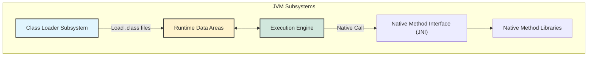
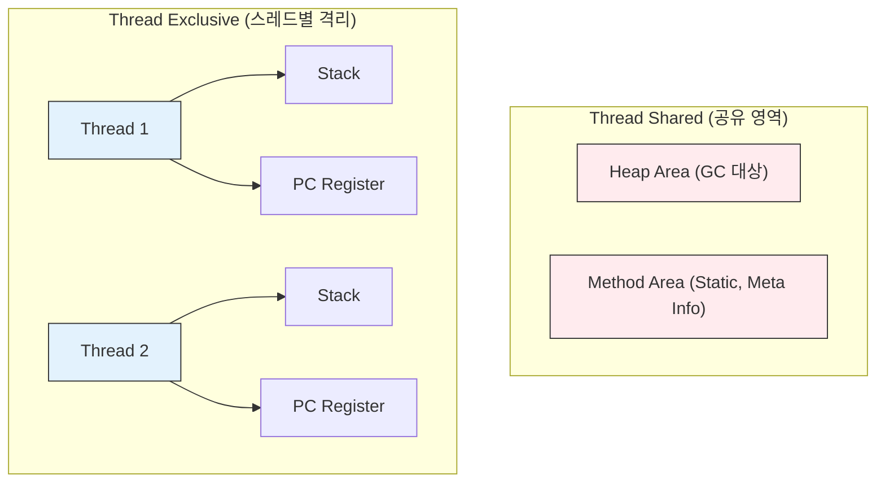

## 1. 개요

Java 애플리케이션이 실행될 때 JVM 내부에서는 복잡한 과정이 일어난다. 이전에는 JVM의 기본 개념을 다뤘다면, 이번에는 JVM을 구성하는 3대 핵심 요소인 **클래스 로더(Class Loader)**, **런타임 데이터 영역(Runtime Data Areas)**, **실행 엔진(Execution Engine)** 의 내부 동작 원리를 조금 더 깊게 알아보자.

개발자가 작성한 `.java` 소스 코드는 컴파일러(`javac`)에 의해 바이트코드(`.class`)로 변환된다. JVM은 이 바이트코드를 운영체제가 이해할 수 있는 기계어(Machine Code)로 번역하고 실행한다. 이 과정에서 메모리 관리와 최적화가 어떻게 수행되는지 이해하는 것은 성능 튜닝과 트러블슈팅의 기본이 된다.

## 2. JVM 핵심 아키텍처

JVM의 전체 구조는 다음과 같이 데이터의 흐름과 제어 영역으로 구분할 수 있다.



### 2.1 클래스 로더 (Class Loader)

클래스 로더는 **런타임(Runtime)** 시점에 클래스를 동적으로 로드하고, 링크(Link)하며, 초기화(Initialization)하는 역할을 담당한다. C++과 같은 네이티브 언어가 링크 타임에 모든 코드를 연결하는 것과 달리, Java는 실행 중에 필요한 클래스를 메모리에 적재한다.

> **Deep Dive: 클래스 로딩의 3단계**
> 
> 1. **Loading**: `.class` 파일을 읽어 바이트코드를 메모리(Method Area)에 적재한다.
> 2. **Linking**:
> * **Verification**: 바이트코드가 JVM 규격을 준수하는지 검증한다.
> * **Preparation**: 정적 변수(static variables)를 위한 메모리를 할당하고 기본값(0, null 등)으로 초기화한다.
> * **Resolution**: 심볼릭 참조(Symbolic Reference)를 다이렉트 참조(Direct Reference)로 변경한다.
> 
> 3. **Initialization**: 정적 초기화 블록(`static {}`)을 실행하고, 정적 변수에 실제 값을 할당한다.
{: .prompt-info }

### 2.2 런타임 데이터 영역 (Runtime Data Areas)

런타임 데이터 영역은 JVM이 프로세스로서 운영체제로부터 할당받은 메모리 공간이다. 이 영역은 **스레드 공유 영역**과 **스레드 격리 영역**으로 나뉜다.



1. **Method Area (메소드 영역)**: 클래스 정보, 필드/메서드 데이터, Static 변수, **Runtime Constant Pool**이 저장된다.
2. **Heap Area (힙 영역)**: `new` 키워드로 생성된 **객체(Instance)와 배열**이 저장된다. **Garbage Collector(GC)** 의 주 관리 대상이다.
3. **Stack Area (스택 영역)**: 메서드 호출 시마다 **스택 프레임(Stack Frame)** 이 생성된다. 지역 변수, 매개변수, 연산 스택이 저장되며 메서드 종료 시 소멸한다.
4. **PC Register**: 현재 스레드가 실행 중인 JVM 명령의 주소를 가리킨다.
5. **Native Method Stack**: 자바 외의 언어(C/C++)로 작성된 네이티브 코드를 실행하기 위한 스택이다.

> **주의:** Stack Area와 PC Register는 스레드마다 별도로 생성되므로, 이 영역에서의 데이터 조작은 동시성 문제(Concurrency Issue)로부터 안전하다. 반면 Heap과 Method Area는 모든 스레드가 공유하므로 동기화(Synchronization) 관리가 필수적이다.
{: .prompt-warning }

### 2.3 실행 엔진 (Execution Engine)

실행 엔진은 메모리에 적재된 바이트코드를 기계어로 변환하여 실행한다.

* **Interpreter**: 바이트코드를 한 줄씩 읽어서 해석하고 실행한다. 초기 실행 속도는 빠르지만 반복 수행 시 느리다.
* **JIT (Just-In-Time) Compiler**: 인터프리터의 단점을 보완한다. 반복되는 코드(HotSpot)를 발견하면 전체를 네이티브 코드로 컴파일하여 캐싱한다. 이후 실행 시에는 컴파일된 네이티브 코드를 바로 사용하여 성능을 비약적으로 향상시킨다.
* **Garbage Collector (GC)**: Heap 영역에서 참조되지 않는 객체를 찾아 메모리를 해제한다.

## 3. 구현 및 동작 분석 (Java)

아래 코드는 메모리 영역이 실제로 어떻게 사용되는지를 보여주는 예제다.

```java
public class JvmMemoryExample {
    // Method Area에 저장 (Static 변수)
    static final String GREETING = "Hello, JVM"; 

    public static void main(String[] args) {
        // Stack Area: main 메서드의 스택 프레임에 x 변수 저장
        int x = 10; 
        
        // Heap Area: new MemoryTest()로 생성된 객체 저장
        // Stack Area: m 변수(참조값) 저장 -> Heap의 객체를 가리킴
        MemoryTest m = new MemoryTest();
        
        m.printInfo(x);
    }
}

class MemoryTest {
    // Heap Area: 인스턴스 변수는 객체 내부에 저장
    private int id;

    public void printInfo(int param) {
        // Stack Area: printInfo 메서드의 스택 프레임 생성
        // param, localVar는 스택에 저장
        int localVar = param + 10;
        
        // Method Area의 상수 참조 (Runtime Constant Pool)
        System.out.println(JvmMemoryExample.GREETING + " " + localVar);
    }
}
```

### 코드 분석 및 메모리 흐름

1. **클래스 로딩**: `JvmMemoryExample` 클래스가 로딩되며 `GREETING` 문자열이 Method Area의 런타임 상수 풀에 등록된다.
2. **스레드 시작**: 메인 스레드가 생성되고 Stack, PC Register가 할당된다.
3. **메서드 실행**:
* `main()` 호출 시 스택 프레임이 생성된다.
* 지역 변수 `x`와 참조 변수 `m`은 스택에 저장된다.
* 실제 `new MemoryTest()` 인스턴스는 **Heap**에 생성된다.


4. **메서드 종료**: `printInfo()`가 종료되면 해당 스택 프레임은 즉시 제거되지만, Heap에 있는 `MemoryTest` 객체는 GC가 수거하기 전까지 남아있다.

> **Deep Dive: 문자열 상수와 Runtime Constant Pool**
> 
> Java의 String Literal(`"Hello"`)은 힙 영역 내부의 **String Pool**이라는 특별한 공간에 저장되어 관리된다. 동일한 문자열 리터럴을 사용할 경우, 새로운 객체를 생성하지 않고 Pool에 있는 기존 객체의 참조를 반환하여 메모리를 절약한다.
{: .prompt-info }

## 💡 Quiz: 학습 내용 확인하기

**Q1. 스레드 A와 스레드 B가 동시에 실행 중일 때, 서로 침범할 수 없는 메모리 영역은 어디인가?**

<details>
<summary>정답 확인</summary>
<div>
Stack Area(스택 영역), PC Register, Native Method Stack입니다. 이 영역들은 스레드 생성 시마다 별도로 할당되어 스레드 간 격리(Thread Confinement)가 보장됩니다.
</div>
</details>

**Q2. JIT 컴파일러가 도입된 주된 이유는 무엇이며, 어떤 방식으로 작동하는가?**

<details>
<summary>정답 확인</summary>
<div>
인터프리터 방식의 반복 실행 속도 저하 문제를 해결하기 위해 도입되었습니다. 자주 실행되는 코드(HotSpot)를 식별하여 네이티브 기계어로 한 번만 컴파일해두고, 이후에는 캐시된 코드를 사용하여 실행 속도를 높입니다.
</div>
</details>

**Q3. 클래스 로더의 단계 중 'Linking' 단계에서 수행하는 세 가지 작업은 무엇인가?**

<details>
<summary>정답 확인</summary>
<div>
검증(Verification), 준비(Preparation), 해결(Resolution)입니다. 특히 준비 단계에서는 정적 변수(static variables)에 대한 메모리 할당과 기본값 초기화가 이루어집니다.
</div>
</details>