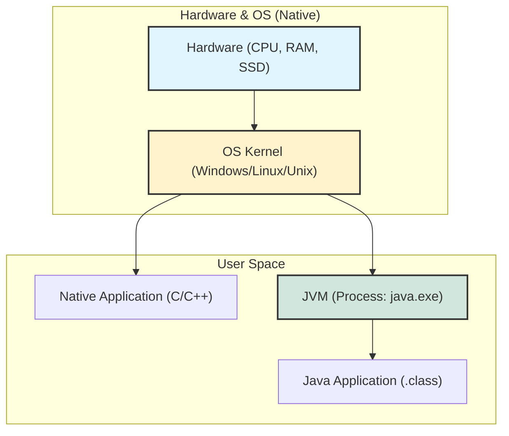
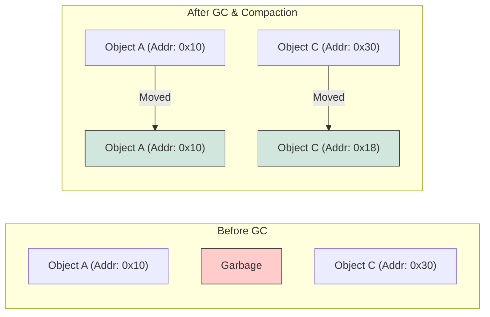

## 1. 개요

많은 사람들이 Java 문법을 익히는 데 집중하지만, 실제 운영 환경에서 발생하는 장애를 대응하기 위해서는 **JVM(Java Virtual Machine)** 에 대한 깊은 이해가 필수적이다. JVM은 단순한 실행기가 아니라, 운영체제와 하드웨어를 추상화하여 메모리 관리와 연산을 대신 수행하는 거대한 소프트웨어 시스템이다. 본 글에서는 CS(Computer Science) 이론인 운영체제와 가상 메모리 개념을 바탕으로 JVM의 내부 동작 원리와 Native 언어(C/C++)와의 차이점을 심층 분석한다.

## 2. 계층 구조와 실행 모델

컴퓨터 시스템은 하드웨어(Physical)와 소프트웨어(Logical)의 계층으로 나뉜다. JVM은 이 구조에서 **User Mode Application Process**로 동작하며, 독자적인 메모리 모델과 연산 체계를 갖춘다.

### 2.1 시스템 레이어 아키텍처

Native 언어는 하드웨어와 운영체제(Kernel)에 종속적이지만, Java는 JVM이라는 미들웨어를 통해 플랫폼 독립성을 획득한다.



> **Deep Dive: JIT(Just-In-Time) 컴파일러와 성능**
> 
> 초기 Java는 바이트코드를 한 줄씩 해석하는 인터프리터 방식이라 느렸다. 현대의 JVM은 **JIT 컴파일러**를 내장하여, 자주 실행되는 코드(Hot Spot)를 런타임에 Native Machine Code로 컴파일하고 캐싱한다. 이로 인해 반복 연산 구간에서는 C++에 준하는 성능을 낼 수 있다[^1].
{: .prompt-info }

## 3. Native vs Managed: 메모리 관리 철학

JVM을 이해하는 가장 좋은 방법은 C/C++와 같은 **Native 언어**와 비교하는 것이다. 가장 큰 차이는 메모리 관리의 주체와 책임 소재다.

### 3.1 Native 언어 (Unmanaged)

* **특징**: 개발자가 메모리 주소(Pointer)에 직접 접근할 수 있다.
* **장점**: 자유도가 극도로 높으며, 최적화 시 최고의 성능을 낸다.
* **위험성**:
* **Explicit Allocation/Deallocation**: `malloc` 후 `free`를 하지 않으면 메모리 누수(Memory Leak)가 발생한다.
* **Segmentation Fault**: 잘못된 주소에 접근하면 프로세스뿐만 아니라, 시스템 전체 성능에 악영향을 줄 수 있다(과거 OS의 경우).
* **OS 종속성**: 윈도우용 코드를 리눅스로 포팅하기 어렵다.

### 3.2 Java (Managed)

* **특징**: 메모리 관리를 JVM의 **Garbage Collector(GC)** 가 전담한다.
* **장점**:
* 개발자는 비즈니스 로직에 집중할 수 있다(생산성 향상).
* **Sandboxing**: 애플리케이션 내부에서 치명적인 오류가 발생해도, JVM 프로세스만 종료될 뿐 OS 전체가 다운되지 않는다.


* **제약 사항**: 메모리 주소를 직접 제어할 수 없다.

> **위험:** Java에서도 메모리 누수는 발생할 수 있다. 더 이상 사용하지 않는 객체를 `static` 컬렉션 등에 계속 참조하고 있다면, GC는 이를 '사용 중'으로 판단하여 회수하지 못한다.
{: .prompt-danger }

## 4. JVM 메모리 모델과 객체 이동

Java 개발자가 객체의 메모리 주소를 신뢰할 수 없는 이유는 GC의 동작 방식 때문이다.

### 4.1 가상 메모리와 객체 재배치 (Object Relocation)

JVM은 힙(Heap) 영역을 효율적으로 사용하기 위해 살아있는 객체를 다른 메모리 블록으로 이동시킨다(Compaction).

1. **객체 생성**: `new` 연산자로 힙에 생성.
2. **GC 발생**: 사용되지 않는 객체(Garbage) 제거.
3. **Compaction (압축)**: 살아남은 객체들을 한쪽으로 모아 단편화(Fragmentation)를 해결.

이 과정에서 객체의 **물리적 가상 메모리 주소가 변경**된다. 따라서 Java는 개발자에게 Raw Pointer를 제공하지 않고, **Reference(참조)** 라는 추상화된 핸들을 제공한다.



> **Deep Dive: 객체 헤더(Object Header)와 Mark Word**
> 
> Java 객체는 힙 메모리에 저장될 때 메타데이터를 포함한 헤더를 가진다. 헤더의 **Mark Word**에는 객체의 해시코드, GC 나이(Age), 락(Lock) 정보 등이 저장된다. JVM은 이 정보를 이용해 객체가 이동해도 식별성을 유지하고 동기화를 처리한다.
{: .prompt-info }

## 5. 구현 (Java)

아래 코드는 Java에서 객체 생명주기와 GC의 개입, 그리고 직접적인 메모리 해제가 불필요함을 보여주는 예제다.

```java
public class JvmMemoryDemo {

    // 대용량 데이터를 담는 객체 시뮬레이션
    static class HeavyObject {
        private byte[] data = new byte[1024 * 1024]; // 1MB
        private String name;

        public HeavyObject(String name) {
            this.name = name;
        }

        // 객체가 GC에 의해 수거될 때 호출됨 (현재는 deprecated되었으나 원리 이해용)
        @Override
        protected void finalize() throws Throwable {
            System.out.println(this.name + " 객체가 메모리에서 해제되었습니다.");
        }
    }

    public static void main(String[] args) {
        System.out.println("=== Java 메모리 관리 데모 시작 ===");

        // 블록 스코프를 이용해 객체의 참조를 끊음
        {
            HeavyObject obj1 = new HeavyObject("Obj-1");
            // Native 언어라면 여기서 free(obj1)을 명시적으로 호출해야 함
            // Java는 스코프가 끝나면 obj1은 'Unreachable' 상태가 됨
        }

        // 강제로 GC를 요청 (실무에서는 절대 사용 금지, 학습용)
        // JVM에게 "청소 좀 해주세요"라고 제안하는 것임 (즉시 실행 보장 X)
        System.gc(); 

        try {
            // GC가 돌 시간을 잠시 부여
            Thread.sleep(1000);
        } catch (InterruptedException e) {
            e.printStackTrace();
        }

        System.out.println("=== 데모 종료 ===");
    }
}

```

> **Tip:** `System.gc()`는 JVM에게 GC 실행을 '요청'할 뿐 강제하지 않는다. 또한, 전체 애플리케이션의 성능을 심각하게 저하시키는 'Stop-the-world'를 유발할 수 있으므로 프로덕션 코드에서는 절대 사용해서는 안 된다.
{: .prompt-tip }

---

## 💡 Quiz: 학습 내용 확인하기

**Q1. Java 애플리케이션 내부에서 치명적인 오류가 발생했을 때, 운영체제(OS)가 다운되지 않는 이유는 무엇인가?**

<details>
<summary>정답 확인</summary>
<div>
Java 애플리케이션은 JVM이라는 사용자 모드(User Mode) 프로세스 위에서 동작하기 때문이다. 오류가 발생해도 JVM 프로세스만 종료될 뿐, OS 커널 영역에는 직접적인 영향을 주지 않는다(Sandboxing 효과).
</div>
</details>

**Q2. Java에서 객체의 메모리 주소를 직접 알거나 조작하는 것이 불가능한(혹은 무의미한) 이유는 무엇인가?**

<details>
<summary>정답 확인</summary>
<div>
JVM의 Garbage Collector가 메모리 단편화를 해결하기 위해 객체의 위치를 메모리 상에서 계속 이동(Compaction)시키기 때문이다. 따라서 물리적 주소는 고정되어 있지 않으며, JVM이 관리하는 참조(Reference)를 통해서만 접근해야 한다.
</div>
</details>

**Q3. Native 언어(C/C++) 개발자가 누리는 '자유도'에 따른 책임은 무엇인가?**

<details>
<summary>정답 확인</summary>
<div>
메모리의 할당(Allocation)과 해제(Deallocation)를 개발자가 직접 명시적으로 수행해야 한다. 이를 소홀히 할 경우 메모리 누수(Memory Leak)나 잘못된 메모리 접근(Access Violation)으로 인한 치명적인 시스템 오류를 책임져야 한다.
</div>
</details>

---

[^1]:JIT(Just-In-Time) 컴파일러는 런타임 시 바이트코드를 원시 기계어 코드로 컴파일하여 성능을 높이는 JVM의 핵심 구성 요소다.