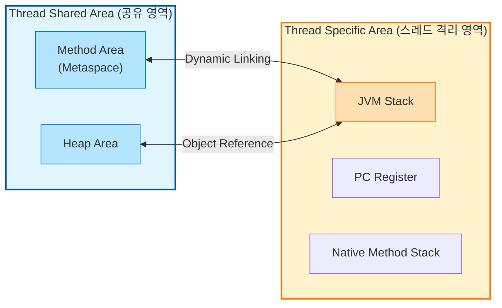

## 1. 개요

운영 관점에서 자바 애플리케이션의 성능과 안정성을 좌우하는 핵심은 **런타임 데이터 영역(Runtime Data Area)** 의 이해에 있다. JVM은 운영체제로부터 프로세스 형태로서 가상 메모리 공간을 할당받으며, 이를 목적에 따라 효율적으로 분할하여 사용한다. 이 영역은 크게 스레드(Thread)별로 격리되는 공간과 모든 스레드가 공유하는 공간으로 나뉜다.

## 2. 런타임 데이터 영역 아키텍처

JVM의 메모리 레이아웃은 데이터의 생명주기와 접근 범위에 따라 엄격하게 구분된다.



### 2.1 스레드 격리 영역 (Thread Specific Area)

이 영역들은 스레드가 생성될 때 할당되며, 스레드가 종료되면 함께 소멸한다. 따라서 스레드 안전(Thread-Safety) 문제가 발생하지 않는다.

* **PC Register (Program Counter)**: 현재 실행 중인 JVM 명령(Instruction)의 주소를 가리킨다. JVM은 스택 기반 머신(Stack-based machine)이지만, 흐름 제어를 위해 레지스터 개념을 차용했다. CPU의 PC와 달리, 현재 수행 중인 바이트코드 라인을 추적하여 컨텍스트 스위칭 시 실행 위치를 복원하는 역할을 한다.
* **JVM Stack**: 메소드 호출 시마다 **프레임(Frame)** 이라는 블록을 생성하여 스택에 쌓는다(Push). 프레임 내부에는 로컬 변수 배열, 피연산자 스택(Operand Stack), 프레임 데이터가 존재한다.
* **Native Method Stack**: 자바 외부의 네이티브 코드(C, C++ 등)를 실행하기 위한 스택이다. JNI(Java Native Interface)를 통해 호출되는 코드가 이곳에서 실행된다.

> **주의:** 재귀 호출(Recursion)의 깊이가 과도하게 깊어지거나, 프레임의 크기가 너무 커서 할당된 스택 메모리 한계를 초과하면 `StackOverflowError`가 발생한다. 이는 힙 메모리 부족(`OutOfMemoryError`)과는 구별되는 현상이다.
{: .prompt-warning }

### 2.2 스레드 공유 영역 (Thread Shared Area)

모든 스레드가 공유하는 영역으로, 동기화(Synchronization)와 메모리 관리가 필수적이다.

* **Heap Area**: `new` 연산자로 생성된 모든 객체 인스턴스와 배열이 저장된다. GC(Garbage Collection)의 주요 대상이다.
* **Method Area**: 클래스 로더가 읽어 들인 클래스 정보, 상수, 정적(static) 변수, JIT 컴파일러가 변환한 코드 등이 저장된다.

## 3. 메소드 영역(Method Area)과 메타스페이스(Metaspace)

메소드 영역은 논리적으로는 힙의 일부로 간주될 수 있으나, 구현상으로는 힙과 구분되어 관리된다. 이곳에는 클래스 수준의 데이터(Class-Level Data)가 저장된다.

### 3.1 주요 저장 데이터

1. **Type Information**: 클래스/인터페이스의 풀 네임, 부모 클래스 정보, 접근 제어자 등.
2. **Runtime Constant Pool**: 클래스 파일의 상수 풀(Constant Pool)이 런타임에 로드된 형태. 리터럴(Literal) 상수뿐만 아니라 필드와 메소드에 대한 심볼릭 레퍼런스(Symbolic Reference)를 포함한다.
3. **Field & Method Data**: 필드의 타입, 이름, 메소드의 이름, 리턴 타입, 파라미터 정보 등.
4. **Static Variables**: 모든 인스턴스가 공유하는 정적 변수.

### 3.2 Java 8 이후의 변화: Metaspace

과거(Java 7 이전)에는 메소드 영역이 **PermGen(Permanent Generation)** 이라는 힙의 일부 영역에 위치했다. 하지만 PermGen은 크기가 고정되어 있어 `OutOfMemoryError: PermGen space` 오류가 빈번했다.

Java 8부터는 이를 **Metaspace**로 대체하고 **Native Memory(OS가 관리하는 메모리)** 영역으로 이동시켰다.

> **Deep Dive: Metaspace의 동적 확장**
> 
> Metaspace는 힙과 달리 기본적으로 OS 메모리 용량만큼 동적으로 늘어날 수 있다. 하지만 무제한 확장을 방용하면 OS 전체의 메모리가 고갈될 수 있으므로 `MaxMetaspaceSize` 옵션으로 상한을 설정하는 것이 권장된다. 이를 통해 클래스 로더 누수(Class Loader Leak) 등으로 인한 시스템 전체 장애를 방지할 수 있다.
{: .prompt-info }

## 4. 런타임 상수 풀(Runtime Constant Pool) 분석

클래스 파일(`*.class`) 내부에는 `Constant Pool`이라는 테이블이 존재한다. 클래스 로더가 클래스를 로딩할 때, 이 정보가 메소드 영역의 **런타임 상수 풀**로 이동한다.

### 4.1 심볼릭 레퍼런스(Symbolic Reference)와 Resolution

자바는 컴파일 시점에 메모리 주소를 확정하지 않는다(Late Binding). 대신 클래스 파일에는 참조하는 대상의 이름(문자열)과 타입 정보만 심볼(Symbol) 형태로 저장된다.

* **심볼릭 레퍼런스**: `java.lang.System.out`과 같이 대상의 실제 주소가 아닌 논리적인 이름.
* **Resolution(해석)**: 런타임에 이 심볼릭 레퍼런스를 실제 메모리 주소(Direct Reference)로 교체하는 과정.

### 4.2 `javap`를 이용한 상수 풀 분석

실제 바이너리 상에서 상수 풀이 어떻게 구성되어 있는지 `javap` 역어셈블러를 통해 확인할 수 있다.

```java
// Main.java
public class Main {
    public static void main(String[] args) {
        System.out.println("Hello, Java Runtime!");
    }
}
```

위 코드를 컴파일 후 `javap -v Main` 명령어를 실행하면 다음과 같은 메타데이터를 볼 수 있다.

```text
Classfile /path/to/Main.class
  Last modified ...; size 432 bytes
  SHA-256 checksum ...
  ...
Constant pool:
   #1 = Methodref          #6.#15         // java/lang/Object."<init>":()V
   #2 = Fieldref           #16.#17        // java/lang/System.out:Ljava/io/PrintStream;
   #3 = String             #18            // Hello, Java Runtime!
   #4 = Methodref          #19.#20        // java/io/PrintStream.println:(Ljava/lang/String;)V
   #5 = Class              #21            // Main
   ...
   #18 = Utf8               Hello, Java Runtime!
```

* `#2`: `System.out` 필드에 대한 심볼릭 레퍼런스다. `#16`과 `#17`을 참조하여 클래스 이름과 필드 타입을 찾는다.
* `#3`: 코드에 작성된 문자열 리터럴이다.
* **무결성 검증**: `SHA-256 checksum` 등의 시그니처 정보를 통해 클래스 파일의 위변조 여부를 확인한다.

## 5. 힙 메모리 크기와 GC의 관계

힙 영역은 객체를 저장하는 거대한 공간이다. "힙 메모리는 클수록 좋은가?"에 대한 답은 **"반드시 그렇지는 않다"**이다.

* **큰 힙의 장점**: `OutOfMemoryError` 발생 빈도가 줄고, 많은 객체를 수용할 수 있다.
* **큰 힙의 단점**: GC(Garbage Collection)가 수행해야 할 청소 영역이 넓어진다. Stop-The-World(애플리케이션 중단) 시간이 길어져 응답 지연(Latency)이 발생할 수 있다.

> **Tip:** 메모리 용량 산정 시에는 애플리케이션의 **TPS(Transaction Per Second)**와 **객체 생존 주기**를 고려해야 하며, 무조건적인 증설보다는 적절한 튜닝이 필수적이다.
{: .prompt-tip }

## 💡 Quiz: 학습 내용 확인하기

**Q1. 자바의 메소드 영역(Method Area)에 저장되는 데이터 3가지는 무엇인가?**

<details>
<summary>정답 확인</summary>
<div>

1. 클래스 및 인터페이스의 타입 정보(Type Information)
2. 런타임 상수 풀(Runtime Constant Pool) - 상수 및 심볼릭 레퍼런스
3. 정적 변수(Static Variables) 및 메소드 바이트코드
</div>
</details>

**Q2. StackOverflowError와 OutOfMemoryError의 발생 원인 차이는 무엇인가?**

<details>
<summary>정답 확인</summary>
<div>
StackOverflowError는 스택 프레임이 스택 영역의 허용 깊이를 초과할 때(주로 무한 재귀 호출) 발생하며, OutOfMemoryError는 힙 영역에 더 이상 객체를 할당할 공간이 없거나(Heap OOM), 메타스페이스 등의 네이티브 메모리가 부족할 때 발생한다.
</div>
</details>

**Q3. Java 8에서 PermGen이 제거되고 Metaspace가 도입된 주요 구조적 차이점은?**

<details>
<summary>정답 확인</summary>
<div>
PermGen은 힙 메모리의 일부로 크기가 고정되어 있어 용량 제한 문제가 빈번했으나, Metaspace는 JVM 힙이 아닌 OS의 Native Memory를 사용하며 크기를 동적으로 조정할 수 있다.
</div>
</details>