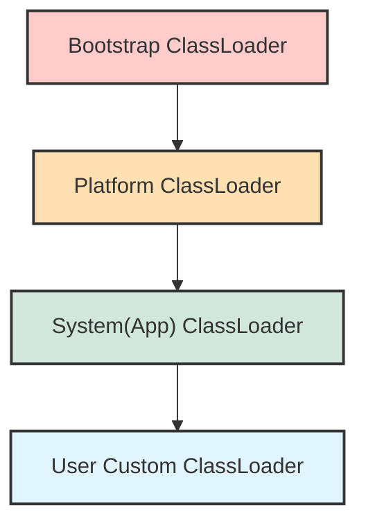
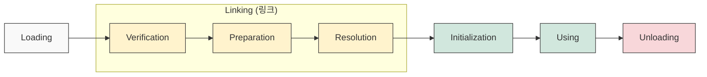

## 1. 개요

Java 소스 코드(`.java`)는 컴파일을 통해 바이트코드(`.class`)로 변환된다. 하지만 이 바이트코드 자체는 단순한 파일일 뿐이며, 이를 실제로 실행하기 위해서는 **JVM(Java Virtual Machine)** 의 메모리 영역으로 적재하는 과정이 필요하다. 이 역할을 담당하는 것이 바로 **클래스 로더(Class Loader)** 다.

클래스 로더는 단순히 로컬 디스크의 파일을 읽는 것을 넘어, 네트워크를 통해 코드를 전송받아 실행하는 등 자바의 강력한 **동적 로딩(Dynamic Loading)** 과 **확장성**을 보장하는 핵심 메커니즘이다.

## 2. 클래스 로더 아키텍처 (Architecture)

JVM의 클래스 로더는 계층적 구조를 가지며, 하위 로더가 상위 로더에게 로딩을 위임하는 모델을 따른다. Java 9 이후 모듈 시스템(Jigsaw)이 도입되면서 구조에 변화가 있었으나, 기본적인 역할 분담은 다음과 같다.



### 2.1 주요 클래스 로더의 역할

1. **Bootstrap ClassLoader**:
* **역할**: JVM 구동을 위한 가장 필수적인 라이브러리를 로드한다. 운영체제의 부트로더가 커널을 로드하듯, JVM의 가장 기초가 되는 `java.base` 모듈 등을 담당한다.
* **특징**: Java가 아닌 네이티브 코드(C/C++)로 구현되어 있다.


2. **Platform ClassLoader** (구 Extension ClassLoader):
* **역할**: Java SE 플랫폼의 핵심 API를 제외한 확장 기능이나 플랫폼별 모듈을 로드한다.
* **위치**: 하드웨어와 애플리케이션 사이의 미들웨어 성격 라이브러리가 이곳에 해당한다.


3. **System (Application) ClassLoader**:
* **역할**: 개발자가 작성한 애플리케이션 코드와 `CLASSPATH`에 지정된 외부 라이브러리를 로드한다.
* **특징**: 일반적인 자바 프로그램이 시작될 때 사용되는 기본 로더다.


## 3. 클래스 로딩 라이프사이클 (Lifecycle)

클래스 로더가 `.class` 파일을 가져와 JVM 메모리에 안착시키기까지는 복잡한 단계를 거친다.



### 3.1 Loading (적재)

클래스 파일(바이트코드)을 찾아 읽어 들이는 단계다. 파일 시스템뿐만 아니라 네트워크 등을 통해 바이너리 데이터를 가져온다. 이때 해당 클래스의 메타데이터를 관리하기 위해 **`java.lang.Class` 인스턴스**를 힙(Heap) 영역에 생성한다.

### 3.2 Linking (링크)

로드된 클래스 데이터를 실행 가능한 상태로 검증하고 준비하는 과정이다.

1. **Verification (검증)**:
* 로드된 바이트코드가 JVM 규격을 준수하는지, 시스템을 파괴하는 악성 코드가 포함되어 있지 않은지 검사한다.
* C/C++과 달리 JVM 내부에서 실행이 통제되므로 OS 레벨의 치명적인 손상을 방지하는 보안 장벽 역할을 한다.


2. **Preparation (준비)**:
* 클래스의 **Static(정적) 변수**를 위한 메모리를 할당하고 **기본값(Zero Value)**으로 초기화한다.
* **주의**: 이때 개발자가 할당한 값(예: `static int a = 10;`)이 아닌, 타입별 기본값(0, null, false)이 들어간다.
* 단, `static final` 상수(Primitive type/String)는 이 단계에서 즉시 값이 할당된다(Constant Value).


3. **Resolution (해석/결합)**:
* 클래스 파일 내의 **심볼릭 참조(Symbolic Reference)**[^1]를 실제 메모리 주소인 **직접 참조(Direct Reference)**[^2]로 변환한다.
* C++의 동적 링킹(Dynamic Linking)과 유사하며, 다른 클래스와의 의존성을 실제 연결하는 단계다.


### 3.3 Initialization (초기화)

실제 코드가 실행되는 단계다. `Preparation` 단계에서 확보된 메모리에 개발자가 지정한 실제 초기값을 할당하고, **Static Initializer**(`static { ... }`) 블록을 실행한다.

이 과정의 차이를 코드로 살펴보면 다음과 같다.

```java
class Example {
    // 1. Preparation: 메모리 확보 및 0으로 초기화
    // 2. Initialization: 10 할당 (이 시점에 실제 값 대입)
    static int a = 10;
    
    // Preparation: 컴파일 타임 상수는 이 단계에서 즉시 20 할당 (Constant Value)
    static final int b = 20; 
}
```

> **Deep Dive: 메모리 할당 시점의 차이**
> 
> `static` 필드는 Preparation 단계에서 메모리 공간이 확보되고 기본값(0, null)으로 초기화되지만, 개발자가 의도한 값은 Initialization 단계에 비로소 할당된다.
> 반면, `static final` (상수)은 컴파일 타임에 값이 확정되므로 Preparation 단계에서 즉시 값이 할당된다. 이를 통해 불필요한 연산을 줄이고 최적화를 수행한다.
{: .prompt-info }

## 4. 객체 메모리 레이아웃과 관리

클래스 로딩이 완료된 후 `new` 키워드를 통해 인스턴스가 생성되면, JVM 힙(Heap) 영역에 객체가 저장된다. 이때 객체는 단순히 필드 데이터만 가지는 것이 아니다.

### 4.1 객체의 구조

JVM 내부적으로 객체는 다음과 같은 구조를 가진다.

1. **Object Header (Mark Word)**:
* 해시코드(HashCode)
* GC 세대(Age) 정보
* 락(Lock) 정보 및 플래그


2. **Klass Word (Class Pointer)**:
* 메타스페이스(Metaspace)에 위치한 클래스 메타데이터를 가리키는 포인터. 이 객체가 어떤 클래스의 인스턴스인지 식별한다.


3. **Instance Data**:
* 실제 필드 값들이 저장되는 영역.


4. **Padding**:
* 객체의 크기를 CPU 워드 크기(보통 8바이트)의 배수로 맞추기 위해 채워 넣는 빈 공간.


> **Tip:** `java.lang.Class` 인스턴스는 힙 영역에 존재하며 개발자가 리플렉션(Reflection)을 통해 클래스 정보에 접근할 때 사용된다. 반면, JVM이 내부적으로 사용하는 클래스 메타데이터(Klass)는 **Metaspace(Native Memory)** 영역에 저장된다.
{: .prompt-tip }

## 5. 구현 예제 (Java)

클래스 로딩 과정을 확인하고, 사용자 정의 로더가 필요한 상황을 가정한 예제 코드다.

```java
import java.lang.reflect.Method;

public class ClassLoaderDeepDive {

    public static void main(String[] args) {
        try {
            // 1. 클래스 로딩 확인
            // String 클래스는 Bootstrap ClassLoader에 의해 로드되므로 null(혹은 플랫폼별 표현)이 반환될 수 있음
            ClassLoader stringLoader = String.class.getClassLoader();
            System.out.println("String Loader: " + stringLoader); 

            // 현재 클래스는 AppClassLoader가 로드함
            ClassLoader myLoader = ClassLoaderDeepDive.class.getClassLoader();
            System.out.println("MyClass Loader: " + myLoader.getName()); 

            // 2. 동적 로딩 (Runtime Loading)
            // 컴파일 타임에는 몰랐던 클래스를 런타임에 이름으로 로드
            String className = "com.example.DynamicLogic"; // 가정된 클래스명
            
            // 로딩 -> 검증 -> 준비 단계 수행 (초기화는 initialize 파라미터에 따름)
            Class<?> dynamicClass = Class.forName(className); 
            
            // 인스턴스 생성 (Initialization 단계 수행 및 Heap 할당)
            Object instance = dynamicClass.getDeclaredConstructor().newInstance();
            
            System.out.println("Loaded and created instance: " + instance);

        } catch (ClassNotFoundException e) {
            System.out.println("클래스를 찾을 수 없습니다. (Lazy Loading 가능성)");
        } catch (Exception e) {
            e.printStackTrace();
        }
    }
}
```

## 6. Unloading과 Garbage Collection

C++에서는 `delete`를 통해 객체를 명시적으로 소멸시켜야 하지만, Java는 **Garbage Collector(GC)** 가 이를 전담한다.

* **Unloading 조건**: 클래스 로더 자체가 GC 대상이 되고, 해당 로더가 로드한 모든 클래스의 인스턴스가 힙에서 사라져야 비로소 클래스 정보가 Unloading 될 수 있다. 이는 매우 드물게 발생한다.
* **주의사항**: 개발자가 GC에 개입하려 해서는 안 된다. `System.gc()` 호출이나 `finalize()` 오버라이딩은 시스템 성능에 치명적인 영향을 줄 수 있으며, 실행 시점을 보장하지도 않는다.

> **위험:** 가비지 컬렉션을 강제로 수행하거나 `finalize()`를 통해 객체 소멸 시점에 개입하려는 시도는 예측 불가능한 부작용을 낳는다. 메모리 관리는 전적으로 JVM에게 맡겨야 한다.
{: .prompt-danger }

---

## 💡 Quiz: 학습 내용 확인하기

**Q1. Linking 과정 중 Preparation(준비) 단계와 Initialization(초기화) 단계에서 변수 할당의 차이점은 무엇인가?**

<details>
<summary>정답 확인</summary>
<div>
Preparation 단계에서는 정적(static) 변수에 대해 메모리를 할당하고 '기본값(0, null 등)'으로 초기화합니다. 반면, Initialization 단계에서는 개발자가 코드에 작성한 '실제 초기값'을 할당하고 static 블록을 실행합니다. (단, static final 상수는 Preparation 단계에서 값이 할당됨)
</div>
</details>

**Q2. Java의 클래스 로더가 동적 로딩(Dynamic Loading)을 지원함으로써 얻는 이점은 무엇인가?**

<details>
<summary>정답 확인</summary>
<div>
애플리케이션 실행 시 모든 클래스를 한 번에 로딩하지 않고 필요한 시점에 로딩(Lazy Loading)할 수 있어 메모리를 효율적으로 사용할 수 있습니다. 또한, 네트워크를 통해 코드를 받아 실행하는 등 런타임에 기능을 확장하거나 교체하는 유연성을 제공합니다.
</div>
</details>

**Q3. 개발자가 작성한 일반적인 Java 클래스 파일은 어떤 클래스 로더에 의해 로드되는가?**

<details>
<summary>정답 확인</summary>
<div>
System ClassLoader (또는 Application ClassLoader)에 의해 로드됩니다.
</div>
</details>

[^1]:**심볼릭 참조(Symbolic Reference)**: 바이트코드 내에서 클래스, 메서드, 필드를 참조할 때 실제 메모리 주소가 아닌 논리적인 이름(문자열)과 타입 정보로만 기술된 형태다.

[^2]:**직접 참조(Direct Reference)**: 실제 런타임에 메모리상에 존재하는 주소 값이나 오프셋을 의미한다. JVM은 심볼릭 참조를 해석(Resolution)하여 직접 참조로 연결한다.