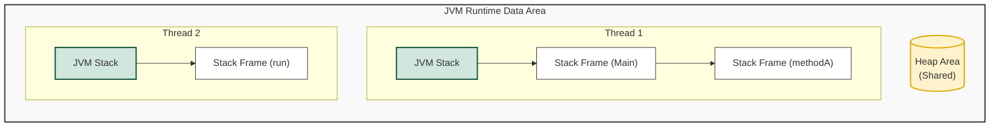
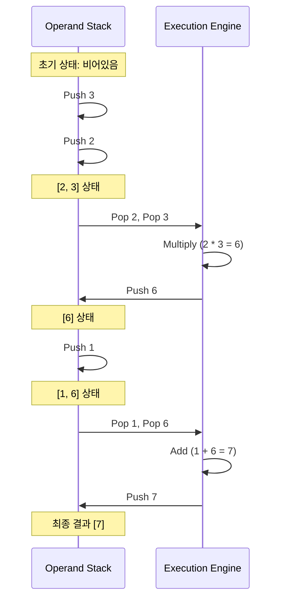

## 1. 개요

프로그램이 실행될 때 메모리를 효율적으로 관리하는 것은 성능 최적화의 기본이다. JVM(Java Virtual Machine)은 운영체제로부터 메모리를 할당받아 **Runtime Data Area**를 구성하며, 이 중 **Stack 영역**은 메서드 호출과 연산의 핵심이 되는 공간이다. 자료구조로서의 스택과 JVM이 사용하는 스택의 차이, 그리고 실제 바이트코드 레벨에서 스택 프레임이 어떻게 동작하는지 알아보자.

## 2. 스택(Stack) 자료구조와 JVM

### 2.1 자료구조로서의 스택

스택은 **LIFO(Last In First Out)** 구조를 가진 선형 자료구조다. 바닥이 막힌 상자에 물건을 쌓는 것과 같으며, 데이터의 입력을 **Push**, 출력을 **Pop**이라 한다. 입출력이 상단(Top) 한 곳에서만 이루어지기 때문에 가장 나중에 들어온 데이터가 가장 먼저 나가는 특성을 가진다. 이는 윈도우의 '실행 취소(Ctrl+Z)' 기능이나 웹 브라우저의 '뒤로 가기' 기능이 역순으로 동작하는 원리와 같다.

### 2.2 JVM Stack의 특징

JVM의 스택은 일반적인 자료구조 스택보다 복잡한 역할을 수행한다. JVM은 하드웨어 레지스터에 직접 의존하는 대신 **스택 기반 머신(Stack-based Machine)** 아키텍처를 채택했다.

> **Deep Dive: 스택 기반 머신 vs 레지스터 기반 머신**
> 
> * **레지스터 기반 (예: x86, ARM, Dalvik VM):** 피연산자가 CPU 레지스터에 저장된다. 명령어가 짧고 빠르지만 하드웨어 종속적이다.
> * **스택 기반 (예: JVM):** 피연산자를 스택에 넣고 꺼내며 연산한다. 레지스터보다 명령어가 많아지고 속도가 상대적으로 느릴 수 있지만, **하드웨어 아키텍처에 독립적**이어서 이식성이 높다.
{: .prompt-info }

## 3. JVM Stack 아키텍처 및 생명주기

JVM 스택의 가장 큰 특징은 **스레드(Thread)별 격리**다. Heap 영역이 모든 스레드에 의해 공유되는 반면, Stack은 각 스레드가 생성될 때마다 별도로 생성되며 해당 스레드 내에서만 유효하다.



* **생명주기:** 스레드가 시작될 때 생성되고, 스레드가 종료되면 함께 소멸한다.
* **스택 프레임(Stack Frame):** 메서드가 호출될 때마다 하나의 프레임이 스택에 Push 되고, 메서드가 종료(반환)되면 Pop 되어 사라진다.

## 4. 스택 프레임(Stack Frame)의 구성 요소

메서드 하나가 실행될 때 생성되는 프레임은 내부적으로 **LVT(Local Variable Table)**, **OS(Operand Stack)**, **Frame Data**로 구성된다.

### 4.1 지역 변수 배열 (Local Variable Table, LVT)

메서드의 매개변수(Parameter)와 내부에서 선언된 지역 변수(Local Variable)가 저장되는 공간이다. 배열 형태의 테이블로 관리된다.

* **Slot(슬롯):** 데이터를 저장하는 기본 단위.
* **크기:** 기본적으로 32bit(4byte) 크기를 가진다.
* `int`, `boolean`, `reference` 등: 1개의 슬롯 사용.
* `long`, `double`: 64bit이므로 **2개의 연속된 슬롯**을 사용한다.


* **this 참조:** 인스턴스 메서드(static이 아닌 메서드)의 경우, **0번 인덱스 슬롯에 항상 `this` 참조가 자동 저장**된다. 따라서 메서드 내부에서 `this` 키워드 없이도 인스턴스 멤버에 접근할 수 있다.

> **주의:** 지역 변수는 명시적으로 초기화하지 않으면 사용할 수 없다. 클래스 멤버 변수(Field)가 자동으로 기본값(0, null 등)으로 초기화되는 것과는 대조적이다.
{: .prompt-warning }

### 4.2 피연산자 스택 (Operand Stack)

실제 연산이 이루어지는 임시 작업 공간이다. 메서드 내에서 계산(`+`, `-`, `*` 등)이 필요하거나, 값을 반환하거나, 매개변수를 전달할 때 사용된다.

**동작 예시:** `1 + 2 * 3` 연산 과정 (연산자 우선순위에 따라 곱셈 먼저 수행)



### 4.3 프레임 데이터 (Frame Data)

* **Dynamic Linking:** 런타임 상수 풀(Constant Pool)에 대한 참조를 가지고 있어 메서드 호출 시 실제 메모리 주소를 찾을 수 있게 한다.
* **Return Address:** 메서드가 종료된 후 돌아갈 호출 지점(PC Register 값 등)의 정보를 저장한다.

## 5. 구현 코드 및 분석 (Java)

실제 자바 코드가 스택 메모리 상에서 어떻게 배치되는지 확인해보자.

```java
public class StackDemo {

    // 1. main 메서드 실행 시 스택 프레임 생성
    public static void main(String[] args) {
        int a = 10;
        int b = 20;
        
        // 2. calc 메서드 호출 -> 새로운 스택 프레임 Push
        int result = calc(a, b); 
        
        // 5. calc 종료 후 복귀, result 변수에 반환값 저장
        System.out.println(result);
    }

    // static 메서드이므로 0번 슬롯에 'this'가 없음
    public static int calc(int p1, int p2) {
        int c = 3;
        // 3. 피연산자 스택을 활용한 연산 수행
        // p1 + p2 * c 연산이 내부적으로 수행됨
        int temp = p1 + p2 * c; 
        
        // 4. 메서드 종료(return) -> 스택 프레임 Pop
        return temp;
    }
}

```

### 5.1 네이티브 메서드 스택 (Native Method Stack)

Java가 아닌 C/C++ 등의 언어로 작성된 JNI(Java Native Interface) 메서드를 실행할 때 사용되는 별도의 스택 영역이다. JVM 구현체에 따라 JVM 스택과 통합되거나 분리되어 운영된다.

> **Deep Dive: StackOverflowError**
> 스택 영역의 크기는 JVM 실행 옵션(`-Xss`)으로 지정할 수 있다. 만약 재귀 호출(Recursion)이 너무 깊어지거나 지역 변수가 과도하게 많아져 할당된 스택 메모리를 초과하면 `java.lang.StackOverflowError`가 발생한다. 이는 힙 메모리 부족(`OutOfMemoryError`)과는 다른 종류의 오류다.
{: .prompt-danger }

## 💡 Quiz: 학습 내용 확인하기

**Q1. 인스턴스 메서드(Instance Method)의 지역 변수 테이블(Local Variable Table) 0번 인덱스에는 무엇이 저장되는가?**

<details>
<summary>정답 확인</summary>
<div>
호출된 인스턴스 자기 자신을 가리키는 참조값인 <strong>this</strong>가 저장된다. (static 메서드는 제외)
</div>
</details>

**Q2. double이나 long 타입의 변수는 지역 변수 테이블에서 몇 개의 슬롯을 차지하는가?**

<details>
<summary>정답 확인</summary>
<div>
2개의 슬롯을 차지한다. (각 슬롯은 일반적으로 32bit 크기이며, double/long은 64bit이기 때문)
</div>
</details>

**Q3. JVM이 레지스터 기반이 아닌 스택 기반 머신을 채택한 주된 이유는 무엇인가?**

<details>
<summary>정답 확인</summary>
<div>
하드웨어(CPU 레지스터)에 대한 종속성을 줄여 <strong>이식성(Portability)</strong>을 높이기 위해서이다.
</div>
</details>