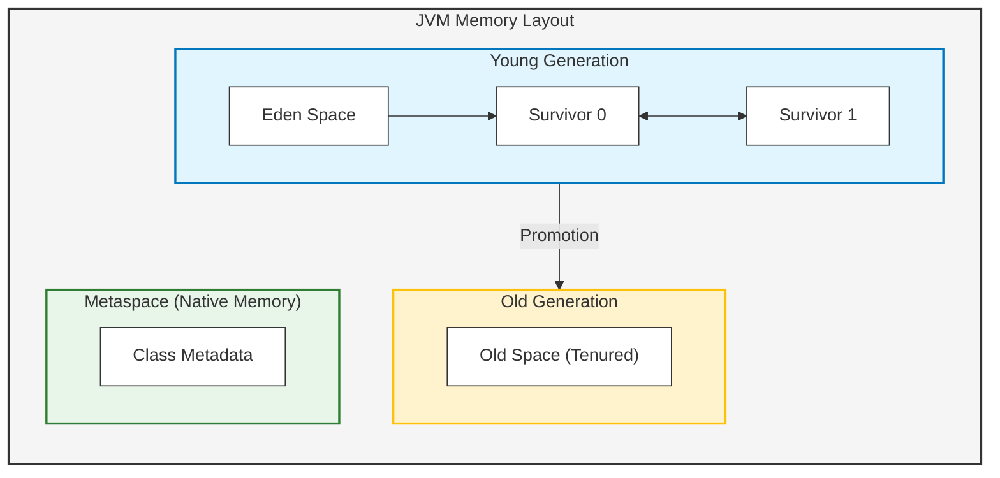
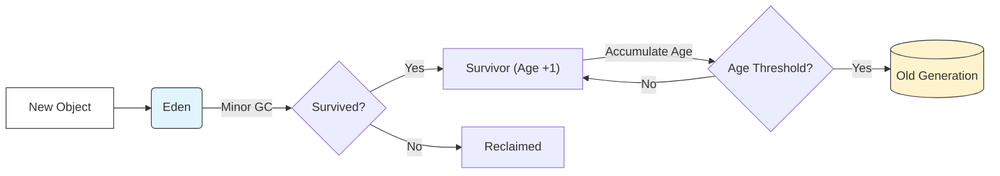

## 1. 개요

JVM(Java Virtual Machine) 메모리 구조 중 **Heap 영역**은 개발자가 `new` 연산자를 통해 생성한 모든 클래스 인스턴스와 배열이 저장되는 공간이다[^1]. 스택(Stack) 영역이 스레드별로 독립적인 제어 흐름을 담당하는 반면, 힙은 모든 스레드가 공유하는 데이터를 저장하며 **Garbage Collector(GC)**의 관리 대상이 된다.

힙 메모리가 부족할 경우 치명적인 `java.lang.OutOfMemoryError`가 발생한다. 따라서 단순히 메모리를 할당하는 것을 넘어, GC가 어떤 기준으로 객체를 회수하고 메모리를 최적화하는지 이해하는 것은 고성능 애플리케이션 개발에 필수적이다.

## 2. 세대별 수집 이론 (Generational Collection Theory)

GC가 모든 객체를 전수 조사하여 메모리를 회수하는 것은 비용이 매우 크다. 이를 효율화하기 위해 **"대부분의 객체는 금방 사라진다(Weak Generational Hypothesis)"**는 가설을 바탕으로 메모리를 영역별로 나누어 관리한다.

### 2.1 Heap 메모리 아키텍처



1. **Young Generation (신세대)**
* 새로 생성된 객체 대부분이 위치하는 곳이다.
* **Eden**: 객체가 최초로 생성되는 공간.
* **Survivor 0 / 1**: Minor GC에서 살아남은 객체들이 이동하는 공간.


1. **Old Generation (구세대)**
* Young 영역에서 오랫동안 살아남은 객체가 **승격(Promotion)**되어 이동하는 곳이다.
* GC 빈도는 낮지만, 한 번 발생하면 시간이 오래 걸린다.


3. **Metaspace (구 PermGen)**
* Java 8부터 Permanent Generation이 제거되고 도입된 영역이다.
* 클래스 메타데이터, 메서드 정보 등이 저장되며 Native Memory를 사용한다.


> **Deep Dive: Metaspace와 OutOfMemoryError**
> 
> 과거 PermGen 영역은 Heap의 일부로 크기가 고정되어 있어 `OOM: PermGen space` 오류가 빈번했다. 반면, Metaspace는 Native Memory를 사용하므로 OS가 허용하는 한 메모리를 유동적으로 사용할 수 있다. 단, 제한을 두지 않으면 서버 전체 메모리를 고갈시킬 수 있으므로 `MaxMetaspaceSize` 설정이 권장된다.
{: .prompt-info }

## 3. 객체의 생명주기와 Reachability

GC는 메모리를 회수할 대상을 식별하기 위해 **Reachability(도달 가능성)** 개념을 사용한다. Root Set(유효한 참조)으로부터 참조 사슬을 따라가며 도달할 수 없는 객체(Unreachable)를 쓰레기(Garbage)로 간주한다.

### 3.1 참조 카운팅과 스코프 (Java 구현)

```java
public class GCLifecycleTest {
    
    // 정적 변수 (GC Root가 됨) - 프로그램 종료 시까지 메모리에 상주
    public static Object staticRef;

    public static void main(String[] args) {
        // 1. 객체 생성 및 Stack 변수(localRef) 참조
        Object localRef = new Object(); 
        
        // 2. 정적 변수에 참조 할당 (강한 참조)
        staticRef = localRef; 
        
        // 3. 지역 변수 스코프 종료 시뮬레이션
        localRef = null; 
        
        // 이때 Heap에 생성된 Object 인스턴스는 GC 대상인가?
        // 정답: 아니다. staticRef가 여전히 참조하고 있기 때문이다.
        
        // 4. 정적 참조 해제
        staticRef = null;
        
        // 이제 해당 인스턴스는 Unreachable 상태가 되어 GC 대상이 된다.
        System.gc(); // GC 실행 요청 (보장되진 않음)
    }
}

```

* **지역 변수 (`localRef`)**: 메서드 실행 중 스택 프레임에 존재하며, 메서드 종료(스코프 아웃) 시 사라진다. 이때 힙 객체에 대한 참조 링크가 끊긴다.
* **정적 변수 (`staticRef`)**: 메서드 영역(Metaspace)에 위치하며 GC Root 역할을 한다. 이를 통해 참조된 힙 객체는 GC되지 않고 계속 살아남는다.

> **주의:** `static` 변수에 컬렉션(`List`, `Map` 등)을 선언하고 객체를 계속 추가하면, 해당 객체들은 영원히 GC되지 않아 **메모리 누수(Memory Leak)**의 주원인이 된다.
{: .prompt-warning }

## 4. Garbage Collection 프로세스와 STW

### 4.1 Minor GC와 Promotion 과정



객체가 Survivor 영역에서 GC를 버틸 때마다 **Age(나이)**가 1씩 증가한다. 이 정보는 객체 헤더(Object Header)에 기록된다. 임계값(Threshold)을 넘어서면 Old Generation으로 승격된다.

### 4.2 Stop The World (STW)

GC를 실행하기 위해서는 객체의 참조 상태가 변경되면 안 되기 때문에, JVM은 애플리케이션의 모든 스레드를 일시 정지시킨다. 이를 **Stop The World**라고 한다.

* **Minor GC**: Young 영역만 처리하므로 속도가 매우 빠르다(보통 1초 미만). STW 영향이 적다.
* **Major/Full GC**: Heap 전체와 Metaspace를 청소한다. STW 시간이 길어지며(수 초 이상), 이로 인해 DB 커넥션 타임아웃이나 서버 응답 지연이 발생하여 장애로 이어질 수 있다.

> **Deep Dive: 객체 헤더(Object Header)와 Mark Word**
> 
> 힙에 저장된 객체는 데이터뿐만 아니라 메타데이터를 가진다. HotSpot JVM의 경우 객체 헤더의 **Mark Word** 부분에 `GC Age`(4bit, 최대 15), 해시코드, 락(Lock) 정보 등이 비트 단위로 저장된다. Age 비트가 꽉 차면(15가 되면) Old 영역으로 이동한다.
{: .prompt-info }

> **위험:** 운영 환경에서 `System.gc()`를 명시적으로 호출하는 것은 절대 금지해야 한다. 이는 의도치 않게 Full GC를 유발하여 시스템 전체를 멈추게 할 수 있다.
{: .prompt-danger }

## 5. 결론 및 요약

1. **Heap 영역**: `new`로 생성된 객체가 저장되며 GC가 관리한다.
2. **세대별 구조**: 효율성을 위해 Young(Eden, Survivor), Old, Metaspace로 구분된다.
3. **STW(Stop The World)**: GC 수행 중 발생하는 멈춤 현상이며, 이를 최소화하는 것이 튜닝의 핵심이다.
4. **참조 관리**: 불필요한 `static` 참조를 피하여 메모리 누수를 방지해야 한다.

---

## 💡 Quiz: 학습 내용 확인하기

**Q1. Java 객체가 Young Generation에서 Old Generation으로 이동하는 기준이 되는 값은 무엇이며, 어디에 저장되는가?**

<details>
<summary>정답 확인</summary>
<div>
객체의 Age(나이) 값이 기준이 된다. 이 값은 객체 헤더(Object Header)의 Mark Word 내부에 비트 단위로 저장된다.
</div>
</details>

**Q2. Stop The World(STW)가 발생했을 때, 데이터베이스(DB) 연결 관점에서 발생할 수 있는 잠재적인 문제는?**

<details>
<summary>정답 확인</summary>
<div>
STW 시간이 DB 커넥션의 타임아웃 설정보다 길어질 경우, DB는 애플리케이션이 응답하지 않는다고 판단하여 연결을 끊을 수 있다. 이후 애플리케이션이 재개되었을 때 끊어진 커넥션 사용 시도 등으로 오류가 발생할 수 있다.
</div>
</details>

**Q3. 메서드 내부의 지역 변수(Local Variable)가 GC Root가 될 수 있는가?**

<details>
<summary>정답 확인</summary>
<div>
그렇다. 스택 프레임 내의 지역 변수는 힙 영역의 객체를 참조하는 가장 기본적인 GC Root 중 하나이다. 메서드가 종료되어 스택 프레임이 사라지면 해당 참조도 사라진다.
</div>
</details>

---

[^1]:Method Area(Metaspace)와 Stack 영역을 제외한 인스턴스 저장 전용 공간이다.