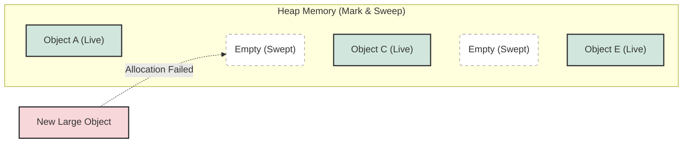
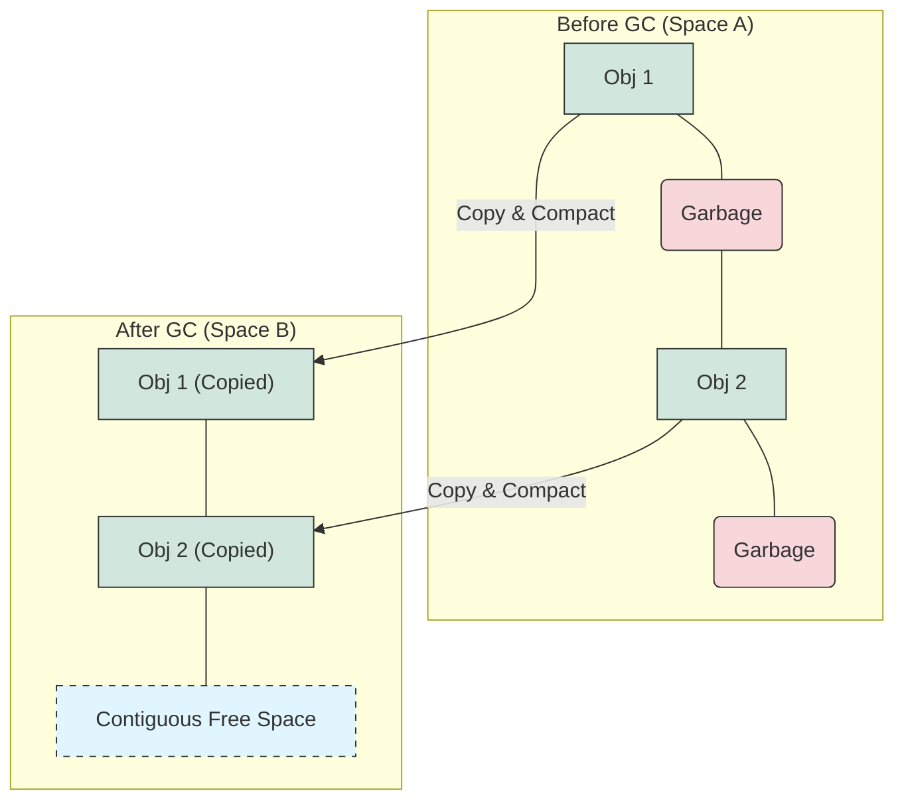

## 1. 개요

Java의 **Garbage Collection(GC)**은 개발자가 메모리를 직접 관리하지 않도록 도와주는 핵심 메커니즘이다. 하지만 GC가 언제, 어떻게 동작하는지 이해하지 못하면 애플리케이션의 성능 저하(Latency)나 `OutOfMemoryError`와 같은 치명적인 문제를 해결하기 어렵다. GC 알고리즘은 단순히 "쓰지 않는 객체를 지운다"는 개념에서 출발하여, **메모리 파편화(Fragmentation)** 해결과 **중단 시간(Stop-the-World)** 최소화를 목표로 진화해왔다. 오늘은 가장 기초적인 `Mark and Sweep`부터 현대적인 GC의 근간이 되는 `Mark and Compact`까지의 진화 과정을 알아보자.

## 2. Mark and Sweep: GC의 시초

최초의 GC 알고리즘이자 가장 직관적인 방식인 **Mark and Sweep**은 이름 그대로 두 단계로 나뉜다.

1. **Mark (식별)**: Root Set(스택의 지역 변수 등)에서 참조가 끊긴 객체(Unreachable)와 참조된 객체(Reachable)를 식별하여 마킹한다.
2. **Sweep (회수)**: 마킹되지 않은, 즉 더 이상 사용되지 않는 객체들의 메모리를 해제한다.

### 2.1 동작 메커니즘과 한계

이 방식은 구현이 간단하지만 치명적인 단점이 존재한다. 객체가 제거된 자리에 빈 공간(Hole)이 생기며, 이 공간들이 불연속적으로 흩어지는 **메모리 파편화(Memory Fragmentation)** 현상이 발생한다.



위 다이어그램처럼 `Empty` 공간의 총합은 충분하더라도, 연속된 큰 공간이 없어서 `New Large Object`를 할당하지 못하는 상황이 발생할 수 있다.

> **Deep Dive: Root Set과 Reachability**
> 
> GC는 '무엇을 지울까'가 아니라 '무엇이 살아있는가'에 집중한다. Java에서 **Root Set**은 실행 중인 스레드의 스택 프레임(Stack Frame) 내 로컬 변수, 메서드 영역의 정적 변수(Static), JNI 참조 등을 포함한다. 이 Root Set에서 참조 사슬을 따라가며 도달할 수 있는 객체를 **Reachable**, 끊어진 객체를 **Unreachable**로 판단한다[^1].
{: .prompt-info }

## 3. Mark and Copy: 파편화 해결을 위한 공간의 희생

파편화 문제를 해결하기 위해 1969년 로버트 페인첼(Robert Fenichel)은 **Mark and Copy** 알고리즘을 제안했다. 핵심 아이디어는 **메모리 공간을 물리적으로 분리**하는 것이다.

### 3.1 동작 원리

1. **전체 힙 메모리**를 두 개의 영역(예: A공간, B공간)으로 나눈다.
2. 한 번에 한 영역(A)만 사용한다.
3. GC가 발생하면 A공간의 **살아있는 객체(Live Object)만 B공간으로 복사**한다.
4. 이때 객체들을 차곡차곡 쌓아(Compacting) 빈 공간 없이 배치한다.
5. 기존 A공간을 통째로 비운다(Sweep).



### 3.2 효율성 문제와 IBM의 발견

이 방식은 파편화를 완벽히 해결하지만, 메모리의 절반만 사용할 수 있다는 **공간 효율성(Space Efficiency)** 문제가 발생한다. 하지만 이후 IBM의 연구(1989)에 따르면, **"대부분의 객체는 금방 죽는다(Weak Generational Hypothesis)"**는 사실이 밝혀졌다.

따라서 굳이 50:50으로 나눌 필요 없이, **Eden 영역을 크게, Survivor 영역을 작게(예: 8:1:1)** 나누는 방식으로 발전하게 된다. 이것이 현대 JVM의 Young Generation 구조의 기반이다. Eden 영역은 이때 생긴 것이다.

> **Deep Dive: 8:1:1 비율의 비밀 (Eden과 Survivor)**
> 
> "Eden:Survivor = 8:1:1"이라는 비율에서 **Survivor 0(S0)와 Survivor 1(S1)의 크기는 여전히 1:1로 동일**하다. Copy 알고리즘 특성상 두 영역이 서로 역할을 맞바꿔야(Swap) 하기 때문이다.
> 과거(초기 Mark & Copy)에는 메모리를 물리적으로 50:50으로 나누어 절반을 낭비했지만, 현대에는 **Eden(80%) + S0(10%)**를 사용하여 메모리 효율을 **90%**까지 끌어올렸다. 남은 10%(S1)만 비워두면 되기 때문이다. **Eden 영역** 자체가 이 효율성을 위해 연구 이후 새롭게 고안된 개념이다.
{: .prompt-info }

## 4. Mark and Compact: 공간 효율과 파편화 해결의 조화

Mark and Copy는 살아남는 객체가 많을수록 복사 비용이 기하급수적으로 증가한다. 오랫동안 살아남는 객체(Old Generation)를 관리하기에는 비효율적이다. 이를 보완하기 위해 1974년 에드워드 루더스(Edward L. Ludes)는 **Mark and Compact**를 제안했다.

### 4.1 동작 프로세스 (Mark-Compact-Sweep)

1. **Mark**: 살아있는 객체를 식별한다.
2. **Compact**: 살아있는 객체들을 메모리의 한쪽 구석으로 몰아넣는다(압축).
3. **Sweep**: 압축된 경계 이후의 모든 메모리를 해제한다.

이 방식은 별도의 여유 공간(Copy를 위한 공간)이 필요 없으면서도 파편화 문제를 해결한다. 주로 **Old Generation**에서 사용된다.

> **Tip: Mark-Copy와 Mark-Compact의 결정적 차이**
> 
> 사용자가 자주 혼동하는 점은 "Mark-Compact도 Survivor 영역처럼 두 공간을 왔다 갔다 하는가?"이다.
> * **Mark-Copy (Young Gen)**: S0에서 S1으로 **'이사(Moving)'**를 간다. (공간 분리 필수)
> * **Mark-Compact (Old Gen)**: 단일 공간 내에서 객체를 한쪽 구석으로 **'미는(Sliding)'** 작업이다. 별도의 공간으로 복사하지 않고 제자리에서 정리하므로 공간 효율이 높지만 이동 비용이 크다.
{: .prompt-tip }

> **주의:** **Stop-the-World (STW)**
> 
> Compact 작업은 객체의 메모리 주소를 이동시키는 작업이다. 객체가 이동하는 동안 애플리케이션 스레드가 해당 객체에 접근하면 꼬인 주소를 참조하게 된다. 따라서 JVM은 메모리 재배치가 끝날 때까지 **모든 애플리케이션 스레드를 멈춰야(Stop-the-World)** 한다. 이 시간이 길어질수록 서비스 응답 지연이 발생한다.
{: .prompt-warning }

## 5. 구현 (Java): 객체 생명주기와 GC 트리거 시뮬레이션

GC는 JVM이 자동으로 수행하지만, 코드로 그 동작 원리를 유추해볼 수 있다. 아래 코드는 참조가 끊길 때(Unreachable)와 대량의 객체 생성 시 GC가 어떻게 메모리를 확보해야 하는지 보여주는 개념적 예제이다.

```java
import java.util.ArrayList;
import java.util.List;

/**
 * GC 대상 객체 식별 및 메모리 할당 시뮬레이션
 */
public class GCDemo {

    // 1MB 크기의 바이트 배열을 가진 객체
    static class HeavyObject {
        private byte[] memory = new byte[1024 * 1024]; 
        private String name;

        public HeavyObject(String name) {
            this.name = name;
        }
        
        @Override
        public String toString() {
            return "Object(" + name + ")";
        }
    }

    public static void main(String[] args) {
        // Root Set 역할을 하는 리스트
        List<HeavyObject> rootSet = new ArrayList<>();

        // 1. 객체 생성 및 참조 유지 (Reachable)
        for (int i = 0; i < 5; i++) {
            rootSet.add(new HeavyObject("Live-" + i));
        }

        // 2. Unreachable 객체 만들기 (Mark & Sweep 대상)
        createGarbage(); 
        
        // 3. Mark & Compact 상황 시뮬레이션
        // 리스트 중간의 객체를 제거하여 파편화 유발 시도 (논리적)
        if (rootSet.size() > 2) {
            System.out.println("Removing: " + rootSet.get(1));
            rootSet.remove(1); // 인덱스 1 제거 -> 힙 메모리상 불연속 발생 가능성
        }
        
        // 메모리가 부족해지면 JVM은 내부적으로 Compact를 수행하여 
        // 연속된 공간을 확보하고 새 객체를 할당한다.
    }

    // 메서드가 종료되면 scope 내의 obj는 Root Set에서 제외됨 (Unreachable)
    private static void createGarbage() {
        HeavyObject garbage = new HeavyObject("Garbage");
        // 메서드 종료 시점: garbage 참조 변수가 스택에서 pop 되며
        // 힙 영역의 HeavyObject 인스턴스는 GC 대상(Mark되지 않음)이 된다.
    }
}


```

> **Deep Dive: 객체 이동과 포인터 업데이트**
> 
> Mark and Compact 과정에서 객체가 이동하면, 해당 객체를 참조하던 다른 모든 객체의 참조 값(포인터)도 업데이트되어야 한다. 이는 매우 비용이 큰 작업이며, GC 튜닝의 핵심은 이 Compact(또는 Copy) 횟수를 줄이거나 효율적으로 처리하는 데 있다.
{: .prompt-info }

## 💡 Quiz: 학습 내용 확인하기

**Q1. Mark and Sweep 알고리즘의 가장 큰 단점은 무엇이며, 이를 해결하기 위해 어떤 현상이 발생하는가?**

<details>
<summary>정답 확인</summary>
<div>
가장 큰 단점은 <b>메모리 파편화(Fragmentation)</b>입니다. 살아있는 객체 사이사이에 빈 공간이 불연속적으로 생겨, 총 여유 공간은 충분하더라도 큰 객체를 할당할 수 없는 문제가 발생합니다.
</div>
</details>

**Q2. Mark and Copy 알고리즘에서 메모리 공간을 50:50으로 나누는 비효율을 개선하기 위해, 현대 JVM은 어떤 구조를 채택했는가?**

<details> <summary>정답 확인</summary> <div> <b>거대한 Eden 영역을 새로 도입</b>했습니다. IBM의 연구 결과(Weak Generational Hypothesis)를 바탕으로, 객체 대부분이 금방 사라진다는 점을 이용하여 객체는 최초에 Eden에 생성되고, 살아남은 소수의 객체만 Survivor 영역으로 이동하는 구조입니다. 이를 통해 전체 메모리의 90%까지 효율적으로 사용할 수 있게 되었습니다. </div> </details>

**Q3. 'Stop-the-World' 현상이 발생하는 근본적인 이유는 무엇인가? (Mark and Compact 관점)**

<details>
<summary>정답 확인</summary>
<div>
객체를 메모리의 한쪽으로 몰아넣는 <b>Compact(압축) 과정에서 객체의 메모리 주소가 변경</b>되기 때문입니다. 주소가 변경되는 동안 애플리케이션이 옛날 주소를 참조하지 못하도록 모든 애플리케이션 스레드를 일시 정지시켜야 합니다.
</div>
</details>

---

[^1]:이 과정은 그래프 탐색 알고리즘(DFS/BFS)과 유사하며, Root에서 닿지 않는 객체는 가비지로 간주한다.