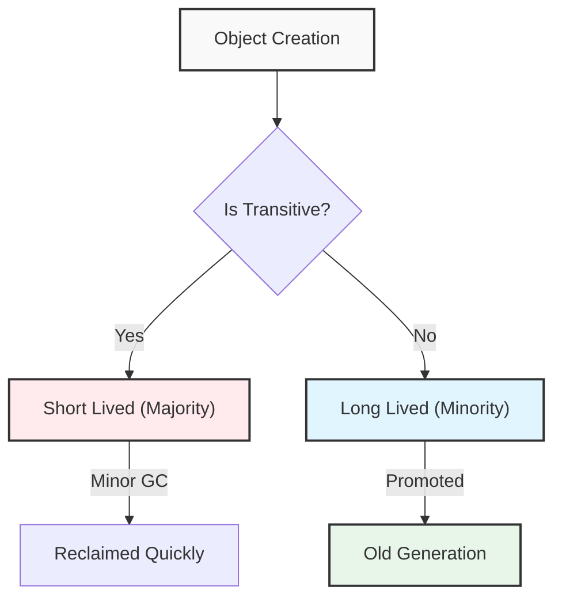
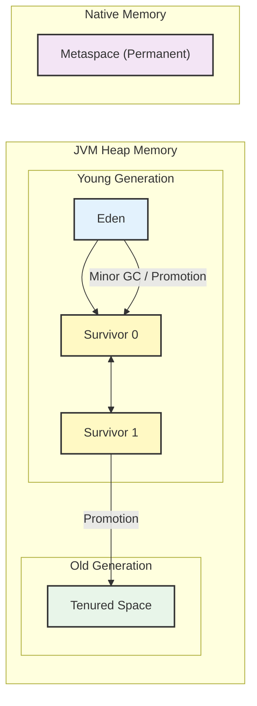

## 1. 개요

자바 애플리케이션의 성능과 안정성은 **메모리 관리**에 크게 의존한다. C/C++와 달리 자바는 개발자가 메모리를 직접 해제하지 않고, **가비지 컬렉터(Garbage Collector, 이하 GC)** 가 이 역할을 대신한다.

JVM 런타임 메모리 중 가장 큰 비중을 차지하는 **힙(Heap)** 영역은 객체(Instance)가 생성되고 소멸하는 주 무대다. 오늘은 GC가 힙을 효율적으로 관리하기 위해 사용하는 **세대 단위 컬렉션 이론(Generational Collection Theory)** 과 내부 동작 원리를 알아보자.

## 2. GC의 이론적 배경: 세대 단위 가설

GC가 모든 객체를 전수 조사하여 메모리를 해제하는 것은 비용이 매우 크다. 따라서 효율성을 위해 **세대 단위 가설(Generational Hypothesis)** 을 기반으로 메모리 영역을 분리하여 관리한다.

### 2.1 약한 세대 가설 (Weak Generational Hypothesis)

* **대다수의 객체는 생성 후 금방 접근 불가능 상태(Unreachable)가 된다.**
* 지역 변수, 임시 연산 결과 등은 스코프(Scope)를 벗어나는 즉시 수명을 다한다.
* 이 가설 덕분에 신규 객체가 생성되는 영역(Young Generation)에서 빈번한 GC가 발생하더라도 전체 시스템에 큰 부하를 주지 않고 빠르게 회수할 수 있다.

### 2.2 강한 세대 가설 (Strong Generational Hypothesis)

* **오래 살아남은 객체는 앞으로도 오래 살아남을 가능성이 높다.**
* 여러 GC 주기에서 생존한 객체는 전역 설정 정보나 커넥션 풀 등 지속적으로 사용되는 자원일 확률이 높다.



> **Deep Dive: 세대 간 참조 (Cross-Generational Reference)**
> 
> 드물게 Old 영역의 객체가 Young 영역의 객체를 참조하는 경우가 발생한다. 이를 처리하기 위해 JVM은 **Card Table**이라는 별도의 메모리 구조를 사용하여, Minor GC 수행 시 Old 영역 전체를 스캔하지 않고 Card Table만 확인하여 참조 여부를 판단한다.
{: .prompt-info }

## 3. HotSpot JVM 힙(Heap) 아키텍처

HotSpot JVM은 힙 영역을 크게 **Young Generation**과 **Old Generation**으로 물리적으로 분리한다.

### 3.1 메모리 구조 다이어그램



### 3.2 Young Generation의 상세 구조

Young 영역은 효율적인 메모리 회수와 **단편화(Fragmentation)** 해결을 위해 3개의 서브 영역으로 나뉜다.

1. **Eden**: `new` 연산자로 생성된 객체가 최초로 할당되는 곳.
2. **Survivor 0 / Survivor 1**: Minor GC에서 살아남은 객체들이 이동하는 완충 지대.

> **Deep Dive: 왜 Survivor 영역이 2개인가? (Copying Algorithm)**
> 
> 메모리 단편화 문제를 해결하기 위함이다. 마크-앤-스윕(Mark and Sweep)만 수행하면 해제된 객체 자리에 '구멍(Hole)'이 생겨, 총량은 충분해도 연속된 공간이 부족해 큰 객체를 할당하지 못하는 문제가 발생한다.
> JVM은 살아남은 객체들을 비어있는 Survivor 영역(To-Space)으로 **복사(Copy) 및 정렬(Compact)** 하여 단편화를 0으로 만든다. 이 과정에서 Survivor 영역 하나는 반드시 비워져 있어야 한다[^1].
{: .prompt-info }

## 4. 객체의 생명주기 및 GC 프로세스

객체는 생성부터 소멸까지 다음과 같은 과정을 거친다.

1. **할당 (Allocation)**: 객체가 Eden 영역에 생성된다.
2. **Minor GC**: Eden이 가득 차면 Minor GC가 발생한다.
* 참조되지 않는 객체는 즉시 제거된다(대부분 여기서 소멸).
* 살아남은 객체는 **Survivor 영역(S0 또는 S1)** 으로 이동한다.


3. **Aging (나이 먹기)**: Survivor 영역에서 Minor GC를 버틸 때마다 객체의 **Age Bit**가 증가한다.
* 객체의 Age 정보는 **Object Header**에 저장된다.


4. **승격 (Promotion)**: Age가 특정 임계값(MaxTenuringThreshold, 기본 15)을 초과하면 **Old Generation**으로 이동한다.
5. **Major/Full GC**: Old 영역이 가득 차면 발생하며, 힙 전체를 청소한다. 시간이 오래 걸리며, 이 동안 애플리케이션이 멈추는 **Stop-The-World**가 발생할 수 있다.

> **위험:** Full GC가 너무 빈번하게 발생하면 서비스 응답 지연(Latency)이 치명적으로 증가한다. 이는 힙 메모리 크기 튜닝이나 코드 레벨의 최적화가 필요하다는 신호다.
{: .prompt-danger }

## 5. Metaspace와 Spring Framework

Java 8 이전에는 **Permanent Generation (PermGen)** 이라는 힙 내부 영역에 클래스 메타데이터를 저장했다. 하지만 `OutOfMemoryError: PermGen space` 오류가 빈번하여, Java 8부터는 **Metaspace**라는 Native Memory 영역으로 변경되었다.

### 5.1 Metaspace의 역할

* **로드된 클래스 정보**: 클래스 이름, 메서드 정보, 필드 정보 등.
* **Static 변수**: 정적 변수들이 저장된다.
* **Runtime Constant Pool**: 상수 풀 정보.

### 5.2 Spring과 Reflection 이슈

Spring Framework는 런타임에 **Reflection** 기술을 사용하여 동적으로 빈(Bean)을 생성하고 관리한다. 이 과정에서 수많은 프록시(Proxy) 클래스가 생성되며, 이는 Metaspace에 저장된다.

만약 Metaspace 크기를 제한하지 않거나 너무 작게 설정하면, 동적 클래스 생성 과정에서 Native Memory가 고갈되어 시스템 장애로 이어질 수 있다.

## 6. 구현 및 튜닝 (Java & JVM Options)

메모리 관리 효율을 확인하기 위한 예제 코드와 JVM 옵션이다.

### 6.1 JVM 실행 옵션 예시

```bash
# 초기 힙 크기(Xms)와 최대 힙 크기(Xmx)를 2GB로 고정 (운영 환경 권장)
# Metaspace 크기 제한 설정
java -Xms2048m -Xmx2048m -XX:MaxMetaspaceSize=256m -jar my-app.jar
```

### 6.2 GC 유발 및 모니터링 테스트 코드

이 코드는 의도적으로 짧은 생명주기의 객체(Eden)와 긴 생명주기의 객체(Old)를 생성한다.

```java
import java.util.ArrayList;
import java.util.List;

public class GCSimulation {
    // Old Generation으로 승격될 가능성이 높은 정적 리스트 (강한 참조 유지)
    private static List<byte[]> oldGenObjects = new ArrayList<>();

    public static void main(String[] args) throws InterruptedException {
        System.out.println("GC Simulation Started...");

        // 무한 루프를 통해 지속적인 메모리 할당 시도
        while (true) {
            // 1. Eden 영역에 할당되었다가 금방 사라질 객체 (Weak Generational Hypothesis)
            allocateShortLivedObjects();

            // 2. 가끔씩 Old Generation으로 승격될 객체 생성 (오래 살아남음)
            // 1MB 크기의 바이트 배열 할당
            oldGenObjects.add(new byte[1024 * 1024]); 

            // 모니터링을 위해 잠시 대기
            Thread.sleep(100);
            
            // 메모리 누수 방지를 위해 일정 크기 이상이면 비움 (Full GC 유도 후 해제)
            if (oldGenObjects.size() > 100) {
                System.out.println("Clearing Old Gen candidates to prevent OOM...");
                oldGenObjects.clear();
            }
        }
    }

    private static void allocateShortLivedObjects() {
        // 지역 변수로 생성되므로 메소드 종료 시 Unreachable 상태가 됨
        // Eden 영역에 할당되었다가 다음 Minor GC 때 수거됨
        for (int i = 0; i < 1000; i++) {
            byte[] shortLived = new byte[1024]; // 1KB
        }
    }
}

```

> **Tip:** 운영 환경에서는 `-verbose:gc` 옵션이나 VisualVM, Pinpoint 같은 APM 도구를 사용하여 힙 사용량(Eden vs Old) 추이를 반드시 모니터링해야 한다.
{: .prompt-tip }

---

## 💡 Quiz: 학습 내용 확인하기

**Q1. Survivor 영역을 두 개(S0, S1)로 나누어 운영하는 주된 이유는 무엇인가?**

<details>
<summary>정답 확인</summary>
<div>
메모리 단편화(Fragmentation)를 방지하기 위해서이다. 살아남은 객체들을 한쪽 Survivor 영역으로 몰아서 복사(Copy & Compact)함으로써 연속된 메모리 공간을 확보한다.
</div>
</details>

**Q2. Java 8 이후 Permanent Generation이 사라지고 도입된 영역의 이름과 특징은?**

<details>
<summary>정답 확인</summary>
<div>
Metaspace이다. 기존 힙 메모리 내부가 아닌 Native Memory 영역을 사용하며, 클래스 메타데이터와 정적 변수 등을 저장한다. 시스템 메모리가 허용하는 한 유동적으로 크기가 조정될 수 있다.
</div>
</details>

**Q3. 약한 세대 가설(Weak Generational Hypothesis)의 핵심 내용은?**

<details>
<summary>정답 확인</summary>
<div>
대부분의 객체는 생성된 후 곧바로 접근 불가능(Unreachable) 상태가 되어 사라진다는 가설이다. 이는 Eden 영역에서 빈번한 GC가 효율적인 이유가 된다.
</div>
</details>

---

[^1]:Survivor 영역은 항상 둘 중 하나는 비어 있는(Empty) 상태를 유지해야 하며, 이 과정을 통해 단편화 없는 깨끗한 메모리 상태를 유지한다.