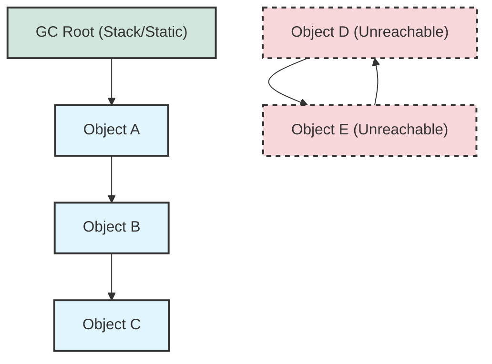
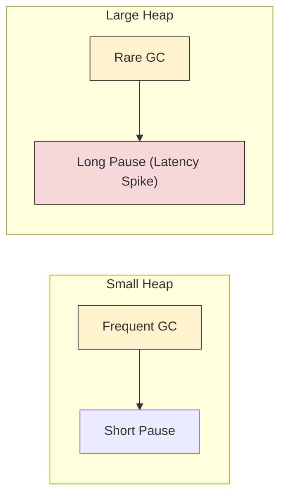

## 1. 개요

Java의 메모리 관리 메커니즘에서 가장 중요한 질문은 "이 객체는 여전히 유효한가?"이다. 과거의 참조 횟수 계산(Reference Counting) 방식은 순환 참조(Circular Reference) 문제를 해결하지 못하는 한계가 있었다.

현대 JVM은 이를 해결하기 위해 **도달 가능성 분석(Reachability Analysis)** 알고리즘을 채택했다. 이 방식은 **루트 객체(GC Root)**[^1]라는 시작점에서 출발하여 참조 체인을 따라가며, 도달할 수 있는 객체는 '생존(Reachable)', 도달할 수 없는 객체는 '수거 대상(Unreachable)'으로 간주한다.

## 2. 도달 가능성 분석의 원리

도달 가능성 분석은 그래프 탐색 알고리즘과 유사하다. 루트에서 시작하여 참조된 모든 객체를 탐색하고 마킹(Marking)한다. 이 과정에서 참조가 끊어진 객체들은 가비지 컬렉터의 수거 대상이 된다.

### 2.1 참조 체인 시각화



위 그림에서 `Object A`, `B`, `C`는 GC Root로부터 연결되어 있으므로 생존한다. 반면 `Object D`와 `E`는 서로를 참조하고 있지만(순환 참조), GC Root로부터 도달할 수 없으므로 수거 대상이 된다.

> **Deep Dive: Tri-color Marking Algorithm**
> 
> JVM은 도달 가능성 분석을 위해 **Tri-color Marking** 알고리즘을 주로 사용한다.
> * **White**: 아직 방문하지 않음 (수거 대상 후보).
> * **Gray**: 방문했으나, 참조하는 자식 노드를 아직 모두 탐색하지 않음.
> * **Black**: 본인과 자식 노드까지 모두 탐색 완료 (생존 확실).
> 
> 이 과정은 애플리케이션 스레드가 멈추는 STW(Stop-The-World) 상태 혹은 동시(Concurrent) 단계에서 수행된다.
{: .prompt-info }

## 3. GC Root의 종류

도달 가능성 분석의 핵심은 "어디서 탐색을 시작하는가?"이다. 이를 **GC Root**라고 하며, JVM 명세에서는 다음과 같은 영역들이 GC Root가 될 수 있다고 정의한다.

### 3.1 스택 프레임(Stack Frame)의 로컬 변수

메서드 실행 시 생성되는 스택 프레임 내부의 로컬 변수(참조 변수)는 가장 일반적인 GC Root다.

* 메서드가 종료되어 스택 프레임이 팝(Pop)되면, 해당 참조도 사라진다.
* 따라서 메서드 실행 중에만 유효한 임시 객체들의 생명주기를 결정한다.

### 3.2 메서드 영역(Method Area)의 정적(Static) 변수

`static` 키워드로 선언된 클래스 변수는 메서드 영역에 저장된다.

* 클래스가 로딩된 후 언로딩될 때까지 유지되므로, **애플리케이션이 종료될 때까지 살아남는 경우가 많다.**
* `static` 컬렉션에 객체를 계속 추가하고 비우지 않으면 **메모리 누수(Memory Leak)** 의 주원인이 된다.

### 3.3 JNI 참조 및 동기화 객체

* **JNI(Java Native Interface) References**: 네이티브 코드(C/C++)에서 생성하여 관리하는 참조 객체.
* **Monitor (Synchronized)**: `synchronized` 블록에 의해 잠금(Lock)이 걸린 객체는 절대 수거되지 않는다.

> **주의:** `synchronized`로 락이 걸린 객체는 참조가 끊겨도 GC 대상에서 제외된다. 데드락 상황에서 메모리 누수까지 유발할 수 있으므로 주의해야 한다.
{: .prompt-warning }

## 4. 구현 및 시뮬레이션 (Java)

GC Root의 동작 방식을 코드로 확인해보자. `LocalVariableRoot`는 메서드 종료 시 수거되지만, `StaticRoot`는 계속 유지된다.

```java
import java.util.ArrayList;
import java.util.List;

public class ReachabilitySimulation {

    // 1. Static Root: 클래스 레벨의 참조 (GC 되지 않음)
    // Method Area에 위치하며, 프로그램 종료 시까지 유지됨
    private static List<Object> staticContainer = new ArrayList<>();

    public static void main(String[] args) {
        // 지역 변수 시뮬레이션
        processLocalData(); 
        
        // 정적 변수 시뮬레이션
        processStaticData();
        
        // GC 유도 (보장되지는 않으나 힌트를 줌)
        System.gc(); 
        
        System.out.println("GC 요청 완료. JVisualVM 등을 통해 힙 덤프를 확인하면 staticContainer 내부 객체는 살아있음을 볼 수 있다.");
    }

    private static void processLocalData() {
        // 2. Stack Root: 지역 변수
        // 이 메서드가 실행되는 동안 'localData'는 GC Root 역할을 함.
        Object localData = new Object();
        System.out.println("Local Data created: " + localData);
        
        // 메서드 종료(return) 시 스택 프레임이 파괴되면서
        // localData에 대한 참조가 사라지고, 힙의 Object는 Unreachable 상태가 됨.
    }

    private static void processStaticData() {
        // 객체를 생성하여 정적 리스트에 추가
        Object persistentData = new Object();
        staticContainer.add(persistentData);
        
        // 메서드가 종료되어도 staticContainer(GC Root)가 참조하고 있으므로
        // persistentData는 Reachable 상태로 유지됨.
        System.out.println("Static Data added. Size: " + staticContainer.size());
    }
}

```

## 5. 힙 크기와 GC 성능의 상관관계

"메모리가 부족하면 힙(Heap)을 무조건 늘리면 되지 않을까?"라는 생각은 위험할 수 있다. 도달 가능성 분석 관점에서 힙 크기는 GC 성능에 직접적인 영향을 미친다.

### 5.1 Full GC와 객체 탐색 비용

Full GC가 발생하면 JVM은 살아있는 모든 객체를 마킹해야 한다.

* **Heap이 너무 작을 때**: 잦은 GC 발생으로 인한 오버헤드.
* **Heap이 너무 클 때**: 탐색해야 할 객체의 수가 기하급수적으로 늘어나, **Marking Phase** 시간이 길어진다. 이는 STW(Stop-The-World) 시간을 증가시켜 애플리케이션의 응답 지연을 초래한다.



> **Tip:** 대용량 힙을 사용할 경우 G1GC나 ZGC 같은 최신 가비지 컬렉터를 사용하여 STW 시간을 줄이는 것이 필수적이다. 단순히 힙 사이즈(`-Xmx`)만 늘리는 것은 능사가 아니다.
{: .prompt-tip }

---

## 💡 Quiz: 학습 내용 확인하기

**Q1. Java의 GC 알고리즘이 Reference Counting 대신 Reachability Analysis를 사용하는 결정적인 이유는 무엇인가?**

<details>
<summary>정답 확인</summary>
<div>
서로를 참조하는 순환 참조(Circular Reference) 객체들이 메모리에서 해제되지 않는 문제를 해결하기 위함이다. 도달 가능성 분석은 루트(Root)에서 시작하므로 순환 참조된 고립 그룹을 탐지하여 제거할 수 있다.
</div>
</details>

**Q2. `static` 키워드로 선언된 `HashMap`에 데이터를 계속 넣고 삭제하지 않았을 때 발생하는 현상은?**

<details>
<summary>정답 확인</summary>
<div>
Static 변수는 GC Root에 해당하므로, 여기에 저장된 객체들은 GC 대상이 되지 않는다. 이 상태가 지속되면 힙 메모리가 가득 차 OutOfMemoryError가 발생하며, 이를 메모리 누수(Memory Leak)라고 한다.
</div>
</details>

**Q3. `synchronized` 블록으로 락(Lock)이 걸린 객체는 GC 대상이 되는가?**

<details>
<summary>정답 확인</summary>
<div>
아니다. 동기화 락이 걸린 객체는 락이 해제될 때까지 GC Root로 간주되거나 JVM 내부에서 별도로 관리되어 수거되지 않는다.
</div>
</details>

---

[^1]:GC Root: 가비지 컬렉션의 도달 가능성 분석이 시작되는 객체들의 집합. 힙 영역 밖(스택, 메서드 영역 등)에서 힙 영역의 객체를 참조하는 지점들이다.