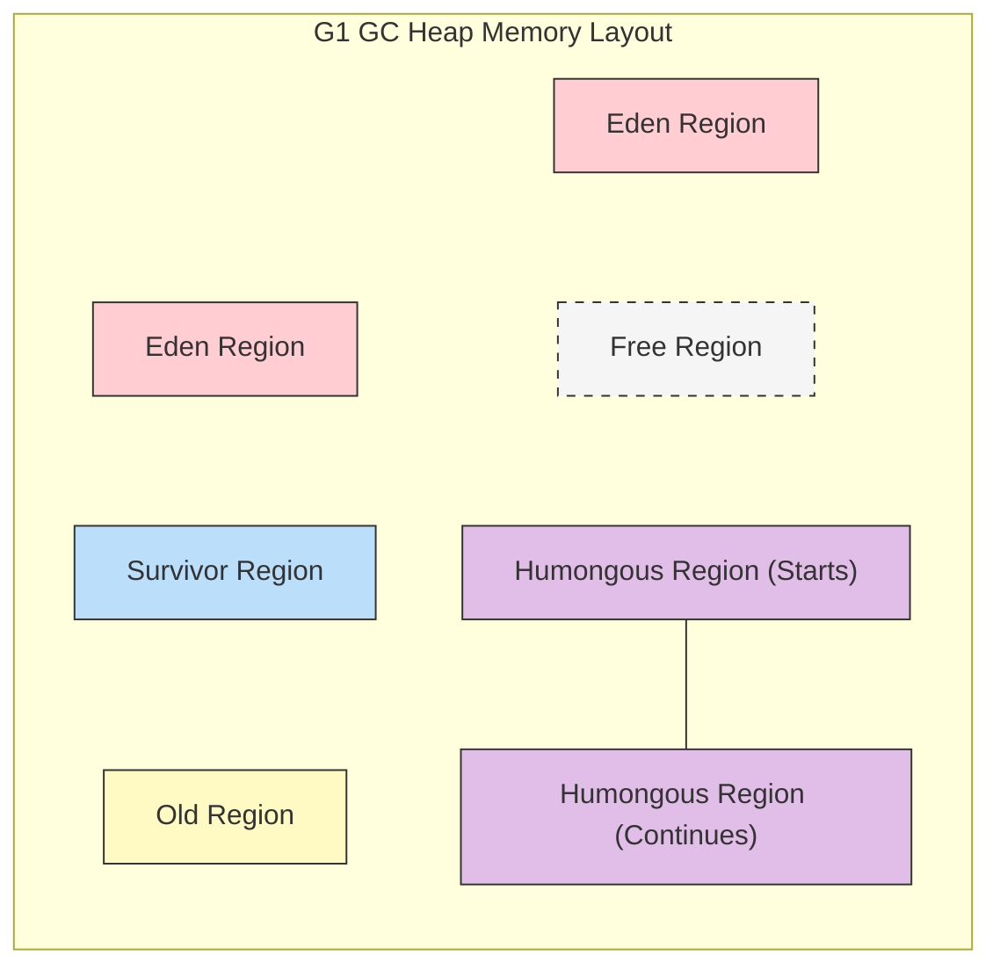

## 1. 개요

가비지 컬렉터(Garbage Collector, 이하 GC)는 JVM의 핵심 요소로, 1960년대부터 이어진 알고리즘의 발전을 토대로 진화해 왔다. 초기 컴퓨팅 환경(싱글 코어, 저용량 메모리)에 맞춰 설계된 Serial GC부터, 현대의 대용량 힙과 멀티 코어 환경을 위한 G1 GC(Garbage First GC)까지의 흐름을 이해하는 것은 성능 최적화의 첫걸음이다. 오늘은 CMS를 대체하고 표준으로 자리 잡은 G1 GC의 아키텍처와, 코드 레벨에서 관측할 수 있는 독특한 메모리 회수 현상에 대해 알아보자.

## 2. GC 알고리즘의 진화

JVM의 GC는 하드웨어의 발전에 맞춰 발전해 왔다.

### 2.1 레거시 GC (Legacy GCs)

1. **Serial GC**: 단일 스레드로 동작하며, GC 수행 시 애플리케이션의 모든 스레드를 멈춘다(Stop-The-World). CPU 코어가 하나이고 메모리가 매우 적던 시절에 적합했다.
2. **Parallel GC (Throughput GC)**: Java 8의 기본 GC. Young 영역의 GC를 멀티 스레드로 수행하여 STW 시간을 줄였으나, 여전히 전체 힙을 물리적으로 세대 구분(Generation)하여 관리했다.
3. **CMS (Concurrent Mark-Sweep)**: 애플리케이션 스레드와 동시에 GC 스레드를 실행하여 응답 시간(Latency)을 줄이는 데 집중했다. 그러나 메모리 파편화(Fragmentation) 문제와 Compaction 단계의 부재로 인해 결국 Deprecated 되었다.

### 2.2 G1 GC (Garbage First GC)

CMS를 대체하기 위해 등장했으며, Java 9부터 기본(Default) GC로 채택되었다. **4GB 이상의 대용량 힙 메모리**와 멀티 프로세서 환경에서 짧은 GC 정지 시간(Pause Time)을 보장하는 것을 목표로 한다.

> **Deep Dive: G1 GC의 탄생 배경**
> 
> 기존 세대별 GC(Generational GC)는 힙 전체를 물리적으로 Young/Old로 나누었다. 힙 크기가 수십 GB로 커질수록, Old 영역 전체를 스캔하고 정리하는 데 드는 비용(STW 시간)이 선형적으로 증가하는 문제가 발생했다. G1 GC는 이를 해결하기 위해 물리적 구획을 없애고 논리적 구획(Region) 개념을 도입했다.
{: .prompt-info }

## 3. G1 GC 아키텍처 및 동작 원리

G1 GC의 가장 큰 특징은 **Region(지역)** 개념의 도입이다.

### 3.1 Region 기반 메모리 구조

G1 GC는 힙 메모리를 물리적으로 고정된 Young/Old 영역으로 나누지 않는다. 대신 전체 힙을 일정한 크기(1MB ~ 32MB)의 **Region**이라는 작은 블록으로 분할한다. 각 Region은 동적으로 Eden, Survivor, Old, Humongous(거대 객체) 역할을 수행한다.



* **Region 크기 결정 공식**:
	* JVM 실행 시 전체 Heap 크기를 기준으로 약 **2,048개**의 Region을 생성하도록 크기가 자동 결정된다.
	* **공식**: `Region Size = Total Heap Size / 2048`
	* **제약사항**: 계산된 값은 반드시 1MB ~ 32MB 사이의 **2의 거듭제곱**(1, 2, 4, 8, 16, 32MB)이어야 한다.
	* (예: 4GB 힙의 경우, 4096MB / 2048 = **2MB**가 Region 하나의 크기가 된다.)


* **Region의 역할**:
	* **Eden/Survivor/Old**: 고정된 위치가 아니라, 필요에 따라 역할이 변하는 Region들이다.
	* **Humongous**: 거대 객체를 저장하기 위한 전용 영역이다.


> **Deep Dive: 거대 객체(Humongous Object)와 연속 할당**
> 
> G1 GC에서 **Humongous Object**는 전체 힙 크기가 아닌, **"단일 Region 크기의 50%를 초과하는 객체"**로 정의된다.
> * **할당 방식**: 만약 객체 크기가 Region 하나보다 크다면, G1 GC는 **연속된(Contiguous)** 빈 Region들을 찾아 하나의 논리적 블록으로 연결하여 할당한다.
> * **세대 구분**: Humongous Object는 Young 영역을 거치지 않고 **즉시 Old Generation**으로 간주된다.
> * **성능 이슈**: 연속된 공간을 찾지 못하면 Full GC가 유발될 수 있으므로, `-XX:G1HeapRegionSize` 옵션 튜닝이 필요할 수 있다.
{: .prompt-info }

### 3.2 Garbage First 알고리즘

이름이 'Garbage First'인 이유는 **쓰레기(Garbage)가 가장 많은 Region을 우선적으로 청소**하기 때문이다.

1. GC는 각 Region의 생존 객체 비율을 추적한다.
2. 회수 효율(Cost-Benefit)이 가장 좋은 Region을 선별한다.
3. 해당 Region의 살아있는 객체만 다른 Region(Survivor 또는 Old)으로 복사(Copy)하고, 기존 Region을 통째로 비운다(Compact).

이 과정에서 메모리 파편화 문제가 자연스럽게 해결된다.

> **Deep Dive: Remembered Set (RSet)과 Card Table**
> 
> G1 GC가 특정 Region만 GC를 수행할 수 있는 비결은 **Remembered Set(RSet)**에 있다.
> * 만약 Region A의 객체가 Region B의 객체를 참조한다면, 전체 힙을 뒤지지 않고도 이를 알 수 있어야 한다.
> * G1은 **Card Table**이라는 자료구조를 사용하여, Old 영역의 객체가 Young 영역의 객체를 참조하는 정보를 기록한다.
> * GC 수행 시 RSet만 스캔하면 되므로 STW 시간을 획기적으로 단축할 수 있다.
{: .prompt-info }

## 4. Stack Slot 이슈와 GC 실험

이론적으로 변수의 스코프(Scope)가 종료되면 해당 객체는 GC 대상이 되어야 한다. 하지만 실제 JVM 동작에서는 스택 프레임의 **Local Variable Table(지역 변수 테이블)** 관리 방식 때문에 즉시 회수되지 않는 경우가 있다.

### 4.1 실험 코드 (Java)

아래 코드는 스코프가 끝난 후에도 `placeholder` 객체가 즉시 GC 되지 않는 현상과, 이를 강제로 해결하는 방법을 보여준다.

```java
public class G1GCTest {
    public static void main(String[] args) {
        {
            // 64MB 크기의 더미 데이터 생성 (Eden 영역 할당 유도)
            byte[] placeholder = new byte[64 * 1024 * 1024]; 
            System.out.println("Placeholder allocated.");
        } // 스코프 종료

        // Case 1: 스코프 종료 후 GC 수행 -> 회수 실패 가능성 높음
        // System.gc(); 

        // Case 2: 스코프 종료 후 다른 변수로 덮어쓰기 -> 회수 성공
        int a = 0; 
        System.gc(); 
        
        System.out.println("GC requested.");
    }
}
```

### 4.2 현상 분석 (Under the hood)

1. **스코프 종료 직후**: `placeholder` 변수의 스코프(`{}`)는 끝났지만, `main` 메서드의 **Stack Frame** 내 **Local Variable Table**의 특정 슬롯(Slot)은 여전히 `placeholder` 배열의 힙 메모리 주소를 가리키고 있다.
2. **GC 수행**: GC는 Root Set(스택, static 변수 등)을 스캔한다. 이때 해당 슬롯이 여전히 유효한 참조를 가지고 있다고 판단하여(보수적인 관점) 메모리를 회수하지 않는다.
3. **변수 덮어쓰기 (`int a = 0`)**: 새로운 변수 `a`가 선언되면, 컴파일러나 JIT는 더 이상 사용되지 않는 `placeholder`의 슬롯을 재사용하여 `0`을 쓴다.
4. **참조 끊김**: 이제 힙 영역의 64MB 배열을 가리키는 참조가 완전히 사라졌으므로, GC는 이를 정상적으로 회수한다.

> **주의:** 실무 코드에서 메모리 회수를 위해 `int a = 0;` 처럼 인위적인 코드를 넣는 것은 권장되지 않는다. 이는 JVM의 Liveness Analysis(생존 분석) 구현 특성에 기인한 것이며, 메서드가 종료되면 자연스럽게 스택 프레임이 해제되면서 해결된다.
{: .prompt-warning }

## 5. GC 로깅 및 모니터링

G1 GC의 상세 동작을 확인하기 위해서는 적절한 JVM 옵션이 필요하다.

### 5.1 JVM 옵션 (JDK 9+)

과거에는 `-verbose:gc` 등을 사용했으나, JDK 9 이후부터는 통합 로깅 시스템(Xlog)을 사용한다.

* **기본 GC 로그**: `-Xlog:gc*`
* **상세 옵션 예시**:

```bash
# GC의 상세 단계, 힙 사이즈 변화 등을 출력
java -Xlog:gc*:file=gc.log:time,uptimemillis:filecount=5,filesize=10M G1GCTest
```

### 5.2 로그 분석 포인트

* **Pause Young (Normal)**: 일반적인 Eden 영역 청소.
* **Pause Young (Concurrent Start)**: Old 영역 점유율이 임계치(Initiating Heap Occupancy Percent, 기본 45%)를 넘어서 Concurrent Marking을 시작하는 단계.
* **Pause Young (Mixed)**: Young Region과 함께 Old Region의 일부(가비지가 많은 곳)를 함께 청소하는 단계.
* **Heap Regions**: 로그에서 `Total: 123 regions, used: 100` 등의 형태로 Region 사용량을 확인할 수 있다.

> **Tip:** 소스 코드 레벨에서 JVM 내부 구조체 이름은 `Class`가 아닌 `Klass`로 표기된다(C++ 예약어 충돌 방지). GC 로그 분석이나 JVM 소스 분석 시 `Klass`라는 용어를 접한다면 Java의 클래스 메타데이터를 의미한다고 이해하면 된다.
{: .prompt-tip }

## 💡 Quiz: 학습 내용 확인하기

**Q1. G1 GC가 기존의 CMS GC와 차별화되는 가장 큰 메모리 구조적 특징은 무엇인가?**

<details>
<summary>정답 확인</summary>
<div>
물리적으로 Young/Old 영역을 고정하여 나누지 않고, <b>Region(지역)</b>이라는 논리적인 단위로 힙을 분할하여 관리한다는 점이다. 이를 통해 대용량 힙에서도 효율적인 GC가 가능하다.
</div>
</details>

**Q2. 변수의 스코프가 끝났음에도 불구하고 <code>System.gc()</code> 호출 시 메모리가 즉시 회수되지 않고, 새로운 변수를 선언해야 회수되는 현상이 발생하는 이유는 무엇인가?**

<details>
<summary>정답 확인</summary>
<div>
메서드의 스택 프레임 내 <b>Local Variable Table(지역 변수 테이블)</b>의 슬롯(Slot)이 여전히 이전 객체의 참조값을 유지하고 있기 때문이다. 새로운 변수가 선언되어 해당 슬롯을 덮어써야 참조가 끊어지고 GC 대상이 된다.
</div>
</details>

**Q3. G1 GC에서 Humongous Object로 분류되는 기준은 무엇인가?**

<details>
<summary>정답 확인</summary>
<div>
전체 힙 크기가 아닌, <b>단일 Region 크기의 50%를 초과하는 객체</b>를 의미한다. 이들은 Young 영역을 거치지 않고 Old 영역(Humongous Region)에 바로 할당된다.
</div>
</details>