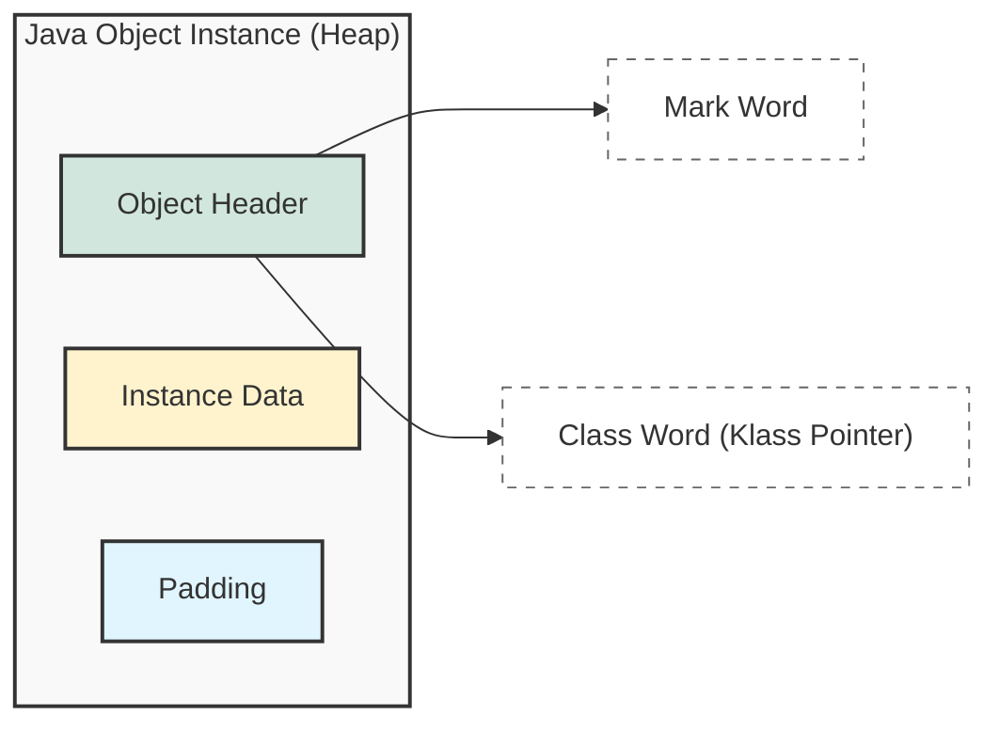
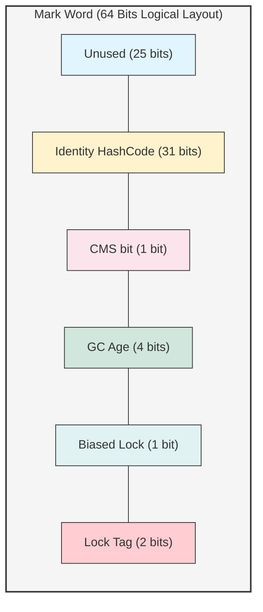
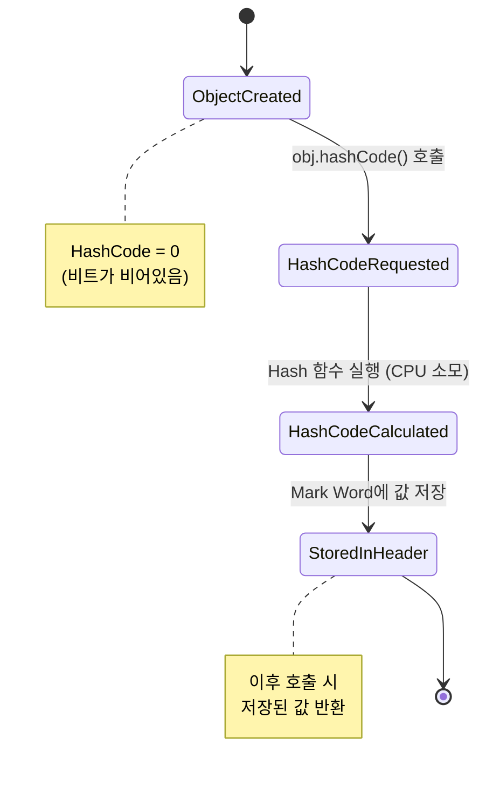

## 1. 개요

Java 개발자는 메모리 관리를 JVM에게 위임한다. 하지만 고성능 애플리케이션을 개발하거나 `OutOfMemoryError` 같은 문제에 직면했을 때, 힙(Heap) 내부에서 객체가 실제로 어떻게 구성되는지 이해하는 것은 필수적이다.

오늘은 **Java Object Layout (JOL)**을 통해 객체의 메모리 구조를 분해하고, 특히 **HashCode**가 생성되고 저장되는 시점과 위치를 통해 JVM의 최적화 전략을 심층적으로 분석한다.

## 2. Java 객체 메모리 구조 (Object Layout)

Java의 인스턴스는 힙 메모리 상에서 불연속적인 덩어리가 아니라, 매우 규칙적인 구조를 가진다. 이를 물리적 관점에서 보면 크게 세 가지 영역으로 나눌 수 있다.

1. **Object Header**: 객체의 메타 정보.
2. **Instance Data**: 실제 필드 값.
3. **Padding**: 메모리 정렬(Alignment)을 위한 채움 공간.



### 2.1 Object Header (객체 헤더)와 Mark Word의 비밀

헤더는 다시 두 가지 핵심 요소인 **Mark Word**와 **Class Word**로 구성된다. 여기서 가장 중요한 것은 **Mark Word**다.

물리적으로는 8바이트(64비트)의 단순한 메모리 덩어리처럼 보이지만, 그 내부는 **비트 단위(Bit-Level)**로 쪼개져 수많은 정보를 담고 있다.

#### **Mark Word 내부 구조 (64-bit Unlocked 기준)**

아래 다이어그램은 락(Lock)이 걸리지 않은 **Normal 상태**일 때, 64비트 Mark Word가 어떻게 구성되는지를 보여준다.



1. **Identity HashCode (31 bits)**: 객체의 고유 식별자다. 32비트가 아닌 31비트만 사용된다는 점에 유의해야 한다.
2. **GC Age (4 bits)**: GC에서 살아남은 횟수다. 4비트로 표현할 수 있는 최대값은 `1111(2)` 즉 **15**이다.
	* *이것이 Java에서 `MaxTenuringThreshold`를 15까지만 설정할 수 있는 기술적 이유다.*
3. **Biased Lock (1 bit)**: 편향 락 사용 여부 (0: 사용 안 함, 1: 사용 함).
4. **Lock Tag (2 bits)**: 현재 객체의 락 상태를 나타낸다.
	- `01`: Unlocked (잠금 없음)
    - `00`: Lightweight Locked (경량 락)
    - `10`: Heavyweight Locked (중량 락)
    - `11`: GC Marked (GC 수행 중)

> **Deep Dive: 왜 Class가 아니라 Klass인가?**
> 
> JVM의 구현체인 HotSpot은 C++로 작성되었다. C++에서 `class`는 예약어(keyword)이므로 변수명으로 사용할 수 없다. 따라서 발음이 같은 `Klass`라는 용어를 사용하여 클래스 메타데이터 포인터를 정의했다[^1].
{: .prompt-info }

> **Deep Dive: 상태에 따라 변하는 Mark Word 레이아웃**
> 
> 위 그림은 **Normal(Unlocked)** 상태일 때의 구조다. 만약 객체에 락(Lock)이 걸리면 이 레이아웃은 완전히 바뀐다.
> * **Biased Lock**: HashCode 공간에 **Thread ID**가 기록된다.
> * **Heavyweight Lock**: 64비트 전체가 **Monitor 객체의 주소(Pointer)**로 대체된다.
> 즉, Mark Word는 고정된 구조가 아니라 객체의 상태에 따라 내용을 갈아끼우는 **가변적인 컨테이너**다.
{: .prompt-info }

### 2.2 Instance Data (인스턴스 데이터)

개발자가 클래스에 선언한 필드(`int`, `long`, `reference` 등)의 실제 값이 저장되는 공간이다.

### 2.3 Padding (패딩)

JVM은 메모리 관리의 효율성을 위해 객체의 크기를 **8바이트 단위(Word size)**로 정렬(Alignment)한다. 만약 헤더와 데이터의 합이 8의 배수가 아니라면, 남은 공간을 빈 데이터로 채워 크기를 맞추는데 이를 패딩이라 한다.

## 3. Mark Word와 HashCode의 동작 메커니즘

Mark Word는 앞서 본 것처럼 제한된 비트 공간을 효율적으로 사용해야 한다. 따라서 **HashCode의 저장 방식**에도 최적화 전략이 숨어 있다.

### 3.1 HashCode의 지연 초기화 (Lazy Initialization)

C/C++ 개발자는 메모리 주소를 객체의 식별자로 사용하지만, Java는 메모리 주소를 직접 다룰 수 없다. 대신 JVM은 `Identity HashCode`를 제공하여 객체의 유일성을 보장한다.

중요한 점은 **객체 생성 시점에는 HashCode가 계산되지 않는다**는 것이다. HashCode는 불필요한 CPU 연산을 줄이기 위해 실제 요청(`obj.hashCode()`)이 있을 때 계산되어 Mark Word에 기록된다.



> **주의:** `Identity HashCode`는 한 번 계산되어 Mark Word에 기록되면, 해당 객체의 수명 주기 동안 변하지 않는다. 하지만 `Lock` 상태로 전환될 때 저장 공간 부족으로 인해 HashCode가 다른 곳(Monitor 객체 등)으로 백업되거나 이동할 수 있다.
{: .prompt-warning }

### 3.2 Lock Flags와 동기화

Mark Word는 `synchronized` 키워드를 사용한 동기화 처리를 위해 락(Lock) 정보를 저장한다.

* **Biased Lock / Lightweight Lock (Spin Lock)**: 사용자 레벨에서 처리 가능한 가벼운 락.
* **Heavyweight Lock (Mutex)**: OS 커널의 도움을 받아야 하는 무거운 락. 문맥 교환(Context Switch) 비용이 발생한다.

## 4. JOL(Java Object Layout)을 이용한 실습

실제 메모리 구조를 눈으로 확인하기 위해 `openjdk.jol` 라이브러리를 사용한다.

### 4.1 의존성 추가 (Maven)

```xml
<dependency>
    <groupId>org.openjdk.jol</groupId>
    <artifactId>jol-cli</artifactId>
    <version>0.17</version>
</dependency>
```

### 4.2 실습 코드 (Java)

HashCode 호출 전후의 객체 헤더 변화를 관찰하는 코드다.

```java
import org.openjdk.jol.info.ClassLayout;

class MyData {
    int value = 10; // 4 bytes
}

public class JOLTest {
    public static void main(String[] args) {
        MyData obj = new MyData();

        // 1. 객체 생성 직후 (HashCode 호출 전)
        System.out.println("=== 1. Before HashCode Call ===");
        System.out.println(ClassLayout.parseInstance(obj).toPrintable());

        // 2. HashCode 호출
        int hashCode = obj.hashCode();
        System.out.println("Calculated HashCode: " + Integer.toHexString(hashCode));

        // 3. HashCode 호출 후 (헤더 변화 확인)
        System.out.println("=== 2. After HashCode Call ===");
        System.out.println(ClassLayout.parseInstance(obj).toPrintable());
    }
}

```

### 4.3 결과 분석

**1. HashCode 호출 전**
Mark Word 영역(OFFSET 0~8)을 보면 대부분 `00`으로 비어 있거나, 기본 설정 값만 들어있다.

**2. HashCode 호출 후**
`obj.hashCode()`가 실행되면 JVM은 고유 값을 계산하여 Mark Word의 비트 공간(앞서 다이어그램에서 본 31bit 영역)에 기록한다. 두 번째 출력 결과의 Mark Word 부분을 보면, 앞서 출력된 `Calculated HashCode` 값(Hex)이 리틀 엔디안(Little Endian) 방식으로 박혀있는 것을 확인할 수 있다.

> **Tip:** **리틀 엔디안(Little Endian)** 시스템에서는 바이트 순서가 뒤집혀 보일 수 있다. 예를 들어 해시코드가 `0x12345678`이라면 메모리에는 `78 56 34 12` 순서로 보일 것이다. JOL 출력 해석 시 이 점을 유의해야 한다.
{: .prompt-tip }

## 5. 결론

Java 객체는 단순히 힙에 떠 있는 데이터 덩어리가 아니다. JVM은 **Object Header**라는 제한된 64비트 공간 안에 GC 상태, 해시코드, 락 정보 등을 비트 단위로 정교하게 관리하며, **Padding**을 통해 메모리 접근 효율을 최적화한다.

* **HashCode는 지연 초기화된다**: 생성 즉시 계산되지 않으며, `hashCode()` 메서드가 호출될 때 계산되어 헤더에 저장된다.
* **JOL은 강력한 디버깅 도구다**: 동시성 문제나 메모리 최적화 이슈를 다룰 때, 객체의 상태를 비트 레벨에서 확인할 수 있게 해준다.

---

## 💡 Quiz: 학습 내용 확인하기

**Q1. Java 객체 메모리 레이아웃에서 8바이트 단위로 크기를 맞추기 위해 채워넣는 공간을 무엇이라 하는가?**

<details>
<summary>정답 확인</summary>
<div>
Padding (패딩)
</div>
</details>

**Q2. 객체의 HashCode는 객체가 생성되는 즉시 계산되어 Mark Word에 저장된다. (O/X)**

<details>
<summary>정답 확인</summary>
<div>
X (객체 생성 시점이 아니라, hashCode() 메서드가 최초로 호출될 때 계산되어 저장됩니다.)
</div>
</details>

**Q3. GC Age가 4비트로 저장됨으로써 가지는 최대값(MaxTenuringThreshold)은 얼마인가?**

<details>
<summary>정답 확인</summary>
<div>
15 (2^4 - 1 = 15)
</div>
</details>

---

[^1]:HotSpot JVM 소스 코드에서 메타데이터를 관리하는 구조체 이름이 `Klass`로 정의되어 있다.