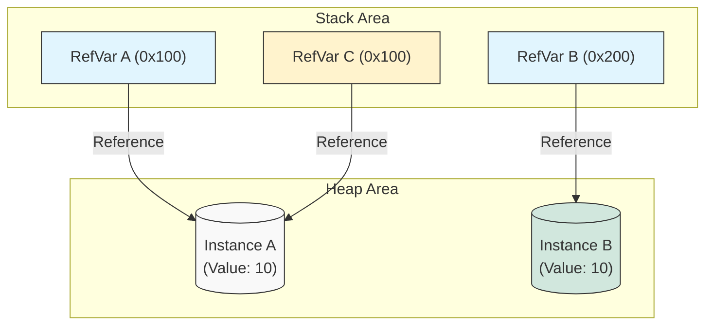

## 1. 개요: 인스턴스와 참조의 분리

Java 프로그래밍에서 '같다'라는 개념은 두 가지 차원에서 해석된다. JVM의 Heap 영역에 생성된 **인스턴스(Instance)** 그 자체와, 이를 가리키는 Stack 영역의 **참조 변수(Reference Variable)** 사이의 관계를 명확히 이해해야 한다.

C/C++ 언어의 포인터와 유사하게, Java의 참조 변수는 실제 데이터가 저장된 메모리 주소를 가리킨다. 하지만 JVM은 개발자가 실제 물리 메모리 주소에 접근하는 것을 허용하지 않으며, 대신 객체 식별을 위한 **해시코드(HashCode)** 시스템을 제공한다.

## 2. 메모리 아키텍처와 객체 식별

두 변수가 '같다'고 할 때, 그것이 **"같은 대상을 가리키는가"**인지 **"대상의 내용이 같은가"**인지는 메모리 구조를 통해 시각화할 때 가장 명확해진다.



* **RefVar A**와 **RefVar C**는 동일한 인스턴스(`Instance A`)를 가리킨다. (동일성 성립)
* **RefVar A**와 **RefVar B**는 서로 다른 인스턴스를 가리키지만, 내부 값(10)은 같다. (동등성 성립 가능)

> **Deep Dive: JVM의 HashCode 생성 전략**
> 
> `Object.hashCode()`는 기본적으로 객체의 내부 주소 값을 기반으로 생성된다고 알려져 있으나, 실제 HotSpot JVM 구현에서는 단순히 메모리 주소를 반환하지 않는다.
> 객체의 헤더(Mark Word)에 저장된 해시 값을 반환하거나, 난수 생성 알고리즘(XOR-Shift 등)을 사용하여 스레드 안전하게 생성한다. 따라서 해시코드는 "논리적인 메모리 주소 식별자" 역할을 한다.
{: .prompt-info }

## 3. 동일성(Identity) vs 동등성(Equality)

Java에서는 객체 비교를 위해 두 가지 개념을 엄격히 구분한다.

### 3.1 동일성 (Identity): `==` 연산자

* **정의**: 두 참조 변수가 물리적으로 **같은 메모리 주소**를 가리키고 있는가?
* **동작**: 스택에 저장된 참조 값(Reference Value) 자체를 비교한다.
* **특징**: `RefA == RefC`는 `true`이지만, `RefA == RefB`는 내용이 같아도 주소가 다르므로 `false`다.

### 3.2 동등성 (Equality): `equals()` 메서드

* **정의**: 두 인스턴스가 논리적으로 **같은 정보(내용)**를 담고 있는가?
* **동작**: `Object` 클래스의 기본 `equals()`는 내부적으로 `==` 연산을 수행한다. 즉, 오버라이딩(재정의)하지 않으면 동일성 비교와 똑같이 동작한다.
* **필요성**: 서로 다른 인스턴스라도(`new`로 각각 생성됨), 내부 필드 값이 같다면 '같은 객체'로 취급해야 하는 비즈니스 로직(예: 값 객체, VO)을 위해 재정의가 필요하다.

> **주의:** `String` 클래스는 이미 `equals()`가 재정의되어 있어 내용 비교가 가능하다. 하지만 개발자가 직접 만든 클래스(Custom Class)는 반드시 직접 재정의해야 한다.
{: .prompt-warning }

## 4. 구현: 올바른 equals() 재정의

강의 예제에 나온 `Minion` 클래스를 통해 올바른 비교 로직을 구현해 보자.

### 4.1 잘못된 비교 (기본 구현 사용)

```java
public class Minion {
    private int id;
    private String name;

    public Minion(int id, String name) {
        this.id = id;
        this.name = name;
    }

    public static void main(String[] args) {
        // 내용은 같지만 서로 다른 메모리에 할당된 두 객체
        Minion m1 = new Minion(1, "Kevin");
        Minion m2 = new Minion(1, "Kevin");

        // [Identity Check] 주소값 비교 -> false
        if (m1 == m2) {
            System.out.println("참조가 같습니다.");
        } else {
            System.out.println("참조가 다릅니다."); 
        }

        // [Equality Check] Object의 기본 equals는 ==과 같음 -> false
        if (m1.equals(m2)) {
            System.out.println("논리적으로 같습니다.");
        } else {
            System.out.println("논리적으로 다릅니다."); 
        }
    }
}

```

### 4.2 올바른 비교 (재정의)

`equals()`를 재정의할 때는 **반사성, 대칭성, 추이성, 일관성, null 아님**의 5가지 규약을 준수해야 한다. 또한 `hashCode()`도 반드시 함께 재정의해야 컬렉션 프레임워크(HashMap, HashSet 등)에서 오동작을 방지할 수 있다[^1].

```java
import java.util.Objects;

public class Minion {
    private int id;
    private String name;

    public Minion(int id, String name) {
        this.id = id;
        this.name = name;
    }

    @Override
    public boolean equals(Object o) {
        // 1. 주소값(Identity)이 같으면 무조건 true (성능 최적화)
        if (this == o) return true;
        
        // 2. null이거나 클래스 타입이 다르면 false
        if (o == null || getClass() != o.getClass()) return false;
        
        // 3. 타입 캐스팅 후 실제 필드 값(내용) 비교
        Minion minion = (Minion) o;
        
        // primitive 타입은 == 비교, reference 타입은 equals 비교
        // id => int, name => String
        return id == minion.id && 
               Objects.equals(name, minion.name);
    }

    @Override
    public int hashCode() {
        // equals()에 사용된 필드를 이용하여 해시코드 생성
        return Objects.hash(id, name);
    }
}

```

> **Tip:** IntelliJ IDEA나 Eclipse 같은 IDE는 `Generate` 기능을 통해 `equals()`와 `hashCode()` 메서드를 규약에 맞게 자동으로 생성해 주는 기능을 제공한다.
{: .prompt-tip }

### 4.3 구현 로직 심층 분석 (Deep Dive)

위 코드의 `3. 타입 캐스팅 후 실제 필드 값 비교` 부분은 객체 비교의 핵심 로직이다. 이 코드가 왜 필요한지 상세히 분석한다.

**1. 다운캐스팅 (Downcasting)의 이유**

* `equals(Object o)` 메서드의 매개변수는 모든 클래스의 최상위 부모인 `Object` 타입이다.
* `Object` 타입의 참조 변수로는 자식 클래스인 `Minion`의 고유 필드(`id`, `name`)에 접근할 수 없다(보이지 않는다).
* 따라서 `Minion minion = (Minion) o;`와 같이 **명시적 형변환(Casting)** 을 수행해야만 비교 대상 객체의 필드 값을 꺼내올 수 있다.
* *주의: 형변환 전 반드시 `getClass()`나 `instanceof`로 타입 일치 여부를 확인해야 `ClassCastException`을 방지할 수 있다.*


**2. 필드별 비교 전략 (Primitive vs Reference)**

* **기본형(Primitive Type)**: `int id`와 같은 기본형 변수는 메모리(Stack)에 실제 값이 저장된다. 따라서 `==` 연산자로 값을 직접 비교하는 것이 가장 빠르고 정확하다.
* **참조형(Reference Type)**: `String name`과 같은 참조형 변수는 주소값을 가지므로, 내용 비교를 위해 `equals()`를 사용해야 한다.

> **Deep Dive: 왜 `name.equals()` 대신 `Objects.equals()`를 쓰는가?**
> 
> `name.equals(minion.name)`을 직접 호출할 때, 만약 내 객체의 `name` 필드가 `null`이라면 **`NullPointerException`**이 발생하여 프로그램이 비정상 종료된다.
> 반면, `java.util.Objects.equals(a, b)` 유틸리티 메서드는 내부적으로 `null` 체크를 수행한다.
> 따라서 필드 값이 `null`이어도 안전하게 비교(Null-safe)할 수 있다.
{: .prompt-info }

```java
// Objects.equals 내부 구현
public static boolean equals(Object a, Object b) {
    return (a == b) || (a != null && a.equals(b));
}
```

## 5. 결론

Java에서 객체의 "같음"을 논할 때는 항상 **"주소가 같은가(Identity)?"** 아니면 **"내용이 같은가(Equality)?"**를 명확히 구분해야 한다.

* 단순히 `new`로 생성된 객체들을 `==`로 비교하면, 내용이 같아도 항상 `false`가 반환된다.
* 비즈니스 로직상 내용 비교가 필요하다면 반드시 `equals()`를 재정의하여 논리적 동등성을 보장해야 한다.

---

## 💡 Quiz: 학습 내용 확인하기

**Q1. `Object` 클래스의 기본 `equals()` 메서드는 내부적으로 어떤 연산자를 사용하여 비교하는가?**

<details>
<summary>정답 확인</summary>
<div>
== 연산자 (즉, 메모리 주소를 비교하는 동일성 비교를 수행한다.)
</div>
</details>

**Q2. 두 객체의 `equals()` 결과가 `true`일 때, 두 객체의 `hashCode()` 값은 달라야 하는가, 같아야 하는가?**

<details>
<summary>정답 확인</summary>
<div>
반드시 같아야 한다. Java 규약상 equals()가 true인 두 객체는 같은 hashCode() 값을 반환해야 Hash 기반 컬렉션에서 정상적으로 동작한다.
</div>
</details>

**Q3. 기본형(Primitive Type)인 `int`형 변수 `a`와 `b`를 비교할 때 `equals()` 메서드를 사용할 수 없는 이유는?**

<details>
<summary>정답 확인</summary>
<div>
기본형은 객체(Object)가 아니므로 메서드를 가질 수 없다. 따라서 항상 == 연산자를 통해 값을 비교해야 한다.
</div>
</details>

---

[^1]:`equals`가 `true`인 두 객체는 반드시 같은 `hashCode`를 가져야 한다는 Java의 규약(Contract) 때문이다. 이를 어길 경우 `HashSet`이나 `HashMap`의 키로 사용할 때 객체를 찾지 못하는 버그가 발생한다.