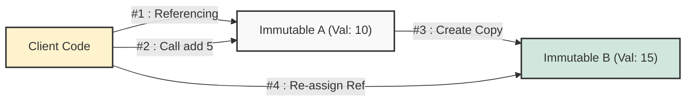

## 1. 개요

소프트웨어 개발, 특히 동시성 프로그래밍에서 '상태(State)'를 관리하는 것은 매우 까다로운 문제다. 불변 객체(Immutable Object)는 객체 생성 후 내부 상태를 변경할 수 없도록 강제함으로써 이러한 복잡성을 근본적으로 해결하는 디자인 패턴이다.

일반적인 객체(Mutable)가 `set` 메서드를 통해 내부 값을 변경한다면, 불변 객체는 **"변경이 필요할 때 새로운 객체를 생성"**하는 방식으로 동작한다. 이는 다소 비효율적으로 보일 수 있으나, 데이터의 무결성(Integrity)을 보장하는 강력한 수단이 된다.

## 2. 아키텍처 및 동작 원리

불변 객체의 핵심은 **Read-Only**다. 모든 필드는 `final`로 선언되어 초기화 이후 재할당이 불가능하며, 외부에서의 쓰기(Write) 시도는 컴파일 에러를 유발한다.

### 2.1 상태 변경 매커니즘: Copy-on-Write

불변 객체의 값을 '수정'하는 논리적 행위는 실제로는 **'변형된 사본 생성'**으로 구현된다. 기존 객체는 그대로 둔 채(불변), 변경된 값을 가진 새로운 인스턴스를 반환한다.



> **Deep Dive: 원자성(Atomicity)의 보장**
> 
> 원자성이란 일련의 연산이 하나의 단위로 실행되어, 중간 상태가 외부에 노출되지 않음을 의미한다.
> 불변 객체는 생성자가 완료되는 시점에 완벽한 상태를 갖추며, 이후 상태가 변하지 않는다. 따라서 여러 스레드가 동시에 접근하더라도 **"완전한 상태"** 혹은 **"참조하지 않음"** 중 하나만 존재할 뿐, "수정 중인 깨진 상태"를 참조할 가능성이 없다[^1].
{: .prompt-info }

## 3. 구현 (Java)

불변 객체를 설계하기 위해서는 다음과 같은 엄격한 규칙이 필요하다.

1. 모든 필드는 `private final`로 선언한다.
2. `Setter` 메서드를 제공하지 않는다.
3. 클래스를 `final`로 선언하여 상속을 통한 확장을 막는다(하위 클래스에서의 불변성 파괴 방지).
4. 가변 객체(예: List, Date)를 필드로 가질 경우, 방어적 복사(Defensive Copy)를 사용한다.

### 3.1 불변 객체 설계 예제

강의에서 언급된 `MyInt` 개념을 실무적인 형태인 `Money` 클래스로 구체화한 코드다.

```java
/**
 * 불변성을 보장하는 Money 클래스
 * 모든 필드는 final이며, 상태 변경 시 새로운 인스턴스를 반환한다.
 */
public final class Money { // 1. 상속 방지
    
    // 2. 모든 필드는 private final
    private final long amount;

    // 생성자를 통해 값을 초기화 (초기화 이후 변경 불가)
    public Money(long amount) {
        this.amount = amount;
    }

    public long getAmount() {
        return amount;
    }

    /**
     * 값을 더하는 메서드
     * 내부 상태(this.amount)를 변경하지 않고, 
     * 연산된 결과를 담은 '새로운 객체'를 반환한다.
     */
    public Money add(long extraAmount) {
        // 기존 객체는 유지하고, 새로운 상태를 가진 객체 생성 (New Instance)
        return new Money(this.amount + extraAmount);
    }

    @Override
    public String toString() {
        return "Money{amount=" + amount + "}";
    }
}
```

### 3.2 클라이언트 사용 예시

```java
public class Main {
    public static void main(String[] args) {
        Money original = new Money(1000);
        
        // original 객체의 값은 변하지 않음
        Money modified = original.add(500); 

        System.out.println("Original: " + original.getAmount()); // 1000
        System.out.println("Modified: " + modified.getAmount()); // 1500
    }
}
```

> **주의:** `add`와 같은 메서드를 호출한 후 반환값을 받지 않으면 아무런 효과가 없다. 원본 객체는 변하지 않았기 때문이다. 예: `original.add(500);`만 호출하면 힙 메모리에 객체만 생성되고 버려진다.
{: .prompt-warning }

## 4. 성능과 트레이드오프

### 4.1 멀티스레딩 환경에서의 이점

불변 객체는 `synchronized` 키워드나 락(Lock) 매커니즘이 전혀 필요 없다.

* **Context Switching 비용 감소:** 락을 획득하고 해제하는 오버헤드가 없다.
* **Side Effect 방지:** 다른 스레드가 값을 몰래 바꿀 걱정 없이 데이터를 공유할 수 있다.

### 4.2 메모리 관리와 GC (Garbage Collection)

강의 내용처럼 C/C++ 개발자 시각에서는 매번 객체를 `new`로 생성하는 것이 엄청난 낭비처럼 보일 수 있다.

* **단점:** 잦은 객체 생성은 힙(Heap) 메모리 사용량을 늘리고 GC(Garbage Collector)의 부하를 증가시킨다.
* **현대적 관점:** 현대 JVM의 GC(특히 G1GC, ZGC)는 **"생명주기가 짧은 객체(Short-lived Object)"**를 수거하는 데 매우 최적화되어 있다. 불변 객체 패턴으로 생성된 임시 객체들은 대부분 Eden 영역에서 빠르게 생성되고 빠르게 회수되므로, 과거에 비해 성능 저하가 크지 않다.

> **Tip:** Java의 `Integer`, `String` 등 래퍼(Wrapper) 클래스는 모두 불변 객체다. JVM은 성능 최적화를 위해 `Integer Cache`(-128 ~ 127)나 `String Constant Pool`을 사용하여 자주 사용되는 불변 객체를 재사용한다.
{: .prompt-tip }

> **위험:** 대용량 컬렉션(Map, List 등) 전체를 불변으로 관리할 때, 요소 하나를 바꾸기 위해 컬렉션 전체를 복사해야 한다면 심각한 성능 저하가 발생할 수 있다. 이 경우 `Persistent Data Structure` 같은 고급 자료구조가 필요하다.
{: .prompt-danger }

## 5. 기본형(Primitive)과 래퍼 클래스(Wrapper Class)

Java는 성능을 위해 기본형(`int`, `long`)과 이를 객체로 감싼 래퍼 클래스(`Integer`, `Long`)를 구분한다.

* **기본형 (`int`):** 스택(Stack) 메모리에 값 자체가 저장되며, 산술 연산이 매우 빠르다.
* **래퍼 클래스 (`Integer`):** 힙(Heap)에 객체가 생성되고 메타데이터(헤더 등)가 포함되므로 메모리를 더 많이 사용한다.
* **결론:** 단순 연산에는 기본형을 사용하고, 객체 간의 협력이나 불변성이 필요한 로직, 제네릭 컬렉션(`List<Integer>`) 등에는 래퍼 클래스(불변 객체)를 활용한다.

## 💡 Quiz: 학습 내용 확인하기

**Q1. 불변 객체의 상태를 변경하고 싶을 때 사용하는 방법은 무엇인가?**

<details>
<summary>정답 확인</summary>
<div>
기존 객체의 필드를 수정하는 것이 아니라, 변경된 값을 가진 새로운 객체를 생성(Deep Copy 혹은 New Instance)하여 반환한다.
</div>
</details>

**Q2. 멀티스레드 환경에서 불변 객체가 갖는 가장 큰 장점은 무엇인가?**

<details>
<summary>정답 확인</summary>
<div>
동기화(Synchronization) 없이도 스레드 안전성(Thread-safety)이 보장된다. 상태가 변하지 않으므로 여러 스레드가 동시에 읽어도 데이터 경합(Race Condition)이 발생하지 않는다.
</div>
</details>

**Q3. 불변 객체 사용 시 주의해야 할 성능 이슈는?**

<details>
<summary>정답 확인</summary>
<div>
잦은 객체 생성으로 인한 메모리 사용량 증가와 GC(Garbage Collection) 오버헤드가 발생할 수 있다.
</div>
</details>

---

[^1]:이를 **가시성(Visibility)** 문제와 **경합 조건(Race Condition)**이 해결된 상태라고 한다.