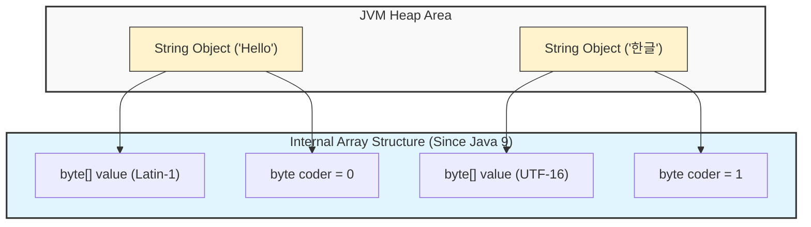
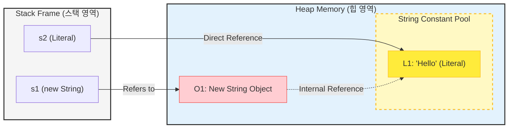
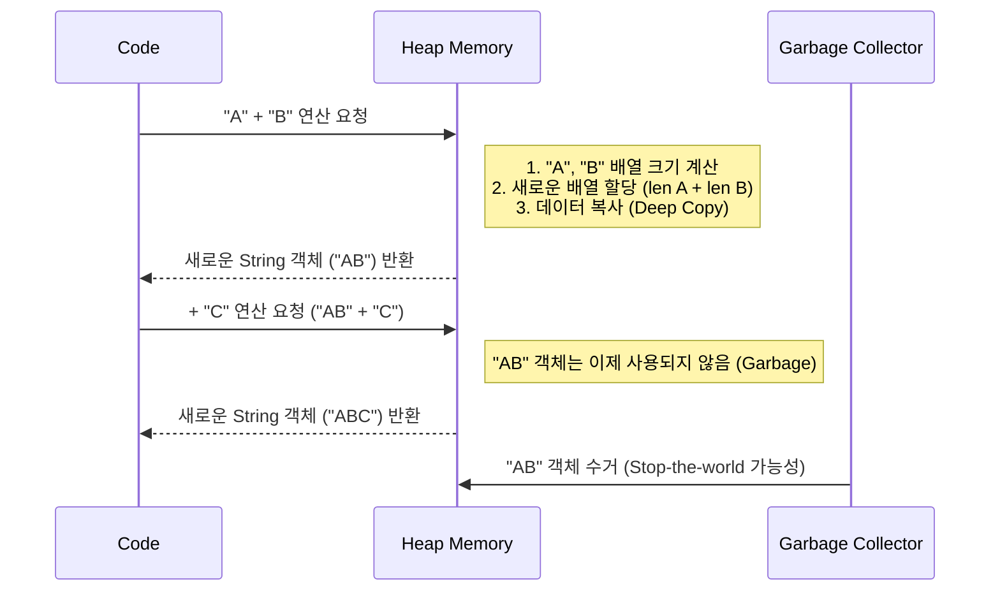

## 1. 개요: String은 곧 읽기 전용 배열이다

개발자들은 흔히 `String`을 단순한 데이터 타입으로 취급하지만, 그 본질은 **'읽기 전용 배열(Read-only Array)'**이다. C언어와 같은 네이티브 레벨에서 문자열은 메모리 주소와 길이로 관리되는 바이트의 집합이다. Java는 이를 객체(`Object`)로 래핑하여 메모리 관리의 안전성을 확보했다.

하지만 이 안전성에는 대가가 따른다. 웹 애플리케이션의 HTTP 요청/응답, HTML 문서, JSON 데이터 등은 모두 **가변 길이(Variable Length)**의 문자열로 구성된다. 고정된 길이의 배열에 가변적인 데이터를 담으려 할 때, 그리고 그 데이터를 조작할 때 발생하는 메모리 비용은 상상을 초월한다.

## 2. 내부 구조와 메모리 관리 (Architecture)

Java의 `String`은 JVM 힙(Heap) 영역에서 독특한 생명주기를 가진다. 특히 Java 버전이 올라가면서 메모리 효율을 위한 내부 구조의 변화가 있었다.

### 2.1 Java 9 이후의 변화: Compact Strings

과거(Java 8 이전)에는 문자열이 `char[]` (UTF-16, 2byte)로 관리되었다. 그러나 영문 대소문자나 숫자 등 1byte로 표현 가능한 문자가 대부분인 상황에서 이는 메모리 낭비였다. Java 9부터는 `byte[]`를 사용하여 인코딩에 따라 메모리 사용량을 최적화하는 **Compact Strings**가 도입되었다[^1].



> **Deep Dive: Compact Strings의 동작 원리**
> 
> Java 9의 `String` 클래스에는 `coder`라는 필드가 추가되었다.
> * **Latin-1 (`coder=0`)**: 1바이트로 표현 가능한 문자열. 메모리 사용량이 절반으로 줄어든다.
> * **UTF-16 (`coder=1`)**: 한글 등 2바이트 이상이 필요한 경우 기존 방식을 사용한다.
> JVM은 문자열 생성 시 내용을 분석하여 적절한 인코딩 방식을 자동으로 선택한다.
{: .prompt-info }
## 3. 객체 생성 전략: 리터럴 vs 생성자 (`new`)

String을 이해하는 데 있어 **String Constant Pool**과 **Heap Allocation**의 차이를 구분하는 것은 필수적이다.

### 3.1 메모리 구조 비교

`String s2 = "Hello"`는 상수 풀의 주소를 직접 가지며, `new String("Hello")`는 힙에 새로운 객체를 만들고 그 내부에서 상수 풀을 참조하는 구조다.



1. **리터럴 (`String s2 = "Hello"`)**
	- JVM은 String Constant Pool에 "Hello"가 있는지 확인한다.
	- 있다면 그 객체의 주소를 바로 반환한다. (**화살표가 Pool로 직결**)
    - 따라서 `s2`는 메모리 효율이 가장 최적화된 상태다.
2. **생성자 (`String s1 = new String("Hello")`)**
	- Heap 영역에 **새로운 String 객체(O1)**를 무조건 생성한다.
    - `s1`은 이 새로운 객체 `O1`을 가리킨다.
    - `O1`은 내부적으로 "Hello"라는 값을 가지기 위해 Pool에 있는 `L1`을 참조하거나 값을 복사해 온다.
    - 결과적으로 `s1`과 `s2`는 서로 다른 주소를 가지게 된다 (`s1 != s2`).

### 3.2 언제 `new String(...)`을 사용하는가?

일반적인 비즈니스 로직에서는 리터럴 사용이 권장되지만, 특수한 경우에는 생성자가 필요하다.

* **데이터 변환**: 네트워크나 파일에서 읽어온 `byte[]`나 `char[]` 데이터를 문자열로 변환할 때 필수적으로 사용된다. (예: `new String(byteArray, StandardCharsets.UTF_8)`)
* **참조의 분리 (Identity)**: 내용(`equals`)은 같지만, 의도적으로 다른 객체 주소(`==`)를 가져야 할 때(예: 동기화 락 분리 등) 사용될 수 있다.

> **Warning:** `new String("Hello")`는 "Hello" 리터럴이 Pool에 없다면 리터럴 객체 1개 + Heap 객체 1개, 총 **2개의 객체**를 생성할 수도 있다. 이는 명백한 메모리 낭비다.
{: .prompt-warning }

## 4. 불변성(Immutability)과 임시 객체

String이 불변이라는 것은 한 번 생성된 인스턴스의 내부 배열 내용이 **절대 변하지 않음**을 의미한다. 따라서 문자열을 수정하는 모든 작업(덧셈, 자르기 등)은 **새로운 객체 생성**을 유발한다.

### 4.1 문자열 연결의 비용

`"Hello" + " " + "World"`와 같은 단순한 연결 연산에서도 보이지 않는 메모리 할당이 일어난다.

```java
String str = "Hello";
str = str + " World";
```

위 코드가 실행될 때 JVM 내부에서는 다음과 같은 일이 벌어진다.

1. `"Hello"` 리터럴이 String Constant Pool에 존재.
2. `" World"` 리터럴이 String Constant Pool에 존재.
3. 두 문자열을 합친 **새로운 String 객체**(`"Hello World"`)가 Heap에 생성.
4. 참조변수 `str`이 새 객체를 가리킴.
5. 기존 객체들은 참조가 끊어지며 GC(Garbage Collection) 대상이 됨.

### 4.2 이름 없는 임시 객체 (Anonymous Temporary Object)



이 과정에서 생성되는 중간 단계의 객체들(`"AB"` 등)은 코드상에서 변수명이 할당되지 않지만, **실제로 메모리를 점유**하고 CPU(복사 연산)를 소모하며, 최종적으로 GC의 부하를 가중시킨다.

> **위험:** 루프(Loop) 내부에서의 문자열 덧셈(`+=`)은 성능을 기하급수적으로 떨어뜨린다. 문자열 길이가 일 때, 반복문 내 연결 연산의 시간 복잡도는 $O(N^2)$에 가깝다.
{: .prompt-danger }

## 5. 성능 벤치마크 및 구현 (Java)

강의에서 언급된 루프 횟수에 따른 성능 저하를 실제 코드로 검증한다.

### 5.1 문자열 연결 성능 테스트

```java
public class StringPerformanceTest {
    
    /**
     * String 덧셈 연산(+)을 사용한 방식
     * 매 연산마다 새로운 String 객체와 내부 byte[]가 생성되고 복사된다.
     */
    static void testStringConcatenation(int loopCount) {
        long start = System.currentTimeMillis();
        String result = "";
        
        for (int i = 0; i < loopCount; i++) {
            // "0123456789" 문자열을 지속적으로 연결
            // 루프가 돌 때마다 result의 길이는 계속 늘어나며,
            // 늘어난 길이만큼의 메모리 할당과 복사가 반복된다.
            result += "0123456789"; 
        }
        
        long end = System.currentTimeMillis();
        System.out.printf("String (+) Loop: %d회 -> %d ms%n", loopCount, (end - start));
    }

    /**
     * StringBuilder를 사용한 방식
     * 내부 가변 배열(Buffer)을 사용하여 객체 생성을 최소화한다.
     */
    static void testStringBuilder(int loopCount) {
        long start = System.currentTimeMillis();
        StringBuilder sb = new StringBuilder();
        
        for (int i = 0; i < loopCount; i++) {
            sb.append("0123456789");
        }
        
        String result = sb.toString();
        long end = System.currentTimeMillis();
        System.out.printf("StringBuilder Loop: %d회 -> %d ms%n", loopCount, (end - start));
    }

    public static void main(String[] args) {
        // 워밍업
        testStringConcatenation(100);
        
        // 실제 테스트
        int count1 = 1000; // 1K
        int count2 = 10000; // 10K
        
        System.out.println("--- 성능 비교 ---");
        testStringConcatenation(count1);
        testStringConcatenation(count2); // 횟수는 10배지만 시간은 10배 이상 급증
        
        testStringBuilder(count2);
    }
}
```

```java
// 로컬 테스트 결과
String (+) Loop: 100회 -> 1 ms
--- 성능 비교 ---
String (+) Loop: 1000회 -> 2 ms
String (+) Loop: 10000회 -> 57 ms
StringBuilder Loop: 10000회 -> 0 ms
```

### 5.2 결과 분석

루프 횟수를 1,000번에서 10,000번으로 10배 늘렸을 때:

1. **StringBuilder**: 선형적으로 시간이 증가하거나 거의 차이가 없다.
2. **String (+)**: 실행 시간이 10배가 아니라 **수십 배에서 수백 배**로 증가한다. 이는 기존 데이터를 계속해서 새 메모리에 복사(`System.arraycopy`)하고, 버려진 객체를 GC가 수거하는 비용이 누적되기 때문이다.

## 6. 결론 및 모범 사례

1. **단순 할당은 리터럴로**: `new String("...")` 대신 `"..."` 리터럴을 사용하여 String Constant Pool의 캐싱 효과를 누려야 한다.
2. **연산은 StringBuilder로**: 반복문 안에서나 복잡한 문자열 조합이 필요할 때는 반드시 `StringBuilder` (동기화가 필요하다면 `StringBuffer`)를 사용한다.
3. **임시 객체 경계**: `str.concat()`이나 `+` 연산자가 '새로운 객체'를 반환한다는 사실을 항상 인지해야 한다.

---

## 💡 Quiz: 학습 내용 확인하기

**Q1. Java 9부터 String의 내부 저장소가 `char[]`에서 `byte[]`로 변경된 이유는 무엇인가?**

<details>
<summary>정답 확인</summary>
<div>
대부분의 서양권 언어(Latin-1)는 1byte로 표현이 가능한데, 기존 <code>char[]</code>(2byte)는 불필요한 메모리 낭비를 유발했기 때문이다. 이를 통해 힙 메모리 사용량을 줄이고 GC 효율을 높였다.
</div>
</details>

**Q2. `String s = new String("Java");` 코드가 실행될 때, "Java" 리터럴이 Pool에 이미 존재한다면 몇 개의 객체가 Heap에 생성되는가? (Pool 제외)**

<details>
<summary>정답 확인</summary>
<div>
1개. (String Constant Pool에 있는 객체 외에, <code>new</code> 키워드로 인해 Heap 영역에 새로운 String 객체 1개가 추가로 생성된다.)
</div>
</details>

**Q3. 반복문(Loop) 내부에서 String `+` 연산을 지양해야 하는 기술적 이유는?**

<details>
<summary>정답 확인</summary>
<div>
String은 불변 객체이므로 덧셈 연산 시마다 기존 내용을 포함한 새로운 크기의 배열을 할당하고 데이터를 복사하는 과정이 발생한다. 반복문이 진행될수록 복사해야 할 데이터의 양이 늘어나 시간 복잡도가 O(N^2)에 가까워지며, 과도한 임시 객체 생성으로 GC 오버헤드가 발생한다.
</div>
</details>

**Q4. '이름 없는 임시 객체(Anonymous Temporary Object)'란 무엇인가?**

<details>
<summary>정답 확인</summary>
<div>
문자열 연산 과정에서 중간 결과를 저장하기 위해 힙 메모리에 생성되지만, 변수에 할당되지 않아 개발자의 눈에 보이지 않는 객체를 말한다. 사용 직후 참조가 사라져 GC의 대상이 된다.
</div>
</details>

---

[^1]:**Compact Strings**: JEP 254에 정의된 Java 9의 주요 개선 사항으로, 문자열의 인코딩에 따라 바이트 배열의 저장 방식을 효율화하는 기술.