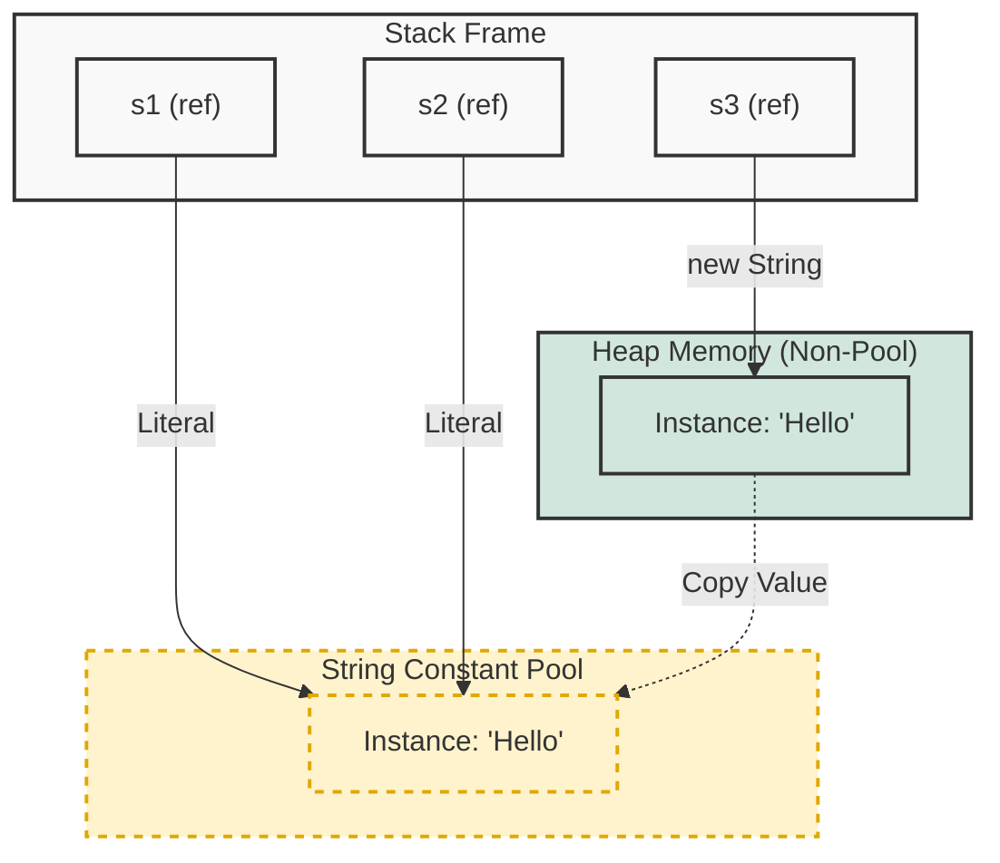

## 1. 개요: 문자열 관리의 효율성

프로그래밍 언어에서 문자열(String)은 가장 빈번하게 사용되는 자료구조 중 하나다. 만약 애플리케이션 내에서 `"Hello World"`라는 문자열이 100번 등장한다고 가정해보자. 이를 메모리에 100번 중복해서 저장하는 것은 심각한 자원 낭비다.

C/C++의 실행 파일 포맷인 PE(Portable Executable) 파일[^1]은 **String Table**이라는 구조를 통해 문자열을 관리한다. 중복된 문자열은 단 한 번만 저장하고, 이를 참조(Pointer)하는 방식을 사용하여 효율성을 극대화한다. Java 역시 이와 유사한 철학을 공유하며, JVM(Java Virtual Machine) 레벨에서 **String Constant Pool(문자열 상수 풀)**이라는 독자적인 메모리 영역을 통해 문자열을 관리한다.

## 2. 아키텍처 및 메모리 구조

Java의 문자열 상수는 `Heap` 영역 내의 특수한 공간인 **String Constant Pool**에 저장된다. 문자열 리터럴(`"..."`)을 사용할 때 JVM은 이 풀을 조회하여 중복 생성을 방지한다.



### 2.1 리터럴(Literal) vs 객체 생성(`new`)

1. **리터럴 해석 (`"Hello"`)**
	- 생성자의 인자로 전달된 리터럴 `"Hello"`를 처리하기 위해 **먼저 String Constant Pool을 확인한다.**
    - 만약 Pool에 `"Hello"`가 없다면? → **Pool에 객체를 하나 생성한다.**
    - 만약 Pool에 `"Hello"`가 있다면? → 있는 것을 가져온다.
    - **결론: 이 단계에서 Pool을 사용한다.**
2. **객체 생성 (`new String(...)`)**
	- `new` 연산자는 Heap 영역(Pool 바깥)에 **새로운 String 객체**를 무조건 하나 더 만든다.
    - 이 새로운 객체는 Pool에 있는 `"Hello"`의 문자열 값(char array)을 복사해서 가진다.
    - 변수 `s`는 이 **Heap 영역의 새로운 객체**를 가리킨다.

> **Deep Dive: Java 버전별 String Pool의 위치 변화**
> 
> * **Java 6 이하**: PermGen(Permanent Generation) 영역에 존재했다. 이 영역은 고정된 크기를 가져 `OutOfMemoryError`의 주원인이 되었다.
> * **Java 7 이후**: **Heap 영역**으로 이동했다. 이로 인해 String Constant Pool의 문자열도 더 이상 참조되지 않으면 **GC(Garbage Collection)**의 대상이 되어 메모리 관리가 유연해졌다.
{: .prompt-info }

## 3. String 객체와 라이프사이클

Java 명세(Specification)에 따르면 문자열 리터럴은 그 자체로 `String` 클래스의 인스턴스다. 이는 소스 코드가 컴파일되고 실행되는 과정에서 단계적으로 처리된다.

### 3.1 라이프사이클 3단계

1. **Compile Time**: 소스 코드의 문자열 리터럴(`"Hello"`)은 `.class` 파일의 **Constant Pool**에 심볼 형태로 저장된다.
2. **Class Loading**: 클래스 로더가 클래스를 로딩할 때, `.class` 파일의 정보가 JVM의 **Runtime Constant Pool**로 로드된다.
3. **Runtime**: 코드가 실행되면서 `ldc` 명령어 등이 수행될 때, 실제 String 인스턴스가 생성되어 **String Constant Pool(Heap)**에 등록된다(Lazy Resolution).

> **주의:** `String`은 불변(Immutable) 객체다. 따라서 `trim()`, `substring()` 등의 메서드는 원본을 수정하는 것이 아니라, 수정된 새로운 String 인스턴스를 반환한다.
{: .prompt-warning }

## 4. `intern()` 메서드와 동작 원리

`intern()` 메서드는 String Constant Pool을 명시적으로 활용할 때 사용된다. 특이하게도 Java 레벨이 아닌 Native Method(JNI)로 구현되어 있어 성능 최적화와 밀접한 관련이 있다.

```java
public class StringInternExample {
    public static void main(String[] args) {
        // 1. 리터럴 방식: String Constant Pool에 "Hello" 생성 및 캐싱
        String s1 = "Hello";
        String s2 = "Hello";

        // 주소값 비교 (Identity)
        // s1과 s2는 Pool 내의 동일한 인스턴스를 가리킴 -> true
        System.out.println("s1 == s2 : " + (s1 == s2)); 

        // 2. new 연산자 방식: Heap 영역에 새로운 인스턴스 강제 생성 (Pool 사용 X)
        String s3 = new String("Hello");

        // s1(Pool)과 s3(Heap)는 서로 다른 메모리 주소를 가짐 -> false
        System.out.println("s1 == s3 : " + (s1 == s3)); 

        // 3. intern() 메서드 호출
        // s3가 가리키는 문자열("Hello")을 Pool에서 찾음.
        // 이미 존재하므로 Pool에 있는 인스턴스의 참조값(s1과 동일)을 반환.
        String s4 = s3.intern();

        // s1(Pool)과 s4(Pool에서 반환된 참조)는 같음 -> true
        System.out.println("s1 == s4 : " + (s1 == s4));
    }
}
```

### 핵심 로직 분석

1. `intern()` 호출 시 JVM은 String Constant Pool에 해당 문자열과 `equals()`가 `true`인 문자열이 있는지 검색한다.
2. **존재할 경우**: Pool에 있는 기존 인스턴스의 참조를 반환한다.
3. **존재하지 않을 경우**: 현재 문자열 객체를 Pool에 추가(참조 등록)하고 그 참조를 반환한다.

> **위험:** 실무에서 `new String("...")`을 사용하여 문자열을 생성하는 패턴은 지양해야 한다. 이는 불필요한 객체를 힙에 생성하여 GC 부하를 가중시키고 메모리 효율을 떨어뜨린다. 항상 리터럴(`"..."`)을 사용하는 것이 권장된다.
{: .prompt-danger }

## 5. 구현 시사점 (Best Practices)

* **문자열 비교**: 문자열의 내용(Content)을 비교할 때는 반드시 `equals()`를 사용하고, 물리적 주소(Identity)가 동일한지 확인할 때만 `==`를 사용한다. 하지만 대부분의 비즈니스 로직은 `equals()`를 필요로 한다.
* **메모리 최적화**: 대량의 중복된 문자열 데이터를 처리해야 하는 경우(예: 대용량 로그 파싱, 문서 분석), `intern()`을 적절히 활용하면 힙 메모리 사용량을 획기적으로 줄일 수 있다. 단, `intern()` 연산 자체의 비용도 고려해야 한다.

---

## 💡 Quiz: 학습 내용 확인하기

**Q1. `String s = new String("Java");` 코드가 실행될 때, 메모리 상에는 어떤 일이 발생하는가? (String Constant Pool에 "Java"가 이미 존재한다고 가정)**

<details>
<summary>정답 확인</summary>
<div>
Heap 영역에 새로운 String 객체가 생성됩니다. 이미 Pool에 "Java"가 존재하더라도, new 연산자는 무조건 새로운 객체를 Heap(Non-Pool 영역)에 할당합니다.
</div>
</details>

**Q2. Java 7 이후 String Constant Pool이 PermGen 영역에서 Heap 영역으로 이동한 주요 이유는 무엇인가?**

<details>
<summary>정답 확인</summary>
<div>
PermGen 영역은 고정된 크기로 인해 OOM(Out Of Memory) 오류가 자주 발생했습니다. Heap 영역으로 이동함으로써 String 객체들이 GC(Garbage Collection)의 대상이 되어, 더 유연하고 효율적인 메모리 관리가 가능해졌습니다.
</div>
</details>

**Q3. `s1.intern() == s2.intern()`의 결과가 true라면, `s1.equals(s2)`의 결과는 무엇인가?**

<details>
<summary>정답 확인</summary>
<div>
true입니다. intern() 메서드는 String Constant Pool 내의 유일한 객체 참조를 반환하므로, 두 참조가 같다면(==) 문자열의 내용(equals) 또한 반드시 동일합니다.
</div>
</details>

[^1]:**PE (Portable Executable)**: 윈도우 운영체제에서 사용되는 실행 파일(EXE), 객체 코드(OBJ), DLL 등의 표준 파일 형식.