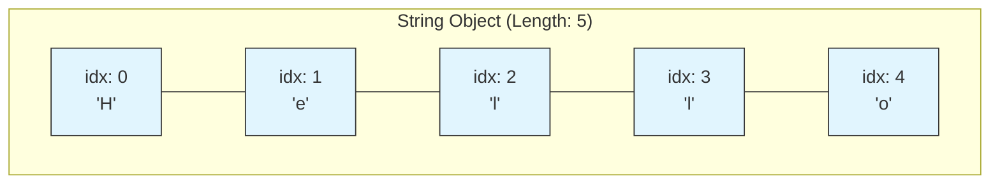
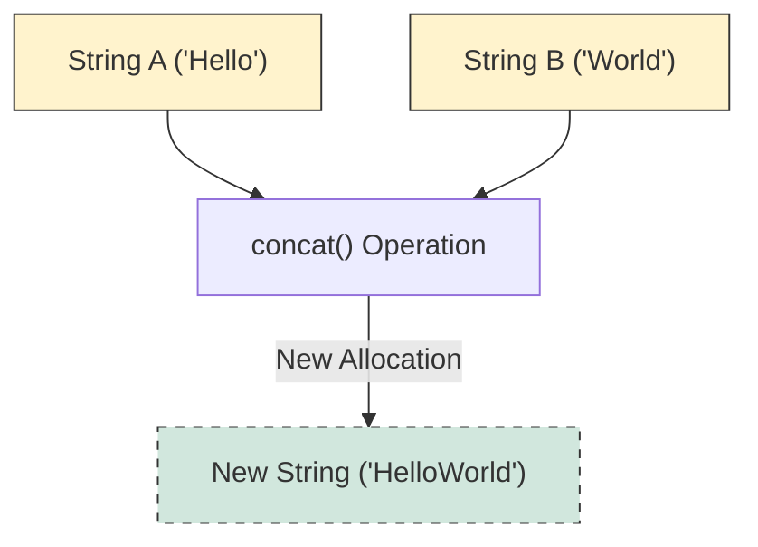
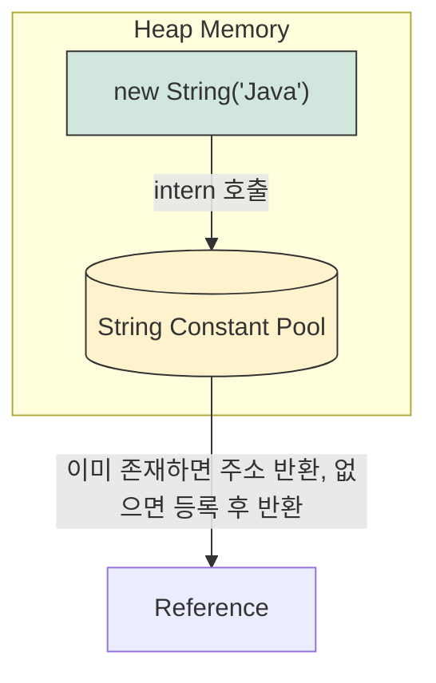

## 1. 개요 및 내부 구조

Java의 `String` 클래스는 본질적으로 **문자들의 배열(Sequence of Characters)**이다. 개발자가 문자열을 다룰 때, 내부적으로는 배열의 인덱스를 통해 데이터에 접근하고 관리한다.

### 1.1 메모리 레이아웃

문자열 `"Hello"`가 생성될 때의 내부 인덱스 구조는 다음과 같다.



* **Index**: 0부터 시작하며, 마지막 인덱스는 `length - 1`이다.
* **Length**: 요소의 개수를 의미하며, 위 예제에서는 `5`다.

> **Deep Dive: Java 9 이후의 String 내부 구조 변화 (Compact Strings)**
> 
> Java 8까지는 `String`이 내부적으로 `char[]` (UTF-16, 2byte)를 사용했다. 하지만 영문자나 숫자는 1byte로 표현이 가능함에도 2byte를 소비하는 비효율이 있었다.
> Java 9부터는 **Compact Strings**가 도입되어 내부적으로 `byte[]`와 `coder`(인코딩 플래그)를 사용한다. 문자열이 Latin-1(1byte)로 표현 가능하면 1byte를, 그렇지 않으면 2byte를 사용하여 메모리 효율을 극대화했다.
{: .prompt-info }

## 2. 불변성(Immutability)과 문자열 연산

`String` 객체는 한 번 생성되면 그 값을 변경할 수 없는 **불변 객체(Immutable Object)**다.

### 2.1 문자열 결합의 비용

`concat()` 메서드나 `+` 연산자를 사용하여 문자열을 합칠 때, 기존 객체가 수정되는 것이 아니라 **새로운 객체**가 생성된다.



> **주의:** 반복문(Loop) 내부에서 `String`을 `+` 연산자로 계속 연결하면, 매 반복마다 새로운 객체가 힙 메모리에 생성되어 성능 저하와 GC(Garbage Collection) 부하를 유발한다. 이 경우 `StringBuilder`나 `StringBuffer`를 사용해야 한다.
{: .prompt-warning }

## 3. 핵심 메서드 분석 및 활용 (Java)

실무에서 자주 사용되는 메서드를 기능별로 분류하여 분석한다.

### 3.1 검색 및 추출 (Search & Extraction)

데이터베이스나 사용자 입력값에서 특정 문자를 찾거나 추출할 때 사용한다.

* **`charAt(int index)`**: 특정 위치의 문자를 반환한다.
* **`indexOf(String str)`**: 특정 문자열이 시작되는 인덱스를 반환한다. (없으면 `-1`)
* **`contains(CharSequence s)`**: 문자열 포함 여부를 `boolean`으로 반환한다.

### 3.2 비교 및 검증 (Comparison & Validation)

* **`equals(Object anObject)`**: 문자열의 **내용(Content)**이 같은지 비교한다.
* **`equalsIgnoreCase(String anotherString)`**: 대소문자를 구분하지 않고 내용을 비교한다.
* **`startsWith` / `endsWith**`: 특정 문자열로 시작하거나 끝나는지 검사한다.
* **`matches(String regex)`**: 정규 표현식(Regular Expression)과 일치하는지 검사한다.

### 3.3 변환 및 정제 (Manipulation)

* **`trim()`**: 문자열 앞뒤의 공백(Whitespace, Tab 등)을 제거한다. 사용자 입력 데이터 정제(Sanitization)에 필수적이다.
* **`format(String format, Object... args)`**: 지정된 형식 문자열로 변환하여 새로운 문자열을 생성한다.

> Tip: `trim()` vs `strip()`
> 
> Java 11부터 도입된 `strip()`은 `trim()`보다 더 강력하다. `trim()`은 아스키 코드의 공백만 제거하지만, `strip()`은 유니코드의 공백까지 처리한다. 최신 Java 버전을 사용 중이라면 `strip()` 사용을 권장한다.
{: .prompt-tip }

### 3.4 구현 예제

```java
public class StringMethodsDeepDive {
    public static void main(String[] args) {
        // 테스트 문자열: 앞뒤 공백 및 탭 포함
        String origin = "\t  Hello String  ";
        String target = "Ring";

        // 1. 공백 제거 (Sanitization)
        // DB 저장 전, 사용자 입력 실수(공백 포함)를 방지하기 위해 필수
        String trimmed = origin.trim(); 
        System.out.println("Trimmed: [" + trimmed + "]"); // [Hello String]

        // 2. 검색 (Search)
        // contains는 존재 여부만(boolean), indexOf는 위치(int)를 반환
        boolean hasRing = trimmed.contains(target); 
        int ringIndex = trimmed.indexOf("String"); // 대소문자 구분
        int noIndex = trimmed.indexOf("string");   // 없으면 -1 반환

        System.out.println("Contains 'Ring' (Case-sensitive): " + hasRing); // false (s vs S)
        System.out.println("Index of 'String': " + ringIndex); // 6
        
        // 3. 비교 (Comparison)
        // equalsIgnoreCase를 사용하여 대소문자 무시하고 비교
        boolean isMatch = trimmed.substring(6).equalsIgnoreCase("string");
        System.out.println("Case Insensitive Match: " + isMatch); // true

        // 4. 정규 표현식 (Regex)
        // 숫자가 포함되어 있는지 검증하는 예제
        boolean hasNumber = trimmed.matches(".*[0-9].*");
        System.out.println("Has Number: " + hasNumber); // false
    }
}
```

## 4. Deep Dive: String Interning과 `intern()`[^1]

강의에서 잠시 언급된 `intern()` 메서드는 JVM의 메모리 관리와 깊은 관련이 있다.

`String` 리터럴(예: `"Hello"`)로 생성된 문자열은 JVM의 **String Constant Pool**이라는 힙(Heap) 영역 내의 특별한 공간에 저장된다. 반면 `new String("Hello")`로 생성하면 힙 영역에 별도의 객체로 생성된다.

`intern()` 메서드는 힙에 있는 문자열 객체를 String Constant Pool로 이동(혹은 참조 반환)시켜, 동일한 문자열이 중복 생성되는 것을 방지한다. 이를 통해 메모리를 절약할 수 있다.



> **위험:** 과거 Java 버전(Java 6 이하)에서는 String Pool이 PermGen 영역에 있어 `intern()` 남발 시 `OutOfMemoryError`가 발생할 수 있었다. Java 7부터 Heap 영역으로 이동했지만, 여전히 불필요한 `intern()` 호출은 성능 비용이 발생하므로 주의해야 한다.
{: .prompt-danger }

---

## 💡 Quiz: 학습 내용 확인하기

**Q1. `String` 객체를 `+` 연산자로 반복해서 연결할 때 발생하는 성능 문제의 원인은 무엇인가?**

<details>
<summary>정답 확인</summary>
<div>
String은 불변 객체(Immutable Object)이기 때문에, 연결 연산 시마다 기존 객체를 수정하는 것이 아니라 새로운 String 객체를 계속해서 생성(메모리 할당)하고 복사해야 하기 때문입니다.
</div>
</details>

**Q2. 사용자 입력을 데이터베이스에 저장하기 전, `trim()` 메서드를 사용하는 주된 이유는 무엇인가?**

<details>
<summary>정답 확인</summary>
<div>
사용자가 의도치 않게 입력한 앞뒤 공백(Space, Tab)을 제거하여, 데이터의 정확성을 높이고 검색 시 공백으로 인한 불일치를 방지하기 위함입니다.
</div>
</details>

**Q3. `indexOf()`와 `contains()` 메서드의 차이점은 무엇인가?**

<details>
<summary>정답 확인</summary>
<div>
contains()는 문자열의 포함 여부만을 확인하여 boolean 값을 반환하는 반면, indexOf()는 해당 문자열이 시작되는 인덱스(위치)를 int 값으로 반환하며, 찾지 못했을 경우 -1을 반환합니다.
</div>
</details>

---

[^1]:**String Interning**: 동일한 내용의 문자열 리터럴을 공유하여 메모리 사용량을 최적화하는 JVM의 기법.