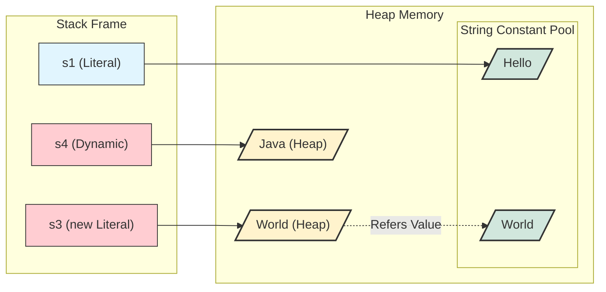

## 1. 개요

Java의 `String` 클래스는 문자열 상수를 캡슐화한 래퍼(Wrapper) 클래스다. 하지만 개발자는 `new` 연산자 없이 마치 기본형(Primitive Type) 변수처럼 문자열을 할당하곤 한다. 이러한 문법적 설탕(Syntactic Sugar) 뒤에는 JVM의 정교한 메모리 관리 전략이 숨어 있다.

본 포스트에서는 String 인스턴스의 생성 방식(리터럴 vs `new` vs 동적 생성)에 따른 메모리 배치 차이와 **이중 객체 생성 메커니즘**, 그리고 `intern()` 메서드의 정확한 역할을 다룬다.

## 2. String 인스턴스 생성과 메모리 모델

String을 생성하는 방식은 크게 **리터럴(Literal)** 사용, **`new` 연산자(리터럴 포함)** 사용, 그리고 **동적 생성(연산)** 세 가지로 나뉜다. 이들은 String Constant Pool의 관여 여부에서 결정적인 차이를 보인다.

### 2.1 리터럴(Literal)과 String Constant Pool

```java
String s1 = "Hello";
String s2 = "Hello";
```

* **동작**: 소스 코드에 `"Hello"`라는 리터럴이 있으면, JVM은 로딩 시점에 **String Constant Pool**에 해당 문자열이 있는지 확인하고 없으면 생성한다.
* **최적화**: 이미 풀(Pool)에 동일한 문자열("Hello")이 존재한다면, 새로운 객체를 생성하지 않고 기존 객체의 참조(주소)를 반환한다. (**String Interning**)
* **결과**: `s1`과 `s2`는 물리적으로 동일한 메모리 주소를 가리킨다.

### 2.2 `new` 연산자와 리터럴 (이중 객체 생성)

```java
String s3 = new String("World");
```

`new` 연산자를 사용하면서 생성자 인자로 **리터럴**을 넘기는 경우다. 이때는 **최대 2개의 객체**가 관여한다.

1. **Pool 확인**: 생성자의 인자인 리터럴 `"World"` 때문에, JVM은 우선 String Constant Pool에 "World" 객체를 확보한다. (없으면 생성)
2. **Heap 할당**: 그 후 `new` 키워드로 인해 **Heap 영역**에 별도의 새로운 String 객체를 생성한다.
3. **값 참조**: Heap 객체는 Pool 객체의 문자열 값(Value)을 참조하여 초기화된다.
4. **비효율**: 결과적으로 값의 원본은 Pool에 있지만, 변수(`s3`)가 가리키는 주소는 Heap의 새로운 객체이므로 메모리 낭비가 발생한다.

### 2.3 동적 생성 (Dynamic Creation)과 Pool의 부재

가장 오해하기 쉬운 부분이다. 리터럴을 사용하지 않고 **런타임에 계산되거나 생성된 문자열**은 Pool을 거치지 않는다.

```java
char[] chars = {'J', 'a', 'v', 'a'};
String s4 = new String(chars); // 또는 StringBuilder 사용
```

* **동작**: 소스 코드에 `"Java"`라는 리터럴이 명시되지 않았으므로, 컴파일 타임이나 로딩 타임에 Pool에 등록되지 않는다.
* **결과**: **Heap 영역에만** String 객체가 생성되며, **String Constant Pool은 비어 있는 상태**가 된다.
* **의의**: 모든 문자열이 무조건 Pool에 들어가는 것은 아니다. 동적으로 생성된 문자열은 명시적으로 요청하지 않는 한 Pool 메모리를 점유하지 않는다.

### 2.4 메모리 구조 시각화 (Deep Dive)

아래 다이어그램은 리터럴, `new String("Literal")`, 그리고 동적 생성 시의 구조적 차이를 보여준다.



> **Deep Dive: String Constant Pool의 위치 변화**
> 
> 과거 Java 6까지 String Constant Pool은 **PermGen** 영역에 위치하여 `OutOfMemoryError`의 원인이 되곤 했다.
> **Java 7부터**는 이를 **Heap 영역**으로 이동시켰다. 덕분에 문자열 풀도 GC(Garbage Collection)의 대상이 되어, 참조되지 않는 상수는 메모리에서 해제될 수 있게 되었다.
{: .prompt-info }

## 3. `intern()` 메서드 심화

`intern()` 메서드는 Heap에 있는 String 객체와 String Constant Pool을 연결하는 다리 역할을 한다. 문자열의 생성 방식에 따라 동작이 미묘하게 다르다.

### 3.1 동작 원리

`s.intern()`을 호출하면 JVM은 다음과 같이 동작한다.

1. **조회**: `s`가 가진 문자열과 같은 값이 String Constant Pool에 존재하는지 찾는다.
2. **반환 (있을 경우)**: 이미 존재한다면, Pool에 있는 그 객체의 주소를 반환한다.
3. **등록 및 반환 (없을 경우)**: 없다면(동적 생성의 경우), 현재 Heap에 있는 문자열의 참조를 Pool에 등록하고 그 주소를 반환한다.

### 3.2 코드 예제

```java
// CASE 1: 리터럴이 포함된 new
String a = new String("Apple"); 
// "Apple" 리터럴 때문에 이미 Pool에 등록됨.
// a.intern()은 Pool의 주소만 반환함.

// CASE 2: 동적 생성 (리터럴 없음)
String b = new String(new char[]{'B', 'a', 'n', 'a', 'n', 'a'});
// Heap에만 "Banana" 존재. Pool은 비어있음.

String poolBanana = b.intern(); 
// Pool에 "Banana"가 없으므로, b의 내용을 기반으로 Pool에 등록 후 반환.

System.out.println(b == poolBanana); 
// true (JDK 버전에 따라 b 자체의 참조가 Pool에 등록될 수도 있음)
```

> **Tip:** 대량의 중복된 문자열 데이터를 처리해야 할 때(예: 로그 분석, CSV 파싱), `intern()`을 적절히 사용하면 힙 메모리 사용량을 획기적으로 줄일 수 있다.
{: .prompt-tip }

## 4. 문자열 비교 전략

문자열을 비교할 때는 `==` 연산자가 아닌 메서드를 사용해야 한다.

### 4.1 동일성(Identity) vs 동등성(Equality)

| 비교 방식     | 연산자/메서드    | 설명                                                |
| --------- | ---------- | ------------------------------------------------- |
| **주소 비교** | `==`       | 두 참조변수가 **같은 메모리 주소**를 가리키는지 확인한다. (Identity)     |
| **내용 비교** | `equals()` | 두 인스턴스가 가진 **문자열 값(Value)**이 같은지 확인한다. (Equality) |

```java
// 주소 비교
System.out.println(s1 == s2); // true (String Pool 공유)
System.out.println(s3 == s4); // false (각자 다른 Heap 객체)

// 내용 비교
System.out.println(s3.equals(s4)); // true (내용은 "World"로 동일)
```

> **주의:** 실무에서는 문자열이 리터럴로 생성되었는지, 동적으로 생성되었는지 예측하기 어렵다. 따라서 내용 비교를 위해서는 반드시 `equals()`를 사용해야 버그를 방지할 수 있다.
{: .prompt-warning }

### 4.2 `equals()` vs `compareTo()` 내부 동작

* **`equals()`**: 가장 먼저 **길이(Length)**를 비교한다. 길이가 다르면 내용을 뜯어보지도 않고 즉시 `false`를 반환하므로, 단순 동등성 비교에 효율적이다.
* **`compareTo()`**: 정렬(Sorting)을 위해 설계되었다. 두 문자열 중 짧은 길이만큼 루프를 돌며 문자 간의 **차이값(Difference)**을 계산한다. 단순 비교용으로는 `equals()`보다 비용이 높을 수 있다.

## 5. 결론

1. **String 생성**: 메모리 효율을 위해 가급적 **리터럴(`"..."`)**을 사용한다.
2. **동적 생성**: `char[]`나 `StringBuilder`로 생성된 문자열은 Pool에 자동 등록되지 않는다. 중복이 많은 경우 `intern()`을 고려한다.
3. **메모리 낭비**: `new String("Literal")`은 Pool과 Heap에 객체를 이중으로 관리하게 하므로 지양해야 한다.
4. **비교**: 내용 비교는 무조건 **`equals()`**를 사용한다.

---

## 💡 Quiz: 학습 내용 확인하기

**Q1. `char[] data = {'A', 'B'}; String s = new String(data);` 코드가 실행된 직후, String Constant Pool에는 "AB" 문자열이 존재하는가?**

<details>
<summary>정답 확인</summary>
<div>
<strong>아니요, 존재하지 않습니다.</strong>


소스 코드에 "AB"라는 리터럴이 명시되지 않았으므로, s는 Heap 영역에만 생성되고 Pool에는 등록되지 않습니다. <code>s.intern()</code>을 호출해야 Pool에 등록됩니다.
</div>
</details>

**Q2. `String s = new String("Java");` 실행 시 생성되는 객체 개수와 이유를 설명하시오. (Pool에 "Java"가 없다고 가정)**

<details>
<summary>정답 확인</summary>
<div>
<strong>총 2개</strong>입니다.


1. "Java" 리터럴을 처리하기 위해 String Constant Pool에 객체 1개 생성.


2. <code>new</code> 연산자로 인해 Heap 영역에 객체 1개 생성.
</div>
</details>

**Q3. 두 문자열의 내용이 같은지 비교할 때, `compareTo()`보다 `equals()`가 성능상 유리한 결정적인 이유는?**

<details>
<summary>정답 확인</summary>
<div>
<code>equals()</code>는 문자열의 <strong>길이(length)</strong>를 가장 먼저 비교하여, 길이가 다르면 즉시 false를 반환하기 때문입니다. 반면 <code>compareTo()</code>는 문자 단위의 비교 루프를 수행해야 합니다.
</div>
</details>