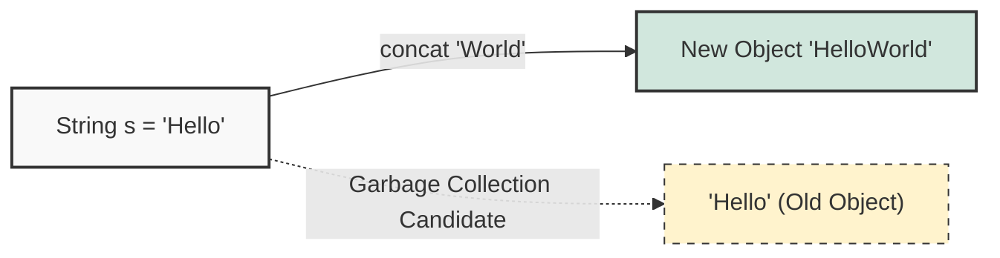
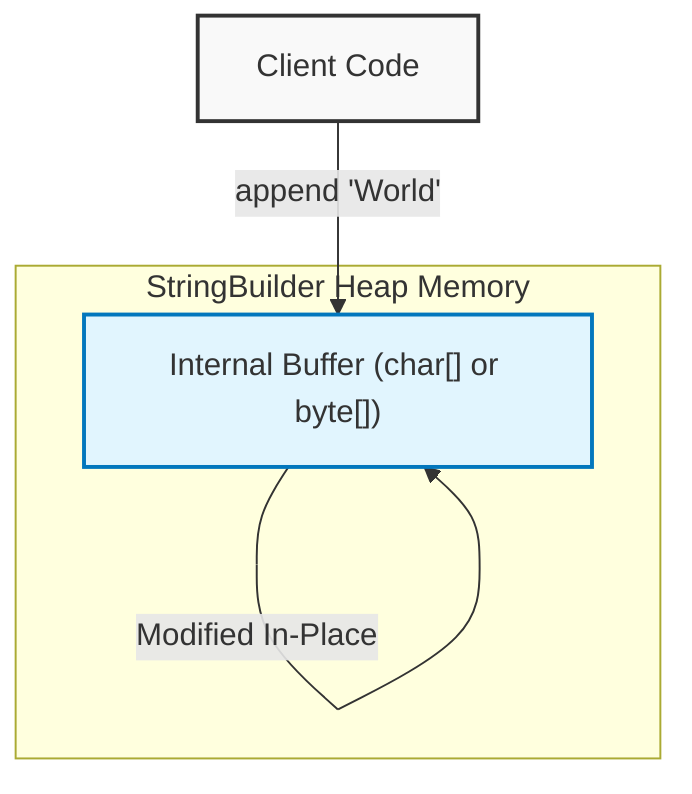
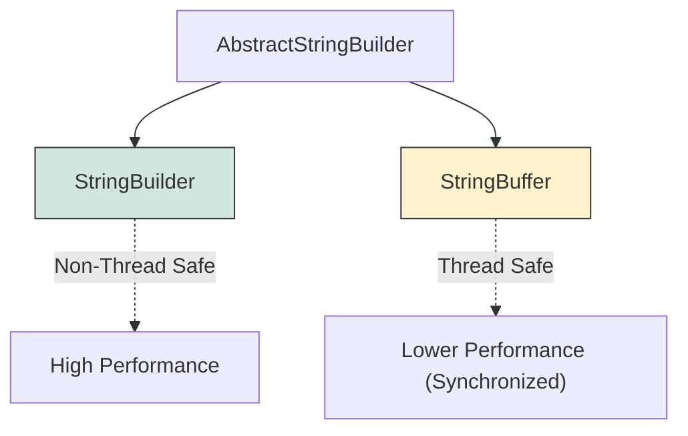

## 1. 개요: 불변 객체(Immutable Object)의 딜레마

Java의 `String` 클래스는 대표적인 **불변(Immutable)** 객체다. 불변성은 멀티스레드 환경에서의 안전성(Thread-safety)과 캐싱(String Pool)을 통한 메모리 절약 등 많은 장점을 제공한다. 하지만, 빈번한 문자열 수정이 발생하는 상황에서는 심각한 성능 저하의 원인이 된다.

텍스트 에디터를 개발한다고 가정해보자. 10KB 크기의 문서 중간에 사용자가 키보드로 문자 하나를 입력할 때마다 전체 문자열을 복사하고 새로운 문자를 추가한 뒤 다시 저장해야 한다면 어떤 일이 발생하겠는가?

1. **메모리 낭비**: 키 입력마다 10KB +  크기의 새로운 객체가 힙 메모리에 생성된다.
2. **GC 오버헤드**: 더 이상 참조되지 않는 이전 문자열 객체(Garbage)가 쌓여 가비지 컬렉터(GC)를 빈번하게 호출한다.
3. **CPU 연산 증가**: 단순한 문자 추가를 위해 전체 데이터를 복사하는 연산(`System.arraycopy` 등)이 반복된다.

이러한 문제를 해결하기 위해 Java는 가변(Mutable) 특성을 가진 `StringBuilder`를 제공한다.

## 2. 메모리 구조와 동작 원리 비교

`String`과 `StringBuilder`의 가장 큰 차이는 **임시 객체의 생성 여부**다.

### 2.1 String의 연결 연산 (Concatenation)

`String` 객체에 `+` 연산이나 `concat()`을 수행하면, 기존 객체를 수정하는 것이 아니라 **완전히 새로운 객체**를 생성한다.



### 2.2 StringBuilder의 Append 연산

반면 `StringBuilder`는 내부 버퍼(Buffer)를 직접 수정한다. 따라서 문자열을 수정하더라도 객체 자체가 새로 생성되지 않으며, 참조값(Reference)도 유지된다.



> **Deep Dive: StringBuilder의 내부 확장 전략 (Capacity Expansion)**
> 
> `StringBuilder`는 내부적으로 배열(Java 9 이전 `char[]`, Java 9 이후 `byte[]`)을 사용하여 문자열을 관리한다. 초기 용량(Capacity)을 넘어서는 데이터가 들어오면 다음과 같은 과정이 일어난다.
> 1. **새로운 배열 생성**: 기존 용량의 약 2배 크기(`(oldCapacity * 2) + 2`)로 새로운 배열을 할당한다.
> 2. **데이터 복사**: `System.arraycopy()`를 사용하여 기존 데이터를 새 배열로 복사한다.
> 3. **참조 변경**: 내부 참조를 새 배열로 교체하고 기존 배열은 GC 대상이 된다.
> 
> 
> 따라서, 최종 문자열의 길이를 예측할 수 있다면 생성자 `new StringBuilder(int capacity)`를 통해 **초기 용량을 지정**하는 것이 불필요한 리사이징과 배열 복사를 막는 핵심 최적화 기법이다.
{: .prompt-info }

## 3. 성능 벤치마크 및 코드 구현

문자열을 다루는 방식에 따라 성능 차이가 얼마나 발생하는지 실제 코드로 확인해보자.

### 3.1 성능 비교 예제 (Java)

아래 코드는 `String`과 `StringBuilder`를 사용하여 동일한 문자열 연결 작업을 수행했을 때의 실행 시간을 측정한다.

```java
public class StringPerformanceTest {
    
    // 반복 횟수 설정
    private static final int STRING_LOOP_COUNT = 10_000;
    private static final int BUILDER_LOOP_COUNT = 1_000_000; // 100배 더 많은 반복

    public static void main(String[] args) {
        testStringConcatenation();
        testStringBuilderAppend();
    }

    /**
     * String + 연산을 이용한 연결
     * 매 연산마다 새로운 String 객체와 StringBuilder(컴파일러 최적화 시)가 생성될 수 있음
     */
    static void testStringConcatenation() {
        long startTime = System.currentTimeMillis();
        
        String target = "A";
        for (int i = 0; i < STRING_LOOP_COUNT; i++) {
            target += "A"; // 매번 새로운 객체 생성 (O(n^2) 복잡도 유발 가능)
        }
        
        long endTime = System.currentTimeMillis();
        System.out.println("String (+) Loop (" + STRING_LOOP_COUNT + "회): " + (endTime - startTime) + "ms");
    }

    /**
     * StringBuilder를 이용한 연결
     * 내부 버퍼만 수정하므로 객체 생성 비용이 거의 없음
     */
    static void testStringBuilderAppend() {
        long startTime = System.currentTimeMillis();
        
        // 초기 용량을 지정하지 않으면 기본값(16) 사용 -> 리사이징 발생 가능
        StringBuilder sb = new StringBuilder(); 
        
        for (int i = 0; i < BUILDER_LOOP_COUNT; i++) {
            sb.append("A");
        }
        
        long endTime = System.currentTimeMillis();
        System.out.println("StringBuilder Loop (" + BUILDER_LOOP_COUNT + "회): " + (endTime - startTime) + "ms");
    }
}
```

### 3.2 결과 분석

일반적인 환경에서 위 코드를 실행하면 다음과 유사한 결과를 얻을 수 있다.

| 구분 | 반복 횟수 | 소요 시간 (Approx.) | 비고 |
| --- | --- | --- | --- |
| **String (+)** | 10,000회 | **~200ms** | 객체 생성 및 GC 오버헤드 큼 |
| **StringBuilder** | 1,000,000회 | **~15ms** | 반복 횟수가 **100배** 많음에도 압도적으로 빠름 |

* **String**: 단 1만 번의 반복에도 수백 밀리초가 소요된다. 이는 힙 메모리에 1만 개의 임시 `String` 객체(중간 단계의 결과물들)가 생성되고 버려졌음을 의미한다.
* **StringBuilder**: 100만 번의 반복을 수행했음에도 불구하고 시간은 거의 걸리지 않는다. 이는 메모리 할당과 해제 비용이 거의 없었기 때문이다.

> **주의:** JDK 1.5 이후 컴파일러가 `String` 연결 연산(`+`)을 자동으로 `StringBuilder`로 변환해주지만[^1], **반복문(Loop) 내부**에서의 연결 연산은 여전히 매 반복마다 새로운 `StringBuilder` 객체를 생성하는 비효율적인 코드로 변환된다. 따라서 반복문 내 문자열 결합은 반드시 명시적으로 `StringBuilder`를 사용해야 한다.
{: .prompt-warning }

## 4. StringBuilder vs StringBuffer

`StringBuilder`와 유사한 클래스로 `StringBuffer`가 있다. 두 클래스의 API는 거의 동일하지만 동기화(Synchronization) 지원 여부에서 결정적인 차이가 있다.



* **StringBuilder**: 동기화를 지원하지 않는다. **싱글 스레드** 환경이나, 메서드 내부의 **지역 변수**로 사용할 때 가장 빠르다.
* **StringBuffer**: 모든 메서드에 `synchronized` 키워드가 붙어 있다. **멀티 스레드** 환경에서 안전하게 문자열을 공유해야 할 때 사용한다.

> **Tip:** 대부분의 실무 로직(DTO 변환, JSON 생성 등)은 메서드 스코프 안에서 일어나므로, 특별한 이유가 없다면 **StringBuilder**를 사용하는 것이 성능상 유리하다.
{: .prompt-tip }

---

## 💡 Quiz: 학습 내용 확인하기

**Q1. 반복문(Loop) 안에서 `String` 객체에 `+` 연산자를 사용하여 문자열을 합치는 것이 성능상 좋지 않은 근본적인 이유는 무엇인가?**

<details>
<summary>정답 확인</summary>
<div>
String은 불변(Immutable) 객체이기 때문에, 덧셈 연산 시마다 기존 객체를 수정하는 것이 아니라 새로운 String 객체를 메모리에 생성한다. 이로 인해 메모리 할당 비용 증가와 잦은 GC(Garbage Collection) 유발로 성능이 심각하게 저하된다.
</div>
</details>

**Q2. StringBuilder의 내부 버퍼 크기가 부족해질 때 발생하는 리사이징(Resizing) 과정에서 성능 부하를 줄이기 위해 개발자가 할 수 있는 최적화 방법은?**

<details>
<summary>정답 확인</summary>
<div>
StringBuilder 생성 시 예상되는 문자열의 길이를 고려하여 생성자에 초기 용량(Capacity)을 미리 지정한다. 이를 통해 내부 배열의 재할당과 데이터 복사(arraycopy) 횟수를 최소화할 수 있다.
</div>
</details>

**Q3. StringBuilder와 StringBuffer의 결정적인 차이점은 무엇이며, 각각 어떤 상황에서 사용해야 하는가?**

<details>
<summary>정답 확인</summary>
<div>
두 클래스의 차이는 동기화(Synchronization) 지원 여부다. StringBuilder는 동기화를 지원하지 않아 빠르므로 싱글 스레드 환경이나 지역 변수로 사용할 때 적합하고, StringBuffer는 Thread-safe하므로 멀티 스레드 환경에서 안전하게 문자열을 공유해야 할 때 사용한다.
</div>
</details>

---

[^1]:최신 JDK 버전(Java 9+)에서는 `StringConcatFactory`를 사용하여 더 최적화된 바이트코드를 생성하기도 하지만, 반복문 내에서의 객체 생성 문제는 여전히 주의가 필요하다.