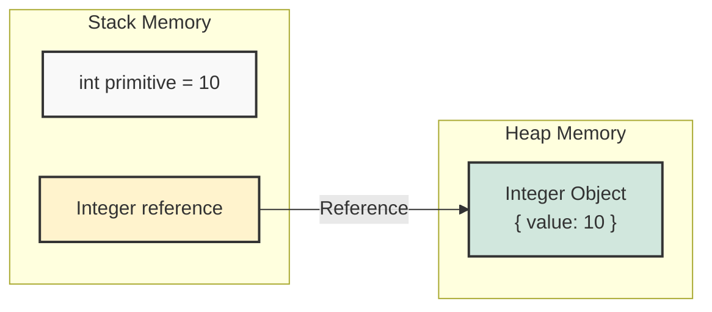

## 1. 개요

Java는 데이터 타입을 크게 **원시 타입(Primitive Type)**과 **참조 타입(Reference Type)**으로 엄격하게 구분한다. `int`, `double`, `boolean`과 같은 원시 타입은 성능이 뛰어나지만, 객체가 아니기 때문에 메서드를 가질 수 없고 `null`을 표현할 수 없다.

**래퍼 클래스(Wrapper Class)**는 이러한 원시 타입의 데이터를 객체(Object)로 포장(Wrap)하여 관리하기 위해 존재한다. 단순히 값을 감싸는 것을 넘어, 제네릭(Generics) 사용, `null` 처리, 그리고 문자열 변환과 같은 유틸리티 기능을 제공하는 핵심 요소다.

## 2. 메모리 구조와 동작 원리

원시 타입과 래퍼 클래스는 메모리에 적재되는 방식이 근본적으로 다르다.



* **Primitive Type (`int`)**: 스택(Stack) 메모리에 실제 값(Literal)이 직접 저장된다. 접근 속도가 매우 빠르고 메모리 효율적이다.
* **Wrapper Class (`Integer`)**: 힙(Heap) 메모리에 객체가 생성되고, 스택에는 해당 객체를 가리키는 **참조 주소(Reference)**가 저장된다.

> **Deep Dive: Wrapper Class의 메모리 오버헤드**
> 
> 단순히 4바이트(`int`)만 차지하는 원시 타입과 달리, `Integer` 객체는 **객체 헤더(Header)**와 **참조 비용**을 포함한다. 일반적으로 64비트 JVM에서 `Integer` 객체 하나는 약 16~24바이트를 차지하며, 이는 원시 타입 대비 4~6배의 메모리를 소모함을 의미한다. 대용량 데이터를 처리할 때 래퍼 클래스 남용은 GC(Garbage Collection) 부하와 성능 저하의 원인이 된다.
{: .prompt-info }

## 3. Null과 0의 의미론적 차이 (The Semantics of Absence)

C++ 등 일부 언어와 달리, Java는 **값(Value) 0**과 **부재(Absence) Null**을 엄격히 구분한다.

* **0 (Zero)**: 계산된 결과값이 0이거나, 초기값이 0인 상태. 데이터로서의 의미가 존재한다.
* **Null**: 참조 대상이 아예 존재하지 않는 상태. 데이터가 '없음'을 명시적으로 표현한다.

예를 들어, 배열에서 "비어 있는 요소"를 표현해야 한다고 가정해보자.

```java
// int 배열은 '없음'을 표현할 방법이 없어 0으로 초기화됨
int[] scores = new int[5]; // [0, 0, 0, 0, 0]

// Integer 배열은 null을 통해 '데이터 없음'을 명확히 표현 가능
Integer[] wrapperScores = new Integer[5]; 
wrapperScores[2] = null; // 명시적 '없음' (0점 아님)
```

이처럼 비즈니스 로직상 "값이 입력되지 않음"을 "0"과 구분해야 할 때 래퍼 클래스는 필수적이다.

## 4. 박싱(Boxing)과 언박싱(Unboxing)

Java 5부터는 원시 타입과 래퍼 클래스 간의 변환을 컴파일러가 자동으로 처리하는 **오토박싱(Auto-boxing)**과 **오토언박싱(Auto-unboxing)**을 지원한다.

### 4.1 구현 (Java)

```java
public class BoxingExample {
    public static void main(String[] args) {
        // 1. Auto-boxing: 원시 타입 10이 자동으로 Integer 객체로 변환됨
        Integer boxedValue = 10; 
        
        // 2. Auto-unboxing: Integer 객체에서 자동으로 int 값이 추출되어 연산됨
        int unboxedValue = boxedValue + 5; 

        // 3. 명시적 변환 (과거 방식, 혹은 명확성을 위해 사용)
        Integer manualBox = Integer.valueOf(100);
        int manualUnbox = manualBox.intValue();
        
        // 4. 문자열 변환 유틸리티
        String strNum = "128";
        int parsedInt = Integer.parseInt(strNum); // String -> int
        Integer valueOfInt = Integer.valueOf(strNum); // String -> Integer Object
        
        System.out.println(unboxedValue); // 15
    }
}
```

## 5. 치명적 주의사항: 참조 동등성 (Identity Trap)

래퍼 클래스는 **객체**다. 따라서 `==` 연산자는 **값(Value)**이 아닌 **참조 주소(Address)**를 비교한다. 

```java
public class IdentityTrap {
    public static void main(String[] args) {
        Integer a = 128;
        Integer b = 128;

        // [주의] 값은 같지만 서로 다른 힙 메모리 주소를 가짐
        System.out.println(a == b); // false 출력!
        
        // [권장] 객체의 내용을 비교할 때는 반드시 equals() 사용
        System.out.println(a.equals(b)); // true
    }
}
```

> **Deep Dive: Integer Cache와 -128 ~ 127**
> 
> 위 예제에서 만약 `128` 대신 `100`을 대입했다면 `a == b`는 `true`가 나온다. Java는 메모리 절약을 위해 **-128부터 127까지의 `Integer` 객체를 내부적으로 캐싱(Caching)**하기 때문이다. 이 범위 내의 값은 새로운 객체를 생성하지 않고 캐시 된 객체를 재사용한다.
> 하지만 이 범위를 벗어나는 순간(예: 128) 새로운 객체가 생성되므로 참조 주소가 달라진다. 따라서 래퍼 클래스 비교는 값의 범위와 무관하게 **항상 `.equals()`를 사용하는 것이 안전하다.**
{: .prompt-warning }

> **위험:** 래퍼 클래스를 사용하여 연산할 때 `NullPointerException`에 주의해야 한다. `Integer a = null;` 상태에서 `int b = a + 10;`을 실행하면, 언박싱 과정에서 null 객체의 값을 꺼내려다 예외가 발생한다.
{: .prompt-danger }

## 💡 Quiz: 학습 내용 확인하기

**Q1. Java에서 `int` 타입 대신 `Integer` 클래스를 사용해야만 하는 대표적인 경우는 언제인가?**

<details>
<summary>정답 확인</summary>
<div>

1. null 값을 저장하여 '데이터 없음'을 명시적으로 표현해야 할 때


2. 제네릭(Generics)을 사용하는 컬렉션 프레임워크(List, Map 등)에 저장할 때


3. Object 타입의 메서드 파라미터로 넘겨야 할 때
</div>
</details>

**Q2. `Integer a = 128; Integer b = 128;` 일 때 `a == b`의 결과값과 그 이유는?**

<details>
<summary>정답 확인</summary>
<div>
결과: false


이유: Integer는 객체이므로 == 연산자는 참조 주소를 비교한다. 128은 Integer Cache 범위(-128 ~ 127)를 벗어나므로 서로 다른 힙 메모리 주소에 할당된 별개의 객체이기 때문이다.
</div>
</details>